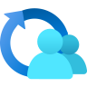

summary: Fundamentals of Analytics on Azure Cloud Platform - Part 1 - Analytics Concepts and the 5 Vs of Big Data
id: azure-analytics-fundamentals-part1
categories: Azure, Analytics, Cloud, Data Engineering
tags: azure, analytics, big-data, 5vs, adls, synapse, data-factory, event-hubs, stream-analytics, power-bi, databricks, beginner, fundamentals
status: Published
authors: HitaVirTech
Feedback Link: https://github.com/hitavir25/codelabs/issues

# Fundamentals of Analytics on Azure Cloud Platform - Part 1

## Overview
Duration: 5:00


```
  +============================================================+
  |                                                            |
  |      AZURE ANALYTICS FUNDAMENTALS - PART 1                 |
  |                                                            |
  |      Concepts  -  The 5 Vs of Big Data  -  Azure Mapping   |
  |                                                            |
  |                 Powered by HitaVir Tech                    |
  +============================================================+
```

Welcome to **Fundamentals of Analytics on Azure Cloud Platform - Part 1** by **HitaVir Tech**!

This codelab builds your mental model for analytics on Microsoft Azure — one concept at a time, one Azure service at a time. No prior Azure experience required.

### What You Will Master

| Pillar | Topics |
|--------|--------|
| 🧠 **Concepts** | Analytics, Machine Learning, core framework |
| 📏 **The 5 Vs** | Volume, Variety, Velocity, Veracity, Value |
| ☁️ **Azure Services** | One toolkit per V — the complete mapping |
| 🛠️ **Hands-on Lab** | ADLS Gen2 → Synapse Serverless SQL end-to-end |

### Why the 5 Vs Framework Matters

Every data challenge you will face maps to one of five questions:

| Question | V |
|----------|---|
| 📦 "How do we store 500 TB?" | Volume |
| 🧩 "We have CSVs, JSON, images — help!" | Variety |
| 🌊 "Dashboards must refresh every second" | Velocity |
| 🛡️ "Half our timestamps are malformed" | Veracity |
| 💎 "Who actually uses this dashboard?" | Value |

The 5 Vs give you a **framework to diagnose**. Azure gives you a **toolbox to solve each V**.

### Estimated Duration

**3-4 hours** (concepts + hands-on lab)

### How to Use This Codelab

| If you are... | Do this |
|---------------|---------|
| 🎓 A student new to cloud | Read top-to-bottom, do the hands-on lab |
| 🛠️ A working engineer | Skim Part 1-2, deep-read the 5 Vs, focus on Azure services for your bottleneck V |
| 🧑‍🏫 A trainer or mentor | Use section headers as talking points; the spotlight cards are slide-ready |
| 🔖 A reference reader | Jump to the Cheat Sheet at the end |

> 💡 **HitaVir Tech says:** "The 5 Vs aren't academic jargon — they're the mental checklist every senior engineer runs when someone says 'we have a data problem.' Learn to speak this language and every cloud will feel familiar."

## Prerequisites
Duration: 3:00

### What You Need

**Required**
- 💻 Laptop — Windows, Mac, or Linux
- 🌐 A modern web browser (Edge, Chrome, Firefox)
- ☁️ Azure account — free tier is enough (`azure.microsoft.com/free`)
- 💳 Credit card for Azure sign-up (no charges expected)
- 🧮 Basic SQL (SELECT, FROM, WHERE)

**Helpful**
- 📝 Spreadsheet or Python exposure
- 🟨 Any other cloud experience (AWS, GCP)

### No Local Installs Required

Everything in this codelab runs in the **Azure Portal** in your browser. Zero software installation on your machine.

### ⚠️ Cost Awareness

Every step stays inside the **Azure free tier / low-cost services**:

| Free / Low-Cost Budget | Usage in This Codelab |
|------------------------|------------------------|
| 💾 ADLS Gen2 storage — 5 GB free | < 1 MB |
| 🔍 Synapse Serverless SQL — $5 / TB scanned | < 1¢ total |
| 📚 Synapse workspace — free to create | 1 workspace |
| 💰 Estimated total cost | **~$0.00** |

> ⚠️ **Always clean up.** Step 10 of the lab is a cleanup ritual. Skip it and Azure will happily bill you for forgotten resources.

### Services the Hands-on Lab Will Use

  

## Analytics Concepts
Duration: 4:00

```
  +==============================================================+
  |         SECTION  1   -   ANALYTICS  CONCEPTS                 |
  +==============================================================+
```

Before we touch Azure, we need three anchor ideas:

```
                    +----------------------+
                    |  1.  ANALYTICS       |
                    |  turn data into      |
                    |  decisions           |
                    +----------+-----------+
                               |
                               | powered by
                               v
                    +----------------------+
                    |  2.  MACHINE LEARNING|
                    |  algorithms that     |
                    |  learn patterns      |
                    +----------+-----------+
                               |
                               | challenged by
                               v
                    +----------------------+
                    |  3.  THE 5 Vs        |
                    |  of Big Data         |
                    +----------------------+
```

### Each Anchor Maps to an Azure Service Family

  

## Analytics
Duration: 6:00

### What is Analytics?

📊 **Analytics** is the practice of turning raw data into useful insights that help people make better decisions.

That one line is the whole discipline. SQL queries, dashboards, ML models, data lakes — all of it is just tooling in service of that idea.

### Real-World Example — HitaVir Coffee

Imagine **HitaVir Coffee** — 50 locations across India. Every day, each store generates data:

| Data Stream | Icon | Data Stream | Icon |
|-------------|:---:|-------------|:---:|
| Orders | ☕ | Payments | 💰 |
| Loyalty | 👥 | Inventory | 📦 |
| Shifts | 🕐 | Equipment | 🌡️ |
| Deliveries | 🚚 | Reviews | ⭐ |

One transaction alone is meaningless. But aggregate across 50 stores for a year and patterns emerge:

| Observation | Action |
|-------------|--------|
| 🐢 Mondays are slowest | 🎯 Launch "Monday BOGO" |
| 📈 Store #23 sells 2x pastries | 🔍 Copy their layout |
| 📉 Cappuccinos drop in summer | 🧊 Push cold brew |

That journey — **from raw events to actions** — is analytics.

### The Four Levels of Analytics

```
  +================================================================+
  |                                                                |
  |     L4   PRESCRIPTIVE       "What should we do?"               |
  |                                                                |
  |                  ^                                             |
  |                  |                                             |
  |     L3   PREDICTIVE         "What will happen?"                |
  |                                                                |
  |                  ^                                             |
  |                  |                                             |
  |     L2   DIAGNOSTIC         "Why did it happen?"               |
  |                                                                |
  |                  ^                                             |
  |                  |                                             |
  |     L1   DESCRIPTIVE        "What happened?"                   |
  |                                                                |
  +================================================================+
```

| Level | Icon | Question | Example | Powered By |
|-------|:---:|----------|---------|------------|
| **L1 Descriptive** | 📸 | What happened? | "Sold 12,400 cappuccinos" | 🔍 SQL / BI |
| **L2 Diagnostic** | 🕵️ | Why did it happen? | "Bean shortage hit week 3" | 🔍 SQL + drill-down |
| **L3 Predictive** | 🔮 | What will happen? | "June sales up 15%" | 🤖 Machine learning |
| **L4 Prescriptive** | 🎯 | What should we do? | "Order 200kg by May 25" | 🤖 ML + optimization |

Most companies live at L1-L2. **Analytics engineers build the foundation** that makes L3-L4 possible.

### What Analytics Is NOT

- ❌ Not the same as data engineering (that builds pipes — analytics drinks from them)
- ❌ Not only Business Intelligence (BI is a subset)
- ❌ Not only Machine Learning (ML is a specialized branch)

> 💡 **HitaVir Tech says:** "Never build a dashboard nobody looks at. Always ask — *what decision will this insight change?* If the answer is 'none', don't build it."

### Preview — Azure Services Across Analytics Maturity

   

L1-L2 is **Synapse + Power BI**. L3-L4 adds **Azure ML + Azure OpenAI**.

## Machine Learning
Duration: 6:00

### What is Machine Learning?

🤖 **Machine Learning (ML)** is a branch of AI where algorithms **learn patterns from data** instead of being explicitly programmed.

### Traditional Programming vs Machine Learning

```
  +-----------------------------+      +-----------------------------+
  |    TRADITIONAL PROGRAMMING  |      |    MACHINE LEARNING         |
  |  -------------------------  |      |  -------------------------  |
  |                             |      |                             |
  |   Rules + Data              |      |   Data + Answers            |
  |         |                   |      |         |                   |
  |         v                   |      |         v                   |
  |     Program                 |      |    Learned Model            |
  |         |                   |      |         |                   |
  |         v                   |      |         v                   |
  |     Answer                  |      |    Rules (weights)          |
  |                             |      |                             |
  |  Human writes the rules.    |      |  Machine learns the rules.  |
  +-----------------------------+      +-----------------------------+
```

### The Three Flavors of ML

| Flavor | Icon | Data Needed | Example | Azure Service |
|--------|:---:|-------------|---------|---------------|
| **Supervised** | 🎯 | Labeled examples | Spam filter, fraud detection, image classification | 🤖 Azure ML |
| **Unsupervised** | 🔎 | No labels | Customer segmentation, anomaly detection, topic modeling | 🤖 Azure ML • 💭 AI Language |
| **Reinforcement** | 🎮 | Reward signals | Game AI, robotics, recommenders | 🤖 Azure ML • 🎯 Personalizer |

### How ML Powers Analytics

```
  Level  Stops at SQL               Needs ML
  -----  --------------------       --------------------
  L1     Descriptive     OK          -
  L2     Diagnostic      OK          -
  L3     Predictive                  Machine learning
  L4     Prescriptive                ML + optimization
```

> 💡 **HitaVir Tech says:** "ML is not magic — it's statistics at scale. If your analytics foundations are shaky, your ML models will be too. Clean data first, cool models second."

### Preview — Azure ML Services

     

*Coming up in "Azure Services for Value" (L3-L4 analytics).*

## The 5 Vs of Big Data
Duration: 5:00

```
  +==============================================================+
  |         SECTION  2   -   THE  5  Vs  OF  BIG  DATA           |
  +==============================================================+
```

### Where the 5 Vs Come From

In 2001, analyst **Doug Laney** described big-data challenges with three Vs: **Volume, Variety, Velocity**. Later the industry added **Veracity** (trust) and **Value** (outcome). Together they form the universal diagnostic checklist.

### The 5 Vs Star

```
                          *
                     VOLUME
                  How much is it?
                       / \
                      /   \
                     /     \
                    /       \
           VARIETY             VELOCITY
       How many formats?     How fast?
                 \             /
                  \           /
                   \         /
                    \       /
             VERACITY        VALUE
         Can we trust it?  Worth it?
```

### The 5 Vs at a Glance

| V | Icon | Question |
|---|:---:|----------|
| 1 | 📦 **VOLUME** | How much? (scale) |
| 2 | 🧩 **VARIETY** | How many formats? |
| 3 | 🌊 **VELOCITY** | How fast? (speed) |
| 4 | 🛡️ **VERACITY** | Can we trust it? |
| 5 | 💎 **VALUE** | What outcome? |

Miss any one V and your data platform has a hole. Let's tour each.

### Preview — Azure's One Service Per V

    

*Volume → ADLS Gen2. Variety → Data Factory. Velocity → Event Hubs. Veracity → Purview. Value → Power BI.*

## Volume
Duration: 6:00

```
  +==============================================================+
  |              THE  1st  V   -   VOLUME                        |
  |              "How much data do we have?"                     |
  +==============================================================+
```

### What is Volume?

📦 **Volume** is the size of your data — how many bytes, rows, events, or files you must store, move, and process.

### The Scale Ladder

| Unit | Power | What It Holds |
|------|:---:|---------------|
| Byte (B) | 1 | A letter |
| KB | 10^3 | One email |
| MB | 10^6 | One song |
| GB | 10^9 | One DVD |
| TB | 10^12 | One year of company sales |
| PB | 10^15 | One day of YouTube uploads |
| EB | 10^18 | All of Netflix streaming |
| ZB | 10^21 | The entire internet per year |

### Why Volume is Hard

A traditional database runs fine up to ~1-10 TB. Past that, things break:

- 💥 Single disk too small to hold it
- 💥 Single CPU too slow to scan it in reasonable time
- 💥 Backups take days
- 💥 Failures become likely (1-in-1000 → every day)
- 💥 Cost spirals out of control

At big-data scale, you need **distributed** systems — hundreds of machines sharing the load.

### Real-World Volume

| Company | Daily Volume |
|---------|--------------|
| 📱 Instagram | 100M+ photos uploaded |
| 🛒 Amazon | Billions of events |
| 🚗 Uber | 10s of TB of trip data |
| 🎬 Netflix | PB of logs and streams |
| 🔎 Bing | Unimaginable |

### Questions Volume Forces You to Ask

- 💾 Where do I **store** 500 TB affordably?
- ⚡ How do I **scan** 10 TB in minutes, not days?
- 💼 How do I **back up** a multi-PB system?
- 💰 How do I **afford** this without going bankrupt?

> 💡 **HitaVir Tech says:** "What works at 10 GB catastrophically fails at 10 TB. Always ask — *how does this scale at 100x?*"

> 📦 **Volume in one line:** design for 100× your current data — or rebuild painfully later.

### Preview — Azure Services That Solve Volume

   

*Coming up in "Azure Services for Volume".*

## Variety
Duration: 6:00

```
  +==============================================================+
  |              THE  2nd  V   -   VARIETY                       |
  |              "How many kinds of data?"                       |
  +==============================================================+
```

### What is Variety?

🧩 **Variety** is the diversity of data — formats, schemas, and sources.

Twenty years ago, "data" meant rows in a database. Today, it means far more:

| Type | Icon | Examples | Schema |
|------|:---:|----------|--------|
| **Structured** | 📊 | SQL tables, CSV, spreadsheets | Fixed |
| **Semi-structured** | 🧩 | JSON from APIs, XML, Parquet, Avro | Flexible |
| **Unstructured** | 🎞️ | Images, video, audio, PDFs, free text | None |

### Why Variety is Hard

Each format needs different tooling:

| Format | Tool Needed |
|--------|-------------|
| SQL tables | Relational engine |
| JSON | Document parser |
| PDF | OCR |
| Image | Computer vision |
| Audio | Speech-to-text |
| Free text | NLP / embeddings |

Most real projects combine these. Example — "Correlate support emails + call recordings + order history into one insight." **Three completely different pipelines** feeding one answer.

### Real-World Variety

| Industry | Variety Mix |
|----------|-------------|
| 🏥 Healthcare | Patient records + X-rays + doctor's notes |
| 🛒 Retail | Orders + product photos + reviews |
| 🏦 Banking | Transactions + scanned checks + call transcripts |
| 🚗 Autonomous cars | Sensors + video + maps + LiDAR |

### Questions Variety Forces You to Ask

- 🪣 Can **one storage system** hold all my types?
- 📚 How do I **catalog** schemas that keep changing?
- 🔍 Which engine queries **JSON, CSV, Parquet** in one SQL?
- 🤖 How do I extract insights from **unstructured** data?

> 💡 **HitaVir Tech says:** "90% of the world's data is unstructured. But 90% of analytics happens on structured data. Your job is often to convert chaos into order."

> 🧩 **Variety in one line:** structure is created, not found — choose tools that embrace format diversity.

### Preview — Azure Services That Solve Variety

     

*Coming up in "Azure Services for Variety".*

## Velocity
Duration: 6:00

```
  +==============================================================+
  |              THE  3rd  V   -   VELOCITY                      |
  |              "How fast is the data?"                         |
  +==============================================================+
```

### What is Velocity?

🌊 **Velocity** is the speed at which data **arrives**, **moves**, and must be **processed** to deliver value.

### The Velocity Spectrum

| Freshness | Icon | Approach | Example Use Case |
|-----------|:---:|----------|------------------|
| Next day | 🐌 | Batch (nightly) | Finance reports |
| Every hour | 🐇 | Mini-batch | Ops dashboards |
| Seconds | 🚀 | Streaming | Live pricing |
| Sub-millisecond | ⚡ | Real-time | Fraud detection, HFT |

### Why Velocity is Hard

| Problem | Solution |
|---------|----------|
| Disks too slow | In-memory / caches |
| Batch SQL too slow | Stream-processing engines |
| One machine too small | Horizontal auto-scaling |
| Failures = data loss | Durable logs (Kafka / Event Hubs) |

### Real-World Velocity

| Scenario | Required Latency |
|----------|------------------|
| 💳 Credit card fraud | Under 100 ms |
| 📈 Stock trading | Microseconds |
| 📱 Social feed | Seconds |
| 🚚 Delivery tracking | Minutes |
| 📊 Exec dashboard | Hourly |
| 🧾 Month close | Daily batch |

### Questions Velocity Forces You to Ask

- 🕒 Do we **really** need real-time, or is 5 minutes fine?
- 🐌 How do we handle **late-arriving** events?
- 📈 What if the stream **falls behind** during a spike?
- 🔁 How do we **replay** events on failure?

> 💡 **HitaVir Tech says:** "Streaming is fashionable. Batch is profitable. 80% of real-world analytics runs on batch — don't reach for streaming unless the business truly cannot wait."

> 🌊 **Velocity in one line:** match the pipeline's speed to the decision's deadline — no faster.

### Preview — Azure Services That Solve Velocity

    

*Coming up in "Azure Services for Velocity".*

## Veracity
Duration: 6:00

```
  +==============================================================+
  |              THE  4th  V   -   VERACITY                      |
  |              "Can we trust the data?"                        |
  +==============================================================+
```

### What is Veracity?

🛡️ **Veracity** is the accuracy, consistency, and trustworthiness of your data.

Big volumes and fast pipelines are useless if the data is **wrong**.

### The Veracity Enemies

| Enemy | Icon | Symptom |
|-------|:---:|---------|
| Missing | 🦠 | NULL in required fields |
| Duplicates | 🗑️ | Same row repeated |
| Inconsistent | 🎭 | 2024-01-05 vs 01/05/24 |
| Outliers | 📉 | Age = 347 |
| Units | 🪙 | USD mixed with INR |
| Bias | 🪞 | Only US users sampled |
| Stale | 🪤 | Last updated 2019 |
| Broken joins | 📎 | Order with no user |
| Noise | 🎲 | Flaky sensor readings |

### GIGO — Garbage In, Garbage Out

> 🛡️ A beautiful dashboard built on bad data is worse than no dashboard — it creates **false confidence**. The most dangerous insight is a wrong insight someone believes.

### Six Dimensions of Data Quality

| Dimension | Icon | Question |
|-----------|:---:|----------|
| **Completeness** | 🧩 | Required fields populated? |
| **Accuracy** | 🎯 | Data reflects reality? |
| **Consistency** | 🧭 | Related systems agree? |
| **Timeliness** | ⏰ | Is it current enough? |
| **Validity** | ✅ | Matches formats / rules? |
| **Uniqueness** | 🔢 | Any unintended duplicates? |

### Real-World Veracity Failures

| Incident | Consequence |
|----------|-------------|
| 🛰️ NASA Mars Climate Orbiter (1999) | Lost $125M — metric vs imperial unit mismatch |
| 🏦 Knight Capital (2012) | $440M loss in 45 minutes — bad trading data |
| 🤧 Google Flu Trends | Overestimated flu peaks 100%+ due to search bias |

### Questions Veracity Forces You to Ask

- 🛡️ Do we have **quality rules** running on every pipeline?
- 👁️ Are we **monitoring** upstream schema changes?
- 🪞 Does our data **match source systems**?
- 🧑 Who **owns** the quality of each dataset?

> 💡 **HitaVir Tech says:** "Senior engineers obsess over data quality. Juniors obsess over cool tools. Guess which group builds systems that actually work in production."

> 🛡️ **Veracity in one line:** quality rules are a pipeline concern, not a hope.

### Preview — Azure Services That Solve Veracity

    

*Coming up in "Azure Services for Veracity".*

## Value
Duration: 6:00

```
  +==============================================================+
  |              THE  5th  V   -   VALUE                         |
  |          "What business outcome does it drive?"              |
  +==============================================================+
```

### What is Value?

💎 **Value** is the business outcome your data and analytics actually deliver — revenue gained, cost saved, risk reduced, customer experience improved.

Without Value, the other four Vs are expensive hobbies.

### The Value Pyramid

```
                       VALUE
                     (outcome)
                         ^
                         |  enabled by
                         |
                Insights & decisions
                         ^
                         |  enabled by
                         |
                   Analytics + ML
                         ^
                         |  enabled by
                         |
               Trustworthy (Veracity) data
                         ^
                         |  at the right
                         |  speed (Velocity)
                         |
                  across Varieties
                         ^
                         |  stored at
                         |
                   the right scale (Volume)
```

### Examples of Real Value

| Industry | Analytics Value |
|----------|-----------------|
| 🛒 Retail | Recommendation engine → **+20% revenue** |
| 🏦 Banking | Fraud detection → **millions saved** |
| 🚚 Logistics | Route optimization → **-15% fuel cost** |
| 🏥 Healthcare | Early diagnosis models → **better outcomes** |
| 🎬 Streaming | Personalized content → **higher retention** |

### The Dashboard Graveyard

Most companies have folders full of unused dashboards — the **dashboard graveyard**. Every one cost engineering time, storage, and compute.

The difference between a valuable dashboard and a graveyard dashboard:

```
  +------------------------------------------------------+
  |                                                      |
  |   "What decision will change because of this?"       |
  |                                                      |
  |   If nobody can answer   ->  DON'T BUILD IT.         |
  |                                                      |
  +------------------------------------------------------+
```

### How to Measure Value

- 🔁 **Adoption** — active daily / weekly users
- 💰 **Metric movement** — did conversion rise?
- ⏱️ **Time saved** — replaces manual work?
- 🎯 **Decisions influenced** — used in leadership meetings?

### Questions Value Forces You to Ask

- 👥 **Who** uses this, and **how often**?
- 🎯 What **decision** would be different without it?
- 💰 What's the **ROI** vs build + maintain cost?
- 🗑️ When should we **retire** outdated reports?

> 💡 **HitaVir Tech says:** "A data platform that costs more than the decisions it enables is a failure, no matter how beautiful the architecture. Lead with Value."

> 💎 **Value in one line:** start from the decision, work backwards to the pipeline.

### Preview — Azure Services That Deliver Value

    

*Coming up in "Azure Services for Value".*

## Azure Services for Analytics
Duration: 3:00

```
  +==============================================================+
  |       SECTION  3  -  AZURE  SERVICES  BY  THE  5  Vs         |
  +==============================================================+
```

### The Headline Cast

         

Now we map **each V** to the **Azure services** that solve it.

### The Golden Rule — Every Stack Follows One Shape

```
  +-------+   +-------+   +-------+   +-------+   +-------+   +-------+   +-------+
  |       |   |       |   |       |   |       |   |       |   |       |   |       |
  | INGST | ->| STORE | ->| CATLG | ->| PROCS | ->| QUERY | ->| VIEW  | ->|  ACT  |
  |       |   |       |   |       |   |       |   |       |   |       |   |       |
  +-------+   +-------+   +-------+   +-------+   +-------+   +-------+   +-------+
```

The **5 Vs** tell you where the bottleneck is. The **Azure services** tell you what solves it.

## Azure Services for Volume
Duration: 8:00

```
  +==============================================================+
  |              AZURE  FOR  VOLUME                              |
  |         "Store any amount of data, affordably."              |
  +==============================================================+
```

### The Volume Lineup

    

**ADLS Gen2** • **Blob Storage** • **Synapse Analytics** • **HDInsight** • **Databricks**

### The Volume Toolkit

| Service | Icon | Purpose |
|---------|:---:|---------|
| **Azure Data Lake Storage Gen2** |  | Object storage built on Blob, hierarchical namespace — the data-lake foundation |
| **Azure Blob Storage** |  | Raw object storage — hot / cool / archive tiers |
| **Azure Archive Storage** |  | Cheapest long-term vault (hours-to-retrieve) |
| **Azure Synapse Analytics** |  | Analytics platform — dedicated + serverless SQL + Spark |
| **Azure HDInsight** |  | Managed Hadoop / Spark / Kafka clusters |
| **Azure Databricks** |  | Managed Apache Spark + MLflow + Delta Lake |

### Service Spotlight — Azure Data Lake Storage Gen2


```
  +--------------------------------------------------------------+
  |  AZURE  DATA  LAKE  STORAGE  GEN2                            |
  +--------------------------------------------------------------+
  |  Built on    :  Azure Blob Storage                           |
  |  Durability  :  99.999999999%  (11 nines, GRS)               |
  |  Scale       :  Exabytes (practically unlimited)             |
  |  Pricing     :  ~$0.018 / GB / month (hot LRS)               |
  |  Features    :  Hierarchical namespace, POSIX ACLs           |
  |  Read by     :  Synapse, Databricks, HDInsight, Power BI     |
  |                                                              |
  |  If you remember only one Azure service - make it ADLS Gen2. |
  +--------------------------------------------------------------+
```

### Blob Storage Tiers — The Cost Pyramid

| Tier | Icon | Access Pattern | Relative Cost |
|------|:---:|----------------|:-------------:|
| **Hot** | 🔥 | Hot, frequent access | $$$$ |
| **Cool** | ❄️ | Monthly access | $$ |
| **Cold** | 🧊 | Every 90+ days | $ |
| **Archive** | 🏔️ | Compliance vault, hours to rehydrate | ¢ |

### Service Spotlight — Azure Synapse Analytics


```
  +--------------------------------------------------------------+
  |  AZURE  SYNAPSE  ANALYTICS  -  Unified Analytics             |
  +--------------------------------------------------------------+
  |  Engines     :  Dedicated SQL Pool (MPP) + Serverless SQL +  |
  |                 Apache Spark pools + Data Explorer pools     |
  |  Storage     :  ADLS Gen2 under the hood                     |
  |  SQL         :  T-SQL (SQL Server flavored)                  |
  |  Integration :  One workspace, notebooks, pipelines, Power BI|
  |                                                              |
  |  One UI for lake, warehouse, Spark, and BI.                  |
  +--------------------------------------------------------------+
```

### Service Spotlight — Azure Databricks


```
  +--------------------------------------------------------------+
  |  AZURE  DATABRICKS  -  Managed Spark + Delta Lake            |
  +--------------------------------------------------------------+
  |  Engine      :  Apache Spark (Photon-accelerated)            |
  |  Superpower  :  Delta Lake (ACID on the data lake)           |
  |  ML          :  MLflow, Feature Store, AutoML                |
  |  Governance  :  Unity Catalog                                |
  |                                                              |
  |  Use for petabyte-scale custom Spark + ML workloads.         |
  +--------------------------------------------------------------+
```

### ADLS Data Lake — Medallion Architecture

```
  abfss://lake@hitavirtechanalytics.dfs.core.windows.net/
    |
    +-- raw/             <-- Bronze:  untouched source data
    |     +-- sales/2026/04/22/orders.csv
    |     +-- inventory/2026/04/22/stock.json
    |
    +-- curated/         <-- Silver:  cleaned, typed Parquet/Delta
    |     +-- sales_fact/year=2026/month=04/day=22/part-001.parquet
    |
    +-- analytics/       <-- Gold:    pre-aggregated for BI
          +-- daily_revenue/year=2026/month=04/day=22/part-001.parquet
```

- 🥉 **Raw (bronze)** — the lake's truth. Reprocess from here if anything goes wrong.
- 🥈 **Curated (silver)** — cleaned, typed. Parquet or Delta for fast analytics.
- 🥇 **Analytics (gold)** — pre-aggregated. Powers dashboards.

### Volume Decision Tree

```
                      How much data?
                            |
       +--------------------+--------------------+
       |                    |                    |
     < 1 TB              1-100 TB             > 100 TB
       |                    |                    |
       v                    v                    v
    Azure SQL DB          ADLS +              ADLS + Databricks +
    or Synapse            Synapse             Synapse Dedicated +
    Serverless            Serverless          Purview governance
    (small + cheap)       (most common)        (huge platform)
```

> 💡 **HitaVir Tech says:** "Start with ADLS Gen2. Every Azure analytics service reads from it. You'll never regret putting data into the lake — you may regret putting it anywhere else first."

## Azure Services for Variety
Duration: 8:00

```
  +==============================================================+
  |              AZURE  FOR  VARIETY                             |
  |         "Handle any data format, elegantly."                 |
  +==============================================================+
```

### The Variety Lineup

       

**Data Factory** • **Synapse** • **Cosmos DB** • **AI Vision** • **Doc Intelligence** • **AI Speech** • **AI Language** • **AI Search**

### The Variety Toolkit

| Service | Icon | Purpose |
|---------|:---:|---------|
| **ADLS Gen2** |  | Holds every format — CSV, JSON, Parquet, images, video |
| **Azure Data Factory** |  | ETL / ELT, 100+ connectors, mapping data flows |
| **Synapse Serverless SQL** |  | `OPENROWSET` on CSV / JSON / Parquet — no setup |
| **Azure Cosmos DB** |  | Multi-model NoSQL (document, graph, key-value) |
| **Azure AI Vision** |  | Images / video → structured labels, OCR |
| **Azure AI Document Intelligence** |  | PDFs, forms, invoices → text and tables |
| **Azure AI Speech** |  | Speech → text, speaker ID, translation |
| **Azure AI Language** |  | NLP: sentiment, entities, summarization |
| **Azure AI Search** |  | Full-text and vector search over any source |

### Service Spotlight — Azure Data Factory


```
  +--------------------------------------------------------------+
  |  AZURE  DATA  FACTORY  -  Serverless ETL / ELT               |
  +--------------------------------------------------------------+
  |  Connectors  :  100+  (SQL, SaaS, files, APIs, on-prem)      |
  |  Pipelines   :  Drag-and-drop + code-free mapping data flows |
  |  Triggers    :  Schedule, event-based, tumbling window       |
  |  Integration :  Git (Azure DevOps / GitHub)                  |
  |                                                              |
  |  The "orchestrator" of Azure data platforms.                 |
  +--------------------------------------------------------------+
```

### Data Factory Flow

```
  INPUT                                                       OUTPUT
  -----                                                       ------

  CSV       +                                           +---- Parquet
  JSON      +---> Copy Activity ---> Mapping Data Flow -+     (optimized)
  Parquet   +              (schema +                    +---- Delta
  Oracle    |               transforms)                        tables
  SAP       +
```

### Synapse Serverless SQL — One SQL, Many Formats

```sql
SELECT  c.customer_id, SUM(o.amount) AS total_spent
FROM    OPENROWSET(
          BULK 'https://hitavirtech.dfs.core.windows.net/lake/orders/*.parquet',
          FORMAT = 'PARQUET'
        ) AS o
JOIN    OPENROWSET(
          BULK 'https://hitavirtech.dfs.core.windows.net/lake/customers/*.json',
          FORMAT = 'CSV', FIELDTERMINATOR='0x0b'
        ) AS c  ON c.customer_id = o.customer_id
GROUP BY c.customer_id;
```

Serverless SQL reads **CSV, JSON, Parquet, Delta** directly from ADLS. You never leave T-SQL.

### Unstructured → Structured: The AI Extractor Pipeline

    

| Input | Icon | Azure Service | Output |
|-------|:---:|---------------|--------|
| Images | 🖼️ | AI Vision | Labels, faces, OCR |
| PDFs / scans | 📄 | Doc Intelligence | Extracted text + tables + key-value |
| Audio / voice | 🎤 | AI Speech | Transcripts + speaker ID |
| Free text | 💬 | AI Language | Sentiment, entities, summarization |
| Translations | 🌍 | Translator | 100+ languages |

Magic step: **chaos in → structured features out** → then into ADLS / Synapse / Databricks as normal.

### Real-World Example — E-commerce Review Pipeline

```
  Customer review (raw text)
        |
        v
  AI Language  --->  sentiment = negative, topic = shipping
        |
        v
  ADLS Gen2 (enriched records)
        |
        v
  Data Factory  --->  Synapse table
        |
        v
  Synapse SQL:   "avg sentiment per product / month"
        |
        v
  Power BI dashboard for the CX team
        |
        v
  Action:  fix shipping partner in Region X
```

### Variety Decision Tree

```
                       What's my data?
                             |
      +---------+---------+--+---+---------+---------+
      |         |         |      |         |         |
   Tabular   JSON      Images   PDFs   Audio     Free text
      |         |         |      |         |         |
      v         v         v      v         v         v
   ADLS +     ADLS +    AI      Doc      AI         AI
   Synapse    Synapse   Vision  Intell.  Speech     Language
              or Cosmos
```

> 💡 **HitaVir Tech says:** "The magic of modern analytics — unstructured data becomes structured features in minutes via Azure AI services. What took PhDs years a decade ago is now an API call."

## Azure Services for Velocity
Duration: 8:00

```
  +==============================================================+
  |              AZURE  FOR  VELOCITY                            |
  |         "Move and process data in real time."                |
  +==============================================================+
```

### The Velocity Lineup

     

**Event Hubs** • **Stream Analytics** • **Data Explorer** • **Functions** • **Event Grid** • **Logic Apps**

### The Velocity Toolkit

| Service | Icon | Purpose |
|---------|:---:|---------|
| **Azure Event Hubs** |  | Real-time event stream (Kafka-compatible) |
| **Event Hubs Capture** |  | Buffered delivery to ADLS / Blob (no code) |
| **Azure Stream Analytics** |  | SQL on streams, sub-second latency |
| **Azure Data Explorer (Kusto)** |  | Blazing-fast time-series + log analytics |
| **Azure Functions** |  | Event-driven serverless code |
| **Azure Event Grid** |  | Serverless event bus across Azure |
| **Azure Service Bus / Queue Storage** |  | Queue and pub-sub messaging |

### Service Spotlight — Azure Event Hubs


```
  +--------------------------------------------------------------+
  |  AZURE  EVENT  HUBS  -  Real-time Event Stream               |
  +--------------------------------------------------------------+
  |  Latency     :  Sub-second                                   |
  |  Retention   :  1-7 days (90 days on Premium)                |
  |  Throughput  :  MB/sec per partition, scale by partition     |
  |  Kafka API   :  Yes - drop-in for Kafka clients              |
  |                                                              |
  |  The "high-speed conveyor belt" for events on Azure.         |
  +--------------------------------------------------------------+
```

### Event Hubs in Action — The Conveyor Belt

```
  PRODUCERS                EVENT HUBS                CONSUMERS
  ------------             ------------              ------------

  App events        +----------------------+         Functions
  Clickstreams  --->|  >> >> >> >> >> >>   |--->    Stream Analytics
  IoT sensors       |  durable, ordered,   |         Capture -> ADLS
  Transactions      |  partitioned         |         Data Explorer
  Card swipes       +----------------------+         Synapse
```

Event Hubs holds events **durably**. Multiple consumers read the same stream **independently**.

### Service Spotlight — Event Hubs Capture


```
  +--------------------------------------------------------------+
  |  EVENT  HUBS  CAPTURE  -  The Easy Button                    |
  +--------------------------------------------------------------+
  |  Model       :  Fully managed, no code                       |
  |  Buffer      :  Time window or size (whichever first)        |
  |  Format      :  Avro (native) or Parquet via Stream Analytics|
  |  Sinks       :  ADLS Gen2, Blob Storage                      |
  |                                                              |
  |  No cluster - the laziest streaming archive on Azure.        |
  +--------------------------------------------------------------+
```

```
  Producers  --->  Event Hubs  --->  Capture (no servers)  --->  ADLS
                                    auto-write every N mins
```

### Azure Stream Analytics — Continuous SQL

```sql
SELECT  user_id, amount, location
INTO    FraudAlerts
FROM    TransactionsStream TIMESTAMP BY event_time
WHERE   amount > 10000 OR is_foreign = 1;
```

Results in **milliseconds** — not after the nightly batch.

### Azure Functions — The Universal Event Glue

```
  Blob created     +
  Event Hubs       +--->  Azure Function  --->  Synapse load
  Cosmos change    +         |
  Event Grid       +         +---->  Service Bus / Queue alert
```

Perfect for: event reactions, enrichment, alerting, small transforms.

### Service Spotlight — Azure Data Explorer


```
  +--------------------------------------------------------------+
  |  AZURE  DATA  EXPLORER  (ADX / KUSTO)                        |
  +--------------------------------------------------------------+
  |  Category    :  Time-series + log analytics                  |
  |  Query lang  :  Kusto Query Language (KQL)                   |
  |  Scale       :  Billions of rows, sub-second                 |
  |  Ingest rate :  GB/sec, auto-indexed                         |
  |                                                              |
  |  Same engine powers Azure Monitor, Sentinel, Log Analytics.  |
  +--------------------------------------------------------------+
```

### Real-World Velocity Pipeline — Rideshare App

```
  Rideshare app (1 million events/sec)
              |
              v
       Azure Event Hubs
              |
     +--------+--------+---------+
     |        |        |         |
     v        v        v         v
  Function  Stream    Capture
  fraud     Analytics buffer
  flag      real-time --> ADLS (Parquet)
     |        |         |
     v        v         v
   Service  Power BI   Synapse
   Bus      live dash  Serverless
   alert                (historical)
```

### Velocity Decision Tree

```
                       How fresh must the data be?
                                 |
        +---------+----------+---+---+-----------+
        |         |          |       |           |
     Next day  15 minutes  Seconds  Sub-second  Kafka shop
        |         |          |       |           |
        v         v          v       v           v
     ADF        Capture    Event     Stream      Event Hubs
     pipeline   -> ADLS    Hubs +    Analytics   (Kafka API)
                           Function
```

> 💡 **HitaVir Tech says:** "Every team thinks they need real-time until they see the bill. Start with Event Hubs Capture and 5-minute micro-batches — graduate later. Most of the time, you won't need to."

## Azure Services for Veracity
Duration: 8:00

```
  +==============================================================+
  |              AZURE  FOR  VERACITY                            |
  |         "Make sure the data is trustworthy."                 |
  +==============================================================+
```

### The Veracity Lineup

      

**Mapping Data Flows** • **Microsoft Purview** • **Info Protection** • **Activity Log** • **Defender for Cloud** • **Key Vault** • **Azure Monitor**

### The Veracity Toolkit

| Service | Icon | Purpose |
|---------|:---:|---------|
| **ADF Mapping Data Flows** |  | Visual data cleaning and profiling |
| **Microsoft Purview Data Quality** |  | Rule-based DQ checks |
| **Great Expectations / Deequ on Spark** |  | Unit tests for data (open-source in Databricks) |
| **Microsoft Purview** |  | Data catalog + lineage + policy |
| **Azure Activity Log** |  | Audit every control-plane change |
| **Azure Monitor + Log Analytics** |  | Resource and pipeline telemetry |
| **Microsoft Defender for Cloud** |  | Discover and classify PII, CSPM |
| **Azure Key Vault** |  | Manage encryption keys and secrets |

### Service Spotlight — ADF Mapping Data Flows


```
  +--------------------------------------------------------------+
  |  ADF  MAPPING  DATA  FLOWS  -  No-Code Data Prep             |
  +--------------------------------------------------------------+
  |  Interface   :  Visual, drag-and-drop                        |
  |  Transforms  :  90+ (nulls, dupes, dates, joins, aggs...)    |
  |  Engine      :  Spark (managed, auto-scaled)                 |
  |  Debug       :  Interactive, with sample data                |
  |                                                              |
  |  Hand this to business analysts - no Spark code needed.      |
  +--------------------------------------------------------------+
```

```
  Source  --->  Profile  --->  Apply transforms  --->  Sink
                (stats,        (fill nulls, parse   (to ADLS,
                 anomalies)     dates, dedupe)       Synapse)
```

### Microsoft Purview — Catalog + Quality + Lineage

```
  +--------------------------------------------------------------+
  |  MICROSOFT  PURVIEW  -  Unified Data Governance              |
  +--------------------------------------------------------------+
  |  Catalog     :  Scan ADLS, Synapse, SQL, Power BI, S3, GCS   |
  |  Lineage     :  End-to-end column-level lineage              |
  |  DQ rules    :  Completeness, uniqueness, ranges, custom     |
  |  Insights    :  Sensitivity labels, hotspots, adoption       |
  |                                                              |
  |  The "nervous system" for multi-cloud data governance.       |
  +--------------------------------------------------------------+
```

```
  RULES                                          CHECK RESULT
  -----                                          -------------
  order_id IS NOT NULL                     ...   PASS
  amount BETWEEN 0 AND 1_000_000           ...   PASS
  customer_id IN customers                 ...   PASS
  COUNT(DISTINCT order_id) = COUNT(*)      ...   FAIL - 23 dupes!
```

### Service Spotlight — Microsoft Defender for Cloud


```
  +--------------------------------------------------------------+
  |  MICROSOFT  DEFENDER  FOR  CLOUD  -  CSPM + PII detection    |
  +--------------------------------------------------------------+
  |  Method      :  ML-based classification of storage contents  |
  |  Finds       :  Credit cards, SSNs, emails, addresses        |
  |  Output      :  Severity alerts -> Sentinel SIEM             |
  |                                                              |
  |  Sniffs sensitive data hiding in your storage accounts.      |
  +--------------------------------------------------------------+
```

### Activity Log + Policy — The Audit Twins

 

- 📜 **Activity Log** — "Who did WHAT and WHEN?" Every ARM API call logged.
- ⚙️ **Azure Policy** — "What rules must resources follow?" Enforce compliance as code.

Essential for regulated industries (finance, healthcare, gov).

### The Data Quality Lifecycle

```
  PROFILE  --->  DEFINE RULES  --->  ENFORCE  --->  ALERT  --->  FIX  --->  MONITOR
  (know)         (expected)           (every run)    (fail fast)  (fix)     (trends)
     ^                                                                         |
     |                                                                         |
     +---------------------------- loop ---------------------------------------+
```

### Real-World Example — Sales Lake Quality Gate

```
  Raw sales CSV from 50 stores
        |
        v
  ADF Mapping Data Flow reads it
        |
        v
  Purview Data Quality rules:
     PASS - order_id unique
     PASS - amount in [0, 1M]
     FAIL - store_id in valid list   (12 rows failed)
        |
        v
     +--+--+
     v     v
  Quarantine   Curated
  container +  zone
  Teams alert  (Parquet)
```

> 💡 **HitaVir Tech says:** "Every pipeline must have quality rules — not 'someday', from day one. 10x cheaper to catch bad data at ingest than to explain a wrong dashboard to the CEO."

## Azure Services for Value
Duration: 8:00

```
  +==============================================================+
  |              AZURE  FOR  VALUE                               |
  |       "Turn data into decisions and ROI."                    |
  +==============================================================+
```

### The Value Lineup

     

**Power BI** • **Azure ML** • **Azure OpenAI** • **Anomaly Detector** • **Personalizer** • **Metrics Advisor**

### The Value Toolkit

| Service | Icon | Purpose |
|---------|:---:|---------|
| **Microsoft Power BI** |  | Dashboards, BI, natural-language analytics |
| **Azure Machine Learning** |  | Build, train, deploy ML models |
| **Azure AI Anomaly Detector** |  | No-code time-series anomaly detection |
| **Azure AI Personalizer** |  | Contextual recommendation engine |
| **Azure AI Metrics Advisor** |  | Proactive KPI anomaly monitoring |
| **Azure OpenAI Service** |  | GPT, Claude-competitive LLMs on Azure |
| **Power BI Copilot** |  | Ask data questions in natural language |
| **Synapse ML / Fabric ML** |  | ML in notebooks next to your data |
| **Microsoft Fabric** |  | SaaS analytics: Lakehouse + Warehouse + BI |

### Service Spotlight — Microsoft Power BI


```
  +--------------------------------------------------------------+
  |  MICROSOFT  POWER  BI  -  Business Intelligence              |
  +--------------------------------------------------------------+
  |  Sources     :  Synapse, SQL, ADLS, Fabric, 100+ connectors  |
  |  Engine      :  VertiPaq (in-memory columnar)                |
  |  Superpowers :  Copilot (natural language) + Embedded        |
  |  Editions    :  Free  |  Pro  |  Premium  |  Fabric          |
  |                                                              |
  |  The leader in Gartner's BI Magic Quadrant for 17 years.     |
  +--------------------------------------------------------------+
```

### Power BI Flow

```
  Synapse / SQL / ADLS  --->  Dataset  --->  Visuals  --->  Report  --->  App
  (data source)              (VertiPaq       (charts)       (pages)       (share)
                              cache)
```

### Service Spotlight — Azure Machine Learning


```
  +--------------------------------------------------------------+
  |  AZURE  MACHINE  LEARNING  -  Full-Lifecycle ML              |
  +--------------------------------------------------------------+
  |  Studio      :  Browser IDE for ML                           |
  |  AutoML      :  Tries many models automatically              |
  |  Pipelines   :  Train / evaluate / deploy as YAML + CLI v2   |
  |  MLOps       :  Model registry, endpoints, monitoring        |
  |                                                              |
  |  From raw data to deployed model - one platform.             |
  +--------------------------------------------------------------+
```

### Service Spotlight — Azure OpenAI Service


```
  +--------------------------------------------------------------+
  |  AZURE  OPENAI  SERVICE                                      |
  +--------------------------------------------------------------+
  |  Models      :  GPT-4, GPT-4o, embeddings, DALL-E, whisper   |
  |  Compliance  :  SOC, HIPAA, FedRAMP, private network         |
  |  Integration :  RAG with AI Search, Cognitive Services       |
  |                                                              |
  |  Same OpenAI models, but your data never leaves Azure.       |
  +--------------------------------------------------------------+
```

```
  Your docs (ADLS)
       |
       v
  AI Search (vector index)
       |
       v
  Azure OpenAI (GPT-4o with RAG)
       |
       v
  Chat / Copilot experiences
```

### Service Spotlight — Azure AI Personalizer


```
  +--------------------------------------------------------------+
  |  AZURE  AI  PERSONALIZER  -  Netflix-Style Recs              |
  +--------------------------------------------------------------+
  |  Inputs      :  Context features + reward signals            |
  |  Use cases   :  "You may like...", "Related items..."        |
  |  Real-time   :  Inference in milliseconds                    |
  |                                                              |
  |  Contextual-bandit reinforcement learning, no PhD required.  |
  +--------------------------------------------------------------+
```

### Power BI Copilot — Natural-Language BI

```
  User types:   "Show me top 5 products last quarter"
                        |
                        v
     Copilot interprets -> writes DAX -> runs -> visualizes
                        |
                        v
            Bar chart appears in 2 seconds
```

Analysts no longer gatekeep simple questions.

### Synapse ML — SQL-Native Machine Learning

```sql
CREATE EXTERNAL MODEL churn_model
FROM   (SELECT * FROM customer_features)
WITH  (MODEL_TYPE = 'Binary Classification',
       LABEL_COLUMN = 'churned');

-- then use it
SELECT customer_id, PREDICT(MODEL = churn_model, DATA = features) AS risk
FROM   customers
WHERE  risk > 0.8;
```

ML without leaving your Synapse warehouse.

### The Value Stack

```
  +==============================================================+
  |                                                              |
  |   BUSINESS  VALUE      revenue - savings - growth            |
  |        ^                                                     |
  |        |                                                     |
  |   APPLICATION LAYER    Personalizer, Metrics Advisor, AD     |
  |        ^                                                     |
  |        |                                                     |
  |   ML LAYER             Azure ML, Synapse ML, OpenAI          |
  |        ^                                                     |
  |        |                                                     |
  |   ANALYSIS LAYER       Synapse + Power BI + Fabric           |
  |        ^                                                     |
  |        |                                                     |
  |   BUILD LAYER          ADLS + ADF + Event Hubs + Purview     |
  |                                                              |
  +==============================================================+
```

> 💡 **HitaVir Tech says:** "The best data platform is worthless if nobody uses the outputs. Start from Value and work backwards — who sees which insight, and what decision changes? Design everything else to serve that."

## Putting It All Together
Duration: 5:00

```
  +==============================================================+
  |         END-TO-END  AZURE  ANALYTICS  STACK                  |
  +==============================================================+
```

### The Full Cast — Every Service You Will See Below

         

All 5 Vs combined into one living architecture:

```
  INGEST  (Velocity + Variety Layers)
  +---------------------------+    +---------------------------+
  |  Azure Event Hubs         |    |  Data Factory             |
  |  Event Hubs Capture       |    |  AI Vision / Doc Intel.   |
  |  Functions                |    |  AI Speech / Language     |
  |  IoT Hub                  |    |  Translator               |
  +-------------+-------------+    +-------------+-------------+
                |                                |
                +----------------+---------------+
                                 |
                                 v
  STORE  (Volume Layer)
  +----------------------------------------------------------+
  |   ADLS Gen2  Data Lake  (raw  /  curated  /  analytics)  |
  |   <------>  Microsoft Purview  (catalog + lineage)       |
  +-----------------------------+----------------------------+
                                |
                                v
  PROCESS + VERACITY
  +----------------------------------------------------------+
  |   ADF Data Flows  /  Databricks  /  Synapse Spark        |
  |   <---  Purview DQ  /  Defender for Cloud  /  Policy     |
  +-----------------------------+----------------------------+
                                |
                                v
  QUERY
  +--------------+  +--------------+  +--------------+
  |  Synapse     |  |  Synapse     |  | Azure ML     |
  |  Serverless  |  |  Dedicated   |  |  (training)  |
  +------+-------+  +------+-------+  +------+-------+
         |                 |                 |
         +-----------------+-----------------+
                           |
                           v
  VALUE LAYER
  +----------------------------------------------------------+
  |   Power BI       |    Azure OpenAI (GPT)                 |
  |   Copilot (NL)   |    Personalizer                       |
  +-----------------------------+----------------------------+
                                |
                                v
                 Decisions  -  Revenue  -  Growth
```

Every box maps to a V. Every arrow is a managed Azure service.

## Hands-on Lab - Your First Azure Analytics Pipeline
Duration: 25:00

```
  +==============================================================+
  |  HANDS-ON  LAB  -  ADLS  ->  SYNAPSE  SERVERLESS SQL         |
  +==============================================================+
```

### The Services We'll Touch

  

You will build a mini pipeline that touches **Volume** (ADLS Gen2), **Variety** (CSV auto-queried), and **Value** (SQL insights).

```
   Step 1         Step 2-3         Step 4-5           Step 6          Step 7-9
  +------+       +------+          +----------+    +--------+     +----------+
  | CSV  | ----> | ADLS | ------>  | Synapse  | -> |Serverl.| --> | T-SQL    |
  +------+       +------+          | workspace|    | SQL    |     +----------+
  Prepare        Upload            Create                        Run OPENROWSET
  sample data    to container      workspace                     get insights
```

### 📄 Step 1 — Prepare Sample Data

On your laptop, create a file called `sales.csv`:

```csv
order_id,customer,product,quantity,amount,order_date
1001,Ravi,Laptop,1,75000.00,2026-04-01
1002,Priya,Mouse,2,1500.00,2026-04-01
1003,Amit,Keyboard,1,3500.00,2026-04-02
1004,Ravi,Monitor,1,18000.00,2026-04-02
1005,Sneha,Headphones,1,4500.00,2026-04-03
1006,Priya,Laptop,1,75000.00,2026-04-03
1007,Vikram,USB Cable,3,900.00,2026-04-04
1008,Neha,Webcam,1,5000.00,2026-04-04
1009,Ravi,Mouse,1,750.00,2026-04-05
1010,Amit,Monitor,1,18000.00,2026-04-05
```

### 🪣 Step 2 — Create a Storage Account with ADLS Gen2

1. Sign in to the **Azure Portal** (`portal.azure.com`)
2. Click **Create a resource** → **Storage account**
3. Resource group: `rg-hitavirtech-analytics` (create new)
4. Storage account name: `hitavirtechanalyticsXX` (lowercase, unique — add random digits)
5. Region: closest to you (`Central India`)
6. Redundancy: **LRS** (cheapest)
7. **Advanced** tab → enable **Hierarchical namespace** (this makes it ADLS Gen2)
8. **Review + create** → **Create**

### ⬆️ Step 3 — Upload the CSV

1. Open your storage account → **Containers** → **+ Container**
2. Name: `lake` → **Create**
3. Open `lake` → **+ Add Directory** → `raw`
4. Inside `raw/` → **+ Add Directory** → `sales`
5. Inside `raw/sales/` → **Upload** → select `sales.csv` → **Upload**

Your file now lives at:

```
https://hitavirtechanalyticsXX.dfs.core.windows.net/lake/raw/sales/sales.csv
```

### 🏗️ Step 4 — Create a Synapse Workspace

1. Portal → **Create a resource** → **Azure Synapse Analytics**
2. Resource group: `rg-hitavirtech-analytics`
3. Workspace name: `syn-hitavirtech-XX`
4. Region: same as the storage account
5. **Select Data Lake Storage Gen2**: pick `hitavirtechanalyticsXX` + container `lake`
6. SQL admin credentials: set a strong password (save it!)
7. **Review + create** → **Create** (takes ~3 minutes)

### 🔐 Step 5 — Grant Synapse Access to the Lake

1. Open the storage account → **Access Control (IAM)** → **+ Add role assignment**
2. Role: **Storage Blob Data Contributor**
3. Assign access to: **Managed identity** → pick the Synapse workspace
4. **Save**

Without this step, Synapse Serverless SQL cannot read your files.

### 💻 Step 6 — Open Synapse Studio

1. Portal → your Synapse workspace → **Open Synapse Studio**
2. Left nav → **Data** tab
3. Expand **Linked** → Azure Data Lake Storage Gen2 → your account → `lake` → `raw` → `sales`
4. Right-click `sales.csv` → **New SQL script** → **Select TOP 100 rows**
5. Synapse auto-generates an `OPENROWSET` query — click **Run**

You should see 10 rows. 🎉

### 🔍 Step 7 — Query with Serverless SQL

Replace the auto-generated query with:

```sql
SELECT *
FROM OPENROWSET(
    BULK 'https://hitavirtechanalyticsXX.dfs.core.windows.net/lake/raw/sales/sales.csv',
    FORMAT = 'CSV',
    PARSER_VERSION = '2.0',
    HEADER_ROW = TRUE
) AS sales;
```

Replace `hitavirtechanalyticsXX` with your actual account name. Click **Run**.

### 💡 Step 8 — Analytical Queries

```sql
-- Top customers by revenue
SELECT customer, SUM(CAST(amount AS DECIMAL(12,2))) AS total_spent
FROM OPENROWSET(
    BULK 'https://hitavirtechanalyticsXX.dfs.core.windows.net/lake/raw/sales/sales.csv',
    FORMAT = 'CSV', PARSER_VERSION = '2.0', HEADER_ROW = TRUE
) AS sales
GROUP BY customer
ORDER BY total_spent DESC;
```

```sql
-- Best-selling products
SELECT product, SUM(CAST(quantity AS INT)) AS units_sold
FROM OPENROWSET(
    BULK 'https://hitavirtechanalyticsXX.dfs.core.windows.net/lake/raw/sales/sales.csv',
    FORMAT = 'CSV', PARSER_VERSION = '2.0', HEADER_ROW = TRUE
) AS sales
GROUP BY product
ORDER BY units_sold DESC;
```

```sql
-- Daily revenue
SELECT order_date, SUM(CAST(amount AS DECIMAL(12,2))) AS daily_revenue
FROM OPENROWSET(
    BULK 'https://hitavirtechanalyticsXX.dfs.core.windows.net/lake/raw/sales/sales.csv',
    FORMAT = 'CSV', PARSER_VERSION = '2.0', HEADER_ROW = TRUE
) AS sales
GROUP BY order_date
ORDER BY order_date;
```

### 💰 Step 9 — The "Data Scanned" Number

At the bottom of every query result: **"Data processed: 1 KB"** (or similar).

That number is your bill. Serverless SQL charges **~$5 per TB scanned**. At scale, every analytics engineer watches it. Partitioning + Parquet shrinks it 100-1000×.

### 🧹 Step 10 — Cleanup (Mandatory!)

> ⚠️ Forgetting cleanup = surprise Azure bill.

The simplest, safest cleanup on Azure: **delete the entire resource group**.

1. Portal → **Resource groups** → `rg-hitavirtech-analytics`
2. **Delete resource group** → type the name to confirm → **Delete**
3. Wait ~5 minutes for all resources to terminate
4. 💰 Check **Cost Management** next day → confirm **~$0**

> 💡 **HitaVir Tech says:** "The last 5 minutes of cleanup are the most valuable 5 minutes of the entire lab. Engineers who skip it end up with $300 surprise bills."

## Summary and What's Next
Duration: 3:00

```
  +==============================================================+
  |          CONGRATULATIONS  -  PART 1 DONE!                    |
  +==============================================================+
```

### What You Learned

**🧠 Analytics Concepts**

| Topic | Icon |
|-------|:---:|
| Analytics and the four maturity levels | 📊 |
| Machine Learning — three flavors | 🤖 |

**📏 The 5 Vs of Big Data**

| V | Icon | Theme |
|---|:---:|-------|
| **VOLUME** | 📦 | Scale |
| **VARIETY** | 🧩 | Formats |
| **VELOCITY** | 🌊 | Speed |
| **VERACITY** | 🛡️ | Trust |
| **VALUE** | 💎 | Outcome |

**☁️ Azure Services Mapped to Each V**

        

| V | Key Services |
|---|--------------|
| 📦 Volume | 🪣 ADLS Gen2 • 🏛️ Synapse • 🔥 Databricks • 🐘 HDInsight |
| 🧩 Variety | 🕸️ Data Factory • 🔍 Synapse Serverless • 🤖 AI Vision • 📝 Doc Intelligence • 🔊 AI Speech • 💭 AI Language |
| 🌊 Velocity | 🌊 Event Hubs • 🎯 Stream Analytics • 🔬 Data Explorer • ⚡ Functions |
| 🛡️ Veracity | 🧪 ADF Data Flows • 🛡️ Purview • 🕵️ Defender • 📜 Activity Log |
| 💎 Value | 📊 Power BI • 🤖 Azure ML • 🧠 Azure OpenAI • 🎯 Personalizer |

**🛠️ Hands-on Skills**

- 🪣 Created a Storage Account with ADLS Gen2
- ⬆️ Uploaded data to a container
- 🏗️ Created a Synapse workspace
- 🔐 Granted RBAC to the workspace's managed identity
- 🔍 Ran `OPENROWSET` queries on CSV
- 🧹 Cleaned up via resource group delete

### What's Coming in Part 2

🚀 **Part 2 — Advanced Analytics on Azure** will cover:

- 🪣 Data Lakes deep dive
- 🏛️ Data Warehousing (dedicated SQL pool + star schemas)
- 🏡 Modern Data Architecture (Lakehouse + Microsoft Fabric)
- 🌊 Streaming architectures with Event Hubs
- 📊 Real Power BI dashboards
- 🤖 Intro to Azure ML + Synapse ML
- 🗺️ Six reference architectures for real-world use cases

### What To Do Next

1. 🔄 **Repeat this lab** with a different dataset (try a Kaggle CSV)
2. 📖 **Read the Azure Synapse and ADLS docs**
3. 💰 **Watch your Azure bill** for a few days
4. 🧠 **Apply the 5 Vs** to a project you work on — identify the bottleneck V

### Final Thoughts

```
  +==============================================================+
  |                                                              |
  |    The 5 Vs  =  universal data challenge framework           |
  |    Azure    =  complete toolbox for each V                   |
  |                                                              |
  |    Learn both  ->  you can pick up any cloud's analytics     |
  |    stack in a week.                                          |
  |                                                              |
  +==============================================================+
```

> 💡 **HitaVir Tech says:** "Analytics is not about tools. Tools change every two years. Analytics is about asking the right question, finding the right data, and presenting an insight people can act on. Master the fundamentals — Volume, Variety, Velocity, Veracity, Value — and every new tool becomes just another syntax."

🎓 Welcome to cloud analytics on Azure. See you in **Part 2**.

— **HitaVir Tech** ☁️

## Bonus - Self-Assessment
Duration: 5:00

```
  +==============================================================+
  |        DIAGNOSE  YOUR  OWN  PROJECT  WITH  THE  5  Vs        |
  +==============================================================+
```

Think of a data project you work on (or want to build). Run it through these five questions. The V that feels **most stressful** is your bottleneck — that's where to focus first.

       

| # | Question | Your V | Azure Services to Study |
|:-:|----------|:------:|-------------------------|
| 1 | "Do we have somewhere cheap and durable to store everything?" | 📦 Volume | 🪣 ADLS Gen2 • 🏛️ Synapse • 🔥 Databricks |
| 2 | "Do we have to handle more than one data format?" | 🧩 Variety | 🕸️ ADF • 🔍 Synapse Serverless • 🤖 AI Vision • 📝 Doc Intelligence |
| 3 | "Is the current data freshness good enough for stakeholders?" | 🌊 Velocity | 🌊 Event Hubs • 🎯 Stream Analytics • ⚡ Functions |
| 4 | "Do stakeholders trust the numbers we publish?" | 🛡️ Veracity | 🧪 ADF Data Flows • 🛡️ Purview • 🕵️ Defender |
| 5 | "Is anyone actually acting on our outputs?" | 💎 Value | 📊 Power BI • 🤖 Azure ML • 🎯 Personalizer |

Score each V from 1 (healthy) to 5 (painful). The highest score is where a senior engineer should lead the next sprint.

> 🎯 **Pro Tip:** "Stacking solutions for Velocity when Veracity is the real problem is the most common and expensive Azure mistake. Diagnose honestly before you build."

## Cheat Sheet - The One-Page Summary
Duration: 3:00

```
  +==============================================================+
  |          AZURE  ANALYTICS  -  PART 1  CHEAT  SHEET           |
  |                  (screenshot and keep)                       |
  +==============================================================+
```

### The Azure Analytics Toolbox — At a Glance

             

### 🧠 Concepts in a Sentence

| Term | Definition |
|------|------------|
| 📊 **Analytics** | Turning data into decisions |
| 🤖 **Machine Learning** | Algorithms that learn patterns instead of being programmed |
| 📸 **Descriptive** → 🕵️ **Diagnostic** → 🔮 **Predictive** → 🎯 **Prescriptive** | The 4 levels of analytics maturity |

### 📏 The 5 Vs in a Sentence

| V | Icon | Question | One-Liner |
|---|:---:|----------|-----------|
| 1 | 📦 | How much? | Design for 100× your current data |
| 2 | 🧩 | How many formats? | Structure is created, not found |
| 3 | 🌊 | How fast? | Match speed to the decision's deadline |
| 4 | 🛡️ | Can we trust it? | Quality rules are pipeline-level, not tribal |
| 5 | 💎 | Worth it? | Start from the decision, work backwards |

### ☁️ Azure Services — By V

| V | Store | Process | Catalog / Quality | Deliver |
|---|-------|---------|-------------------|---------|
| 📦 **Volume** | 🪣 ADLS Gen2 • 🧊 Archive | 🏛️ Synapse • 🔥 Databricks | 🏗️ Purview | — |
| 🧩 **Variety** | 🪣 ADLS • ⚡ Cosmos DB | 🤖 AI Vision • 📝 Doc Intel. • 🔊 AI Speech • 💭 AI Language | 🕸️ ADF • 📚 Purview | 🔍 Synapse Serverless |
| 🌊 **Velocity** | 🌊 Event Hubs • 🪐 Kafka API | ⚡ Functions • 🎯 Stream Analytics | 🚒 Capture (→ ADLS) | 🔬 Data Explorer |
| 🛡️ **Veracity** | — | 🧪 ADF Data Flows | 🛡️ Purview DQ • 🕵️ Defender • 📜 Activity Log • ⚙️ Policy | 🏗️ Purview |
| 💎 **Value** | — | 🤖 Azure ML • 🎯 Personalizer • 👁️ Anomaly Detector | — | 📊 Power BI • 💬 Copilot • 🧠 OpenAI |

### 🛠️ The Universal Azure Analytics Pipeline

```
   INGEST  -->  STORE  -->  CATALOG  -->  PROCESS  -->  QUERY  -->  VISUALIZE  -->  DECIDE
     |          |           |             |             |            |               |
   Event Hubs  ADLS         Purview       ADF flows     Synapse      Power BI        Human
   ADF         Synapse      Fabric cat.   Databricks    Dedicated    Azure ML        action
   Functions   Archive      Data Shares   Synapse Spark Serverless   OpenAI
```

### 🎯 The Decision Rules

- 📦 **Start with ADLS Gen2**, always. Every Azure analytics service reads from it.
- 🗂️ **Use Parquet / Delta + partitioning** in ADLS. 10-100× cheaper queries.
- 🌊 **Use Event Hubs Capture** before custom streaming jobs — it's 10× simpler.
- 🛡️ **Add data-quality rules from day one** — not "someday".
- 💎 **Lead with Value** — if nobody changes a decision, don't build it.
- 💰 **Always clean up resources** after labs — `rg delete` is your friend.

### 📈 Next Steps

1. Re-do the hands-on lab with a different dataset.
2. Apply the 5 Vs self-assessment to a real project.
3. Watch the Azure Synapse and ADLS documentation pages.
4. Move to **Part 2** — Advanced Analytics on Azure.

---

*Azure service icons used in this codelab are from the official Microsoft Azure Public Service Icons set (V23), freely distributed by Microsoft for use in architecture diagrams and educational materials.*
