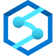
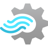
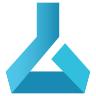
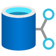
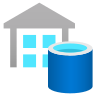
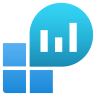
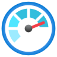

summary: Fundamentals of Analytics on Azure Cloud Platform - Part 2 - Data Lakes, Data Warehouses, and Modern Data Architecture
id: azure-analytics-fundamentals-part2
categories: Azure, Analytics, Cloud, Data Engineering
tags: azure, analytics, data-lake, data-warehouse, lakehouse, fabric, modern-data-architecture, synapse, adls, databricks, purview, power-bi, beginner, fundamentals
status: Published
authors: HitaVirTech
Feedback Link: https://github.com/hitavir25/codelabs/issues

# Fundamentals of Analytics on Azure Cloud Platform - Part 2

## Overview
Duration: 5:00



```
  +============================================================+
  |                                                            |
  |      AZURE ANALYTICS FUNDAMENTALS - PART 2                 |
  |                                                            |
  |  Data Lakes  -  Data Warehouses  -  Modern Architecture    |
  |                                                            |
  |                 Powered by HitaVir Tech                    |
  +============================================================+
```

Welcome to **Fundamentals of Analytics on Azure Cloud Platform - Part 2** by **HitaVir Tech**!

In Part 1 you built the mental model — analytics concepts, the 5 Vs, and the Azure services that solve each V. In Part 2 you will zoom out and learn **how those services combine** into production architectures used by real companies today.

### Where Part 1 Ends and Part 2 Begins

| Part 1 — The Ingredients | Part 2 — The Recipe |
|--------------------------|---------------------|
| 🧠 What is analytics / ML? | 🏛️ What is a data warehouse? |
| 📏 The 5 Vs diagnostic | 🪣 What is a data lake? |
| ☁️ One service per V | 🧩 How they combine into a Lakehouse |
| 🛠️ ADLS → Synapse Serverless mini lab | 🗺️ Reference architectures for 6 real use cases |

### What You Will Master

| Pillar | Topics |
|--------|--------|
| 🪣 **Data Lakes** | What, why, zones, governance on Azure |
| 🏛️ **Data Warehouses** | Columnar MPP, star schemas, Synapse Dedicated |
| 🏡 **Modern Data Architecture** | Lakehouse + Microsoft Fabric |
| ☁️ **Azure Services** | ADLS Gen2, Synapse, Databricks, Purview, ADF, Event Hubs, Power BI |
| 🗺️ **Reference Architectures** | Batch BI, Streaming, ML, Log analytics, 360° customer, Data mesh |
| 🎯 **Common Use Cases** | When to pick which pattern |

### Services You Will Meet in Part 2

          

### Why Architecture Matters More Than Services

```
  +================================================================+
  |                                                                |
  |   Services are Lego bricks.   Architecture is the castle.      |
  |                                                                |
  |   Any junior can spin up ADLS + Synapse.                       |
  |   Seniors know WHEN to use which, WHY, and HOW they join.      |
  |                                                                |
  +================================================================+
```

### Estimated Duration

**2-3 hours** (concept-heavy, no new hands-on required — uses Part 1 lab as the anchor)

### How to Use This Codelab

| If you are... | Do this |
|---------------|---------|
| 🎓 A student new to cloud | Read top-to-bottom; pause at each reference architecture |
| 🛠️ A working engineer | Skim sections 1-3, deep-read the reference architectures for patterns you ship |
| 🏗️ A solution architect | Use the reference diagrams as whiteboard starters with stakeholders |
| 🔖 A reference reader | Jump to the Quiz, the Cheat Sheet, and the Appendix of Resources |

> 💡 **HitaVir Tech says:** "Services change names every few years — HDInsight became Databricks, SQL DW became Synapse, Synapse is becoming Fabric. But the **shapes** of data architectures stay stable for decades. Master the shapes. You will pick up the services in a week."

## Prerequisites
Duration: 3:00

### What You Should Know

**Required**
- ✅ **Part 1 of this codelab** (5 Vs + Azure services per V)
- 💻 Laptop with a modern browser
- ☁️ Azure account (free tier; only for the optional hands-on snippets)
- 🧮 Basic SQL (SELECT, FROM, JOIN, GROUP BY)

**Helpful**
- 📝 Completed the Part 1 ADLS → Synapse Serverless lab
- 📚 Familiarity with JSON / CSV / Parquet / Delta

### Mental Model You Already Have (From Part 1)

           

```
  +--------------------------------------------------------------+
  |   5 Vs framework          Azure service toolkit              |
  |   -------------------     ------------------------           |
  |   Volume                  ADLS Gen2, Synapse, Databricks     |
  |   Variety                 ADF, Synapse, AI Vision, Doc Intel.|
  |   Velocity                Event Hubs, Stream Analytics, Fn   |
  |   Veracity                ADF flows, Purview, Defender       |
  |   Value                   Power BI, Azure ML, OpenAI         |
  +--------------------------------------------------------------+
```

In Part 2 we **compose** these services into proven shapes.

### No Paid Resources Required

Part 2 is concept-heavy. Every diagram is annotated with the services you already met in Part 1. The Part 1 hands-on lab is the practical anchor — this codelab teaches the architectures that scale it up.

> ⚠️ **If you choose to experiment** with Synapse Dedicated Pools or Databricks: they can exit the free tier quickly. Use serverless modes and delete resource groups the same day.

## Course Map
Duration: 3:00

```
  +==============================================================+
  |         SECTION  1  -  ARCHITECTURES (the big three)         |
  +==============================================================+
```

### The Three Architecture Icons

  

Three architecture patterns power **95% of modern analytics** in production:

```
                    +----------------------+
                    |  1.  DATA LAKE       |
                    |  Store anything,     |
                    |  cheap and forever   |
                    +----------+-----------+
                               |
                               | grew alongside
                               v
                    +----------------------+
                    |  2.  DATA WAREHOUSE  |
                    |  Fast SQL on         |
                    |  curated tables      |
                    +----------+-----------+
                               |
                               | combined into
                               v
                    +----------------------+
                    |  3.  LAKEHOUSE       |
                    |  (Modern Data Arch.) |
                    |  Best of both        |
                    +----------------------+
```

**Part 2 tours each architecture**, shows the Azure services that implement it, then demonstrates how real companies blend all three for different use cases.

## Introduction to Data Lakes
Duration: 8:00

```
  +==============================================================+
  |              ARCHITECTURE  1   -   DATA  LAKE                |
  |              "Store first, schema later."                    |
  +==============================================================+
```

  

### What is a Data Lake?

🪣 A **data lake** is a centralized repository that stores **any type of data** — structured, semi-structured, unstructured — **at any scale**, in its **native format**, typically on cheap object storage like **Azure Data Lake Storage Gen2**.

The defining move: you **ingest now** and **decide the schema later** (called *schema-on-read*). Contrast with warehouses, which demand *schema-on-write*.

### Data Lake — The Core Idea

```
  +------------------------------------------------------------+
  |                                                            |
  |   ANY DATA  --->   ADLS Gen2 (object store)   --->  ENGINES|
  |                                                            |
  |   CSV, JSON,        cheap, durable,          Synapse,      |
  |   Parquet, Delta,   infinite scale,          Databricks,   |
  |   logs, images,     one source of truth      HDInsight,    |
  |   Kafka events                               Power BI, ML  |
  |                                                            |
  +------------------------------------------------------------+
```

One lake. Many engines. That is the core promise.

### Why Data Lakes Emerged

Before ~2010, analytics meant **warehouses** — expensive, schema-strict, row-limited. Then data exploded:

| Problem With Warehouse-Only World | Who Felt It |
|-----------------------------------|-------------|
| 💸 Warehouse storage cost $1000s / TB / month | Every CFO |
| 🚫 Could not store PDFs, images, videos | Healthcare, retail, media |
| 🐢 Schema changes took weeks | Fast-moving startups |
| ⛔ Historical data deleted to save cost | Regulated industries |

Data lakes fixed this by leveraging **cheap object storage** (ADLS at ~$0.018 / GB / month) and **decoupling compute from storage**.

### Data Lake Zones — The Medallion Pattern

```
  abfss://lake@hitavirtech.dfs.core.windows.net/
    |
    +-- raw/          <--  BRONZE:  untouched, as ingested
    |                      + source of truth
    |                      + can replay anything from here
    |
    +-- curated/      <--  SILVER:  cleaned, typed, Delta/Parquet
    |                      + deduped, quality-checked
    |                      + partitioned for fast scans
    |
    +-- analytics/    <--  GOLD:    pre-aggregated, BI-ready
                           + joins done once
                           + powers Power BI and ML features
```

| Zone | Icon | Shape | Readers |
|------|:---:|-------|---------|
| **Raw / Bronze** | 🥉 | Original bytes — CSV, JSON, images, dumps | Data engineers only |
| **Curated / Silver** | 🥈 | Cleaned, typed, often Delta + partitions | Analysts, ML engineers |
| **Analytics / Gold** | 🥇 | Aggregated, ready for Power BI and models | Business users, BI tools |

### Delta Lake — The ACID Layer on Your Data Lake

```
  +--------------------------------------------------------------+
  |  DELTA  LAKE  -  ACID Transactions on ADLS                   |
  +--------------------------------------------------------------+
  |  Format    :  Parquet files + JSON transaction log           |
  |  Superpower:  UPDATE, DELETE, MERGE on lake files            |
  |  Travel    :  Time travel (query any past version)           |
  |  Used by   :  Databricks, Synapse Spark, Microsoft Fabric    |
  |                                                              |
  |  Solves the "warehouse features on lake files" problem.      |
  +--------------------------------------------------------------+
```

### Data Lake on Azure — The Service Stack

    

| Layer | Icon | Purpose | Service |
|-------|:---:|---------|---------|
| **Storage** | 🪣 | Raw bytes, infinite scale | ADLS Gen2 |
| **Governance** | 🔐 | Permissions, catalog, lineage | Microsoft Purview |
| **Cataloging** | 📚 | Schema + lineage | Purview + Synapse Catalog |
| **ETL / ELT** | 🕸️ | Move raw → curated → analytics | Azure Data Factory, Synapse Pipelines, Databricks |
| **Query** | 🔍 | SQL on lake files | Synapse Serverless SQL |
| **ML** | 🤖 | Train on lake data directly | Azure Machine Learning |

### Service Spotlight — Microsoft Purview

  

```
  +--------------------------------------------------------------+
  |  MICROSOFT  PURVIEW  -  Unified Data Governance              |
  +--------------------------------------------------------------+
  |  Catalog   :  Scan ADLS, Synapse, SQL, Power BI, S3, GCS     |
  |  Discovery :  Auto-classify sensitive data (500+ types)      |
  |  Lineage   :  End-to-end, column-level, across services      |
  |  Policy    :  Data access governance across clouds           |
  |                                                              |
  |  Turns a raw ADLS account into a governed, multi-tenant lake.|
  +--------------------------------------------------------------+
```

Purview is what lets **one ADLS account serve 20 teams** without everyone seeing everyone else's columns.

### Data Lake Strengths and Weaknesses

| Strength | Icon | Weakness | Icon |
|----------|:---:|----------|:---:|
| Cheap per GB | 💰 | Can become a "data swamp" without governance | 🐊 |
| Any format | 🧩 | Query performance < a warehouse on the same data | 🐢 |
| Separates storage and compute | 🔀 | Schema enforcement is optional (and often skipped) | 🫥 |
| Multi-engine access (Synapse, Databricks, Power BI, ML) | 🌐 | Harder for business users to self-serve | 😵 |

### The Data Swamp — How Lakes Fail

```
  +--------------------------------------------------------------+
  |                                                              |
  |   NO CATALOG         ->  "Which container has customers?"    |
  |   NO QUALITY RULES   ->  "Why are 40% of amounts negative?"  |
  |   NO GOVERNANCE      ->  "Who deleted last quarter's data?"  |
  |   NO LIFECYCLE       ->  "We're paying for 2014 clickstream" |
  |                                                              |
  |             ==>  DATA SWAMP  (useless, expensive)            |
  +--------------------------------------------------------------+
```

Every successful data lake is paired with **Purview + quality rules + lifecycle policies + Azure Policy**. Skip these and your lake drowns.

> 💡 **HitaVir Tech says:** "A data lake without a catalog is a data swamp. A data lake without quality rules is a liability. Governance is not optional — it is the difference between an asset and a landfill."

> 🪣 **Data lake in one line:** store everything cheaply, govern it strictly, query it from any engine.

## Introduction to Data Warehousing
Duration: 8:00

```
  +==============================================================+
  |           ARCHITECTURE  2   -   DATA  WAREHOUSE              |
  |           "Fast SQL on curated, trusted data."               |
  +==============================================================+
```

  

### What is a Data Warehouse?

🏛️ A **data warehouse** is a centralized, highly-structured database optimized for **analytical queries** — aggregations, joins, and scans across billions of rows — at interactive speeds.

Key properties:

| Property | Icon | What It Means |
|----------|:---:|---------------|
| **Schema-on-write** | 📝 | Every row fits a predefined schema at load time |
| **Columnar storage** | 📊 | Stores columns together, not rows — 10-100× faster scans |
| **MPP (Massively Parallel Processing)** | ⚡ | Splits work across many compute nodes automatically |
| **Optimized for reads** | 📖 | Writes are slower; reads are lightning-fast |
| **Business-user friendly** | 👥 | Clean star schemas; analysts can self-serve SQL |

### Row vs Columnar Storage

```
  ROW STORE (OLTP, e.g. Azure SQL DB)
  -----------------------------------
  [id | name | country | amount]  <-- each row stored together

  Great for:  "Get everything about order 1042"
  Bad for:    "SUM(amount) across 1B rows"

  COLUMNAR STORE (OLAP, e.g. Synapse Dedicated, Parquet)
  ------------------------------------------------------
  [id][id][id]...
  [name][name][name]...
  [country][country][country]...
  [amount][amount][amount]...      <-- each column stored together

  Great for:  "SUM(amount) across 1B rows"  (scan only one column)
  Bad for:    "Get everything about order 1042"
```

**Warehouses use columnar.** That one design choice is why they can aggregate billions of rows in seconds.

### Star Schema — The Warehouse Language

Most warehouse tables follow the **star schema**:

```
                    +---------------------+
                    |   DIM_CUSTOMER      |
                    |   (who bought)      |
                    +----------+----------+
                               |
                               |
  +---------------+    +---------------+    +---------------+
  | DIM_PRODUCT   |----|  FACT_SALES   |----|  DIM_DATE     |
  | (what sold)   |    |  (the event)  |    | (when sold)   |
  +---------------+    +-------+-------+    +---------------+
                               |
                               |
                    +----------+----------+
                    |   DIM_STORE         |
                    |   (where sold)      |
                    +---------------------+
```

- 🌟 **Fact table** — the measurable events (one row per sale, click, payment)
- 📐 **Dimension tables** — the context (who, what, when, where)

Star schemas make queries fast AND readable: `SELECT country, SUM(amount) FROM fact_sales JOIN dim_store ...`.

### Service Spotlight — Azure Synapse Dedicated SQL Pool


```
  +--------------------------------------------------------------+
  |  SYNAPSE  DEDICATED  SQL  POOL  (formerly SQL DW)            |
  +--------------------------------------------------------------+
  |  Category  :  Columnar MPP warehouse                         |
  |  Distrib.  :  Round-robin, hash, replicated                  |
  |  Scale     :  60-to-hundreds of DWUs, petabyte range         |
  |  SQL       :  T-SQL (SQL Server flavored)                    |
  |  Pairings  :  PolyBase, COPY statement, Power BI             |
  |                                                              |
  |  The engine behind Mars, Rolls-Royce, Walmart analytics.     |
  +--------------------------------------------------------------+
```

### Synapse Serverless SQL — Warehouse Queries Over the Lake

```
                 +----------------------------+
                 |  Dedicated SQL Pool         |
                 |  (hot, curated tables)     |
                 +-------------+--------------+
                               |
                               | joins across
                               v
                 +----------------------------+
                 |  ADLS via Serverless SQL   |
                 |  (cold, historical data)   |
                 +----------------------------+
```

One T-SQL query spans **both** the warehouse (recent, hot) and the lake (years of history). No duplicate storage, no duplicate pipelines.

### Warehouse Loading Patterns

| Source | Icon | Loader | Speed |
|--------|:---:|--------|:-----:|
| ADLS files | 🪣 | `COPY` statement (parallel) | 🚀 |
| Event Hubs | 🌊 | Synapse streaming ingestion | 🚀 |
| Azure SQL / Postgres | 🗄️ | Azure Data Factory + CDC | 🏃 |
| SaaS apps (Dynamics, Salesforce) | ☁️ | Data Factory connectors / Power Automate | 🚶 |

### Data Warehouse Strengths and Weaknesses

| Strength | Icon | Weakness | Icon |
|----------|:---:|----------|:---:|
| Sub-second SQL on billions of rows | ⚡ | Expensive per TB stored | 💸 |
| Business-analyst friendly | 👥 | Rigid schema — changes need migrations | 🔒 |
| Mature BI tool ecosystem (Power BI) | 📊 | Only handles structured data | 📋 |
| ACID transactions and governance baked-in | 🛡️ | Locked into one vendor's engine | 🔗 |

### Lake vs Warehouse — The Canonical Comparison

```
  +--------------------+------------------------+------------------------+
  |  ATTRIBUTE         |  DATA  LAKE            |  DATA  WAREHOUSE       |
  +--------------------+------------------------+------------------------+
  |  Data type         |  Anything              |  Structured only       |
  |  Schema            |  On read               |  On write              |
  |  Cost / TB stored  |  $  (cheap)            |  $$$$  (expensive)     |
  |  Query speed       |  Medium                |  Fast                  |
  |  Users             |  Engineers, data sci.  |  Analysts, business    |
  |  Azure example     |  ADLS + Serverless SQL |  Synapse Dedicated     |
  +--------------------+------------------------+------------------------+
```

> 💡 **HitaVir Tech says:** "Warehouses are optimized for the answers you know you want. Lakes are optimized for the answers you haven't invented questions for yet. Real companies need both. The next section shows how to stop choosing and combine them."

> 🏛️ **Warehouse in one line:** columnar + MPP + star schema = fast answers for business users.

## Introduction to Modern Data Architecture
Duration: 10:00

```
  +==============================================================+
  |       ARCHITECTURE  3   -   MODERN  DATA  ARCHITECTURE       |
  |         (aka the "Lakehouse" pattern on Azure)               |
  +==============================================================+
```

     

### The Problem Modern Data Architecture Solves

By 2018, most companies had **both** a lake and a warehouse — and suffered:

| Pain | Icon | Symptom |
|------|:---:|---------|
| Two copies of the truth | 👯 | Lake says one number, warehouse says another |
| Pipeline sprawl | 🕸️ | 200 Data Factory jobs shuffling data between them |
| Permission chaos | 🔐 | Entra ID for SQL, ACLs for storage, separate audits |
| Skill silos | 🧑‍💻 | Data engineers in Spark, analysts in SQL, no common tool |
| ML engineers stuck | 🤖 | Data scientists denied warehouse access, scraping lakes by hand |

### The Modern Data Architecture Idea

```
  +==============================================================+
  |                                                              |
  |    ONE GOVERNED PLATFORM                                     |
  |                                                              |
  |    - Unified storage  (ADLS Gen2 = source of truth)          |
  |    - Open table format  (Delta Lake / Iceberg)               |
  |    - Purpose-built engines  (pick the right tool per job)    |
  |    - Shared catalog + governance  (Purview)                  |
  |    - Common security model  (Entra ID + RBAC + Key Vault)    |
  |                                                              |
  +==============================================================+
```

Instead of lake **or** warehouse, you get lake **and** warehouse — unified by one catalog, one permission model, one lineage.

### Microsoft Fabric — The Unified SaaS Lakehouse

     

In 2023 Microsoft launched **Fabric** — a single SaaS surface that bundles:

| Fabric Pillar | Icon | Under the Hood |
|---------------|:---:|----------------|
| **OneLake** |  | One tenant-wide ADLS, "OneDrive for data" |
| **Data Factory** |  | Ingest and orchestrate (same engine as ADF) |
| **Synapse Data Engineering** |  | Spark notebooks on Delta Lake |
| **Synapse Data Warehouse** |  | T-SQL warehouse over Delta (not Dedicated Pool!) |
| **Synapse Real-Time Analytics** |  | KQL / Data Explorer on streams |
| **Power BI** |  | Native BI over OneLake (Direct Lake mode) |
| **Data Activator** |  | Trigger actions from data signals |
| **Copilot** |  | Natural-language across all pillars |

Fabric is where Azure analytics is heading. The Part 1 services still exist — Fabric simply bundles them on one pricing model, one identity, one lakehouse.

### The Five Pillars of Modern Data Architecture on Azure

```
     +--------+     +--------+     +--------+     +--------+     +--------+
     |   1    |     |   2    |     |   3    |     |   4    |     |   5    |
     | SCALABLE|    |PURPOSE-|    |SEAMLESS|    |UNIFIED |    |FUTURE- |
     |   DATA  |    |  BUILT |    |  DATA  |    |GOVERN- |    |  PROOF |
     |   LAKE  |    | ENGINES|    |MOVEMENT|    |  ANCE  |    |   ML   |
     +---------+    +--------+    +--------+    +--------+    +--------+
         |              |              |              |              |
         v              v              v              v              v
       ADLS +        Synapse,      Shortcuts,   Purview +     Azure ML,
       Fabric        Databricks,   Mirroring,   Entra ID +    OpenAI,
       OneLake       Power BI,     ADF zero-    Key Vault +   Synapse
                     Data Explorer  copy link   Defender      ML, Fabric
```

### Pillar 1 — A Scalable Data Lake at the Core


Every modern Azure architecture **starts from ADLS Gen2 / OneLake**. Why?

| Reason | Icon | Impact |
|--------|:---:|--------|
| Infinite scale | ♾️ | Never outgrow it |
| 11 nines durability (GRS) | 🛡️ | Your data is safer than on any disk |
| Pennies per GB | 💰 | Keep history forever |
| Native reader for Synapse, Databricks, Power BI, ML | 🌐 | One source, many consumers |

### Pillar 2 — Purpose-Built Engines

One-size-fits-all is dead. Pick the right engine per workload:

| Workload | Icon | Engine | Why |
|----------|:---:|--------|-----|
| Ad-hoc SQL on lake files | 🔍 | **Synapse Serverless SQL** | Pay per TB scanned, zero setup |
| Dashboards on curated tables | 🏛️ | **Synapse Dedicated / Fabric Warehouse** | Sub-second BI |
| Petabyte Spark / ML | 🔥 | **Databricks / Synapse Spark** | Custom transforms + ML at scale |
| Sub-ms lookups | ⚡ | **Cosmos DB** | Document / key-value queries |
| Full-text + vector search | 🔎 | **AI Search** | RAG, log search, enterprise search |
| Real-time aggregation | 🎯 | **Stream Analytics / ADX** | Streaming SQL / KQL |

### Pillar 3 — Seamless Data Movement

Instead of 200 brittle ETL jobs, modern Azure architectures rely on:

- 🚀 **Mirroring** — Azure SQL / Cosmos / Snowflake → Fabric with near-zero-latency replication
- 🌐 **OneLake Shortcuts** — point to data in another lake / S3 / GCS without copying
- 🔭 **Synapse Serverless SQL** — warehouse-style SQL on any ADLS folder
- 📡 **Event Hubs to Synapse / Data Explorer streaming ingestion**
- 🔗 **Power BI Direct Lake** — report on Delta tables with no import cache

### Pillar 4 — Unified Governance

   

| Layer | Icon | Service | Purpose |
|-------|:---:|---------|---------|
| Identity | 🔑 | Microsoft Entra ID (formerly AAD) | Who you are |
| Fine-grained access | 🔐 | Azure RBAC + ADLS ACLs + Purview policies | What you can do |
| Encryption | 🔒 | Key Vault + Customer-Managed Keys | At-rest and in-transit |
| PII scanning | 🕵️ | Microsoft Purview + Defender for Cloud | Find sensitive data |
| Audit | 📜 | Activity Log + Azure Monitor | Every API call, every query |
| Data discovery | 🧭 | Microsoft Purview | Business-friendly data catalog |
| Policy-as-code | ⚙️ | Azure Policy | Enforce rules on resources |

### Pillar 5 — Built-in AI / ML

 

ML is no longer a bolt-on — it lives **inside** the platform:

| Capability | Icon | Service |
|------------|:---:|---------|
| Full ML lifecycle | 🤖 | Azure Machine Learning |
| Foundation models (GPT-4, Claude partners, Llama) | 🧠 | Azure OpenAI Service |
| Spark-native ML in notebooks | 🔥 | Databricks MLflow / Synapse ML |
| No-code ML | 📈 | Azure ML Designer / AutoML |
| Natural-language BI | 💬 | Power BI Copilot |
| RAG | 🔎 | AI Search + Azure OpenAI |

### The Modern Data Architecture — One Picture

```
  +==================================================================+
  |                                                                  |
  |   +---------+   +---------+   +---------+   +---------+          |
  |   | Batch   |   | Stream  |   | OpTx DB |   | SaaS    |          |
  |   | files   |   | events  |   | (CDC)   |   | apps    |          |
  |   +----+----+   +----+----+   +----+----+   +----+----+          |
  |        |             |             |             |               |
  |        +-------------+-------------+-------------+               |
  |                             |                                    |
  |                             v                                    |
  |     +-----------------------------------------------------+      |
  |     |    ADLS GEN2 / ONELAKE  ---  Centralized Lake       |      |
  |     |    Raw  ->  Curated  ->  Analytics  (Delta/Parquet) |      |
  |     +---------------------------+-------------------------+      |
  |                                 |                                |
  |                  governed by    |                                |
  |                                 v                                |
  |     +-----------------------------------------------------+      |
  |     | PURVIEW + ENTRA ID + KEY VAULT + DEFENDER + POLICY  |      |
  |     +-----------------------------------------------------+      |
  |                                 |                                |
  |       +------------+------------+------------+-------------+     |
  |       |            |            |            |             |    |
  |       v            v            v            v             v    |
  |   +-------+   +---------+   +-----+   +-----------+   +------+  |
  |   |Synapse|   |Synapse  |   |Data-|   |Azure Data |   |Azure |  |
  |   |Server-|   |Dedicated|   |bricks|  |Explorer   |   |ML /  |  |
  |   |less   |   |(MPP)    |   |Spark |  |  (KQL)    |   |OpenAI|  |
  |   +---+---+   +----+----+   +--+--+   +-----+-----+   +--+---+  |
  |       |            |           |             |           |      |
  |       +------------+-----------+-------------+-----------+      |
  |                                 |                                |
  |                                 v                                |
  |            +----------------------------------------+            |
  |            |   VALUE  =  Power BI + Copilot + apps  |            |
  |            +----------------------------------------+            |
  |                                                                  |
  +==================================================================+
```

Look carefully: **every service from Part 1 has a home.** That is modern Azure data architecture.

### Modern Data Architecture — In One Sentence

> **Centralize storage in a governed ADLS / OneLake. Use the best engine for each workload. Let data move frictionlessly between them. Secure it all uniformly. Build ML natively on top.**

> 💡 **HitaVir Tech says:** "Don't build one monolith. Don't build 20 silos. Build one lake, with many engines, one catalog, one security model. That's how Azure's biggest analytics customers run."

> 🏡 **Lakehouse in one line:** one lake for storage, many engines for compute, one catalog for trust.

## Azure Services for Modern Data Architecture
Duration: 10:00

```
  +==============================================================+
  |         THE  COMPLETE  AZURE  SERVICE  MAP                   |
  |            for Modern Data Architecture                      |
  +==============================================================+
```

### The Headline Cast for Part 2

           

Each service answers a specific question in the modern architecture:

| Layer | Question | Service | Icon |
|-------|----------|---------|:---:|
| Storage | Where does my data live? | ADLS Gen2 / OneLake | 🪣 |
| Governance | Who can see what? | Microsoft Purview | 🏗️ |
| Catalog | What data do we have? | Purview + Synapse Catalog | 📚 |
| ETL / ELT | How do I shape it? | Azure Data Factory, Databricks, Synapse Spark | 🕸️ |
| SQL on lake | How do I explore? | Synapse Serverless SQL | 🔍 |
| SQL on warehouse | How do I serve BI? | Synapse Dedicated / Fabric Warehouse | 🏛️ |
| Stream ingest | How do I handle real time? | Event Hubs + Stream Analytics | 🌊 |
| Time-series / logs | How do I query logs? | Azure Data Explorer (KQL) | 🔎 |
| BI | How do people see it? | Power BI | 📊 |
| ML | How do we predict? | Azure Machine Learning | 🤖 |
| LLMs | How do we add GenAI? | Azure OpenAI + AI Search | 🧠 |
| Real-time search | How do we find a needle? | Azure AI Search | 🔎 |

### Service Spotlight — Azure Databricks


```
  +--------------------------------------------------------------+
  |  AZURE  DATABRICKS  -  The Lakehouse Pioneer                 |
  +--------------------------------------------------------------+
  |  Audience  :  Data engineers + data scientists + analysts    |
  |  Engine    :  Apache Spark (Photon) + Delta Lake             |
  |  Notebooks :  Python, SQL, R, Scala                          |
  |  ML        :  MLflow tracking, feature store, model serving  |
  |  Governance:  Unity Catalog (like Purview, for Databricks)   |
  |                                                              |
  |  The "full lakehouse in one product" option.                 |
  +--------------------------------------------------------------+
```

### Zero-Copy — The Quiet Revolution on Azure

Classic ETL means writing code to extract-transform-load between systems. Azure's zero-copy features make data **appear** in another system without moving it:

```
  +-----------------+          +------------------------+
  | Azure SQL DB    |==Mirror=>| Microsoft Fabric       |
  |  (app DB)       |  managed | (Lakehouse, OneLake)   |
  +-----------------+          +------------------------+

  Zero-copy on Azure today:
  - Azure SQL        -> Fabric (Mirroring)
  - Cosmos DB        -> Fabric (Mirroring)
  - Snowflake        -> Fabric (Mirroring)
  - OneLake Shortcut -> ADLS Gen2 / S3 / GCS (no copy at all)
```

Fewer pipelines to maintain. Fresher analytics. Less on-call pain.

### Azure Data Factory — The Connective Tissue


In a modern architecture, ADF is **everywhere**:

| Capability | Icon | Role |
|------------|:---:|------|
| Copy Activity | 📋 | Move data between 100+ sources and sinks |
| Mapping Data Flows | 🕸️ | Visual Spark-based transforms |
| Triggers | ⏱️ | Schedule, event, tumbling window |
| Integration Runtimes | 🌐 | Cloud or self-hosted, on-prem → Azure |
| Git integration | 🔀 | Pipelines as code (Azure DevOps / GitHub) |
| Monitoring | 📈 | Built-in dashboards + Azure Monitor |

### A Mental Shortcut — The Service Lookup Table

When someone describes a problem, scan this table first:

| Problem Sounds Like... | Reach For |
|------------------------|-----------|
| "We have terabytes piling up and need cheap storage" | 🪣 ADLS Gen2 + 🧊 Archive tier |
| "Analysts want SQL on 1B rows, must return in seconds" | 🏛️ Synapse Dedicated / Fabric Warehouse |
| "We dump random files hourly, want ad-hoc SQL" | 🔍 Synapse Serverless + 🕸️ ADF |
| "Events come at 1M / sec and drive a live dashboard" | 🌊 Event Hubs + 🎯 Stream Analytics |
| "Logs need to be searchable with keyword filters" | 🔬 Azure Data Explorer (KQL) |
| "We keep 2 copies of the same data in lake and warehouse" | 🔭 Serverless / Mirroring / Fabric Direct Lake |
| "We need to share a slice with another Azure tenant" | 🔗 Azure Data Share / Purview data policies |
| "Non-engineers can't find any data" | 🧭 Microsoft Purview / Fabric catalog |
| "We want the CEO to ask questions in English" | 💬 Power BI Copilot |
| "Our support team wants to chat with our docs" | 🔎 AI Search + 🧠 Azure OpenAI (RAG) |

> 💡 **HitaVir Tech says:** "When a junior asks 'which Azure service should we use?', the senior reply is another question — 'what is the actual pattern?' Service choice without pattern = tech for tech's sake."

## Common Use Cases
Duration: 10:00

```
  +==============================================================+
  |         SECTION  2   -   COMMON  USE  CASES                  |
  |           (where the patterns show up in real life)          |
  +==============================================================+
```

Most real-world analytics work on Azure falls into **six repeatable patterns**. Recognize them and you'll know which reference architecture to reach for.

### The Service Cast Across All Six Patterns

        

### The Six Patterns

```
  +-----------------------------------------------------------+
  |  1.  BATCH  BI           - nightly dashboards             |
  |  2.  REAL-TIME  ANALYTICS- live metrics, fraud, IoT       |
  |  3.  LOG  /  APP  OBS.   - search + troubleshoot logs     |
  |  4.  CUSTOMER  360       - unify profiles across sources  |
  |  5.  ML  /  PREDICTIVE   - forecast, recommend, score     |
  |  6.  DATA  MESH          - domain-owned, shared data      |
  +-----------------------------------------------------------+
```

### Use Case 1 — Batch Business Intelligence

 

**Who needs it:** Every company with a CFO.

**Shape:** Operational databases + flat files → data lake → warehouse → Power BI.

| Trait | Value |
|-------|-------|
| Freshness | Daily or hourly |
| Volume | GB to TB |
| Velocity V | 🐢 Batch |
| Core service | 🏛️ Synapse Dedicated / Fabric Warehouse |

**Example prompt:** "Revenue by region compared to last quarter, refreshed every morning at 8 am."

### Use Case 2 — Real-Time Analytics

  

**Who needs it:** Rideshare, fintech, ad-tech, IoT, online gaming.

**Shape:** Events → Event Hubs → stream processor → live dashboard **and** ADLS for history.

| Trait | Value |
|-------|-------|
| Freshness | Sub-second to seconds |
| Volume | Millions of events / sec |
| Velocity V | ⚡ Streaming |
| Core service | 🌊 Event Hubs + 🎯 Stream Analytics |

**Example prompt:** "Alert the risk team the moment any card transaction looks fraudulent."

### Use Case 3 — Log & Application Observability

  

**Who needs it:** Every engineering team at scale.

**Shape:** Application logs → Log Analytics / ADX → ADLS archive.

| Trait | Value |
|-------|-------|
| Freshness | Seconds |
| Volume | TB/day in logs |
| Velocity V | ⚡ Streaming |
| Core service | 🔬 Azure Data Explorer (KQL) |

**Example prompt:** "Search the last 30 days of production logs for any mention of this request ID."

### Use Case 4 — Customer 360

   

**Who needs it:** Retail, banking, telecom, SaaS.

**Shape:** Unify profiles from CRM, web, mobile, support into one view, served to marketing + ML.

| Trait | Value |
|-------|-------|
| Freshness | Hourly |
| Volume | TB |
| Dominant V | 🧩 Variety |
| Core service | 🪣 ADLS + 🕸️ ADF + 🏛️ Synapse |

**Example prompt:** "Show one customer's full lifetime journey — ads seen, orders placed, tickets filed."

### Use Case 5 — ML / Predictive Analytics

  

**Who needs it:** Forecasting, recommendations, fraud, churn, dynamic pricing.

**Shape:** Lake → feature store → model training → model endpoint → prediction served in app or BI.

| Trait | Value |
|-------|-------|
| Freshness | Training weekly, inference real-time |
| Volume | GB to PB of history |
| Dominant V | 💎 Value |
| Core service | 🤖 Azure ML + 🪣 ADLS |

**Example prompt:** "Predict which customers will churn next month so we can retain them."

### Use Case 6 — Data Mesh

  

**Who needs it:** Enterprises with many product teams owning their own data.

**Shape:** Each domain team curates its own data products on ADLS / OneLake; a central catalog (Purview + Fabric) makes them discoverable and access-controlled.

| Trait | Value |
|-------|-------|
| Freshness | Per-domain |
| Ownership | Distributed to domain teams |
| Dominant V | 🛡️ Veracity + 💎 Value |
| Core service | 🏗️ Purview + 🏡 Fabric domains |

**Example prompt:** "The Finance team owns 'invoices', Marketing owns 'campaigns', but anyone at the company can discover and request access."

### Picking the Right Pattern — Decision Cheat

```
                What is the dominant question?
                            |
       +-------+---+-----+----+-----+----+-------+
       |       |         |         |    |       |
    Weekly   Instant  Find a    One     Predict  Federated
    KPIs     alerts   log line  360 view future   ownership
       |       |         |         |    |       |
       v       v         v         v    v       v
     BATCH   REAL-    LOG      CUSTOMER  ML /   DATA
      BI     TIME     OBS.      360      PRED.   MESH
```

> 💡 **HitaVir Tech says:** "New engineers try to force every problem into the pattern they already know. Seniors look at the dominant V and pick the shape — then fill in services. Diagnose first. Build second."

## Reference Architecture
Duration: 12:00

```
  +==============================================================+
  |           SECTION  3  -  REFERENCE  ARCHITECTURES            |
  +==============================================================+
```

For each use case, here is a whiteboard-ready Azure architecture you can copy, adapt, and defend in a design review.

### Reference 1 — Batch BI on a Lakehouse

   

```
  Azure SQL / Postgres            Dynamics 365, Salesforce
           |                                |
           +---- ADF with CDC connector ----+
                                   |
                                   v
            +--------------------------------------+
            |     ADLS Gen2  Data Lake             |
            |     raw -> curated (Delta/Parquet)   |
            +---------------+----------------------+
                            |
                            v  (ADF Data Flows, Purview DQ, catalog)
                            |
            +---------------+----------------------+
            |   Synapse Dedicated SQL Pool         |
            |   - Star schemas                     |
            |   - Nightly COPY loads               |
            +---------------+----------------------+
                            |
                            v
                     Power BI
               (Direct Query or Import)
                            |
                            v
                        Executives
```

**When to pick it:** Finance, ops, exec reporting. Stable queries, predictable loads.

### Reference 2 — Real-Time Analytics

     

```
  Producers (apps, IoT, clickstream)
             |
             v
   +-------------------------+
   |  Azure Event Hubs       |
   |  (durable, partitioned) |
   +------------+------------+
                |
    +-----------+------------+------------+
    |                        |            |
    v                        v            v
 Stream Analytics          Functions    Capture
 (continuous SQL)        (alerting on    |
    |                    anomalies)      v
    |                        |         ADLS
    v                        v       (Parquet, hist.)
 Live dashboard            Service         |
 (Power BI streaming)      Bus / Teams     v
 OR Data Explorer          alert        Synapse
                                        Serverless
                                         ad-hoc
```

**When to pick it:** Fraud detection, live pricing, real-time personalization, IoT.

### Reference 3 — Log & Application Observability

   

```
  App services / AKS / VMs / Activity Log / Defender
                      |
                      v
              Azure Monitor
          (agent + diagnostic settings)
                      |
           +----------+-----------+
           |                      |
           v                      v
   Log Analytics /          ADLS (archive)
   Data Explorer            (cheap, years)
   (hot, 30-90 days)              |
           |                      v
           v                 Synapse Serverless
   KQL dashboards /         for historical
   Grafana / Sentinel       audits
```

**When to pick it:** SRE and platform teams, security logs (Sentinel), microservice observability.

### Reference 4 — Customer 360

   

```
  Dynamics 365   Web events    Mobile app    Zendesk / SN
       |            |              |                |
       +------------+------+-------+----------------+
                          |
                          v
                ADLS Gen2 Data Lake (raw)
                          |
                          v  ADF + Purview DQ
                          |
                ADLS Gen2 Data Lake (curated, Delta)
                          |
                          v
         +----------------+------------------+
         |                                    |
         v                                    v
     Synapse                              Azure ML
     Unified Customer                     Features + Models
     table (serving BI)                   (churn, LTV, NBA)
         |                                    |
         v                                    v
      Power BI 360                   Marketing automation
      dashboard                      (personalized offers)
```

**When to pick it:** Retail, banking, telecom, subscription SaaS.

### Reference 5 — ML / Predictive Analytics

   

```
  +----------------------+
  |   ADLS / OneLake     |
  |   (historical data)  |
  +----------+-----------+
             |
             v
  +----------------------+
  |  Databricks / Synapse|
  |  Feature engineering |
  +----------+-----------+
             |
             v
  +-------------------------+
  |  Azure ML Feature Store |
  +-----+-----------+-------+
        |           |
  (training)    (serving)
        v           v
  Azure ML       Real-time
  Jobs           endpoint
  (compute       (managed online
   cluster)       inference)
        |           |
        v           v
     Models    Mobile / web app
                (personalized UX)
```

**When to pick it:** Recommenders, fraud detection, demand forecasting, dynamic pricing.

### Reference 6 — Data Mesh on Azure

   

```
  Domain A (Orders)      Domain B (Marketing)     Domain C (Finance)
  owns its own pipes     owns its own pipes       owns its own pipes
     |                       |                         |
     v                       v                         v
  ADLS + Synapse          ADLS + Synapse           ADLS + Synapse
  (Orders domain)         (Marketing domain)       (Finance domain)
     |                       |                         |
     +-----------+-----------+-------------------------+
                 |
                 v
       +-----------------------------------+
       |  Microsoft Purview  (central cat) |
       |  + Fabric domains + Data Policies |
       +---------------+-------------------+
                       |
          +------------+------------+
          |            |            |
          v            v            v
        Analyst    Data sci.    Executive
       (Synapse)  (Azure ML)   (Power BI / Copilot)
```

**When to pick it:** Large enterprises where domain teams must own their data products, but a central platform team guarantees governance.

### Reference Architecture Comparison

| # | Pattern | Primary V | Storage | Compute | Serve |
|:-:|---------|:-------:|---------|---------|-------|
| 1 | Batch BI | Volume | ADLS + Synapse | ADF, Synapse Dedicated | Power BI |
| 2 | Real-Time | Velocity | Event Hubs + ADLS | Stream Analytics, Functions | Power BI, Data Explorer |
| 3 | Log Obs. | Velocity + Variety | Log Analytics + ADX + ADLS | Azure Monitor | KQL dashboards, Sentinel |
| 4 | 360 | Variety + Value | ADLS + Synapse | ADF | Power BI + apps |
| 5 | ML | Value | ADLS | Databricks, Azure ML | Endpoint in app |
| 6 | Mesh | Veracity + Value | Distributed ADLS | Per-domain | Purview + Power BI |

> 💡 **HitaVir Tech says:** "Architects don't memorize 50 services — they memorize 6 shapes. When someone brings a new problem, they map it to a shape first, then pick services to fit. Copy these six patterns. Most of your career, you'll be adapting one of them."

## Quiz
Duration: 7:00

```
  +==============================================================+
  |             QUIZ  -   TEST  YOUR  UNDERSTANDING              |
  +==============================================================+
```

### The Services Under Test

      

Answer each question before revealing. No peeking — this is how you build real recall.

### Question 1 — Data Lake Fundamentals

**Which of the following best describes a data lake?**

- A. A database optimized for OLTP workloads
- B. Centralized storage for raw, varied data at any scale, queried by many engines
- C. A real-time stream processor
- D. A managed Kafka cluster

> **Answer:** B. A lake holds *any* data in native format; multiple engines (Synapse, Databricks, Power BI, Azure ML) read from it.

### Question 2 — Data Warehouse Property

**Which property is specific to data warehouses, not data lakes?**

- A. Schema-on-read
- B. Object storage foundation
- C. Columnar storage with MPP
- D. Storing raw unstructured data

> **Answer:** C. Columnar + MPP is the warehouse signature, enabling fast aggregation on billions of rows.

### Question 3 — Medallion Zones

**Match each zone to its typical reader:**

| Zone | Readers |
|------|---------|
| Raw (Bronze) | ? |
| Curated (Silver) | ? |
| Analytics (Gold) | ? |

> **Answer:** Raw = data engineers only. Curated = analysts and ML engineers. Analytics = business users and BI tools.

### Question 4 — Lakehouse Core Service

**In an Azure Modern Data Architecture, which service is the "source of truth" storage layer?**

- A. Azure Synapse Dedicated Pool
- B. ADLS Gen2 / OneLake
- C. Cosmos DB
- D. Azure SQL Database

> **Answer:** B. ADLS Gen2 (or OneLake in Fabric). Every other analytics engine on Azure reads from it.

### Question 5 — Synapse Serverless

**What does Synapse Serverless SQL enable?**

- A. Encrypting Synapse at rest
- B. Training ML models inside Synapse
- C. Running T-SQL directly against ADLS lake files via `OPENROWSET`
- D. Auto-scaling the dedicated pool

> **Answer:** C. Serverless SQL lets you query lake data from the warehouse — no duplicate storage.

### Question 6 — Governance

**Which service provides unified data catalog, lineage, and policy across ADLS, Synapse, Power BI, and even AWS S3?**

- A. Azure RBAC alone
- B. Microsoft Purview
- C. Microsoft Defender for Cloud
- D. Azure Activity Log

> **Answer:** B. Microsoft Purview. Azure RBAC is coarse identity; Defender finds PII; Activity Log audits; Purview **governs** across the whole estate.

### Question 7 — Pattern Matching

**A fraud team needs to block bad transactions within 200 ms. Which pattern fits?**

- A. Batch BI (nightly Synapse)
- B. Real-Time Analytics (Event Hubs + Stream Analytics + Functions)
- C. Data Mesh
- D. Log Observability

> **Answer:** B. Real-time analytics with streaming + serverless alerting.

### Question 8 — Mirroring

**Microsoft Fabric Mirroring between Azure SQL and Fabric eliminates the need to:**

- A. Pay for storage
- B. Write custom replication pipelines
- C. Create warehouse tables
- D. Secure the data

> **Answer:** B. Mirroring replicates changes automatically — no pipeline code to maintain.

### Question 9 — Business Data Discovery

**Which service helps non-engineers discover datasets using business terms instead of table names?**

- A. Azure Data Factory
- B. Microsoft Defender
- C. Microsoft Purview
- D. Azure Activity Log

> **Answer:** C. Purview provides a business-friendly catalog, lineage, and classification.

### Question 10 — Anti-Pattern

**A company stores 5 years of clickstream JSON in ADLS but has no Purview, no Azure Policy, no quality rules. What is this?**

- A. A modern data lake
- B. A data swamp
- C. Data mesh
- D. Medallion architecture

> **Answer:** B. A data swamp — no catalog, no governance, no trust. Storage alone is not an architecture.

### Score Yourself

| Score | Meaning |
|:-----:|---------|
| 9-10 | 🎓 You are ready for production design reviews |
| 7-8 | 🧠 Solid. Re-read the reference architectures section |
| 5-6 | 📚 Review the three architecture chapters and retake |
| < 5 | 🔄 Re-do Part 1 first — the 5 Vs are the foundation |

> 💡 **HitaVir Tech says:** "Don't guess. The questions here are the same ones that show up in every Azure analytics interview. Know them cold."

## Course Summary
Duration: 4:00

```
  +==============================================================+
  |          CONGRATULATIONS  -  PART 2 DONE!                    |
  +==============================================================+
```

### Every Service You Now Know

           

### What You Learned

**🪣 Data Lakes**

| Topic | Icon |
|-------|:---:|
| What a lake is (schema-on-read) | 📖 |
| The medallion zones (raw, curated, analytics) | 🥉🥈🥇 |
| Why lakes become swamps without governance | 🐊 |
| Delta Lake — ACID on ADLS | 🔺 |

**🏛️ Data Warehouses**

| Topic | Icon |
|-------|:---:|
| Schema-on-write, columnar, MPP | 📊 |
| Star schemas (fact + dimensions) | ⭐ |
| Synapse Dedicated vs Serverless | 🏛️ |
| Fabric Warehouse (the new kid) | 🏡 |

**🏡 Modern Data Architecture (Lakehouse)**

| Pillar | Icon |
|--------|:---:|
| Scalable data lake (ADLS / OneLake) | 🪣 |
| Purpose-built engines | 🧰 |
| Seamless movement (Mirroring, Shortcuts, Direct Lake) | 🔀 |
| Unified governance (Purview + Entra) | 🔐 |
| Built-in AI / ML (Azure ML + OpenAI) | 🤖 |

**🗺️ Six Reference Architectures**

| # | Pattern | Core Service |
|:-:|---------|--------------|
| 1 | Batch BI | 🏛️ Synapse + 📊 Power BI |
| 2 | Real-Time | 🌊 Event Hubs + 🎯 Stream Analytics |
| 3 | Log Observability | 🔬 Data Explorer / Log Analytics |
| 4 | Customer 360 | 🪣 ADLS + 🕸️ ADF + 🏛️ Synapse |
| 5 | ML / Predictive | 🤖 Azure ML + 🔥 Databricks |
| 6 | Data Mesh | 🏗️ Purview + 🏡 Fabric domains |

### The Mental Upgrade From Part 1 to Part 2

| Part 1 Gave You... | Part 2 Gave You... |
|--------------------|--------------------|
| 📏 A diagnostic framework (5 Vs) | 🗺️ Reference architectures |
| ☁️ One service per V | 🧩 Combinations that scale |
| 🛠️ A basic ADLS → Synapse Serverless lab | 🏡 The full Lakehouse picture |
| 🎯 What to pick for each bottleneck | 🎯 Which shape fits each real-world problem |

### What To Do Next

1. 🔎 **Draw one of the six reference architectures** for a project you know.
2. 💬 **Walk a teammate through it** — teaching cements understanding.
3. 🧪 **Extend the Part 1 lab:** add an ADF pipeline to move `raw/` → `curated/` as Parquet.
4. 📚 **Read the Azure Well-Architected Framework — Analytics perspective** (link in the Appendix).
5. 🎓 **Try Microsoft Learn** for free, hands-on Azure training paths.

### Final Thoughts

```
  +==============================================================+
  |                                                              |
  |   Part 1  =  the 5 Vs  +  one service per V                  |
  |   Part 2  =  three architectures  +  six reference shapes    |
  |                                                              |
  |   Together  =  you can design and defend                     |
  |               an analytics platform on Azure.                |
  |                                                              |
  +==============================================================+
```

> 💡 **HitaVir Tech says:** "You just completed the same journey a new hire at a top cloud team makes in their first three months. Keep the cheat sheet, apply the patterns, and your architecture reviews will sound like a 5-year veteran's. Fundamentals compound."

🎓 Welcome to the Lakehouse. See you in **Part 3** — hands-on ADF + Synapse + Power BI capstone.

— **HitaVir Tech** ☁️

## Appendix of Resources
Duration: 3:00

```
  +==============================================================+
  |               RESOURCES  AND  NEXT  STEPS                    |
  +==============================================================+
```

### Services Referenced in This Appendix

         

### Official Microsoft Documentation

| Topic | Icon | Where to Read |
|-------|:---:|---------------|
| Azure Data Lake Storage Gen2 | 🪣 | learn.microsoft.com/azure/storage/blobs/data-lake-storage-introduction |
| Microsoft Purview | 🏗️ | learn.microsoft.com/purview |
| Azure Data Factory | 🕸️ | learn.microsoft.com/azure/data-factory |
| Azure Synapse Analytics | 🏛️ | learn.microsoft.com/azure/synapse-analytics |
| Azure Databricks | 🔥 | learn.microsoft.com/azure/databricks |
| Azure Event Hubs | 🌊 | learn.microsoft.com/azure/event-hubs |
| Azure Stream Analytics | 🎯 | learn.microsoft.com/azure/stream-analytics |
| Azure Data Explorer | 🔬 | learn.microsoft.com/azure/data-explorer |
| Power BI | 📊 | learn.microsoft.com/power-bi |
| Azure Machine Learning | 🤖 | learn.microsoft.com/azure/machine-learning |
| Microsoft Fabric | 🏡 | learn.microsoft.com/fabric |

### Microsoft Whitepapers (Free, Highly Recommended)

| Whitepaper | Icon | Why Read It |
|------------|:---:|-------------|
| Azure Well-Architected Framework | 📐 | The canonical design checklist |
| Cloud Adoption Framework — Data | 🏡 | Governance, operating models |
| Azure Data Architecture Guide | 🗺️ | Reference diagrams, blessed by MS |
| Modern Data Warehouse Architecture | 🏛️ | The classic lakehouse blueprint |
| Microsoft Fabric Whitepaper | 🏡 | Why Fabric, and how it maps to Azure |

### Free Training

| Resource | Icon | Provider |
|----------|:---:|----------|
| Microsoft Learn — Azure Data Engineer path | 🎓 | learn.microsoft.com |
| DP-203 Azure Data Engineer Associate cert | 🎯 | Microsoft Certification |
| DP-500 / DP-600 Fabric certs | 🏆 | Microsoft Certification |
| AI-102 Azure AI Engineer cert | 🧠 | Microsoft Certification |

### Hands-on Labs to Try Next

- 🧪 ADF Mapping Data Flow tutorial — visual ETL
- 🪣 Purview Scan ADLS workshop
- 🏛️ Synapse Serverless with TPC-H sample dataset
- 🌊 Event Hubs + Stream Analytics Hello World
- 📊 Power BI + Direct Lake on Fabric 10-minute demo
- 🔥 Databricks Delta Lake fundamentals notebook

### Books

| Book | Why |
|------|-----|
| *Designing Data-Intensive Applications* — Martin Kleppmann | The single best data engineering book ever written |
| *The Data Warehouse Toolkit* — Ralph Kimball | Star schemas, dimensional modeling, classics |
| *Fundamentals of Data Engineering* — Joe Reis | Modern, cloud-era data engineering |
| *Azure Data Engineering Cookbook* — Ahmad Osama | Practical Azure recipes |

### Community

- 🐦 **#Azure** and **#DataEngineering** hashtags on LinkedIn / X
- 💬 **r/AZURE** and **r/dataengineering** on Reddit
- 🎥 **Microsoft Ignite** and **Build** talks on YouTube (free)
- 🎓 **HitaVir Tech** — stay tuned for Part 3 and capstone workshops

## Cheat Sheet - The One-Page Summary
Duration: 3:00

```
  +==============================================================+
  |          AZURE  ANALYTICS  -  PART 2  CHEAT  SHEET           |
  |                  (screenshot and keep)                       |
  +==============================================================+
```

### The Lakehouse Toolbox — At a Glance

             

### 🪣 Data Lake in 30 Seconds

```
  Store ANY data  --->  ADLS Gen2 (raw | curated | analytics)
  Schema-on-READ  --->  decided at query time
  Read by         --->  Synapse, Databricks, Power BI, Azure ML
  Governed by     --->  Microsoft Purview + Azure Policy
```

### 🏛️ Data Warehouse in 30 Seconds

```
  Columnar + MPP  --->  fast aggregation on billions of rows
  Schema-on-WRITE --->  decided before load
  Star schema     --->  fact + dimensions
  Azure service   --->  Synapse Dedicated / Fabric Warehouse
```

### 🏡 Modern Data Architecture in 30 Seconds

```
  One lake  +  many engines  +  one catalog  +  one security model  +  native AI/ML
```

| Pillar | Icon | Services |
|--------|:---:|----------|
| Scalable lake | 🪣 | ADLS Gen2 / OneLake |
| Purpose-built engines | 🧰 | Synapse, Databricks, Data Explorer, Cosmos DB |
| Seamless movement | 🔀 | Mirroring, Shortcuts, Direct Lake, ADF |
| Unified governance | 🔐 | Purview, Entra ID, Key Vault, Defender, Policy |
| Built-in AI | 🤖 | Azure ML, OpenAI, AI Search, Copilot |

### 🗺️ The Six Reference Architectures

| # | Pattern | When | Core |
|:-:|---------|------|------|
| 1 | Batch BI | Daily dashboards | 🏛️ Synapse + 📊 Power BI |
| 2 | Real-Time | Fraud, IoT, live | 🌊 Event Hubs + 🎯 Stream Analytics |
| 3 | Log Obs. | Search production logs | 🔬 Data Explorer / Sentinel |
| 4 | 360 | Unify customer view | 🪣 ADLS + 🕸️ ADF + 🏛️ Synapse |
| 5 | ML | Predict & personalize | 🤖 Azure ML + 🔥 Databricks |
| 6 | Data Mesh | Enterprise domain ownership | 🏗️ Purview + 🏡 Fabric |

### 🎯 The Golden Rules

- 🪣 **ADLS Gen2 is always the floor.** Never start an Azure analytics platform on anything else.
- 📚 **No catalog = data swamp.** Microsoft Purview from day one.
- 🗂️ **Delta / Parquet + partitioning** — 10-100× cheaper queries.
- 🔭 **Use Serverless / Direct Lake** before duplicating lake data into Dedicated pools.
- 🚀 **Try Fabric Mirroring** before writing any new replication pipeline.
- 🛡️ **Enforce data quality at ingest** — not in a dashboard post-mortem.
- 🗺️ **Map every new project to one of the six patterns** — don't invent a seventh without very good reason.
- 💰 **Delete the resource group** after labs. Simplest cost guardrail on Azure.

### 🧠 The One-Sentence Takeaways

- 📦 **Volume** — design for 100× (Part 1).
- 🧩 **Variety** — structure is created, not found (Part 1).
- 🌊 **Velocity** — match speed to decisions, no faster (Part 1).
- 🛡️ **Veracity** — quality rules are pipeline-level (Part 1).
- 💎 **Value** — start from the decision, work backwards (Part 1).
- 🪣 **Data Lake** — store everything cheaply, govern strictly (Part 2).
- 🏛️ **Warehouse** — columnar + MPP + star schema (Part 2).
- 🏡 **Lakehouse** — one lake, many engines, one catalog (Part 2).

### 📈 Next Steps

1. Redraw one of the six architectures for a project in your current job.
2. Extend the Part 1 lab: add an ADF pipeline to convert CSV to Parquet.
3. Try Fabric free trial with the sample lakehouse dataset.
4. Read the Azure Well-Architected Framework end-to-end.
5. Move to **Part 3** — Hands-On Lakehouse (ADF + Synapse + Power BI capstone).

---

*Azure service icons used in this codelab are from the official Microsoft Azure Public Service Icons set (V23), freely distributed by Microsoft for use in architecture diagrams and educational materials.*
