summary: Data Modelling for Data Engineering - Beginner to Advanced
id: data-modelling
categories: Data Engineering, Data Modelling, SQL, Cloud
tags: data-modelling, star-schema, snowflake, dimensional-modelling, data-vault, scd, databricks, warehouse
status: Published
authors: HitaVirTech
Feedback Link: https://github.com/hitavir25/codelabs/issues

# Data Modelling for Data Engineering - Beginner to Advanced

## Introduction to Data Modelling
Duration: 10:00

Welcome to **Data Modelling for Data Engineering** by **HitaVir Tech**!

This is the most comprehensive data modelling tutorial you will find — built for aspiring and working Data Engineers. We go from absolute basics to enterprise architect-level concepts with real SQL, PySpark, and cloud platform examples.

### What is Data Modelling?

**Data modelling** is the process of designing how data is organized, stored, and related in a database system. It is the **blueprint** of your data platform — just like an architect draws building plans before construction begins.

**Real-world analogy:** Imagine building a house. You would never start laying bricks without a plan. Data modelling is the architectural plan for your data — it defines the rooms (tables), doors (relationships), and layout (schema) before any data flows in.

### Why Data Modelling Matters in Data Engineering

| Without Good Modelling | With Good Modelling |
|----------------------|-------------------|
| Queries take minutes/hours | Queries run in seconds |
| Duplicate data everywhere | Single source of truth |
| Reports give wrong numbers | Accurate, consistent metrics |
| Adding new data breaks everything | Schema evolves gracefully |
| Storage costs spiral | Optimized storage |
| Team cannot understand the data | Self-documenting structure |

### Benefits of Good Data Modelling

1. **Performance** — queries run 10-100x faster with proper design
2. **Consistency** — everyone gets the same numbers from the same data
3. **Scalability** — the model grows with the business, not against it
4. **Maintainability** — new team members understand the structure quickly
5. **Cost optimization** — less storage, less compute, lower cloud bills
6. **Compliance** — data lineage and governance are built in

### Problems Caused by Poor Modelling

- Reports show different numbers depending on who runs them
- Simple questions require 15-table JOINs
- Adding one column breaks downstream pipelines
- Nightly ETL jobs take 8 hours instead of 30 minutes
- Cloud bill doubles every quarter
- Data engineers spend 80% of time firefighting

### Where Data Modelling Fits

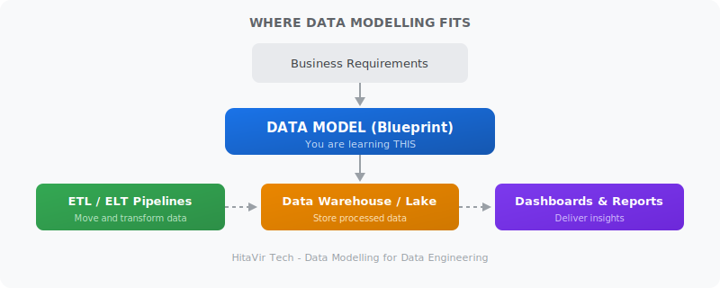

> **HitaVir Tech says:** "I have seen companies spend millions on Snowflake and Databricks licenses, only to get terrible performance because nobody designed the data model properly. Tools are only as good as the model underneath them."

## Types of Data Models
Duration: 8:00

There are three levels of data modelling, each with increasing detail.

### The Three Levels

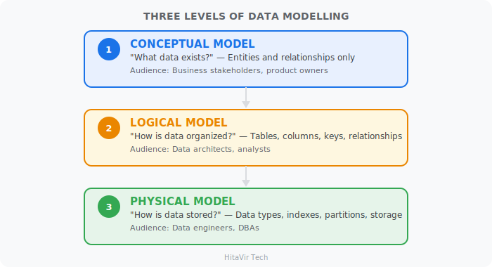

### Conceptual Data Model

The **what** — identifies entities and relationships at the highest level. No columns, no data types.

**Example — E-commerce system:**

| Entity | Relationship | Entity |
|--------|-------------|--------|
| **CUSTOMER** | --has--> | **ORDER** |
| **ORDER** | --has--> | **PRODUCT** |
| **CUSTOMER** | --writes--> | **REVIEW** |
| **PRODUCT** | --receives--> | **REVIEW** |

**When to use:** Early project planning, business requirement gathering, stakeholder communication.

### Logical Data Model

The **how** — defines tables, columns, primary keys, foreign keys, and relationships. No data types yet.

**Example — Order entity expanded:**

| Key | Column | Description |
|-----|--------|-------------|
| PK | order_id | Unique order identifier |
| FK | customer_id | Links to customer table |
| FK | product_id | Links to product table |
| | order_date | When the order was placed |
| | quantity | Number of items |
| | unit_price | Price per item |
| | total_amount | Total order value |
| | order_status | Current status of the order |

**When to use:** Database design phase, team alignment on structure, documentation.

### Physical Data Model

The **where and how exactly** — includes data types, constraints, indexes, partitioning, storage format.

```sql
CREATE TABLE orders (
    order_id        BIGINT          NOT NULL AUTO_INCREMENT,
    customer_id     INT             NOT NULL,
    product_id      INT             NOT NULL,
    order_date      DATE            NOT NULL,
    quantity        SMALLINT        NOT NULL DEFAULT 1,
    unit_price      DECIMAL(10,2)   NOT NULL,
    total_amount    DECIMAL(12,2)   GENERATED ALWAYS AS (quantity * unit_price),
    order_status    VARCHAR(20)     NOT NULL DEFAULT 'PENDING',
    created_at      TIMESTAMP       DEFAULT CURRENT_TIMESTAMP,
    PRIMARY KEY (order_id),
    INDEX idx_customer (customer_id),
    INDEX idx_date (order_date),
    FOREIGN KEY (customer_id) REFERENCES customers(customer_id),
    FOREIGN KEY (product_id) REFERENCES products(product_id)
) PARTITION BY RANGE (YEAR(order_date));
```

### Comparison

| Aspect | Conceptual | Logical | Physical |
|--------|-----------|---------|----------|
| Detail level | High-level | Medium | Very detailed |
| Audience | Business users | Architects | Engineers/DBAs |
| Contains columns? | No | Yes | Yes + data types |
| Contains indexes? | No | No | Yes |
| Platform specific? | No | No | Yes |
| Created by | Business analysts | Data architects | Data engineers |

> **HitaVir Tech says:** "In enterprise projects, you always start with conceptual, refine to logical, then implement physical. Skipping steps is how data platforms become unmaintainable."

## OLTP vs OLAP Modelling
Duration: 8:00

Understanding the difference between transactional and analytical systems is fundamental to data modelling.

### OLTP — Online Transaction Processing

OLTP systems handle **day-to-day transactions**. They are optimized for fast INSERT, UPDATE, DELETE operations on individual records.

**Examples:** Banking systems, e-commerce checkout, airline booking, hospital patient records.

```
OLTP Query (fast, single record):
  SELECT balance FROM accounts WHERE account_id = 12345;
  UPDATE accounts SET balance = balance - 500 WHERE account_id = 12345;
```

### OLAP — Online Analytical Processing

OLAP systems handle **analytics and reporting**. They are optimized for complex queries that scan millions of rows.

**Examples:** Sales dashboards, financial reports, customer analytics, fraud detection.

```
OLAP Query (complex, millions of rows):
  SELECT
      region,
      product_category,
      EXTRACT(QUARTER FROM order_date) AS quarter,
      SUM(revenue) AS total_revenue,
      COUNT(DISTINCT customer_id) AS unique_customers,
      AVG(order_value) AS avg_order_value
  FROM fact_sales
  JOIN dim_product USING (product_key)
  JOIN dim_geography USING (geo_key)
  WHERE order_date >= '2025-01-01'
  GROUP BY region, product_category, quarter
  ORDER BY total_revenue DESC;
```

### Comparison Table

| Feature | OLTP | OLAP |
|---------|------|------|
| **Purpose** | Run the business | Analyze the business |
| **Operations** | INSERT, UPDATE, DELETE | SELECT (mostly reads) |
| **Query type** | Simple, single-row | Complex, multi-table JOINs |
| **Data volume per query** | Few rows | Millions of rows |
| **Normalization** | Highly normalized (3NF) | Denormalized (Star/Snowflake) |
| **Users** | Thousands (app users) | Hundreds (analysts, managers) |
| **Response time** | Milliseconds | Seconds to minutes |
| **Data freshness** | Real-time | Near real-time to batch |
| **Example systems** | MySQL, PostgreSQL, Oracle | Snowflake, BigQuery, Redshift |
| **Model type** | ER Model (normalized) | Dimensional Model (star schema) |

### Banking Example

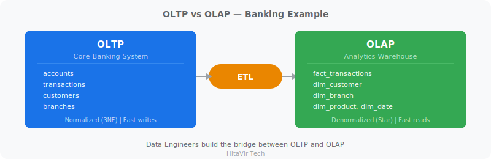

> **HitaVir Tech says:** "As a Data Engineer, you pull data FROM OLTP systems and model it INTO OLAP systems. Your job is the bridge between the two worlds."

## Normalization
Duration: 12:00

Normalization organizes data to **eliminate redundancy** and **ensure data integrity**. It is the foundation of OLTP database design.

### Why Normalize?

**Without normalization (one messy table):**

| order_id | cust_name | cust_email | product_name | prod_cat | amount |
|----------|-----------|------------|-------------|----------|--------|
| 1 | Alice | alice@mail | Laptop | Electronics | 999.99 |
| 2 | Alice | alice@mail | Mouse | Electronics | 29.99 |
| 3 | Bob | bob@mail | Laptop | Electronics | 999.99 |

**Problems with this design:**

- Alice's email is stored **TWICE** (update anomaly)
- Laptop info **repeated** for every order (redundancy)
- Delete order 3 and you **lose Bob entirely** (delete anomaly)

### First Normal Form (1NF)

**Rule:** Every column contains only atomic (single) values. No repeating groups.

**Before 1NF (violating):**

| emp_id | name | phone_numbers |
|--------|------|---------------|
| 1 | Alice | **9876543210, 911234** -- VIOLATION: not atomic! |
| 2 | Bob | 8765432109 |

**After 1NF:**

```sql
CREATE TABLE employee_phones (
    emp_id    INT,
    name      VARCHAR(50),
    phone     VARCHAR(15),
    PRIMARY KEY (emp_id, phone)
);

INSERT INTO employee_phones VALUES
(1, 'Alice', '9876543210'),
(1, 'Alice', '9111234567'),
(2, 'Bob',   '8765432109');
```

### Second Normal Form (2NF)

**Rule:** Must be in 1NF + every non-key column depends on the **entire** primary key (no partial dependency).

**Before 2NF (composite key with partial dependency):**

| student_id | course_id | student_name | course_name |
|-----------|-----------|--------------|-------------|
| 1 | CS101 | Alice | Python |
| 1 | CS102 | Alice | SQL |
| 2 | CS101 | Bob | Python |

**PK** = (student_id, course_id). But `student_name` depends **only** on `student_id` -- partial dependency -- **NOT 2NF!**

**After 2NF (split into separate tables):**

```sql
CREATE TABLE students (
    student_id   INT PRIMARY KEY,
    student_name VARCHAR(50)
);

CREATE TABLE courses (
    course_id   VARCHAR(10) PRIMARY KEY,
    course_name VARCHAR(50)
);

CREATE TABLE enrollments (
    student_id INT,
    course_id  VARCHAR(10),
    PRIMARY KEY (student_id, course_id),
    FOREIGN KEY (student_id) REFERENCES students(student_id),
    FOREIGN KEY (course_id)  REFERENCES courses(course_id)
);
```

### Third Normal Form (3NF)

**Rule:** Must be in 2NF + no transitive dependencies (non-key column depending on another non-key column).

**Before 3NF:**

| emp_id | emp_name | dept_id | dept_name |
|--------|----------|---------|-----------|
| 1 | Alice | 10 | Engineering |
| 2 | Bob | 10 | Engineering |
| 3 | Charlie | 20 | Marketing |

`dept_name` depends on `dept_id`, **NOT** on `emp_id` -- this is a **transitive dependency** -- NOT 3NF!

**After 3NF:**

```sql
CREATE TABLE departments (
    dept_id   INT PRIMARY KEY,
    dept_name VARCHAR(50) NOT NULL
);

CREATE TABLE employees (
    emp_id    INT PRIMARY KEY,
    emp_name  VARCHAR(50) NOT NULL,
    dept_id   INT NOT NULL,
    FOREIGN KEY (dept_id) REFERENCES departments(dept_id)
);
```

### BCNF (Boyce-Codd Normal Form)

**Rule:** Must be in 3NF + every determinant is a candidate key.

BCNF handles rare edge cases where 3NF still has anomalies. In practice, most 3NF designs already satisfy BCNF.

### Normalization Journey

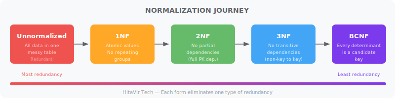

### Normalization Summary

| Form | Rule | Eliminates |
|------|------|-----------|
| 1NF | Atomic values, no repeating groups | Multi-valued columns |
| 2NF | No partial dependencies | Redundancy from composite keys |
| 3NF | No transitive dependencies | Redundancy between non-key columns |
| BCNF | Every determinant is a candidate key | Remaining anomalies |

### When to Use Normalization

| Scenario | Normalize? |
|----------|-----------|
| OLTP / transactional database | Yes (3NF) |
| Data warehouse fact tables | No (denormalize) |
| Data warehouse dimension tables | Partially |
| Application backend | Yes (3NF) |
| Reporting layer | No (denormalize) |

> **HitaVir Tech says:** "Normalize for OLTP (where data is written), denormalize for OLAP (where data is read). This is the golden rule of data modelling that separates juniors from seniors in interviews."

## Denormalization
Duration: 5:00

Denormalization **intentionally adds redundancy** to speed up read queries. It is the opposite of normalization and is standard practice in data warehouses.

### Why Denormalize?

In a normalized database, answering a business question often requires joining 5-10 tables. In a denormalized model, the same question hits one or two tables.

### Before vs After

**Normalized (3NF) — 4 JOINs required:**

```sql
SELECT
    c.customer_name,
    p.product_name,
    cat.category_name,
    o.quantity,
    o.total_amount,
    s.store_name
FROM orders o
JOIN customers c ON o.customer_id = c.customer_id
JOIN products p ON o.product_id = p.product_id
JOIN categories cat ON p.category_id = cat.category_id
JOIN stores s ON o.store_id = s.store_id
WHERE o.order_date >= '2025-01-01';
```

**Denormalized (Star Schema) — 0 JOINs:**

```sql
SELECT
    customer_name,
    product_name,
    category_name,
    quantity,
    total_amount,
    store_name
FROM fact_sales_wide
WHERE order_date >= '2025-01-01';
```

### When to Denormalize

| Denormalize When | Do NOT Denormalize When |
|-----------------|----------------------|
| Building a data warehouse | Building a transactional system |
| Read-heavy workload (90% reads) | Write-heavy workload |
| Query performance is critical | Data integrity is the top priority |
| Users need fast dashboards | Application needs real-time updates |
| Data is loaded in batches | Data changes frequently |

> **HitaVir Tech says:** "Normalization and denormalization are not enemies — they are tools for different jobs. Normalize your source systems, denormalize your warehouse. That is the Data Engineering way."

## Star Schema
Duration: 15:00

The **Star Schema** is the most popular data warehouse modelling pattern. It is called "star" because the diagram looks like a star — a central fact table surrounded by dimension tables.

### Structure

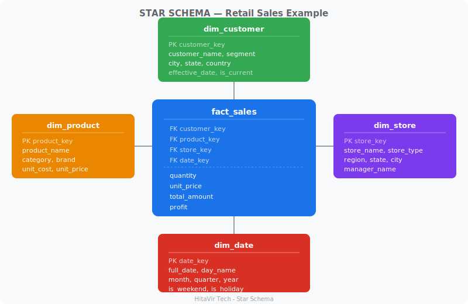

### Key Concepts

| Concept | Definition | Example |
|---------|-----------|---------|
| **Fact table** | Stores measurable events/transactions | Sales, orders, claims |
| **Dimension table** | Stores descriptive context | Customer, product, date |
| **Measure** | Numeric values you aggregate | Revenue, quantity, profit |
| **Grain** | The level of detail per row | One row per order line item |
| **Surrogate key** | Auto-generated integer PK | `customer_key = 1001` |
| **Foreign key** | Links fact to dimension | `fact.customer_key -> dim.customer_key` |

### Hands-On: Build a Retail Star Schema

**Step 1 — Create Dimension Tables**

```sql
-- Date dimension
CREATE TABLE dim_date (
    date_key      INT PRIMARY KEY,
    full_date     DATE NOT NULL,
    day_name      VARCHAR(10),
    day_of_week   SMALLINT,
    day_of_month  SMALLINT,
    month_number  SMALLINT,
    month_name    VARCHAR(10),
    quarter       SMALLINT,
    year          SMALLINT,
    is_weekend    BOOLEAN,
    is_holiday    BOOLEAN
);

-- Customer dimension
CREATE TABLE dim_customer (
    customer_key  INT PRIMARY KEY AUTO_INCREMENT,
    customer_id   VARCHAR(20) NOT NULL,
    first_name    VARCHAR(50),
    last_name     VARCHAR(50),
    email         VARCHAR(100),
    segment       VARCHAR(20),
    city          VARCHAR(50),
    state         VARCHAR(50),
    country       VARCHAR(50),
    effective_date DATE,
    expiry_date   DATE,
    is_current    BOOLEAN DEFAULT TRUE
);

-- Product dimension
CREATE TABLE dim_product (
    product_key   INT PRIMARY KEY AUTO_INCREMENT,
    product_id    VARCHAR(20) NOT NULL,
    product_name  VARCHAR(100),
    category      VARCHAR(50),
    sub_category  VARCHAR(50),
    brand         VARCHAR(50),
    unit_cost     DECIMAL(10,2),
    unit_price    DECIMAL(10,2)
);

-- Store dimension
CREATE TABLE dim_store (
    store_key     INT PRIMARY KEY AUTO_INCREMENT,
    store_id      VARCHAR(20) NOT NULL,
    store_name    VARCHAR(100),
    store_type    VARCHAR(30),
    region        VARCHAR(30),
    state         VARCHAR(50),
    city          VARCHAR(50),
    manager_name  VARCHAR(50),
    open_date     DATE
);
```

**Step 2 — Create Fact Table**

```sql
CREATE TABLE fact_sales (
    sale_key        BIGINT PRIMARY KEY AUTO_INCREMENT,
    date_key        INT NOT NULL,
    customer_key    INT NOT NULL,
    product_key     INT NOT NULL,
    store_key       INT NOT NULL,
    quantity        INT NOT NULL,
    unit_price      DECIMAL(10,2),
    discount_pct    DECIMAL(5,2) DEFAULT 0,
    total_amount    DECIMAL(12,2),
    cost_amount     DECIMAL(12,2),
    profit          DECIMAL(12,2),
    FOREIGN KEY (date_key)     REFERENCES dim_date(date_key),
    FOREIGN KEY (customer_key) REFERENCES dim_customer(customer_key),
    FOREIGN KEY (product_key)  REFERENCES dim_product(product_key),
    FOREIGN KEY (store_key)    REFERENCES dim_store(store_key)
);
```

**Step 3 — Insert Sample Data**

```sql
-- Sample date dimension data
INSERT INTO dim_date (date_key, full_date, day_name, day_of_week,
    day_of_month, month_number, month_name, quarter, year, is_weekend, is_holiday)
VALUES
(20260101, '2026-01-01', 'Thursday', 5, 1, 1, 'January', 1, 2026, FALSE, TRUE),
(20260102, '2026-01-02', 'Friday', 6, 2, 1, 'January', 1, 2026, FALSE, FALSE),
(20260103, '2026-01-03', 'Saturday', 7, 3, 1, 'January', 1, 2026, TRUE, FALSE);

-- Sample customers
INSERT INTO dim_customer (customer_id, first_name, last_name, segment, city, state, country, effective_date, is_current)
VALUES
('C001', 'Priya', 'Sharma', 'Premium', 'Mumbai', 'Maharashtra', 'India', '2025-01-01', TRUE),
('C002', 'Rahul', 'Patil', 'Standard', 'Pune', 'Maharashtra', 'India', '2025-03-15', TRUE),
('C003', 'Sneha', 'Reddy', 'Premium', 'Bangalore', 'Karnataka', 'India', '2025-06-01', TRUE);

-- Sample products
INSERT INTO dim_product (product_id, product_name, category, sub_category, brand, unit_cost, unit_price)
VALUES
('P001', 'Laptop Pro 15', 'Electronics', 'Laptops', 'TechBrand', 600.00, 999.99),
('P002', 'Wireless Mouse', 'Electronics', 'Accessories', 'PeriphCo', 10.00, 29.99),
('P003', 'Office Chair', 'Furniture', 'Chairs', 'ComfortPlus', 150.00, 349.99);

-- Sample stores
INSERT INTO dim_store (store_id, store_name, store_type, region, state, city, manager_name, open_date)
VALUES
('S001', 'Mumbai Central', 'Flagship', 'West', 'Maharashtra', 'Mumbai', 'Amit Kumar', '2020-01-15'),
('S002', 'Pune Mall', 'Mall', 'West', 'Maharashtra', 'Pune', 'Kavya Singh', '2021-06-01');

-- Sample fact data
INSERT INTO fact_sales (date_key, customer_key, product_key, store_key, quantity, unit_price, discount_pct, total_amount, cost_amount, profit)
VALUES
(20260101, 1, 1, 1, 2, 999.99, 10.00, 1799.98, 1200.00, 599.98),
(20260101, 2, 2, 2, 5, 29.99, 0.00, 149.95, 50.00, 99.95),
(20260102, 3, 3, 1, 1, 349.99, 5.00, 332.49, 150.00, 182.49),
(20260102, 1, 2, 1, 10, 29.99, 15.00, 254.92, 100.00, 154.92),
(20260103, 2, 1, 2, 1, 999.99, 0.00, 999.99, 600.00, 399.99);
```

**Step 4 — Query the Star Schema**

```sql
-- Revenue by product category and quarter
SELECT
    p.category,
    d.quarter,
    d.year,
    SUM(f.total_amount) AS total_revenue,
    SUM(f.profit) AS total_profit,
    COUNT(*) AS num_transactions,
    ROUND(AVG(f.total_amount), 2) AS avg_transaction
FROM fact_sales f
JOIN dim_product p ON f.product_key = p.product_key
JOIN dim_date d ON f.date_key = d.date_key
GROUP BY p.category, d.quarter, d.year
ORDER BY total_revenue DESC;

-- Top customers by revenue
SELECT
    CONCAT(c.first_name, ' ', c.last_name) AS customer_name,
    c.segment,
    c.city,
    COUNT(*) AS total_orders,
    SUM(f.total_amount) AS total_spent,
    ROUND(AVG(f.total_amount), 2) AS avg_order_value
FROM fact_sales f
JOIN dim_customer c ON f.customer_key = c.customer_key
GROUP BY customer_name, c.segment, c.city
ORDER BY total_spent DESC;

-- Store performance with date analysis
SELECT
    s.store_name,
    s.region,
    d.month_name,
    SUM(f.total_amount) AS revenue,
    SUM(f.profit) AS profit,
    ROUND(SUM(f.profit) / SUM(f.total_amount) * 100, 1) AS profit_margin_pct
FROM fact_sales f
JOIN dim_store s ON f.store_key = s.store_key
JOIN dim_date d ON f.date_key = d.date_key
GROUP BY s.store_name, s.region, d.month_name
ORDER BY revenue DESC;
```

> **HitaVir Tech says:** "The star schema is the single most important pattern in data warehousing. Learn it deeply. Every Snowflake, BigQuery, Redshift, and Databricks warehouse uses some variation of star schema."

## Snowflake Schema
Duration: 5:00

The **Snowflake Schema** extends the star schema by **normalizing dimension tables** into sub-tables. The diagram looks like a snowflake because dimensions branch out.

### Structure

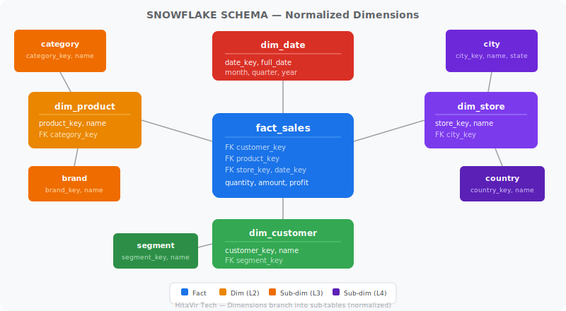

In a snowflake schema, dimensions are **normalized into sub-tables**:

| Level 1 (Fact) | Level 2 (Dimension) | Level 3 (Sub-dimension) |
|---------------|-------------------|----------------------|
| **fact_sales** | dim_product | category, department |
| **fact_sales** | dim_store | city, state, country |
| **fact_sales** | dim_customer | segment, region |

Dimensions like `dim_product` are split into: **product --> category --> department**. This saves storage but adds more JOINs.

### Star vs Snowflake Comparison

| Feature | Star Schema | Snowflake Schema |
|---------|------------|-----------------|
| Dimension structure | Flat (denormalized) | Normalized (sub-tables) |
| Number of JOINs | Fewer | More |
| Query performance | Faster (fewer JOINs) | Slower (more JOINs) |
| Storage | More (redundancy) | Less (no redundancy) |
| Complexity | Simpler | More complex |
| ETL complexity | Simpler | More complex |
| Industry preference | Preferred in most DW | Used when storage is critical |

### When to Use Snowflake Schema

| Use Snowflake When | Use Star When |
|-------------------|---------------|
| Storage costs are very high | Query speed is the priority |
| Dimension data changes frequently | Simplicity is valued |
| Data governance requires normalization | Analysts write their own queries |
| Dimension tables are very large | Dashboard performance matters |

> **HitaVir Tech says:** "In 95% of modern data warehouses, star schema wins. Cloud storage is cheap. Query performance is expensive. Star schema trades a bit of storage for dramatically faster queries. Always start with star unless you have a specific reason for snowflake."

## Fact Tables — Types and Design
Duration: 8:00

Fact tables are the heart of every data warehouse. They store the **measurable events** of the business.

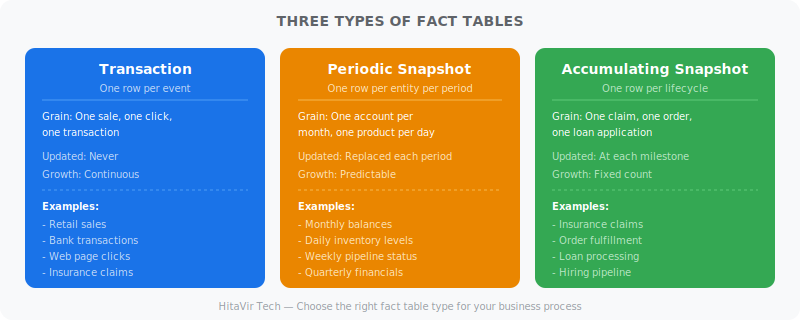

### Three Types of Fact Tables

### 1. Transaction Fact Table

Stores **one row per event** at the most detailed level.

```sql
-- One row per sale transaction
CREATE TABLE fact_sales_transaction (
    sale_key        BIGINT,
    date_key        INT,
    customer_key    INT,
    product_key     INT,
    store_key       INT,
    quantity        INT,
    unit_price      DECIMAL(10,2),
    total_amount    DECIMAL(12,2),
    payment_method  VARCHAR(20)
);

-- Grain: One row per product per order
```

**Use case:** Retail sales, bank transactions, insurance claims, web clicks.

### 2. Periodic Snapshot Fact Table

Stores **one row per entity per time period** — a snapshot of state.

```sql
-- Monthly account balance snapshot
CREATE TABLE fact_account_monthly_snapshot (
    snapshot_date_key   INT,
    account_key         INT,
    balance             DECIMAL(15,2),
    num_deposits        INT,
    total_deposits      DECIMAL(15,2),
    num_withdrawals     INT,
    total_withdrawals   DECIMAL(15,2),
    interest_earned     DECIMAL(10,2)
);

-- Grain: One row per account per month
```

**Use case:** Monthly account balances, daily inventory levels, weekly pipeline reports.

### 3. Accumulating Snapshot Fact Table

Tracks the **lifecycle of a process** with multiple milestone dates.

```sql
-- Insurance claim lifecycle
CREATE TABLE fact_claim_lifecycle (
    claim_key           BIGINT,
    policy_key          INT,
    claimant_key        INT,
    filed_date_key      INT,
    acknowledged_date_key INT,
    assessed_date_key   INT,
    approved_date_key   INT,
    paid_date_key       INT,
    claim_amount        DECIMAL(12,2),
    approved_amount     DECIMAL(12,2),
    paid_amount         DECIMAL(12,2),
    current_status      VARCHAR(20),
    days_to_settle      INT
);

-- Grain: One row per claim (updated as milestones are reached)
```

**Use case:** Order fulfillment, insurance claims, loan processing, hiring pipeline.

### Choosing the Right Fact Table

| Question | Transaction | Periodic Snapshot | Accumulating Snapshot |
|----------|------------|------------------|---------------------|
| How many rows per entity? | Many (one per event) | One per period | One per lifecycle |
| Does the row get updated? | Never | Replaced each period | Updated at milestones |
| Tracks individual events? | Yes | No (aggregated) | Yes (lifecycle) |
| Time span per row | Point in time | Fixed period | Variable duration |

> **HitaVir Tech Interview Insight:** "In interviews, they will ask: 'What type of fact table would you use for insurance claims?' The answer is accumulating snapshot — because a claim goes through multiple stages (filed, assessed, approved, paid) and you want to track the full lifecycle in one row."

## Dimension Tables and SCD Types
Duration: 15:00

Dimension tables provide the **descriptive context** for facts. The biggest challenge is handling changes over time — this is where **Slowly Changing Dimensions (SCD)** come in.

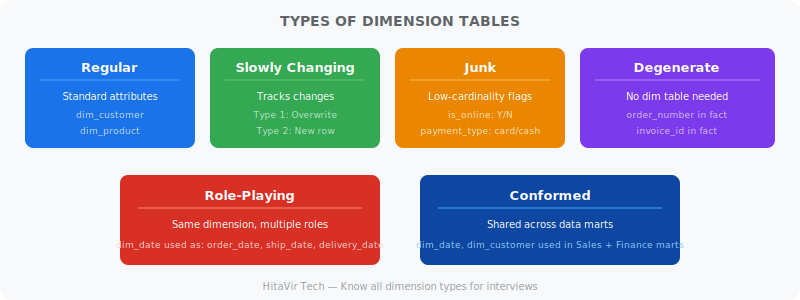

### Types of Dimensions

| Type | Description | Example |
|------|-------------|---------|
| **Regular** | Standard descriptive attributes | Customer name, product category |
| **Junk** | Combines low-cardinality flags into one table | Is_online, is_promotion, payment_type |
| **Degenerate** | Dimension value stored in fact table (no dim table) | Order number, invoice number |
| **Role-playing** | Same dimension used multiple times | dim_date as order_date, ship_date, delivery_date |

### Slowly Changing Dimensions (SCD)

When a customer moves cities, or a product changes categories — how do you handle it?

### SCD Type 0 — Retain Original

**Never update.** The original value is preserved forever.

**Use case:** Date of birth, original registration date.

### SCD Type 1 — Overwrite

**Overwrite the old value.** No history kept.

```sql
-- Customer moved from Mumbai to Pune
-- Type 1: Just update the row
UPDATE dim_customer
SET city = 'Pune', state = 'Maharashtra'
WHERE customer_id = 'C001';

-- History is LOST — we no longer know they were in Mumbai
```

**Use case:** Fixing data entry errors, when history does not matter.

### SCD Type 2 — Add New Row (Most Important)

**Insert a new row** with the new values. The old row is marked as expired. Full history is preserved.

```sql
-- Before: Customer in Mumbai
-- customer_key=1, customer_id='C001', city='Mumbai',
--   effective_date='2025-01-01', expiry_date='9999-12-31', is_current=TRUE

-- After Type 2 update: Customer moved to Pune

-- Step 1: Expire old row
UPDATE dim_customer
SET expiry_date = '2026-03-14',
    is_current = FALSE
WHERE customer_id = 'C001' AND is_current = TRUE;

-- Step 2: Insert new row
INSERT INTO dim_customer
    (customer_id, first_name, last_name, city, state, effective_date, expiry_date, is_current)
VALUES
    ('C001', 'Priya', 'Sharma', 'Pune', 'Maharashtra', '2026-03-15', '9999-12-31', TRUE);
```

**Result:**

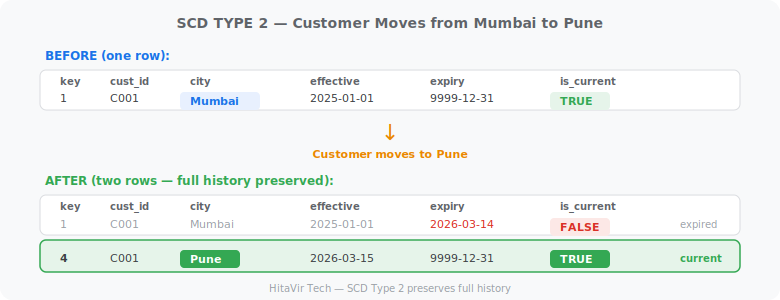

**Use case:** Customer address changes, employee department transfers, product price changes — any time you need historical analysis.

### SCD Type 3 — Add Column

**Add a column** for the previous value. Only stores one level of history.

```sql
ALTER TABLE dim_customer
ADD COLUMN previous_city VARCHAR(50),
ADD COLUMN city_change_date DATE;

UPDATE dim_customer
SET previous_city = city,
    city = 'Pune',
    city_change_date = '2026-03-15'
WHERE customer_id = 'C001';
```

**Use case:** When you only need current vs previous (not full history).

### SCD Type 6 — Hybrid (Type 1 + 2 + 3)

Combines Type 1 (current column), Type 2 (history rows), and Type 3 (previous value column).

```sql
-- Type 6 structure
CREATE TABLE dim_customer_scd6 (
    customer_key      INT PRIMARY KEY AUTO_INCREMENT,
    customer_id       VARCHAR(20),
    first_name        VARCHAR(50),
    current_city      VARCHAR(50),    -- Type 1 (always current)
    historical_city   VARCHAR(50),    -- Type 2 (value at row time)
    previous_city     VARCHAR(50),    -- Type 3 (previous value)
    effective_date    DATE,
    expiry_date       DATE,
    is_current        BOOLEAN
);
```

### SCD Comparison

| Type | History | Storage | Complexity | Use Case |
|------|---------|---------|-----------|----------|
| Type 0 | None (fixed) | Minimal | None | Birth date, SSN |
| Type 1 | None (overwrite) | Same | Low | Error corrections |
| Type 2 | Full history | Grows | Medium | Address, status changes |
| Type 3 | Current + previous | +1 column | Low | When 1 level of history is enough |
| Type 6 | Full + current | Grows + columns | High | When you need everything |

### SCD Type 2 with MERGE (Databricks/Spark SQL)

```sql
MERGE INTO dim_customer AS target
USING staging_customer AS source
ON target.customer_id = source.customer_id
   AND target.is_current = TRUE

WHEN MATCHED AND (
    target.city <> source.city
    OR target.segment <> source.segment
) THEN UPDATE SET
    target.expiry_date = CURRENT_DATE(),
    target.is_current = FALSE

WHEN NOT MATCHED THEN INSERT (
    customer_id, first_name, last_name, city, state,
    segment, effective_date, expiry_date, is_current
) VALUES (
    source.customer_id, source.first_name, source.last_name,
    source.city, source.state, source.segment,
    CURRENT_DATE(), '9999-12-31', TRUE
);

-- Then insert new rows for changed records
INSERT INTO dim_customer
SELECT
    s.customer_id, s.first_name, s.last_name, s.city, s.state,
    s.segment, CURRENT_DATE(), '9999-12-31', TRUE
FROM staging_customer s
JOIN dim_customer t
    ON s.customer_id = t.customer_id
    AND t.is_current = FALSE
    AND t.expiry_date = CURRENT_DATE();
```

> **HitaVir Tech says:** "SCD Type 2 is the most frequently asked data modelling interview question. If you can explain it clearly with an example, you will impress any interviewer. Practise drawing the before/after table on a whiteboard."

## Surrogate Keys vs Natural Keys
Duration: 5:00

### What Are They?

| Key Type | Definition | Example |
|----------|-----------|---------|
| **Natural key** | A real-world business identifier | Employee ID: `EMP-2345`, Email: `alice@mail.com` |
| **Surrogate key** | A system-generated meaningless integer | `customer_key = 1001` (auto-increment) |

### Why Surrogate Keys in Data Warehouses?

```sql
-- Natural key problems:
-- 1. Business keys can CHANGE (company merges, system migration)
-- 2. Composite natural keys make JOINs slow
-- 3. Different source systems use different IDs for same entity

-- Surrogate key solution:
CREATE TABLE dim_customer (
    customer_key    INT AUTO_INCREMENT PRIMARY KEY,  -- Surrogate (DW key)
    customer_id     VARCHAR(20) NOT NULL,             -- Natural (source key)
    first_name      VARCHAR(50),
    ...
);
```

### Performance Impact

```
Natural key JOIN (slow — string comparison):
  ON fact.customer_id = dim.customer_id     -- VARCHAR comparison

Surrogate key JOIN (fast — integer comparison):
  ON fact.customer_key = dim.customer_key   -- INT comparison
```

Integer JOINs are **3-5x faster** than string JOINs on large datasets.

> **HitaVir Tech Best Practice:** "Always use surrogate keys (integers) in your data warehouse dimension tables. Keep the natural key as a separate column for traceability. This is a universal industry standard."

## Data Warehouse Modelling — Kimball vs Inmon
Duration: 8:00

Two legendary approaches to data warehouse architecture.

### Kimball (Bottom-Up)

**Ralph Kimball's approach:** Build dimensional data marts first, then integrate them into an enterprise warehouse.

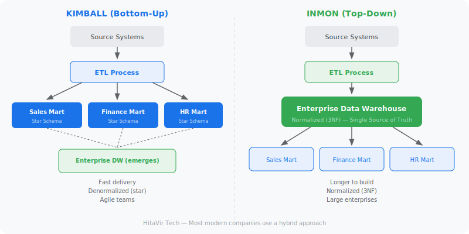

**Key principles:**
- Single source of truth first
- Normalized (3NF) enterprise model
- Data marts derived from the warehouse
- More upfront design work

### Comparison

| Feature | Kimball (Bottom-Up) | Inmon (Top-Down) |
|---------|-------------------|-----------------|
| Start point | Business process | Enterprise model |
| Central warehouse | Emerges from marts | Built first |
| Normalization | Denormalized (star) | Normalized (3NF) |
| Time to first delivery | Weeks/months | Months/years |
| Complexity | Lower | Higher |
| Cost | Lower initially | Higher initially |
| Flexibility | Easier to extend | Harder to change |
| Industry adoption | More common | Large enterprises |
| Best for | Mid-size, agile teams | Large regulated orgs |

> **HitaVir Tech says:** "In the real world, most modern companies use a hybrid approach — Kimball-style star schemas for analytics, with Inmon-level governance. Know both, but start with Kimball for practical projects."

## Data Lakehouse and Medallion Architecture
Duration: 10:00

The **Data Lakehouse** combines the best of data lakes (raw storage, flexibility) and data warehouses (structure, performance). The **Medallion Architecture** organizes data into three quality layers.

### Medallion Architecture

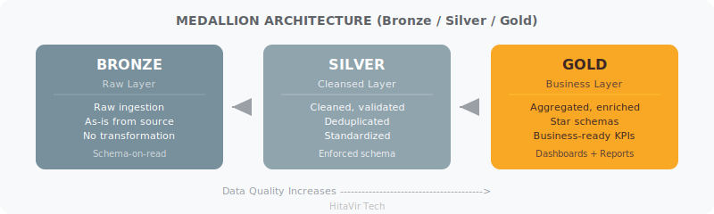

### Bronze Layer (Raw)

Data lands exactly as it comes from source systems. No transformation.

```python
# PySpark — Bronze layer ingestion
bronze_df = (spark.read
    .format("json")
    .option("multiline", "true")
    .load("/mnt/raw/sales/2026/04/06/")
)

(bronze_df.write
    .format("delta")
    .mode("append")
    .option("mergeSchema", "true")
    .saveAsTable("bronze.raw_sales")
)
```

### Silver Layer (Cleansed)

Data is cleaned, validated, deduplicated, and standardized.

```python
# PySpark — Silver layer transformation
from pyspark.sql.functions import col, trim, upper, current_timestamp

silver_df = (spark.read.table("bronze.raw_sales")
    .dropDuplicates(["transaction_id"])
    .filter(col("amount") > 0)
    .filter(col("customer_id").isNotNull())
    .withColumn("customer_name", trim(upper(col("customer_name"))))
    .withColumn("processed_at", current_timestamp())
)

(silver_df.write
    .format("delta")
    .mode("overwrite")
    .option("overwriteSchema", "true")
    .saveAsTable("silver.cleaned_sales")
)
```

### Gold Layer (Business-Ready)

Data is modelled into star schemas, aggregated, and optimized for consumption.

```python
# PySpark — Gold layer star schema
from pyspark.sql.functions import sum, count, avg, round

gold_daily_sales = (spark.read.table("silver.cleaned_sales")
    .groupBy("sale_date", "store_id", "product_category")
    .agg(
        sum("amount").alias("total_revenue"),
        count("*").alias("num_transactions"),
        round(avg("amount"), 2).alias("avg_transaction"),
        sum("profit").alias("total_profit")
    )
)

(gold_daily_sales.write
    .format("delta")
    .mode("overwrite")
    .partitionBy("sale_date")
    .saveAsTable("gold.daily_sales_summary")
)
```

### Layer Comparison

| Feature | Bronze | Silver | Gold |
|---------|--------|--------|------|
| Data quality | Raw, as-is | Cleaned, validated | Business-ready |
| Schema | Schema-on-read | Enforced schema | Star schema |
| Users | Data engineers | Data engineers, analysts | Business users, dashboards |
| Updates | Append-only | Overwrite/merge | Overwrite/merge |
| Storage format | Delta/Parquet | Delta | Delta |
| Partitioning | By ingestion date | By business date | By business dimensions |

> **HitaVir Tech says:** "Medallion architecture is the industry standard for Databricks, Azure Synapse, and modern data lakehouses. If you are interviewing for any cloud data engineering role, you MUST know Bronze-Silver-Gold."

## Data Vault Modelling
Duration: 8:00

**Data Vault** is an enterprise modelling methodology designed for **auditability, scalability, and agility**. It is popular in regulated industries like banking, insurance, and healthcare.

### Three Building Blocks

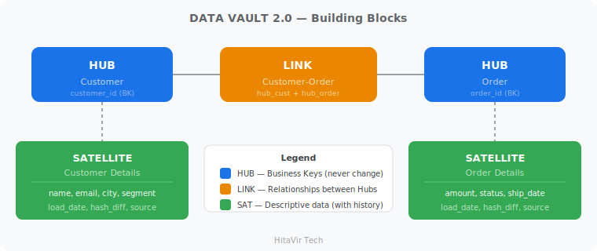

### Hubs — Business Keys

Hubs store the **unique business identifiers** that never change.

```sql
CREATE TABLE hub_customer (
    hub_customer_hash   CHAR(32) PRIMARY KEY,  -- MD5 hash of business key
    customer_id         VARCHAR(20) NOT NULL,   -- Business key
    load_date           TIMESTAMP NOT NULL,
    record_source       VARCHAR(50) NOT NULL
);
```

### Links — Relationships

Links capture the **relationships between hubs**.

```sql
CREATE TABLE link_customer_order (
    link_hash           CHAR(32) PRIMARY KEY,
    hub_customer_hash   CHAR(32) NOT NULL,
    hub_order_hash      CHAR(32) NOT NULL,
    load_date           TIMESTAMP NOT NULL,
    record_source       VARCHAR(50) NOT NULL,
    FOREIGN KEY (hub_customer_hash) REFERENCES hub_customer(hub_customer_hash),
    FOREIGN KEY (hub_order_hash) REFERENCES hub_order(hub_order_hash)
);
```

### Satellites — Descriptive Attributes

Satellites store the **changing descriptive data** with full history.

```sql
CREATE TABLE sat_customer_details (
    hub_customer_hash   CHAR(32),
    load_date           TIMESTAMP,
    first_name          VARCHAR(50),
    last_name           VARCHAR(50),
    email               VARCHAR(100),
    city                VARCHAR(50),
    segment             VARCHAR(20),
    hash_diff           CHAR(32),       -- Hash of all attributes (change detection)
    record_source       VARCHAR(50),
    PRIMARY KEY (hub_customer_hash, load_date)
);
```

### Data Vault vs Star Schema

| Feature | Data Vault | Star Schema |
|---------|-----------|-------------|
| Purpose | Integration and history | Reporting and analytics |
| Complexity | High | Medium |
| Flexibility | Very flexible | Moderate |
| Auditability | Full | Limited |
| Query performance | Slower (many JOINs) | Faster (fewer JOINs) |
| Best layer | Silver/integration | Gold/presentation |
| Industry use | Banking, insurance, govt | Retail, analytics, BI |

> **HitaVir Tech says:** "Data Vault is used as the integration layer (Silver), and then star schemas are built on top for reporting (Gold). They are complementary, not competing approaches."

## Cloud Data Modelling and Performance
Duration: 10:00

Each cloud platform has specific modelling considerations.

### Platform Comparison

| Feature | Snowflake | Databricks | Redshift | BigQuery |
|---------|-----------|-----------|----------|----------|
| Storage | Columnar, compressed | Delta Lake (Parquet) | Columnar, compressed | Columnar, compressed |
| Partitioning | Auto (micro-partitions) | Manual (Delta) | Distribution keys | Auto + manual |
| Clustering | Cluster keys | Z-ORDER | Sort keys | Clustering columns |
| Format | Internal | Delta/Parquet/ORC | Internal | Internal |
| Best for | Multi-workload | ML + Engineering | AWS-native analytics | Google ecosystem |

### Partitioning Strategies

Partitioning divides large tables into smaller, manageable chunks.

```sql
-- Snowflake: Automatic micro-partitioning + cluster keys
CREATE TABLE fact_sales (
    sale_date   DATE,
    customer_id INT,
    amount      DECIMAL(12,2)
)
CLUSTER BY (sale_date, customer_id);

-- Databricks: Delta table with explicit partitioning
CREATE TABLE fact_sales (
    sale_date   DATE,
    customer_id INT,
    amount      DECIMAL(12,2)
)
USING DELTA
PARTITIONED BY (sale_date);

-- BigQuery: Partitioned + clustered
CREATE TABLE dataset.fact_sales (
    sale_date   DATE,
    customer_id INT64,
    amount      NUMERIC
)
PARTITION BY sale_date
CLUSTER BY customer_id;

-- Redshift: Distribution + sort keys
CREATE TABLE fact_sales (
    sale_date   DATE,
    customer_id INT,
    amount      DECIMAL(12,2)
)
DISTSTYLE KEY
DISTKEY (customer_id)
SORTKEY (sale_date);
```

### Databricks Z-ORDER Optimization

```sql
-- Z-ORDER physically co-locates related data for faster queries
OPTIMIZE gold.fact_sales
ZORDER BY (customer_id, product_id);

-- This makes WHERE customer_id = X AND product_id = Y blazing fast
```

### Performance Optimization Checklist

| Technique | What It Does | Platform |
|-----------|-------------|----------|
| Partitioning | Splits table by column value | All |
| Clustering | Co-locates related rows | Snowflake, BigQuery |
| Z-ORDER | Multi-column clustering | Databricks |
| Sort keys | Orders data on disk | Redshift |
| Compression | Reduces storage and I/O | All |
| Materialized views | Pre-computed query results | Snowflake, Redshift, BigQuery |
| Caching | Stores query results in memory | All |
| Column pruning | Only reads needed columns | All (columnar) |

> **HitaVir Tech Best Practice:** "Always partition fact tables by date. Always cluster/sort by your most common WHERE clause columns. These two rules alone solve 80% of performance problems."

## Real-World Enterprise Case Study
Duration: 15:00

Let us build a complete **Insurance Claims Data Platform** — the kind of project you would deliver at a real company.

### Business Problem

HitaVir Insurance needs to:
- Track all policy and claim information
- Analyze claim processing times
- Detect fraud patterns
- Generate regulatory reports
- Provide self-service analytics

### Source Systems and Data Flow

| Source System | Technology | Data |
|-------------|-----------|------|
| Policy Admin | Oracle DB | Policies, premiums, coverage |
| Claims System | SQL Server | Claims, assessments, payments |
| Customer CRM | Salesforce | Customer profiles, contacts |

**Data flows through the Medallion Architecture:**

| Layer | What Happens |
|-------|-------------|
| **Bronze** (Raw Ingestion) | All three sources land as raw tables |
| **Silver** (Cleansed) | Cleaned, validated, deduplicated, standardized |
| **Gold** (Star Schemas) | Fact and dimension tables for analytics |

### Gold Layer — Star Schema Design

```sql
-- === DIMENSION TABLES ===

CREATE TABLE dim_policy (
    policy_key          INT PRIMARY KEY,
    policy_number       VARCHAR(20),
    policy_type         VARCHAR(30),     -- Auto, Home, Life, Health
    coverage_amount     DECIMAL(15,2),
    premium_amount      DECIMAL(10,2),
    deductible          DECIMAL(10,2),
    start_date          DATE,
    end_date            DATE,
    status              VARCHAR(20),
    effective_date      DATE,
    expiry_date         DATE DEFAULT '9999-12-31',
    is_current          BOOLEAN DEFAULT TRUE
);

CREATE TABLE dim_claimant (
    claimant_key        INT PRIMARY KEY,
    customer_id         VARCHAR(20),
    full_name           VARCHAR(100),
    date_of_birth       DATE,
    gender              VARCHAR(10),
    city                VARCHAR(50),
    state               VARCHAR(50),
    risk_score          SMALLINT,
    effective_date      DATE,
    expiry_date         DATE DEFAULT '9999-12-31',
    is_current          BOOLEAN DEFAULT TRUE
);

CREATE TABLE dim_adjuster (
    adjuster_key        INT PRIMARY KEY,
    adjuster_id         VARCHAR(20),
    adjuster_name       VARCHAR(100),
    specialization      VARCHAR(50),
    experience_years    INT,
    region              VARCHAR(30)
);

CREATE TABLE dim_claim_type (
    claim_type_key      INT PRIMARY KEY,
    claim_category      VARCHAR(30),
    claim_sub_category  VARCHAR(50),
    severity_level      VARCHAR(10),
    avg_processing_days INT
);

-- === FACT TABLES ===

-- Transaction fact: One row per claim
CREATE TABLE fact_claims (
    claim_key           BIGINT PRIMARY KEY,
    date_filed_key      INT,
    date_closed_key     INT,
    policy_key          INT,
    claimant_key        INT,
    adjuster_key        INT,
    claim_type_key      INT,
    claim_amount        DECIMAL(12,2),
    approved_amount     DECIMAL(12,2),
    paid_amount         DECIMAL(12,2),
    deductible_applied  DECIMAL(10,2),
    num_documents       INT,
    processing_days     INT,
    is_fraud_flagged    BOOLEAN DEFAULT FALSE,
    FOREIGN KEY (date_filed_key)  REFERENCES dim_date(date_key),
    FOREIGN KEY (policy_key)      REFERENCES dim_policy(policy_key),
    FOREIGN KEY (claimant_key)    REFERENCES dim_claimant(claimant_key),
    FOREIGN KEY (adjuster_key)    REFERENCES dim_adjuster(adjuster_key),
    FOREIGN KEY (claim_type_key)  REFERENCES dim_claim_type(claim_type_key)
);

-- Accumulating snapshot: Claim lifecycle tracking
CREATE TABLE fact_claim_pipeline (
    claim_key           BIGINT PRIMARY KEY,
    policy_key          INT,
    claimant_key        INT,
    filed_date_key      INT,
    acknowledged_date_key INT,
    investigation_date_key INT,
    assessment_date_key INT,
    approval_date_key   INT,
    payment_date_key    INT,
    denial_date_key     INT,
    claim_amount        DECIMAL(12,2),
    current_stage       VARCHAR(30),
    days_in_pipeline    INT
);
```

### Sample Analytics Queries

```sql
-- Claims by region and type
SELECT
    cl.state AS claimant_state,
    ct.claim_category,
    COUNT(*) AS total_claims,
    SUM(f.claim_amount) AS total_claimed,
    SUM(f.paid_amount) AS total_paid,
    ROUND(AVG(f.processing_days), 1) AS avg_processing_days,
    ROUND(SUM(f.paid_amount) / SUM(f.claim_amount) * 100, 1) AS payout_ratio
FROM fact_claims f
JOIN dim_claimant cl ON f.claimant_key = cl.claimant_key
JOIN dim_claim_type ct ON f.claim_type_key = ct.claim_type_key
JOIN dim_date d ON f.date_filed_key = d.date_key
WHERE d.year = 2026 AND cl.is_current = TRUE
GROUP BY cl.state, ct.claim_category
ORDER BY total_claimed DESC;

-- Fraud detection: Claims exceeding 2x average by type
WITH claim_stats AS (
    SELECT
        claim_type_key,
        AVG(claim_amount) AS avg_claim,
        STDDEV(claim_amount) AS std_claim
    FROM fact_claims
    GROUP BY claim_type_key
)
SELECT
    f.claim_key,
    cl.full_name,
    ct.claim_category,
    f.claim_amount,
    cs.avg_claim,
    ROUND((f.claim_amount - cs.avg_claim) / cs.std_claim, 2) AS z_score
FROM fact_claims f
JOIN dim_claimant cl ON f.claimant_key = cl.claimant_key
JOIN dim_claim_type ct ON f.claim_type_key = ct.claim_type_key
JOIN claim_stats cs ON f.claim_type_key = cs.claim_type_key
WHERE (f.claim_amount - cs.avg_claim) / cs.std_claim > 2
ORDER BY z_score DESC;
```

### PySpark SCD Type 2 Implementation

```python
from pyspark.sql.functions import *
from pyspark.sql.types import *
from delta.tables import DeltaTable

def apply_scd_type2(spark, target_table, source_df, key_column, tracked_columns):
    """
    Generic SCD Type 2 implementation for any dimension table.
    HitaVir Tech — Production-grade pattern.
    """

    target = DeltaTable.forName(spark, target_table)

    # Identify changes
    join_condition = f"target.{key_column} = source.{key_column} AND target.is_current = TRUE"
    change_condition = " OR ".join([
        f"target.{col} <> source.{col}" for col in tracked_columns
    ])

    # Step 1: Expire changed records
    target.alias("target").merge(
        source_df.alias("source"),
        join_condition
    ).whenMatchedUpdate(
        condition=change_condition,
        set={
            "expiry_date": current_date(),
            "is_current": lit(False)
        }
    ).whenNotMatchedInsertAll().execute()

    # Step 2: Insert new versions for changed records
    changed = (source_df.alias("s")
        .join(
            spark.read.table(target_table)
                .filter(col("is_current") == False)
                .filter(col("expiry_date") == current_date())
                .alias("t"),
            col(f"s.{key_column}") == col(f"t.{key_column}")
        )
        .select("s.*")
        .withColumn("effective_date", current_date())
        .withColumn("expiry_date", lit("9999-12-31").cast("date"))
        .withColumn("is_current", lit(True))
    )

    changed.write.format("delta").mode("append").saveAsTable(target_table)

    return changed.count()

# Usage
changes = apply_scd_type2(
    spark,
    target_table="gold.dim_claimant",
    source_df=silver_customers,
    key_column="customer_id",
    tracked_columns=["full_name", "city", "state", "risk_score"]
)
print(f"SCD Type 2 applied: {changes} records versioned")
```

> **HitaVir Tech says:** "This case study is the kind of project you will build in your first 3 months as a Data Engineer at an insurance company. Save this code — you will use it."

## Common Mistakes and Best Practices
Duration: 5:00

### Top Data Modelling Mistakes

| Mistake | Impact | Fix |
|---------|--------|-----|
| Wrong grain | Duplicate metrics, wrong aggregations | Define grain FIRST before anything else |
| No surrogate keys | Slow JOINs, SCD impossible | Always add integer surrogate keys |
| Over-normalization in DW | Too many JOINs, slow queries | Denormalize for analytics |
| Missing date dimension | Cannot analyze by time periods | Always create a full dim_date |
| No SCD strategy | Lost history, wrong analysis | Default to SCD Type 2 |
| Poor naming | Confusion, maintenance nightmare | Use consistent prefixes: `dim_`, `fact_` |
| No partitioning | Full table scans on large tables | Partition facts by date |
| Ignoring NULL handling | Wrong counts and aggregations | Define NULL strategy per column |

### Naming Conventions

| Object | Convention | Example |
|--------|-----------|---------|
| Fact tables | `fact_` prefix | `fact_sales`, `fact_claims` |
| Dimension tables | `dim_` prefix | `dim_customer`, `dim_date` |
| Surrogate keys | `_key` suffix | `customer_key`, `product_key` |
| Natural keys | `_id` suffix | `customer_id`, `order_id` |
| Date columns | Descriptive name | `order_date`, `ship_date` |
| Metrics | Business term | `total_amount`, `quantity`, `profit` |
| Boolean flags | `is_` prefix | `is_current`, `is_active`, `is_fraud` |
| Staging tables | `stg_` prefix | `stg_raw_orders` |

> **HitaVir Tech Best Practice:** "Document your grain statement for every fact table. Example: 'One row per product per order per day.' If you cannot state the grain in one sentence, your model needs work."

## Data Modelling Interview Questions
Duration: 10:00

These questions are asked at companies hiring Data Engineers through LinkedIn, Naukri, and at top training institutes worldwide.

### Beginner Level

**Q1: What is the difference between a fact table and a dimension table?**

**Answer:** A fact table stores measurable business events (sales, transactions, claims) with numeric metrics like amount, quantity, and profit. A dimension table stores descriptive context (who, what, where, when) like customer names, product categories, and dates. Facts contain foreign keys to dimensions, forming the star schema.

**Q2: What is a star schema?**

**Answer:** A star schema is a data warehouse modelling pattern with a central fact table connected to surrounding dimension tables via foreign keys. It is called "star" because the diagram resembles a star. It is optimized for fast analytical queries by denormalizing dimensions.

**Q3: What is normalization? Why is it used?**

**Answer:** Normalization organizes data to eliminate redundancy and prevent update/delete anomalies. It is used in OLTP (transactional) systems where data integrity is critical. The common forms are 1NF (atomic values), 2NF (no partial dependencies), 3NF (no transitive dependencies).

### Intermediate Level

**Q4: Explain SCD Type 2 with an example.**

**Answer:** SCD Type 2 preserves full history by inserting a new row when a dimension attribute changes. The old row is expired (expiry_date set to yesterday, is_current set to FALSE), and a new row is inserted with the current values (expiry_date 9999-12-31, is_current TRUE). A new surrogate key is generated for each version. Example: when a customer moves from Mumbai to Pune, both the Mumbai and Pune records exist, and historical sales are correctly linked to the city at the time of the sale.

**Q5: What is the difference between Kimball and Inmon approaches?**

**Answer:** Kimball (bottom-up) builds dimensional data marts first using star schemas, then integrates them. Faster delivery, simpler, preferred for agile teams. Inmon (top-down) builds a centralized normalized (3NF) enterprise warehouse first, then derives data marts. More comprehensive, better governance, preferred for large regulated enterprises.

**Q6: What is the Medallion Architecture?**

**Answer:** A three-layer data lakehouse architecture: Bronze (raw data, as-is from source), Silver (cleaned, validated, deduplicated), Gold (business-ready, star schemas, aggregated). Popularized by Databricks. Each layer increases data quality and decreases data volume.

### Advanced / Architect Level

**Q7: How would you design a data model for a real-time fraud detection system?**

**Answer:** Use a lambda architecture with separate batch and speed layers. The batch layer uses a star schema with fact_transactions and dimensions. The speed layer uses a streaming fact table (Kafka + Spark Structured Streaming) with pre-computed features. Implement a wide denormalized table for ML feature serving with sub-second lookups. Partition by date, cluster by account_id. Use materialized views for aggregated fraud signals.

**Q8: Explain Data Vault and when you would use it over Star Schema.**

**Answer:** Data Vault uses Hubs (business keys), Links (relationships), and Satellites (descriptive attributes with history). Use it when you need full auditability, multiple source integration, and flexible schema evolution — common in banking, insurance, and government. Star Schema is used on top of Data Vault as the presentation layer for BI tools.

**Q9: How do you handle late-arriving facts and dimensions?**

**Answer:** For late-arriving facts: insert with the dimension key that was current at the time of the event (use effective_date/expiry_date to find the right SCD Type 2 version). For late-arriving dimensions: create a placeholder row with default values (e.g., "Unknown Customer"), then update it when the real dimension data arrives. Use an "inferred member" flag to track placeholder rows.

**Q10: Design a model for a multi-tenant SaaS analytics platform.**

**Answer:** Use tenant_id as the first column in every table and as the partition key. Each tenant's data is physically isolated via partitioning. Shared dimensions (like dim_date) are global. Tenant-specific dimensions include tenant_id. Implement row-level security in the BI tool. Consider separate schemas per tenant for large customers. Use column-level encryption for PII across tenants.

> **HitaVir Tech Interview Insight:** "For architect-level interviews, they want to hear your THOUGHT PROCESS, not just the answer. Walk them through: requirements, constraints, trade-offs, alternatives considered, and why you chose your approach."

## Summary and Next Steps
Duration: 3:00

Congratulations! You have completed **Data Modelling for Data Engineering** by **HitaVir Tech**!

### What You Mastered

| Module | Key Concepts |
|--------|-------------|
| Fundamentals | Conceptual, logical, physical models |
| OLTP vs OLAP | Transactional vs analytical modelling |
| Normalization | 1NF, 2NF, 3NF, BCNF |
| Denormalization | Performance optimization for warehouses |
| Star Schema | Fact tables, dimension tables, grain |
| Snowflake Schema | Normalized dimensions, trade-offs |
| Fact Table Types | Transaction, periodic snapshot, accumulating |
| SCD Types | Type 0, 1, 2, 3, 6 with SQL and PySpark |
| Keys | Surrogate vs natural keys |
| Warehouse Approaches | Kimball vs Inmon |
| Lakehouse | Medallion architecture (Bronze/Silver/Gold) |
| Data Vault | Hubs, links, satellites |
| Cloud Modelling | Snowflake, Databricks, Redshift, BigQuery |
| Performance | Partitioning, clustering, Z-ORDER |
| Enterprise Project | Full insurance claims data platform |
| Best Practices | Naming, governance, documentation |
| Interview Prep | 10 questions across all levels |

### Career Roadmap

| Step | Skill | Status |
|------|-------|--------|
| 1 | **Data Modelling** | You are here! |
| 2 | SQL Mastery (Joins, Window Functions, CTEs) | Next |
| 3 | Cloud Data Warehousing (Snowflake / BigQuery / Redshift) | |
| 4 | Databricks + PySpark | |
| 5 | Apache Airflow (Orchestration) | |
| 6 | dbt (Data Transformation) | |
| 7 | **Senior Data Engineer / Data Architect** | Goal |

> **HitaVir Tech says:** "Data modelling is the most underrated skill in Data Engineering. Tools change every year. Cloud platforms evolve every quarter. But a well-designed data model lasts for decades. Master this, and you will always be in demand."

## Congratulations
Duration: 1:00

You have successfully completed **Data Modelling for Data Engineering - Beginner to Advanced** by **HitaVir Tech**!

### What You Built

- Complete understanding of data modelling from conceptual to physical
- Hands-on star schema with SQL (create tables, insert data, query)
- SCD Type 2 implementation in both SQL and PySpark
- Full enterprise case study (Insurance Claims Data Platform)
- Cloud-specific modelling for Snowflake, Databricks, Redshift, BigQuery
- Medallion architecture implementation with PySpark
- Data Vault fundamentals
- Interview-ready knowledge across all levels

This is enterprise-grade knowledge that data architects charge consulting fees for. You now have it for free.

**Keep modelling, keep engineering, keep growing with HitaVir Tech!**
