summary: Python Programming Language for Data Engineering - Beginner to Intermediate
id: python-data-engineering
categories: Python, Data Engineering, Programming
tags: python, data-engineering, etl, pandas, parquet, beginner, intermediate
status: Published
authors: HitaVirTech
Feedback Link: https://github.com/hitavir25/codelabs/issues

# Python Programming Language for Data Engineering - Beginner to Intermediate

## Overview
Duration: 5:00

Welcome to **Python Programming for Data Engineering** by **HitaVir Tech**!

This hands-on codelab is built for **complete beginners from a non-technical background**. Every concept is explained in plain English first, then shown through real Data Engineering examples. You will not just learn Python — you will learn the way data engineers actually use it.

> **Promise to the learner:** If you can use Excel and save a file, you can finish this codelab. We define every term, show every command, and explain every line.

### What You Will Learn

- Python fundamentals (variables, data types, control flow, functions)
- Data structures used in pipelines (lists, dicts, sets, tuples, JSON)
- File handling for Data Engineering (CSV, JSON, log files)
- Error handling and logging for production pipelines
- pandas for data cleaning, transformation, and aggregation
- Building a complete ETL (Extract-Transform-Load) pipeline from scratch
- Interview-ready Python concepts for Data Engineering jobs

### What You Will Build

A complete **Sales Data ETL Pipeline** for HitaVir Tech:

```
  Raw CSV Data → Extract → Clean → Transform → Aggregate → Report
       │            │        │          │           │          │
  sales_raw.csv  Load file  Fix nulls  Add cols   Summarize  output.csv
```

### Skills You Will Gain

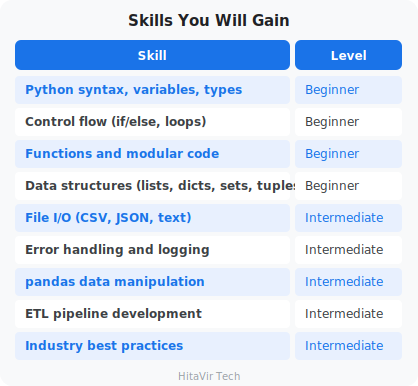

### Why Python for Data Engineering?

Python is the **number one language** in Data Engineering because:

1. **Every tool supports it** — Spark, Airflow, Databricks, AWS Glue, dbt
2. **Massive library ecosystem** — pandas, numpy, PySpark, SQLAlchemy
3. **Easy to learn** — readable syntax that looks like English
4. **Industry standard** — required in 95% of Data Engineering job postings
5. **Automation** — script anything from file processing to API calls

### Quick Glossary — Bookmark This

You will see these words throughout the codelab. Read them once now; they will sink in as you practice.

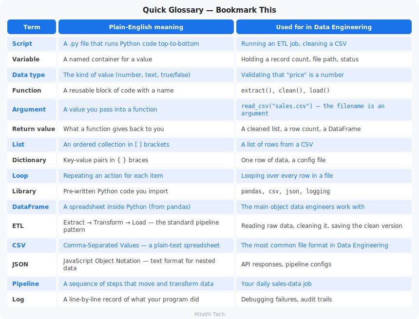

### Estimated Duration

**5–7 hours total** — go at your own pace. Each section builds on the last.

> **HitaVir Tech says:** "Python is not just a programming language — it is the glue that holds modern data platforms together. Master it, and every data tool becomes accessible to you."

### What You Have Learnt on This Page

By the end of this page you should be able to confidently:

- Explain why Python is the **#1 language** in Data Engineering
- Define every term in the Glossary (script, variable, ETL, DataFrame, etc.) in plain English
- Describe what you will build by the end of this codelab — a real Sales ETL Pipeline
- Estimate your study plan around the ~5–7 hour total duration

### PEP 8 — The Style Promise You Make Today

This codelab is built on top of **PEP 8**, the universal Python Style Guide. From this page onward, you commit to:

- Treating PEP 8 not as a suggestion but as the **bare minimum of professionalism**
- Writing code that humans (your teammates) can read first, machines second
- Running `black` and `flake8` on every script before you call it "done"

> **Inspiration for the road ahead:**
>
> *"Programs must be written for people to read, and only incidentally for machines to execute."*
> — Harold Abelson, *Structure and Interpretation of Computer Programs*

## Prerequisites
Duration: 3:00

### Required

- A computer running **Windows 10 or 11**
- Administrator access (to install software)
- At least **2 GB** free disk space
- Internet connection (for downloading packages)

### No Prior Knowledge Needed

This codelab assumes **zero Python experience and zero programming background**. We start from installing Python itself.

### Helpful but Not Required

- Basic familiarity with the command line (covered in our Linux Basics codelab)
- Understanding of what data and files are (you already do — every Excel sheet is data!)

> **HitaVir Tech says:** "If you can use a calculator and save a file, you are ready to learn Python. Everything else, we teach you step by step."

### What You Have Learnt on This Page

By the end of this page you should be able to confidently:

- List the **hardware and software prerequisites** (Windows 10/11, 2 GB free disk, internet)
- Explain that **no prior programming knowledge** is required to start
- Recognise that the only "must-have" skills are using a computer and saving a file

### PEP 8 — Set Yourself Up for Strict Style From Day One

Before you write a single line of Python, decide that **every** file you create in this codelab will follow PEP 8. The earliest habits are the strongest.

- Plan to indent with **4 spaces** (never tabs)
- Plan to keep lines **≤ 88 characters** wide (the Black formatter default)
- Plan to install **`black`** and **`flake8`** in the very next page

> **Inspiration for the road ahead:**
>
> *"The expert in anything was once a beginner."*
> — Helen Hayes

## Environment Setup
Duration: 10:00

**What is an "environment"?**

An environment is the set of tools your code runs inside — Python itself, an editor to write code in, and a sandbox to install libraries. We will set up all three on Windows.

Let us set up a professional Python development environment.

### Step 1 — Install Python

Go to [https://www.python.org/downloads/](https://www.python.org/downloads/) and download the latest Python 3.x installer.

**CRITICAL during installation:**

1. **Check the box** that says **"Add Python to PATH"** (at the bottom of the first screen)
2. Click **"Install Now"**

**What does "Add to PATH" mean?**

PATH is a list of folders Windows searches when you type a command. If Python is on PATH, typing `python` anywhere in any terminal works. If you skip this, Python will be installed but invisible to your terminal.

If you miss the PATH checkbox, Python commands will not work — reinstall and check it.

### Step 2 — Verify Python Installation

Open **Git Bash** (or Command Prompt) and run:

```bash
python --version
```

**Expected output:**

```
Python 3.12.3
```

Now check **pip**, Python's package installer (it ships with Python):

```bash
pip --version
```

**Expected output:**

```
pip 24.0 from ... (python 3.12)
```

**What is pip?**

`pip` is the tool that downloads and installs Python libraries (extra code other people wrote that you can reuse). Think of it like the App Store, but for Python code.

### Step 3 — Install VS Code

VS Code is a free code editor from Microsoft. Download from [https://code.visualstudio.com/](https://code.visualstudio.com/) and install with default settings.

**Why VS Code?**

A code editor is a souped-up Notepad: it color-codes your Python so it is easier to read, catches typos as you type, and runs your scripts with one click.

### Step 4 — Install the Python Extension for VS Code

1. Open VS Code
2. Press `Ctrl + Shift + X` (Extensions panel)
3. Search for **"Python"** by Microsoft
4. Click **Install**

### Step 5 — Set VS Code to the Dark+ Theme

Every code example in this codelab is written and explained against the **Dark+ (default dark)** theme. Set the same theme so what you see on screen matches what you see here.

1. Press `Ctrl + K` then `Ctrl + T` to open the Color Theme picker
2. Choose **"Dark+ (default dark)"** (or **"Default Dark Modern"** on newer VS Code versions)
3. Press `Enter` to confirm

Why dark theme for long study sessions? Less eye strain, better contrast on syntax colors, and it matches every screenshot in this codelab.

#### What Your Code Will Look Like in VS Code Dark+

When you paste any Python code from this codelab into a `.py` file in VS Code, the syntax highlighter colors it like this:

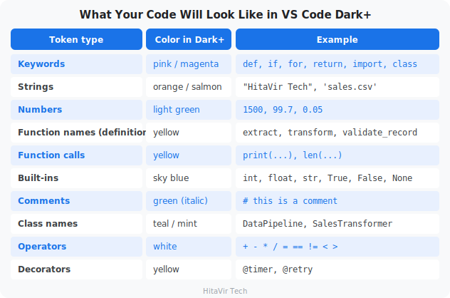

If your code shows up white-on-black with no colors, the Python extension is probably not active — make sure the file is saved with a `.py` extension and the bottom-right of VS Code shows "Python" as the language mode.

### Step 6 — Create Your Project Folder

```bash
mkdir -p ~/python-de-learning
cd ~/python-de-learning
```

**What did that do?**

`mkdir` makes a new folder. `~` is your home folder (e.g., `C:/Users/YourName`). `cd` moves into the folder. From now on, every file you create lives here.

### Step 7 — Create a Virtual Environment

```bash
python -m venv venv
```

**What is a virtual environment, and why?**

A virtual environment (`venv`) is a private sandbox of Python libraries for **this project only**. Different projects need different versions of libraries — without a venv, they would conflict. The venv folder holds its own Python and its own libraries, isolated from everything else.

Activate it:

**Git Bash:**

```bash
source venv/Scripts/activate
```

**Command Prompt:**

```cmd
venv\Scripts\activate
```

You should see `(venv)` at the beginning of your prompt — that means it is active:

```
(venv) user@COMPUTER ~/python-de-learning
$
```

### Step 8 — Install Essential Packages

```bash
pip install pandas numpy requests pyarrow
```

**What did we just install?**

- **pandas** — the spreadsheet-in-Python library every data engineer uses
- **numpy** — fast number-crunching (pandas is built on top of it)
- **requests** — for calling APIs to pull data over the internet
- **pyarrow** — lets pandas read and write **Parquet**, the format used by every modern data platform

Save your dependency list so anyone can recreate your environment:

```bash
pip freeze > requirements.txt
cat requirements.txt
```

**What is requirements.txt?**

`requirements.txt` is a plain-text file listing every library your project uses, with versions. When you share your project, others run `pip install -r requirements.txt` to get the exact same setup.

### Step 9 — Verify Everything Works

Create a test file named **`test_setup.py`**:

```python
import sys
import pandas as pd
import numpy as np

print(f"Python version: {sys.version}")
print(f"pandas version: {pd.__version__}")
print(f"numpy version: {np.__version__}")
print("\nHitaVir Tech - Setup Complete!")
print("You are ready to learn Python for Data Engineering!")
```

Run it:

```bash
python test_setup.py
```

**Expected output:**

```
Python version: 3.12.3 (tags/v3.12.3:...)
pandas version: 2.2.1
numpy version: 1.26.4

HitaVir Tech - Setup Complete!
You are ready to learn Python for Data Engineering!
```

### Your Project Structure So Far

```
python-de-learning/
├── venv/              ← Virtual environment (do not edit)
├── requirements.txt   ← Package list
└── test_setup.py      ← Setup verification
```

> **HitaVir Tech says:** "Always use virtual environments. In the real world, different projects need different package versions. Virtual environments prevent them from conflicting."

### Common Setup Mistakes

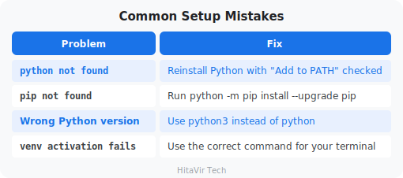

### Setup Checkpoint — You Should Now Be Able To...

```
+--------------------------------------------------------------+
|  [ ]  Open a terminal and run `python --version` successfully |
|  [ ]  Activate a virtual environment and see (venv) prompt    |
|  [ ]  Run `pip install pandas` without errors                 |
|  [ ]  Open VS Code and run a .py file with one click          |
|  [ ]  Recreate this setup on any new Windows machine          |
+--------------------------------------------------------------+
```

If any box is unchecked, revisit the step above before moving on.

### What You Have Learnt on This Page

By the end of this page you should be able to confidently:

- **Install Python** with PATH enabled and verify with `python --version`
- Use **pip** to install third-party libraries
- **Install VS Code**, the Python extension, and switch to **Dark+ (default dark)** theme
- Create a **virtual environment** (`venv`) and activate it
- Run `pip install pandas` inside the venv without errors
- Recreate this entire setup on any new Windows machine

### PEP 8 — Configure Your Editor to Enforce Style Automatically

A great environment is one where **PEP 8 is enforced for you, every save**. Set this up *now* — never type indentation by hand again.

- In VS Code, set **Editor: Tab Size = 4** and **Insert Spaces = true**
- Search settings for **Render Whitespace** → set to `all` (so tabs vs. spaces are visible)
- Install the **Black Formatter** and **Flake8** extensions
- Enable **Format On Save** with Black as the default formatter
- Group your imports: stdlib → third-party → local, **one blank line between groups**

> **Inspiration for the road ahead:**
>
> *"Give me six hours to chop down a tree, and I will spend the first four sharpening the axe."*
> — Abraham Lincoln

## PEP 8 — Python's Style Guide for Professional Code
Duration: 15:00

**What is PEP 8?**

PEP 8 is the official **Style Guide for Python Code** — a set of rules that tells you HOW to format your code so every Python developer in the world can read it. PEP stands for "Python Enhancement Proposal." PEP 8 was written in 2001 by Guido van Rossum (Python's creator) and is the universal standard.

Read the full document any time at: [https://peps.python.org/pep-0008/](https://peps.python.org/pep-0008/)

**Why does this matter for Data Engineers?**

Code is read 10 times more than it is written. Every team you join — banks, startups, FAANG, consultancies — expects PEP 8-compliant code. Tools like `black`, `flake8`, `ruff`, and `pylint` check it automatically in CI/CD. If your pull request fails the style check, it does not merge.

### The Big Picture — The 7 Pillars of PEP 8

```
+-----------------------------------------------------------------+
|                  THE 7 PILLARS OF PEP 8                         |
+-----------------------------------------------------------------+
|   1. Indentation        4 spaces, never tabs                    |
|   2. Line Length        79 chars (88 with Black formatter)      |
|   3. Imports            Top of file, grouped, alphabetized      |
|   4. Naming             snake_case, PascalCase, UPPER_SNAKE     |
|   5. Whitespace         Around operators, after commas          |
|   6. Comments           Block, inline, docstrings               |
|   7. Recommendations    `is None`, `isinstance`, `enumerate`    |
+-----------------------------------------------------------------+
```

Let us walk through each pillar with Data Engineering examples.

### Pillar 1 — Indentation

> **The rule:** **4 spaces** per indentation level. Never tabs. Never mix.

Python uses indentation to know what code is "inside" a function, loop, or `if`. Consistent indentation is not a suggestion — it is a syntax requirement.

**CORRECT — 4 spaces per level**

```python
def transform(records):
    for record in records:          # level 1  ->  4 spaces
        if record["valid"]:         # level 2  ->  8 spaces  (4 + 4)
            record["seen"] = True   # level 3  ->  12 spaces (4 + 4 + 4)
    return records                  # back to level 1  ->  4 spaces
```

**Count the spaces on the left edge of each line** — every new level adds **exactly 4 more spaces** (4 → 8 → 12 → 16 …):

```text
def transform(records):           <- 0 spaces  (top level)
....for record in records:        <- 4 spaces  (level 1)
........if record["valid"]:       <- 8 spaces  (level 2)
............record["seen"] = True <- 12 spaces (level 3)
....return records                <- 4 spaces  (back to level 1)

(each dot "." above marks one space)
```

**WRONG — 2 spaces (the ONLY change is the indent width)**

```python
def transform(records):
  for record in records:        # 2 spaces, not 4
    if record["valid"]:         # 4 spaces, not 8
      record["seen"] = True     # 6 spaces, not 12
  return records
```

**FATAL — mixing tabs and spaces (Python crashes with `TabError`)**

```python
def transform(records):
    for record in records:    # ← spaces
        if record["valid"]:   # ← tab here = invisible bug
            ...
```

> **VS Code fix:** Open Settings, search for `render whitespace`, set it to `all`. Tabs and spaces become visible so you can spot the mix instantly.

### Pillar 2 — Line Length

**The rule:**

- **PEP 8 default**: 79 characters (a 1980s legacy from VT100 terminals)
- **Black formatter**: 88 characters (the modern compromise)
- **Many teams**: 120 characters (matches a wide monitor)

Pick one limit per project and stick to it. Long lines are painful to review side-by-side in a pull request diff.

**WRONG — 130+ characters, hard to scan**

```python
result = pd.merge(sales_df, customer_df, left_on="customer_id", right_on="id", how="left", validate="many_to_one")
```

**CORRECT — wrapped at 88 chars, every argument on its own line**

```python
result = pd.merge(
    sales_df,                    # each wrapped line -> indent 4 spaces
    customer_df,                 # 1 space after every comma, 0 before
    left_on="customer_id",       # 0 spaces around = (keyword argument)
    right_on="id",
    how="left",
    validate="many_to_one",
)                                # closing ) lines up with the start
```

**Spacing rules at work here:** the opening `(` ends the first line, each argument sits on its own line indented **4 spaces**, keyword `=` gets **0 spaces** around it, and the closing `)` drops back to **0 spaces** (column 0) to mark the end.

### Pillar 3 — Imports

**The rule:** Imports go at the **top of the file**, on **separate lines**, grouped in this order, with **one blank line** between groups:

1. **Standard library** — `os`, `csv`, `json`, `logging`
2. **Third-party libraries** — `pandas`, `numpy`, `requests`
3. **Local modules** — `from src.transform import clean`

**CORRECT — three groups, separated by blank lines**

```python
import csv                              # Group 1: standard library
import json
import logging
from datetime import datetime

import numpy as np                      # Group 2: third-party
import pandas as pd

from src.extract import extract_csv     # Group 3: your local modules
from src.transform import clean_records
```

**Vertical spacing here is exact:** **1 blank line** between each of the three groups (you can see the two gaps above), and **0 blank lines** between imports inside the same group.

**WRONG — common beginner mistakes**

```python
from pandas import *           # wildcard pollutes the namespace
import os, sys, json           # multiple imports on one line
import pandas, csv, datetime   # mixes stdlib and third-party
```

### Pillar 4 — Naming Conventions

> **The naming cheat sheet that fits in your head:**

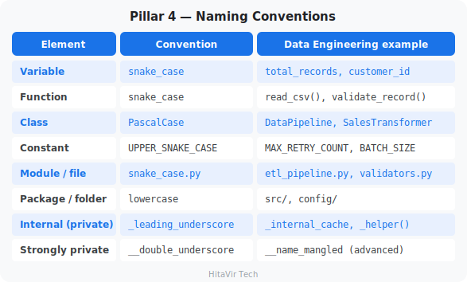

**CORRECT**

```python
MAX_BATCH_SIZE = 1000   # constant — UPPER_SNAKE_CASE


def calculate_total(price, quantity):   # function — snake_case
    return price * quantity


class SalesPipeline:                    # class — PascalCase
    def __init__(self, source_path):
        self.source_path = source_path
        self._records_cache = []        # internal — leading underscore
```

(Note the **2 blank lines** before the `def` and the `class` — that is the same top-level spacing rule from Pillar 5, applied here.)

**WRONG**

```python
maxBatchSize = 1000           # camelCase is JavaScript, not Python
def CalculateTotal(p, q):     # PascalCase belongs to classes
    return p * q
class sales_pipeline:         # snake_case belongs to functions/vars
    pass
```

> **PITFALL:** Single-letter variables (`x`, `i`, `tmp`, `c`) are acceptable inside short loops or list comprehensions only. In a real pipeline, `customer_id` always beats `c`. Future-you will thank present-you.

### Pillar 5 — Whitespace

This is the pillar people get wrong most often, so here are the **exact space counts**. Memorise these eight and you will never guess again:

```text
+------------------------------------------------+-------------------------+
|  WHERE                                         |  HOW MANY SPACES        |
+------------------------------------------------+-------------------------+
|  Indentation, per level                        |  4   (never tabs)       |
|  Each side of a binary operator  = + - * /     |  1 before, 1 after      |
|     %  < >  == != and or ...                   |                         |
|  After a comma  ,                              |  1 after, 0 before      |
|  After a colon  :  in a dict                   |  1 after, 0 before      |
|  Around  =  in a keyword arg / default         |  0   (port=5432)        |
|  Around  =  in an annotated default            |  1   (port: int = 5432) |
|  Just inside  ( )  [ ]  { }                    |  0                      |
|  Before an inline  #  comment                  |  2   (then 1 after #)   |
+------------------------------------------------+-------------------------+
```

**The caret picture — one space on each side of every operator:**

```text
price * quantity
     ^ ^
     | +--- 1 space AFTER the operator
     +----- 1 space BEFORE the operator
```

**CORRECT — count the spaces in each line:**

```python
# 1 space on EACH side of every binary operator ( * and + here)
total = price * quantity + tax

# 1 space AFTER each comma, 0 spaces before it
process(records, batch_size, retries)

# 1 space on each side of = in a normal assignment
threshold = 0.05


# 0 spaces around = for a default value (no type annotation)
def connect(host, port=5432):
    pass


# 0 spaces around = when passing keyword arguments
connect(host="localhost", port=5432)

# 0 spaces just inside ( ) [ ] { }; 1 space after the dict colon
records[0]
{"key": "value"}

# 1 space around = BECAUSE the parameter is annotated (the nuance!)
def connect_v2(host: str, port: int = 5432):
    pass
```

```python
# WRONG — every line breaks a space-count rule
total=price*quantity+tax            # 0 spaces around operators (need 1)
process(records,batch_size,retries) # 0 spaces after commas (need 1)
threshold=0.05                      # 0 spaces around = (need 1)
def connect(host, port = 5432):     # 2 spaces around default = (need 0)
    pass
records[ 0 ]                        # 1 space inside [ ] (need 0)
{ "key" : "value" }                 # spaces inside { } and before : (need 0)
```

### Pillar 6 — Comments and Docstrings

> **Three kinds of comments — know when to use which:**

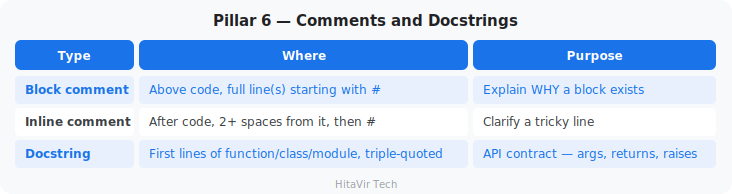

**The spacing rules for comments themselves (with exact counts):**

- **Block comment:** `#` then **1 space**, then the text — `# like this`.
- **Inline comment:** **2 spaces** before the `#`, then **1 space** after it — `code()  # like this`.
- Never `#no space` (that is `E265`) and never `code() # one space` before the `#` (that is `E261`).

```python
# CORRECT — block comment: 1 space after the #, explains WHY
# Group every order by region and sum the revenue.
# Used by the daily executive dashboard.
revenue_by_region = df.groupby("region")["total"].sum()


def validate_record(record, rules):
    """
    Validate a single record against business rules.

    Args:
        record (dict): The record to check.
        rules (dict): Validation rules from config.

    Returns:
        tuple: (is_valid: bool, errors: list[str])
    """
    ...
```

```python
# CORRECT — inline comment: 2 spaces before #, 1 space after #
total = price * quantity  # tax added later by enrichment step
#                       ^^ exactly 2 spaces here, then "# "

# WRONG — only 1 space before the # (flake8 E261)
total = price * quantity # tax added later

# WRONG — useless restatement of the code (correct spacing, bad content)
total = price * quantity  # multiply price by quantity
```

### Pillar 7 — Programming Recommendations

> **The "Pythonic" rules every Data Engineer should know:**

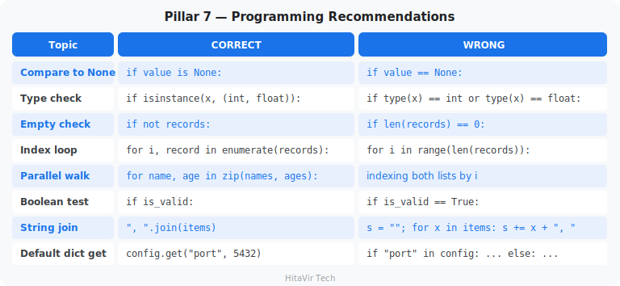

### The PEP 8 Toolchain — Tools That Check (and Fix) Your Code

You do not memorize PEP 8 by heart — you install tools that check (and even fix) it for you.

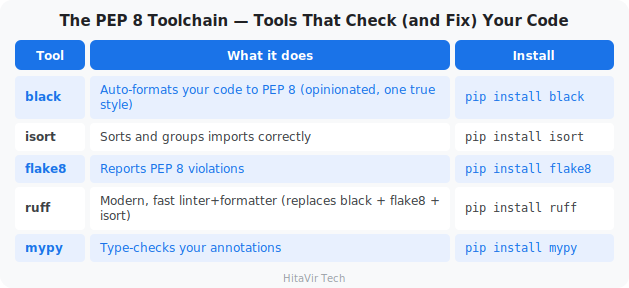

**The 60-second setup for any DE project:**

```bash
# Install everything
pip install black isort flake8 ruff

# Auto-format your code (run before every commit)
black .
isort .

# Or use the modern, single-tool approach
ruff format .
ruff check . --fix
```

Add these to a `requirements-dev.txt` so every teammate uses the same versions.

### Putting It All Together — A Real Refactor

The same logic, before and after PEP 8 is applied. Read both — feel the difference.

**BEFORE — works, but painful**

```python
import pandas as pd,numpy as np,csv,json,logging
def TransformData( records,Threshold=100 ):
  Cleaned=[]
  for i in range(len(records)):
    r=records[i]
    if r["price"]==None:continue
    if r["price"]>Threshold:
      r["total"]=r["price"]*r["qty"];r["category"]="premium"
      Cleaned.append( r )
  return Cleaned
```

**AFTER — PEP 8 compliant** (every space is deliberate)

```python
import csv                  # one import per line, stdlib group
import json
import logging

import numpy as np          # 1 blank line above: stdlib -> third-party
import pandas as pd


def transform_data(records, threshold=100):   # 0 spaces around default =
    """Filter premium records and compute totals."""
    cleaned = []                              # 4-space indent (level 1)
    for record in records:
        if record["price"] is None:           # is None, not == None
            continue                          # 8-space indent (level 2)
        if record["price"] > threshold:       # 1 space around > and =
            record["total"] = record["price"] * record["qty"]
            record["category"] = "premium"    # 12-space indent (level 3)
            cleaned.append(record)
    return cleaned
```

**Notice the vertical spacing too:** **1 blank line** splits the standard-library imports from the third-party ones, and **2 blank lines** sit between the imports and the `def` (the PEP 8 rule for every top-level function or class).

#### What changed?

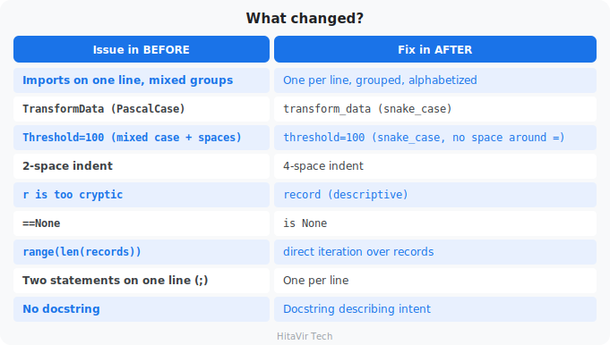

### Try It — Format the Bad Code Yourself

Save this deliberately messy code as **`bad_style.py`**:

```python
import pandas as pd,numpy as np,csv,json,logging
def TransformData( records,Threshold=100 ):
  Cleaned=[]
  for i in range(len(records)):
    r=records[i]
    if r["price"]==None:continue
    if r["price"]>Threshold:
      r["total"]=r["price"]*r["qty"];r["category"]="premium"
      Cleaned.append( r )
  return Cleaned
```

Now let the tools fix it for you. Install Black and auto-format the file:

```bash
pip install black
black bad_style.py
```

Reopen the file — Black has fixed the indentation, spacing, and line breaks automatically. Naming and the `== None` check are style issues Black does **not** touch, so run Flake8 to flag those:

```bash
pip install flake8
flake8 bad_style.py
```

You will see flake8 print the remaining issues — naming and `== None`. Fix those by hand and run flake8 again until it prints nothing. **That silence is the goal.**

### PEP 8 Cheat Card — Tape This Above Your Monitor

```
+----------------------------------------------------------+
|  PEP 8 QUICK REFERENCE  -  for Data Engineers            |
+----------------------------------------------------------+
|  Indent       | 4 spaces, no tabs                        |
|  Line length  | 79  (or 88 if using Black)               |
|  Blank lines  | 2 between top-level defs, 1 between meth |
|  Imports      | stdlib  ->  third-party  ->  local       |
|  Strings      | "double quotes" preferred for text       |
|  Variables    | snake_case                               |
|  Functions    | snake_case()                             |
|  Classes      | PascalCase                               |
|  Constants    | UPPER_SNAKE                              |
|  Privates     | _leading_underscore                      |
|  None check   | `if x is None:`  not  `== None`          |
|  Type check   | `isinstance(x, int)`  not  `type(x)==int`|
|  Empty check  | `if not records:`  not  `len() == 0`     |
|  Format       | run `black .` before every commit        |
|  Lint         | run `flake8 .` or `ruff check .`         |
+----------------------------------------------------------+
```

### The Complete PEP 8 Standard — One Annotated File

Here is **every rule from this whole page, working together in a single, runnable, `flake8`-clean file.** Read it top to bottom: each comment names the rule and the **exact number of spaces** involved. Save it as `pep8_reference.py`, run it, and keep it as your personal cheat file.

**`pep8_reference.py`**

```python
"""Complete PEP 8 reference - one fully annotated file.

A tiny HitaVir Tech pricing pipeline that demonstrates EVERY core PEP 8
rule in one place. Each inline comment names the rule and the exact
number of spaces involved. The whole file is flake8-clean.
"""

# IMPORTS: 3 groups, 1 blank line between groups, one name per line.
import json                          # Group 1 - standard library
from datetime import datetime

# import pandas as pd                # Group 2 - third-party libraries
# from etl.transform import clean    # Group 3 - your own local modules


# CONSTANTS: UPPER_SNAKE_CASE, 1 space on each side of  = .
DEFAULT_TAX_RATE = 0.18
MAX_BATCH_SIZE = 1000


# 2 blank lines (above) separate every top-level def / class.
def calculate_total(
    price: float,
    quantity: int,
    tax_rate: float = DEFAULT_TAX_RATE,   # annotated default -> spaces OK
) -> float:
    """Return the taxed total for one line item.

    Args:
        price (float): Unit price.          (1 space after the colon)
        quantity (int): Number of units.
        tax_rate (float): Tax fraction; defaults to 0.18.

    Returns:
        float: price * quantity * (1 + tax_rate), rounded to 2dp.
    """
    subtotal = price * quantity          # 1 space around  =  and  *
    return round(subtotal * (1 + tax_rate), 2)   # 1 space after ,


def is_valid(record: dict) -> bool:
    """Return True only when the record has a positive price."""
    if record.get("price") is None:      # `is None`, never  == None
        return False
    if not isinstance(record["price"], (int, float)):  # not type() ==
        return False
    return record["price"] > 0           # 1 space around  >


class SalesPipeline:
    """Turn raw rows into priced, validated records."""

    def __init__(self, source_name: str) -> None:
        self.source_name = source_name   # 1 space around = (assignment)
        self._rows: list[dict] = []      # _underscore = internal use

    def add(self, record: dict) -> None:
        """Store one raw record (1 blank line above each method)."""
        self._rows.append(record)

    def run(self) -> list[dict]:
        """Price every valid row, then return the clean list."""
        cleaned = []
        for record in self._rows:        # for-each, not range(len(...))
            if not is_valid(record):     # `if not x`, not  len(x) == 0
                continue
            record["total"] = calculate_total(
                record["price"],         # wrapped args -> indent 4 spaces
                record["quantity"],
            )
            cleaned.append(record)
        return cleaned


# The guard: 1 space on each side of  ==  (never ==None or =="x").
if __name__ == "__main__":
    pipeline = SalesPipeline(source_name="orders.csv")  # 0 spaces around =
    pipeline.add({"price": 100, "quantity": 3})   # 1 space after : and ,
    pipeline.add({"price": None, "quantity": 1})  # this row gets filtered
    priced = pipeline.run()

    stamp = datetime.now().strftime("%Y-%m-%d %H:%M")
    print(f"[{stamp}] priced {len(priced)} record(s)")
    print(json.dumps(priced, indent=2))   # 2 spaces before this # comment
```

Run it, then prove it is clean:

```bash
python pep8_reference.py
flake8 pep8_reference.py     # prints nothing = perfect PEP 8
```

**This one file demonstrates all of it:** a module docstring, three import groups (1 blank line apart), `UPPER_SNAKE_CASE` constants, 2 blank lines between top-level definitions, 1 blank line between methods, `snake_case` functions, `PascalCase` class, a `_leading_underscore` internal attribute, type hints, 4-space indentation, 1 space around operators, 0 spaces around keyword `=`, 1 space after every comma, `is None`, `isinstance`, `if not x`, for-each iteration (never `range(len(...))`), and correctly spaced comments. **If you can read and reproduce this file, you have mastered PEP 8.**

### Best-Practice Standards Beyond PEP 8

PEP 8 is style. These are the **engineering practices** every Data Engineer follows on top of it.

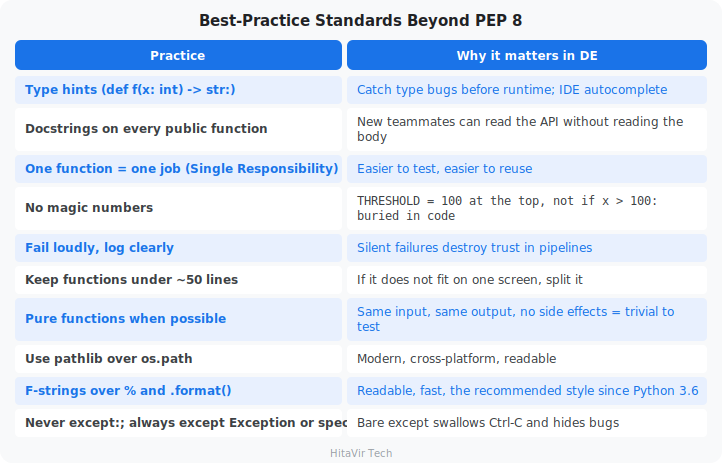

### PEP 8 Checkpoint — You Should Now Be Able To...

```
+----------------------------------------------------------------+
|  [ ]  Explain what PEP 8 is and why it exists                  |
|  [ ]  Apply 4-space indentation correctly                      |
|  [ ]  Group imports in stdlib / third-party / local order      |
|  [ ]  Pick the right naming style for vars, funcs, classes     |
|  [ ]  Place spaces around operators but not in default params  |
|  [ ]  Write a function with a proper docstring                 |
|  [ ]  Run `black` and `flake8` to auto-check your code         |
+----------------------------------------------------------------+
```

> **HitaVir Tech says:** "PEP 8 is to Python what tabs and bullet points are to a resume — non-negotiable polish. Once your editor formats your code with `black` on every save, you stop thinking about style and focus on logic. That is the goal."

### Assignment 0 — Style-Refactor Drill

**Goal:** Take the bad-style code from this section and clean it up by hand. Then verify with the tools.

**Tasks:**

1. Create a new file `assignment_00_pep8.py` and paste in this messy code:

```python
import pandas as pd,numpy as np,csv,json,logging
def TransformData( records,Threshold=100 ):
  Cleaned=[]
  for i in range(len(records)):
    r=records[i]
    if r["price"]==None:continue
    if r["price"]>Threshold:
      r["total"]=r["price"]*r["qty"];r["category"]="premium"
      Cleaned.append( r )
  return Cleaned
```

2. **Without running tools yet**, rewrite it by hand to fix:
   - Indentation (4 spaces)
   - Imports (one per line, grouped: stdlib, third-party, local)
   - Function name (`snake_case`)
   - Parameter name (`threshold`, lowercase, no spaces around `=`)
   - Variable names (`record` instead of `r`, `cleaned` instead of `Cleaned`)
   - Loop pattern (use `for record in records:`, not `range(len(...))`)
   - `== None` -> `is None`
   - Two statements per line -> one per line
   - Add a docstring
3. Now install and run the tools:

```bash
pip install black flake8
black assignment_00_pep8.py
flake8 assignment_00_pep8.py
```

4. Fix any remaining `flake8` warnings until it prints **nothing**.

**Success criteria:**

- [ ] All 9 issues from the "what changed" table fixed by hand
- [ ] `black` makes no further changes (file is already formatted)
- [ ] `flake8` reports zero warnings
- [ ] Function still produces the same output for the same input

**Stretch goal:** Add type hints (`list[dict]`, `int`, etc.) and run `mypy` to confirm they are correct.

### What You Have Learnt on This Page

By the end of this page you should be able to confidently:

- Explain what **PEP 8** is, who wrote it (Guido van Rossum, 2001), and why it is universal
- Apply all **7 Pillars** of PEP 8 (indentation, line length, imports, naming, whitespace, comments, recommendations)
- Pick the right naming style: `snake_case`, `PascalCase`, `UPPER_SNAKE`, `_private`
- Run `black` to auto-format and `flake8` to lint until **flake8 prints nothing**
- Recognise the **engineering practices beyond PEP 8** — type hints, docstrings, single responsibility, no magic numbers

### Your Lifetime PEP 8 Commitment

From this page on, every single Python file you write in this codelab — and beyond — will be:

- Auto-formatted with **`black`** before commit
- Lint-clean under **`flake8`** (zero warnings)
- Reviewed against the **PEP 8 Cheat Card** above

> **Inspiration for the road ahead:**
>
> *"Any fool can write code that a computer can understand. Good programmers write code that humans can understand."*
> — Martin Fowler

## Python Basics — Variables and Data Types
Duration: 12:00

**What is a variable?**

A variable is a **name that points to a value**. Think of it as a labeled box: you write a label on the box (the variable name), put something inside (the value), and later refer to the box by its label.

Example: `total_records = 15000` means "make a labeled box named `total_records` and put the number 15000 inside it."

**What is a data type?**

The data type tells Python **what kind of value** is in the box — a number, some text, a true/false flag, etc. Python figures this out automatically when you assign a value.

### Visual Mental Model — Variables in Memory

```
        Your code                   What Python does in memory
        ---------                   --------------------------

   pipeline_name = "Sales ETL"
                                    +-----------------+      +-----------+
   total_records = 15000            | pipeline_name   | ---> | "Sales ETL"|
                                    +-----------------+      +-----------+
   success_rate  = 99.7
                                    +-----------------+      +-----------+
   is_production = True             | total_records   | ---> |   15000   |
                                    +-----------------+      +-----------+
                                    +-----------------+      +-----------+
                                    | success_rate    | ---> |   99.7    |
                                    +-----------------+      +-----------+
                                    +-----------------+      +-----------+
                                    | is_production   | ---> |   True    |
                                    +-----------------+      +-----------+

           NAME (label)                         VALUE (the data)
```

The variable name is a sticker on a box. Python remembers which box each sticker is attached to.

Let us write real Python code. Create a new file for each section.

### The Five Core Data Types You Use Every Day in Data Engineering

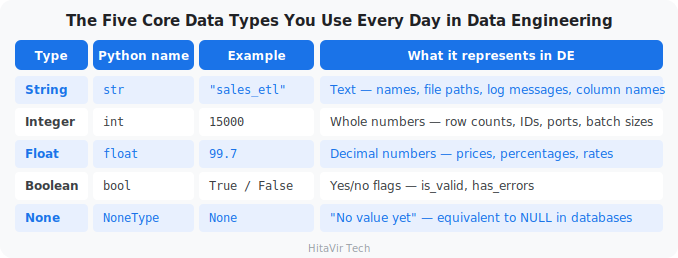

### Variables — Storing Data

> **How to follow the code in this codelab:** every example shows a **filename in bold** followed by the code. Create a new file with that exact name in your project folder, paste in the code, then run the `Run it:` command shown below it. Working through each file by hand — rather than copy-pasting blindly — is what builds real fluency.

**`basics_variables.py`**

```python
# ============================================
# HitaVir Tech - Python Variables & Data Types
# ============================================
# A variable is a labelled box that stores a value.
# Below we describe one person using all five core types.

# --- String (str): text, always written inside quotes ---
name = "Asha"
city = "Bangalore"

print(f"Name: {name}")
print(f"City: {city}")

# --- Integer (int): whole numbers, no decimal point ---
age = 25
birth_year = 2001

print(f"\nAge: {age}")
print(f"Born in: {birth_year}")

# --- Float (float): numbers that have a decimal point ---
height_m = 1.65
wallet = 250.75

print(f"\nHeight: {height_m} m")
print(f"Money in wallet: {wallet}")

# --- Boolean (bool): a yes/no answer, either True or False ---
is_student = True
has_license = False

print(f"\nIs a student? {is_student}")
print(f"Has a driving licence? {has_license}")

# --- None: 'no value yet', like a blank field on a form ---
middle_name = None
print(f"\nMiddle name: {middle_name}")
```

Run it:

```bash
python basics_variables.py
```

**Expected output:**

```
Name: Asha
City: Bangalore

Age: 25
Born in: 2001

Height: 1.65 m
Money in wallet: 250.75

Is a student? True
Has a driving licence? False

Middle name: None
```

**What is an f-string?**

An f-string (formatted string) is text starting with `f"..."` that lets you drop variables straight into the text using `{ }`. Example: `f"Age: {age}"` becomes `"Age: 25"`. This is the modern, recommended way to build strings in Python.

### Naming Rules for Variables

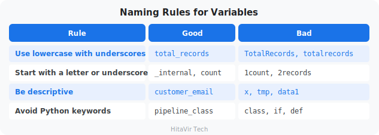

### Type Checking and Conversion

**What is type conversion?**

Often a value comes in one type but you need it in another. The most common case: anything a user types, or any value read from a file, arrives as **text**. Before you can do maths with `"25"`, you must convert it to the number `25`. That is type conversion.

**`basics_types.py`**

```python
# ============================================
# HitaVir Tech - Checking and Converting Types
# ============================================

# --- type() tells you what kind of value you have ---
age = 25
name = "Asha"
is_student = True

print(f"age is a {type(age)}")               # <class 'int'>
print(f"name is a {type(name)}")             # <class 'str'>
print(f"is_student is a {type(is_student)}")  # <class 'bool'>

# --- Text to integer: needed when a number arrives as text ---
typed_age = "25"            # this is text, not a number
real_age = int(typed_age)   # convert text -> integer
print(f"\nNext year you will be {real_age + 1}")

# --- Number to text: so you can join it into a sentence ---
apples = 7
message = "I have " + str(apples) + " apples"
print(message)

# --- Text to float: for prices or measurements ---
price_text = "49.99"
price = float(price_text)
print(f"Price with tax: {price * 1.1:.2f}")
```

Run it:

```bash
python basics_types.py
```

### Operators

**What is an operator?**

An operator is a symbol that performs an action on values: `+` adds, `==` compares, `and` combines two truths. Operators are how you do math, compare data, and check conditions in your pipeline.

**`basics_operators.py`**

```python
# ============================================
# HitaVir Tech - Operators
# ============================================

# --- Arithmetic operators: everyday maths ---
slices = 8 + 4         # add: two pizzas             -> 12
left = 10 - 3          # subtract: ate 3 sweets      -> 7
ticket_cost = 3 * 250  # multiply: 3 movie tickets   -> 750
each_pays = 1000 / 4   # divide (gives a decimal)    -> 250.0
full_boxes = 26 // 6   # floor division: whole boxes -> 4
eggs_left = 26 % 6     # modulo: the remainder       -> 2
area = 5 ** 2          # power: 5 squared            -> 25

print(f"Total slices: {slices}")
print(f"Sweets left: {left}")
print(f"Ticket cost: {ticket_cost}")
print(f"Each person pays: {each_pays}")
print(f"Full boxes of 6: {full_boxes}")
print(f"Eggs left over: {eggs_left}")
print(f"5 squared: {area}")

# --- Comparison operators: ask a question, get True or False ---
age = 20
print(f"\nOld enough to vote (>= 18)? {age >= 18}")  # True
print(f"Is exactly 20? {age == 20}")                 # True
print(f"Is not a teenager (!= 13)? {age != 13}")     # True

# --- Logical operators: combine yes/no conditions ---
is_weekend = True
is_sunny = False

print(f"\nGo to the beach? {is_weekend and is_sunny}")  # False
print(f"Do something today? {is_weekend or is_sunny}")  # True
print(f"Stay indoors? {not is_sunny}")                  # True
```

Run it:

```bash
python basics_operators.py
```

#### Operator Cheat Sheet

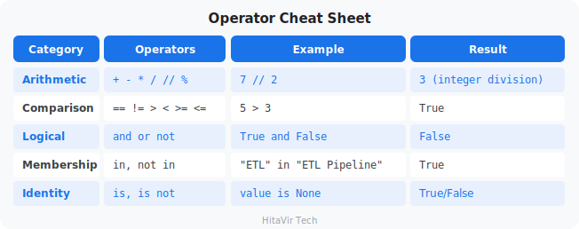

### User Input

**`basics_input.py`**

```python
# ============================================
# HitaVir Tech - Getting Input From the User
# ============================================

# input() shows a question and waits for the user to type something.
# Whatever they type always comes back as text (a string).
name = input("What is your name? ")
age_text = input("How old are you? ")

# Convert the age text to a number so we can do maths with it.
age = int(age_text)

print(f"\nHello, {name}!")
print(f"Next year you will be {age + 1} years old.")
```

Run it:

```bash
python basics_input.py
```

> **HitaVir Tech says:** "In data engineering, you rarely use `input()`. Instead, you read from files, databases, and APIs. But understanding input/output flow is fundamental to programming."

### Assignment 1 — Pipeline Stats Calculator

**Goal:** Practice every data type, type conversion, operators, and f-strings by building a small pipeline reporter.

**The scenario:** HitaVir Tech's overnight sales pipeline finished. Your job is to write a script that prints a clean stats summary the on-call engineer can read in 5 seconds.

**Tasks:**

1. Open VS Code and create a new file: `assignment_01_basics.py`.
2. Define these variables (use the right data type for each):
   - `pipeline_name` = `"HitaVir Sales ETL"`
   - `total_records` = `50000`
   - `failure_rate` = `0.023`
   - `is_production` = `True`
   - `last_error` = `None`
3. Compute `failed_records` = `total_records * failure_rate` (cast to `int`).
4. Compute `success_rate` = `(1 - failure_rate) * 100`.
5. Print this exact format using f-strings:

```text
============================================
  HitaVir Tech - Pipeline Stats
============================================
Pipeline       : HitaVir Sales ETL
Mode           : PRODUCTION
Records read   : 50,000
Failed records : 1,150
Success rate   : 97.7%
Last error     : None
============================================
```

**Success criteria:**

- [ ] All 5 data types used (str, int, float, bool, None)
- [ ] Numbers use thousands separator (`{x:,}`)
- [ ] Success rate has 1 decimal place (`{x:.1f}`)
- [ ] "PRODUCTION" or "DEVELOPMENT" picked from `is_production` using a conditional
- [ ] Output matches the format above exactly

**Stretch goal:** Read each value with `input()` and convert the strings to the right types before printing.

### What You Have Learnt on This Page

By the end of this page you should be able to confidently:

- Define **variables** and assign values of the **5 core data types** — `str`, `int`, `float`, `bool`, `None`
- Use `type()` to inspect a value and convert types with `int()`, `float()`, `str()`
- Apply **arithmetic, comparison, logical, membership, and identity operators**
- Build readable strings with **f-strings** (`f"Total: {x:,}"`) and format numbers (`{x:.2f}`, `{x:,}`)
- Read user input with `input()` and convert it to the right type

### PEP 8 — Style Rules to Apply Strictly to Variables and Types

Professional Python coders **never** name a variable like `TotalRecords` or `data1`. Apply these rules every single time you declare a value:

- **Variable names** → `snake_case` (e.g., `total_records`, `pipeline_name`) — never `camelCase` or `PascalCase`
- **Constants** → `UPPER_SNAKE_CASE` (e.g., `MAX_RETRIES = 3`)
- **Be descriptive** — `customer_email`, never `x` or `tmp`
- **Spaces around `=`** for normal assignment: `total = 1500` (not `total=1500`)
- **No spaces around `=`** in function default args: `def f(x=10):` (not `def f(x = 10):`)
- **Prefer "double quotes"** for strings (Black's standard)
- **Prefer f-strings** over `+` concatenation or `%` formatting
- **Use `is None` / `is not None`** — never `== None`

> **Inspiration for the road ahead:**
>
> *"Simple is better than complex. Complex is better than complicated."*
> — Tim Peters, *The Zen of Python*

## Control Flow — Making Decisions
Duration: 12:00

**What is "control flow"?**

Control flow is how Python decides **which lines of code to run, and how many times to run them**. Without control flow, Python just runs everything top-to-bottom, once. With it, your script can make decisions (`if-else`) and repeat work (`for`, `while`).

Real-life analogy: when you cook, your recipe says "if the water is boiling, add the pasta. Repeat stirring every 30 seconds for 8 minutes." Those `if`s and `repeats` are control flow.

Data pipelines constantly make decisions: Is the data valid? Should we retry? Which path to take? Control flow is how you express that logic.

### `if-else` — Conditional Logic

**What is the if-else statement?**

`if` runs a block of code **only when a condition is true**. `elif` ("else if") checks another condition. `else` is the fallback when nothing else matched.

Real-life analogy: "If it is raining, take an umbrella. Else if it is hot, wear sunglasses. Else, just go."

**`control_if.py`**

```python
# ============================================
# HitaVir Tech - Control Flow: if / elif / else
# ============================================

# --- Example 1: Did the student pass? (simple if / else) ---
score = 72

if score >= 40:
    print(f"Score {score}: PASS")
else:
    print(f"Score {score}: FAIL")

# --- Example 2: Turn a score into a grade (if / elif / else) ---
# Python checks each condition top to bottom and stops at the FIRST
# one that is True.
print("\n--- Grade ---")
marks = 85

if marks >= 90:
    grade = "A"
elif marks >= 75:
    grade = "B"
elif marks >= 50:
    grade = "C"
else:
    grade = "Fail"

print(f"Marks {marks} -> Grade {grade}")

# --- Example 3: Decide what to do based on the weather ---
print("\n--- What to do today ---")
weather = "rainy"

if weather == "rainy":
    print("Take an umbrella")
elif weather == "sunny":
    print("Wear sunglasses")
else:
    print("Looks like a normal day, just head out")
```

Run it:

```bash
python control_if.py
```

> **Pay attention to indentation!** Python uses 4 spaces of indentation to know what code is "inside" the `if`. Mixing tabs and spaces, or wrong indentation, is the #1 beginner error.

### Loops — Processing Data

**What is a loop?**

A loop runs the same block of code **multiple times** — once per item. Without loops, processing 10 million CSV rows would mean writing 10 million lines of code. With a loop, you write the row-handling code once.

Two kinds of loops:
- **`for` loop** — repeats once for each item in a collection ("for each row in the file…")
- **`while` loop** — repeats as long as a condition is true ("while not connected, retry…")

**`control_loops.py`**

```python
# ============================================
# HitaVir Tech - Control Flow: Loops
# ============================================

# --- for loop: do something once for EACH item in a list ---
print("--- Greeting friends ---")
friends = ["Asha", "Ravi", "Meena", "John"]

for friend in friends:
    print(f"Hello, {friend}!")

# --- for loop with range(): repeat a fixed number of times ---
# range(1, 6) gives the numbers 1, 2, 3, 4, 5 (6 is not included).
print("\n--- The 7 times table ---")
for number in range(1, 6):
    print(f"7 x {number} = {7 * number}")

# --- Adding things up inside a loop ---
print("\n--- Total shopping bill ---")
prices = [120, 75, 200, 50]
total = 0
for price in prices:
    total += price          # add each price to the running total
print(f"Total to pay: {total}")

# --- while loop: keep repeating WHILE a condition is true ---
# Count down from 3, like a rocket launch.
print("\n--- Countdown ---")
count = 3
while count > 0:
    print(f"{count}...")
    count -= 1              # subtract 1 each time, or it loops forever!
print("Lift off!")

# --- break and continue ---
# break    = stop the loop right now
# continue = skip the rest of THIS turn and go to the next item
print("\n--- Checking the shopping list ---")
shopping = ["milk", "eggs", "candy", "bread", "END", "rice"]

for item in shopping:
    if item == "END":
        print("Reached the end marker. Stopping.")
        break               # leave the loop completely
    if item == "candy":
        print("Skipping candy (too much sugar!)")
        continue            # jump straight to the next item
    print(f"Buying: {item}")
```

Run it:

```bash
python control_loops.py
```

> **HitaVir Tech says:** "In data engineering, loops process records, retry failed connections, and iterate through batches. The `for` loop is your workhorse. The `while` loop is your retry mechanism. Master both."

### Assignment 2 — Data Quality Gate

**Goal:** Build a "data quality gate" that decides which records can flow into the warehouse and which must be quarantined.

**The scenario:** A daily extract from the upstream system contains some bad records. Before loading, you must inspect every record and route it.

**Tasks:**

1. Create `assignment_02_control.py`.
2. Use this input list (paste it into your file):

```python
records = [
    {"id": 1, "value": 100,  "region": "North"},
    {"id": 2, "value": -50,  "region": "South"},
    {"id": 3, "value": 200,  "region": "INVALID"},
    {"id": 4, "value": None, "region": "East"},
    {"id": 5, "value": 75,   "region": "West"},
    {"id": 6, "value": 320,  "region": "North"},
    {"id": 7, "value": 0,    "region": "South"},
]
VALID_REGIONS = ["North", "South", "East", "West"]
```

3. Loop through each record and apply these rules **in this order**:
   - If `value` is `None` -> log `"SKIP id={id}: null value"` and `continue`
   - If `value` is less than or equal to `0` -> log `"SKIP id={id}: non-positive value"` and `continue`
   - If `region` is not in `VALID_REGIONS` -> log `"SKIP id={id}: invalid region '{region}'"` and `continue`
   - Otherwise print `"PASS id={id}: ${value} ({region})"` and add to a `valid` list
4. After the loop, print a one-line summary: `"Valid: X | Skipped: Y"`.

**Expected output (last lines):**

```text
PASS id=1: $100 (North)
SKIP id=2: non-positive value
SKIP id=3: invalid region 'INVALID'
SKIP id=4: null value
PASS id=5: $75 (West)
PASS id=6: $320 (North)
SKIP id=7: non-positive value
Valid: 3 | Skipped: 4
```

**Success criteria:**

- [ ] Uses `if`, `elif`, and `else`
- [ ] Uses `for` over the list
- [ ] Uses `continue` to skip bad rows
- [ ] Uses `in` to check region membership
- [ ] Final summary numbers are correct: 3 valid, 4 skipped

**Stretch goal:** Wrap the rules in a `while` loop that retries the whole batch up to 3 times if any record was skipped (simulating a flaky upstream).

### Control-Flow Cheat Sheet

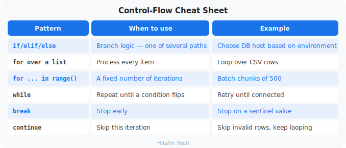

### What You Have Learnt on This Page

By the end of this page you should be able to confidently:

- Branch logic with **`if` / `elif` / `else`** based on data quality, environment, and thresholds
- Loop over a list of rows with **`for ... in`**
- Use **`for ... in range(n)`** for fixed-count batches
- Repeat work until a condition flips with **`while`** (e.g., retry until connected)
- Stop early with **`break`** and skip an iteration with **`continue`**
- Combine conditions with **`and`, `or`, `not`** for pipeline gating

### PEP 8 — Style Rules to Apply Strictly to Control Flow

Bad indentation in a `for` or `if` block does not just look ugly — it can change the meaning of your program. Apply these rules every single time you write a control-flow block:

- **Indent block contents with exactly 4 spaces** (never tabs, never 2 spaces)
- One **blank line** before and after each logical block to aid readability
- Use **`is None`** for null checks, never `== None`
- Use **`if not records:`** to check for empty collections, never `if len(records) == 0:`
- Use **`if x in {a, b, c}:`** for multi-value membership instead of chained `or`
- Use **`enumerate(items)`** when you need both index and value — never `range(len(items))`
- Avoid deeply nested blocks (more than 3 levels) — extract into a helper function instead

> **Inspiration for the road ahead:**
>
> *"Flat is better than nested. Sparse is better than dense."*
> — Tim Peters, *The Zen of Python*

## Functions — Reusable Code
Duration: 18:00

**What is a function?**

A function is a **named block of code that performs one task**. You define it once, then "call" it (run it) as many times as you want, with different inputs.

Real-life analogy: a microwave is a function. Inputs (arguments): food + time. Output (return value): hot food. You don't rebuild a microwave every time you reheat lunch — same idea here.

In data engineering, functions are the building blocks of every pipeline. Every ETL job is just `extract()`, then `transform()`, then `load()` — three functions you call in order.

### The Anatomy of a Function — Visual Breakdown

```
        keyword    name           parameters
           |        |                  |
           v        v                  v
        +---+ +---------------+ +------------------+
         def   calculate_total  (price, quantity):
                                                      +--- colon ends the signature
        """Multiply price by quantity."""             |
        |--------------- docstring ---------------|   |
                                                      v
            total = price * quantity   <--- body (indented 4 spaces)
            return total               <--- return value sent back to caller


   When the caller writes:                 Python returns:
        result = calculate_total(99.99, 3)        ----> 299.97
                          |        |
                       price    quantity
                       (arg)     (arg)
```

```python
def calculate_total(price, quantity):    # def = "define a function"
    """Multiply price by quantity."""    # docstring (optional but recommended)
    total = price * quantity              # body — the actual work
    return total                          # send the result back
```

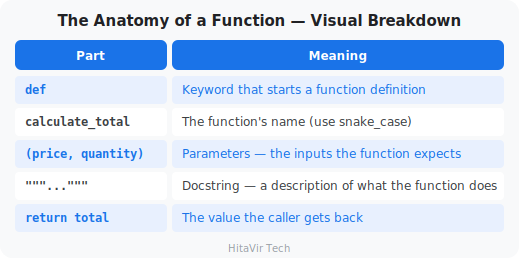

### Types of Functions in Python

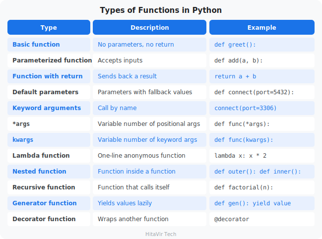

Let us learn each one with real Data Engineering examples.

### Part 1 — Basic Functions

**`func_01_basics.py`**

```python
# ============================================
# HitaVir Tech - Part 1: Basic Functions
# ============================================

# --- 1A. A function with no inputs and no return value ---
def say_hello():
    """Print a friendly greeting."""
    print("Hello and welcome!")

say_hello()   # "call" the function by writing its name followed by ()

# --- 1B. A function that takes an input (a parameter) ---
def greet(name):
    """Greet a person by name."""
    print(f"Hello, {name}!")

greet("Asha")
greet("Ravi")

# --- 1C. A function that returns a value ---
def add(a, b):
    """Add two numbers and hand the result back."""
    return a + b

answer = add(5, 3)
print(f"5 + 3 = {answer}")

# --- 1D. A function that returns MORE THAN ONE value ---
# Python sends them back as a tuple, which you can unpack.
def min_and_max(numbers):
    """Return both the smallest and the largest number."""
    return min(numbers), max(numbers)

lowest, highest = min_and_max([7, 2, 9, 4])
print(f"Lowest: {lowest}, Highest: {highest}")

# --- 1E. A function that returns a dictionary (a small record) ---
def make_student(name, age):
    """Build a student record as a dictionary."""
    return {"name": name, "age": age, "is_adult": age >= 18}

student = make_student("Meena", 20)
print(f"Student: {student}")
```

Run it:

```bash
python func_01_basics.py
```

### Part 2 — Default Parameters and Keyword Arguments

**What is a default parameter?**

A parameter with `=` and a value is **optional** — if the caller does not pass it, the default kicks in. This is how libraries give you sensible defaults but let you override when needed.

**What is a keyword argument?**

Calling a function by **naming** the argument: `connect(port=5432)`. Order does not matter, and the code reads more clearly.

**`func_02_defaults_kwargs.py`**

```python
# ============================================
# HitaVir Tech - Part 2: Defaults & Keyword Args
# ============================================

# --- 2A. Default parameters ---
# size and milk have defaults, so only 'drink' is required.
def order_coffee(drink, size="medium", milk=True):
    """Print a coffee order, filling in sensible defaults."""
    milk_text = "with milk" if milk else "black"
    print(f"One {size} {drink}, {milk_text}")

print("--- Default Parameters ---")
order_coffee("latte")                       # uses both defaults
order_coffee("espresso", size="small")      # override one default
order_coffee("americano", "large", False)   # override all of them

# --- 2B. Keyword arguments (call by naming each value) ---
def book_room(name, nights, room="single"):
    """Book a hotel room for a guest."""
    print(f"\n{name} booked a {room} room for {nights} night(s)")

print("--- Keyword Arguments ---")
# Positional: the ORDER of the values matters.
book_room("Asha", 2)
# Keyword: name each value, so the order no longer matters.
book_room(nights=3, name="Ravi", room="double")

# --- 2C. Mutable default argument trap (a famous Python gotcha) ---
# WRONG — the same list is shared and reused on every call!
def bad_add_item(item, cart=[]):
    cart.append(item)
    return cart

# CORRECT — default to None, then create a fresh list inside.
def good_add_item(item, cart=None):
    if cart is None:
        cart = []
    cart.append(item)
    return cart

print("\n--- Mutable Default Trap ---")
print(f"Bad call 1:  {bad_add_item('apple')}")    # ['apple']
print(f"Bad call 2:  {bad_add_item('banana')}")   # ['apple', 'banana'] BUG!
print(f"Good call 1: {good_add_item('apple')}")   # ['apple']
print(f"Good call 2: {good_add_item('banana')}")  # ['banana'] correct!
```

Run it:

```bash
python func_02_defaults_kwargs.py
```

> **HitaVir Tech says:** "Default parameters are everywhere in data engineering. Database connections, API timeouts, retry counts — they all have sensible defaults that you override when needed."

### Part 3 — `*args` (Accept Any Number of Positional Values)

**The one-line idea:** `*args` lets a function accept **any number of positional arguments**. Python *packs* them all into a single **tuple** named `args`.

**Why you need it:** Often you do not know how many values the caller will hand you. A shopping cart might have 1 item or 50. A logger might receive 1 message or 10. Instead of writing `add(a, b, c, d, ...)` for every possible count, you write **one** parameter, `*args`, and it catches them all.

**How to read it:** the magic is the `*`, not the word `args`. `*numbers`, `*prices`, `*rows` all work exactly the same way. By long-standing tradition we write `*args` when the values have no special name.

**Mental model — the `*` *packs* loose values into one tuple:**

```
        add_all( 10 ,  20 ,  30 )
                  \    |    /
                   \   |   /
                 the * packs them
                       |
                       v
            numbers = (10, 20, 30)   <-- a tuple, inside the function
```

**`func_03_args.py`**

```python
# ============================================
# HitaVir Tech - Part 3: *args
# ============================================

# --- 3A. *args accepts ANY number of positional values ---
def add_all(*numbers):
    """Add up however many numbers are passed in."""
    print(f"  Got {len(numbers)} number(s): {numbers}")
    return sum(numbers)


print("--- 3A. *args Basics ---")
print(f"Sum of 1, 2, 3:        {add_all(1, 2, 3)}")
print(f"Sum of 10, 20, 30, 40: {add_all(10, 20, 30, 40)}")
print(f"Sum of one number:     {add_all(100)}")
print(f"Sum of nothing:        {add_all()}")


# --- 3B. Real-world use: total a cart of any size ---
def cart_total(*prices):
    """Return the total bill for any number of item prices."""
    return sum(prices)


print("\n--- 3B. Any-size shopping cart ---")
print(f"Small cart: {cart_total(120, 75)}")
print(f"Big cart:   {cart_total(120, 75, 200, 50, 30)}")


# --- 3C. Mix a normal parameter with *args ---
# The normal parameter comes FIRST; then *args mops up the rest.
def greet_all(greeting, *names):
    """Greet everyone using the same greeting word."""
    for name in names:
        print(f"{greeting}, {name}!")


print("\n--- 3C. One greeting, many names ---")
greet_all("Hello", "Asha", "Ravi", "Meena")


# --- 3D. The * also UNPACKS a list back into separate values ---
friends = ["Sara", "Tom", "Leo"]

print("\n--- 3D. Unpacking a list with * ---")
greet_all("Hi", *friends)        # * spreads the list: "Sara", "Tom", "Leo"
# Without the *, the whole list would arrive as ONE single argument.
```

Run it:

```bash
python func_03_args.py
```

**The `*` does two opposite jobs — remember both:**

- In a function **definition** (`def add_all(*numbers)`) the `*` **packs** many values *into* a tuple.
- In a function **call** (`greet_all("Hi", *friends)`) the `*` **unpacks** a list *into* separate values.

> **Try it yourself:** Write a function `longest(*words)` that returns the longest word it is given. Test it with `longest("data", "engineering", "python")`. (Hint: `max(words, key=len)`.)

### Part 4 — `**kwargs` (Accept Any Number of Named Values)

**The one-line idea:** `**kwargs` is the twin of `*args`. Where `*args` collects loose *positional* values into a **tuple**, `**kwargs` collects any number of **named** (keyword) values into a **dictionary** named `kwargs`.

**Why you need it:** It gives a function maximum flexibility. A profile builder might receive `name=` and `age=` today, and `city=` and `phone=` tomorrow. With `**kwargs` the function happily accepts whatever named values arrive — no need to list them in advance.

**How to read it:** two stars `**` means "named values"; the name `kwargs` (short for *keyword arguments*) is just convention. `**options`, `**details`, `**config` all behave identically.

**Mental model — the `**` *packs* named values into one dict:**

```
   print_details( name="Asha" ,  age=25 ,  city="Pune" )
                       \           |          /
                        \          |         /
                        the ** packs them by name
                                   |
                                   v
        info = {"name": "Asha", "age": 25, "city": "Pune"}   <-- a dict
```

**`func_04_kwargs.py`**

```python
# ============================================
# HitaVir Tech - Part 4: **kwargs
# ============================================

# --- 4A. **kwargs collects any number of NAMED values into a dict ---
def print_details(**info):
    """Print whatever named details are passed in."""
    print(f"  Got {len(info)} detail(s):")
    for key, value in info.items():
        print(f"    {key} = {value}")


print("--- 4A. **kwargs Basics ---")
print_details(name="Asha", age=25, city="Bangalore")
print()
print_details(product="Book", price=299)


# --- 4B. Mix normal params, *args, and **kwargs (always this order) ---
def party(host, *guests, **details):
    """Describe a party: the host, the guests, and the extra details."""
    print(f"\n  Host:   {host}")
    print(f"  Guests: {list(guests)}")
    for key, value in details.items():
        print(f"  {key}: {value}")


print("\n--- 4B. Everything together ---")
party("Asha", "Ravi", "Meena", date="Saturday", theme="retro")


# --- 4C. The ** also UNPACKS a dict back into named values ---
profile = {"name": "Ravi", "age": 30, "city": "Pune"}

print("\n--- 4C. Unpacking a dict with ** ---")
print_details(**profile)        # same as name="Ravi", age=30, city="Pune"


# --- 4D. A flexible settings builder: defaults + overrides ---
def make_settings(**overrides):
    """Start from default settings, then apply any overrides."""
    settings = {"theme": "light", "font_size": 14, "autosave": True}
    settings.update(overrides)
    return settings


print("\n--- 4D. Defaults with overrides ---")
print(f"Default settings: {make_settings()}")
print(f"Custom settings:  {make_settings(theme='dark', font_size=18)}")
```

Run it:

```bash
python func_04_kwargs.py
```

**One picture to lock it in — `*` vs `**`:**

```
   *args    ->  loose values     ->  packed into a TUPLE   ->  args  = (1, 2, 3)
   **kwargs ->  name=value pairs ->  packed into a DICT    ->  kwargs = {"a": 1, "b": 2}
```

> **Try it yourself:** Write `build_url(base, **params)` that returns `base` followed by `?key=value&key=value` for every item in `params`. Test it with `build_url("/search", q="python", page=2)`. (Hint: loop over `params.items()`.)

> **HitaVir Tech says:** "`*args` and `**kwargs` are the backbone of flexible Python code. Every major framework uses them — Django, Flask, pandas, Spark. When you see `**options` or `*args` in library docs, you now know exactly what they mean."

### Part 5 — Lambda Functions (Tiny One-Line Functions)

**What is a lambda?** A `lambda` is a **small, unnamed function written on a single line**. It does exactly one thing and hands back the result automatically — no `def`, and no `return` keyword needed.

**Why does it exist?** Sometimes you need a throwaway function for one quick job — "sort by this field", "keep only these rows", "multiply each by that". Writing a full `def` for a one-off feels heavy. A lambda lets you write the logic right where you use it.

**Syntax breakdown:**

```
        lambda  x  :  x * 2
          |     |        |
          |     |        +-- the result (returned automatically)
          |     +----------- the input (parameter)
          +----------------- the keyword that says "tiny function"
```

Read it as: *"a function that takes `x` and gives back `x * 2`."* These two are identical:

```python
def double(x):
    return x * 2

# The lambda version does the SAME job in one line:  lambda x: x * 2
```

Lambdas shine when you pass them **straight into** another function. The three classic partners are `sorted()`, `filter()`, and `map()`.

**`func_05_lambda.py`**

```python
# ============================================
# HitaVir Tech - Part 5: Lambda Functions
# ============================================

# --- 5A. sorted(): sort a list of records by a chosen field ---
students = [
    {"name": "Asha", "grade": 85},
    {"name": "Ravi", "grade": 72},
    {"name": "Meena", "grade": 91},
]

# key=... tells sorted() WHICH value to sort on.
ranked = sorted(students, key=lambda student: student["grade"], reverse=True)

print("--- 5A. sorted(): ranked by grade (highest first) ---")
for student in ranked:
    print(f"  {student['name']}: {student['grade']}")

# --- 5B. filter(): keep only the items that pass a test ---
scores = [30, 60, 45, 90, 50, 75]
passed = list(filter(lambda mark: mark >= 50, scores))

print("\n--- 5B. filter(): keep marks >= 50 ---")
print(f"  Passing marks: {passed}")

# --- 5C. map(): apply the same change to every item ---
prices = [100, 200, 300]
with_tax = list(map(lambda price: round(price * 1.18, 2), prices))

print("\n--- 5C. map(): add 18% tax to every price ---")
print(f"  Prices with tax: {with_tax}")

# --- 5D. A lambda can take more than one input ---
# (Shown named here only so you can SEE the two parameters clearly.)
full_name = lambda first, last: f"{first} {last}".title()

print("\n--- 5D. A two-argument lambda ---")
print(f"  {full_name('grace', 'hopper')}")
```

Run it:

```bash
python func_05_lambda.py
```

> **PEP 8 watch-out (rule E731):** A lambda is for *passing in*, not for *naming*. Example 5D names a lambda only so you can see its two parameters — but in real code, the moment a tiny function needs a name, use a normal `def` instead:
>
> ```python
> def full_name(first, last):
>     return f"{first} {last}".title()
> ```
>
> A `def` shows a real name in error messages and reads more clearly. **Rule of thumb:** keep lambdas anonymous and inline (inside `sorted`/`filter`/`map`); reach for `def` the instant you want to reuse it.

> **Try it yourself:** Given `words = ["data", "ai", "engineering", "ml"]`, use `sorted()` with a lambda to sort the words by **length**, shortest first. (Hint: `key=lambda w: len(w)`.)

### Part 6 — Recursion (A Function That Calls Itself)

**What is recursion?** A **recursive function is a function that calls itself** to solve a smaller version of the same problem — again and again — until the problem is small enough to answer directly.

**Real-life analogy:** You are standing in a queue and want to know your position. You ask the person in front, "What number are you?" They ask the person in front of *them*, and so on. The very first person knows they are number 1 (nobody ahead). That answer travels back down the line, each person adding 1.

**Every recursive function needs two parts:**

1. **Base case** — the simplest version, where the function **stops** calling itself and returns an answer directly. *Without this, it never stops and crashes.*
2. **Recursive case** — the function calls itself on a **smaller** input, stepping toward the base case.

**Mental model — `factorial(4)` unwinds, then folds back up:**

```
   factorial(4)
     = 4 * factorial(3)
            = 3 * factorial(2)
                   = 2 * factorial(1)
                          = 1          <-- BASE CASE: stop here
                   = 2 * 1   = 2
            = 3 * 2          = 6
     = 4 * 6                 = 24       <-- answers travel back up
```

**`func_06_recursion.py`**

```python
# ============================================
# HitaVir Tech - Part 6: Recursion
# ============================================

# --- 6A. Countdown: the simplest recursion to "see" ---
def countdown(n):
    """Print n, n-1, ... down to 1, then 'Lift off!'."""
    if n == 0:                    # BASE CASE: stop calling ourselves
        print("Lift off!")
        return
    print(n)
    countdown(n - 1)              # RECURSIVE CASE: a smaller problem


print("--- 6A. Countdown ---")
countdown(3)


# --- 6B. Factorial: 5! = 5 * 4 * 3 * 2 * 1 ---
def factorial(n):
    """Return n! — the product of all whole numbers from 1 to n."""
    if n <= 1:                    # BASE CASE
        return 1
    return n * factorial(n - 1)   # RECURSIVE CASE


print("\n--- 6B. Factorial ---")
print(f"factorial(5) = {factorial(5)}")


# --- 6C. Add up a list by peeling off one item at a time ---
def sum_list(numbers):
    """Return the total of a list, using recursion."""
    if not numbers:               # BASE CASE: an empty list sums to 0
        return 0
    first, rest = numbers[0], numbers[1:]
    return first + sum_list(rest)


print("\n--- 6C. Sum a list ---")
print(f"sum_list([10, 20, 30, 40]) = {sum_list([10, 20, 30, 40])}")


# --- 6D. Real data engineering case: total a NESTED structure ---
# JSON payloads and folder trees are nested, so recursion fits naturally.
def deep_sum(data):
    """Sum every number inside a list, even deeply nested lists."""
    total = 0
    for item in data:
        if isinstance(item, list):
            total += deep_sum(item)   # dive into the sub-list
        else:
            total += item
    return total


nested = [1, [2, 3, [4, 5]], 6, [7, [8, 9]]]
print("\n--- 6D. Sum a deeply nested list ---")
print(f"deep_sum({nested}) = {deep_sum(nested)}")
```

Run it:

```bash
python func_06_recursion.py
```

> **Common trap — the forgotten base case:** If a recursive function never reaches its base case, it calls itself forever. Python protects you by stopping at roughly 1,000 nested calls and raising `RecursionError: maximum recursion depth exceeded`. If you see that error, your base case is missing or never true. **Checklist for every recursive function:** (1) Is there a base case? (2) Does each call get *closer* to it?

> **Try it yourself:** Write `power(base, exponent)` recursively so that `power(2, 5)` returns `32`. (Hint: base case is `exponent == 0` → return `1`; otherwise return `base * power(base, exponent - 1)`.)

### Part 7 — Generators (Produce Values One at a Time)

**What is a generator?** A **generator is a function that produces a stream of values lazily — one at a time, only when asked** — instead of building a whole list in memory at once. The magic word is `yield`.

**`return` vs `yield` — the key difference:**

- `return` hands back **one** value and the function is **finished**.
- `yield` hands back **one** value and **pauses** the function, remembering exactly where it stopped. The next time you ask, it **resumes** right after the `yield`.

**Why it matters for data engineering:** Imagine a 50 GB log file. A normal function that builds a list would try to load all 50 GB into memory and crash. A generator reads and hands back **one line at a time**, so memory stays tiny no matter how big the file is. This is how real pipelines stream millions of rows.

```
   Normal list  ->  [■■■■■■■■■■]  all 10 values built and stored at once
   Generator    ->   ■ . . . . .  give 1, pause, give 1, pause, ...
                      (only one value lives in memory at a time)
```

**`func_07_generators.py`**

```python
# ============================================
# HitaVir Tech - Part 7: Generators
# ============================================

# --- 7A. A basic generator with yield ---
def squares_up_to(n):
    """Yield 1*1, 2*2, ... n*n — one value at a time."""
    for i in range(1, n + 1):
        yield i * i               # pause here and hand back ONE value


print("--- 7A. Squares, one at a time ---")
for value in squares_up_to(5):
    print(value, end=" ")
print()


# --- 7B. Generators are lazy: nothing runs until you ask ---
gen = squares_up_to(3)            # NOT run yet — no squares produced
print("\n--- 7B. Pulling values by hand with next() ---")
print(next(gen))                  # 1  -> runs up to the first yield
print(next(gen))                  # 4  -> resumes, runs to the next yield
print(next(gen))                  # 9


# --- 7C. Stream a "big file" without loading it all at once ---
def clean_rows(rows):
    """Pretend to stream rows from a huge file, one at a time."""
    for row in rows:
        # In real life this would read one line from disk right here.
        yield row.strip().upper()


big_file = ["  alice  ", "  bob  ", "  carol  "]
print("\n--- 7C. Streaming + cleaning rows ---")
for clean_row in clean_rows(big_file):
    print(f"  {clean_row}")


# --- 7D. Generator expression: a one-line generator ---
# Like a list comprehension but with () instead of [] — and it stays lazy,
# so it never builds a million-item list in memory.
total = sum(n * n for n in range(1, 1_000_001))
print("\n--- 7D. Generator expression ---")
print(f"Sum of the first million squares: {total}")
```

Run it:

```bash
python func_07_generators.py
```

> **HitaVir Tech says:** "Generators are the secret to processing data bigger than your computer's memory. When a senior engineer says 'stream it, don't load it,' they mean *use a generator*. `pandas.read_csv(..., chunksize=...)` and reading a file line by line are generators under the hood."

> **Try it yourself:** Write a generator `even_numbers(limit)` that yields `0, 2, 4, ...` up to (but not including) `limit`. Loop over `even_numbers(10)` and print each value. (Hint: `for i in range(0, limit, 2): yield i`.)

### Part 8 — Decorators (Wrap a Function to Add Behaviour)

Decorators feel like magic at first, so we build up to them in three small steps.

**Step 1 — Functions are objects.** In Python a function is just a value, like a number or a string. You can store it in a variable, and you can pass it to another function.

**Step 2 — A function can return a function (a "closure").** A function defined *inside* another function remembers the variables from where it was born — even after the outer function has finished. That remembered, returned inner function is called a **closure**. This is the engine that makes decorators work.

**Step 3 — A decorator is a function that takes a function, wraps it in extra behaviour, and returns the wrapped version.** The `@name` line above a `def` is just a friendly shortcut.

**Mental model — `@shout` is shorthand:**

```
   @shout                          shout(func) builds and returns a wrapper:
   def greet(name): ...
                                    +--------------------------------+
   is EXACTLY the same as:          |  wrapper:                      |
                                    |    1. (optional) do something  |
   greet = shout(greet)             |    2. call the ORIGINAL func   |
                                    |    3. (optional) tweak result  |
                                    +--------------------------------+
```

**Why data engineers love them:** add logging, timing, retries, or caching to *any* function by writing one `@line` — without ever touching that function's own code.

**`func_08_decorators.py`**

```python
# ============================================
# HitaVir Tech - Part 8: Decorators
# ============================================
import functools
import time


# --- 8A. Build-up: a closure remembers the value it was built with ---
def make_multiplier(factor):
    """Return a new function that multiplies its input by 'factor'."""
    def multiply(number):
        return number * factor    # 'factor' is remembered from outside
    return multiply


double_it = make_multiplier(2)
triple_it = make_multiplier(3)
print("--- 8A. Closures ---")
print(f"double_it(10) = {double_it(10)}")
print(f"triple_it(10) = {triple_it(10)}")


# --- 8B. A first decorator: SHOUT whatever text a function returns ---
def shout(func):
    """Wrap a function so its text result comes back LOUD."""
    @functools.wraps(func)        # keep the original name and docstring
    def wrapper(*args, **kwargs):
        result = func(*args, **kwargs)
        return result.upper() + "!"
    return wrapper


@shout
def greet(name):
    """Return a friendly greeting."""
    return f"hello {name}"


print("\n--- 8B. The @shout decorator ---")
print(greet("asha"))              # -> HELLO ASHA!


# --- 8C. A genuinely useful decorator: time how long a function runs ---
def timer(func):
    """Print how many seconds the wrapped function took to run."""
    @functools.wraps(func)
    def wrapper(*args, **kwargs):
        start = time.perf_counter()
        result = func(*args, **kwargs)
        elapsed = time.perf_counter() - start
        print(f"  [{func.__name__}] took {elapsed:.4f}s")
        return result
    return wrapper


@timer
def crunch_numbers(limit):
    """Add up every number from 0 to limit - 1."""
    return sum(range(limit))


print("\n--- 8C. The @timer decorator ---")
answer = crunch_numbers(1_000_000)
print(f"  Result: {answer}")
```

Run it:

```bash
python func_08_decorators.py
```

> **Best practice — always use `@functools.wraps`:** Without it, the wrapped function forgets its real name and docstring (`greet.__name__` would wrongly say `"wrapper"`). One line — `@functools.wraps(func)` above the inner `wrapper` — preserves them. Every professional decorator includes it.

> **Try it yourself:** Write a decorator `announce` that prints `"Calling <name>..."` *before* the function runs and `"Done."` *after*. Apply it with `@announce` to a small function and call it. (Hint: copy the shape of `@timer`, printing before and after `func(*args, **kwargs)`.)

### Part 9 — Putting It All Together: Pipeline Functions

This final example stitches together everything from Parts 1–8 — default parameters, `*args`, `**kwargs`, and a decorator — into the exact shape of a real data pipeline: **load → transform → show**.

**`func_09_pipeline.py`**

```python
# ============================================
# HitaVir Tech - Part 6: Putting It All Together
# A mini 3-step process that uses every idea so far
# ============================================

# We will process a list of students in three steps:
#   1) load the data   2) transform it   3) show the result
# This is exactly the shape of a real data pipeline.

# --- A decorator that announces each step ---
def log_step(func):
    """Print a line before and after the function runs."""
    def wrapper(*args, **kwargs):
        print(f"\n[START] {func.__name__}")
        result = func(*args, **kwargs)
        print(f"[DONE]  {func.__name__}")
        return result
    return wrapper

# --- Step 1: load (uses a default parameter) ---
@log_step
def load_students(limit=None):
    """Return a small list of student records."""
    students = [
        {"name": "Asha", "marks": [85, 90, 88]},
        {"name": "Ravi", "marks": [70, 65, 80]},
        {"name": "Meena", "marks": [95, 92, 99]},
        {"name": "John", "marks": [40, 55, 48]},
    ]
    if limit:
        students = students[:limit]
    print(f"  Loaded {len(students)} students")
    return students

# --- Step 2: transform (uses *args to apply many steps) ---
@log_step
def transform(students, *steps):
    """Run each transform step on the students, in order."""
    for step in steps:
        students = step(students)
    return students

def add_average(students):
    """Add each student's average mark."""
    for s in students:
        s["average"] = round(sum(s["marks"]) / len(s["marks"]), 1)
    print("  Added 'average'")
    return students

def add_result(students):
    """Add a Pass/Fail result based on the average."""
    for s in students:
        s["result"] = "Pass" if s["average"] >= 50 else "Fail"
    print("  Added 'result'")
    return students

# --- Step 3: show (uses **kwargs for optional settings) ---
@log_step
def show(students, **options):
    """Print a report. Options control what is shown."""
    only_pass = options.get("only_pass", False)
    for s in students:
        if only_pass and s["result"] != "Pass":
            continue
        print(f"  {s['name']:<6} avg={s['average']:<5} {s['result']}")

# --- Run the three steps together ---
print("=" * 40)
print("  HitaVir Tech - Student Report")
print("=" * 40)

data = load_students()
data = transform(data, add_average, add_result)
show(data, only_pass=False)

print("\nAll done!")
```

Run it:

```bash
python func_09_pipeline.py
```

### Function Types Summary

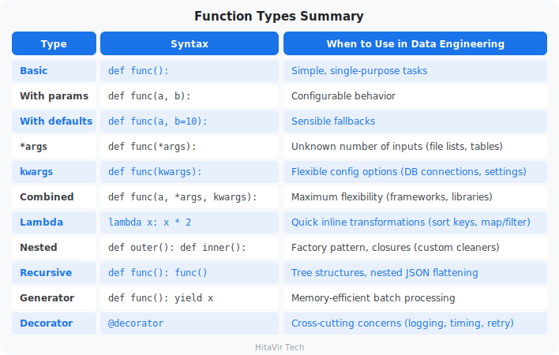

### The argument order rule

When combining all argument types, they **must** appear in this order:

```python
def func(regular, default=val, *args, keyword_only, **kwargs):
    pass

# Example:
def pipeline(name, mode="batch", *sources, notify=True, **options):
    pass
```

> **HitaVir Tech says:** "Functions are the atoms of programming — everything is built from them. Every data pipeline is just `extract()`, `transform()`, `load()`. Every API endpoint is a function. Every automation script is a collection of functions. Master functions and you master Python."

### Assignment 3 — Reusable Validation Toolkit

**Goal:** Build a small library of reusable functions that any pipeline at HitaVir Tech could import.

**The scenario:** Three teams keep re-writing the same validators. Build them once, write proper docstrings, and ship a single toolkit file everyone can import.

**What you will practise:** default parameters, `*args`, docstrings, and clean PEP 8 style.

**Tasks:**

1. Create `assignment_03_functions.py`.
2. Implement these four functions, each with a docstring and a `snake_case` name:

   - `validate_email(email)` → returns `True` if the string contains `@` **and** a `.` after the `@`, else `False`.
   - `clean_name(name)` → returns a stripped, title-cased version. If `None` or empty, return `"Unknown"`.
   - `calculate_total(price, quantity, tax_rate=0.18)` → returns `round(price * quantity * (1 + tax_rate), 2)`. Default tax is 18%.
   - `summarize(*amounts, label="Total")` → prints `"{label}: ${sum:,.2f}"` for any number of amounts.

3. Below the functions, add an `if __name__ == "__main__":` block that calls each function with at least 3 different inputs and prints the results.

**Starter template — copy this and fill in the `# TODO` lines:**

```python
# ============================================
# HitaVir Tech - Assignment 3: Validation Toolkit
# ============================================

def validate_email(email):
    """Return True if email has '@' and a '.' after the '@'."""
    # TODO: check that "@" is in email, then that "." appears after it.
    return False


def clean_name(name):
    """Return a stripped, title-cased name, or 'Unknown' if empty."""
    # TODO: if name is falsy (None or ""), return "Unknown".
    # TODO: otherwise return name.strip().title()
    return "Unknown"


def calculate_total(price, quantity, tax_rate=0.18):
    """Return the price * quantity total, tax included, rounded to 2dp."""
    # TODO: return round(price * quantity * (1 + tax_rate), 2)
    return 0.0


def summarize(*amounts, label="Total"):
    """Print 'label: $sum' for any number of amounts."""
    # TODO: total = sum(amounts); then print(f"{label}: ${total:,.2f}")
    pass


if __name__ == "__main__":
    # Call each function at least 3 times and print the results.
    print(validate_email("alice@hitavir.tech"))
    # TODO: add the rest of your test calls here.
```

**Step-by-step hints (open one only if you get stuck):**

- *Hint for `validate_email`:* `at = email.find("@")` gives the position of `@` (or `-1` if missing). The email is valid when `at != -1` and `"." in email[at:]`.
- *Hint for `clean_name`:* an empty string and `None` are both *falsy*, so `if not name:` catches both cases.
- *Hint for `summarize`:* `*amounts` packs every value into a tuple, so `sum(amounts)` just works.

**Sample output:**

```text
validate_email('alice@hitavir.tech') -> True
validate_email('not-an-email')       -> False
clean_name('  alice johnson  ')      -> Alice Johnson
clean_name(None)                     -> Unknown
calculate_total(99.99, 3)            -> 354.0
calculate_total(50, 2, tax_rate=0.0) -> 100.0
Total: $1,250.50
Refunds: $35.99
```

**Success criteria:**

- [ ] All four functions defined with docstrings
- [ ] Default parameter used in `calculate_total`
- [ ] `*args` used in `summarize`
- [ ] All functions called at least 3 times each
- [ ] Code passes `flake8 assignment_03_functions.py` with zero warnings

**Stretch goal:** Add the `@timer` decorator from Part 8 and apply it to `summarize`. Also add type hints, e.g. `def calculate_total(price: float, quantity: int, tax_rate: float = 0.18) -> float:`.

### Assignment 3B — The Four Power Tools (Lambda, Recursion, Generator, Decorator)

**Goal:** Use each of the four advanced function types **once**, in a tiny, friendly task. This is a confidence-builder — every part comes with a hint.

**The scenario:** You are tidying a list of order amounts for a HitaVir Tech report.

**Tasks — create `assignment_03b_power_tools.py` and complete each one:**

1. **Lambda + `sorted`:** Given `orders = [("Asha", 250), ("Ravi", 90), ("Meena", 400)]`, sort them by the amount (the second item), **highest first**, and print the result.
   *Hint:* `sorted(orders, key=lambda item: item[1], reverse=True)`.

2. **Recursion:** Write `count_down(n)` that prints `n, n-1, ... 1` and then `"Done!"`, calling itself each time.
   *Hint:* base case is `if n == 0: print("Done!"); return`.

3. **Generator:** Write `running_total(amounts)` that `yield`s the cumulative total after each amount. For `[100, 50, 25]` it should yield `100`, then `150`, then `175`.
   *Hint:* keep a `total = 0`, add each amount, then `yield total`.

4. **Decorator:** Write a `@banner` decorator that prints a line of `=` before and after the function it wraps, then apply it to a small `report()` function.
   *Hint:* copy the shape of `@timer` from Part 8, printing `"=" * 30` before and after `func(*args, **kwargs)`.

**Success criteria:**

- [ ] A `lambda` used as a `sort` key
- [ ] A recursive function with a clear base case
- [ ] A generator that uses `yield`
- [ ] A working `@decorator` applied with `@`
- [ ] Code passes `flake8 assignment_03b_power_tools.py` with zero warnings

**Stretch goal:** Combine them — decorate a function that loops over `running_total(...)` with your `@banner`, and `sorted(..., key=lambda ...)` the results inside it.

### What You Have Learnt on This Page

By the end of this page you should be able to confidently:

- Define and call functions with **positional, default, `*args`, and `**kwargs`** parameters
- Return single or multiple values (tuples) from a function
- Understand **local vs. global scope** and avoid mutating globals
- Write **`lambda`** expressions for simple one-liners (with `sorted`, `map`, `filter`)
- Write **recursive** functions with a clear base case (factorial, nested data)
- Build **generators** with `yield` to stream large data one value at a time
- Build and apply **decorators** (`@timer`, `@shout`) to wrap reusable behaviour
- Compose small, single-purpose functions into a working **pipeline**

### PEP 8 — Style Rules to Apply Strictly to Functions

A function is the unit of reusable code in Python. Sloppy function signatures are a tell-tale sign of an amateur. Apply these rules every single time you write `def`:

- **Function names** → `snake_case` (e.g., `extract_records`, `validate_row`) — never `CamelCase`
- **Two blank lines** between top-level function definitions
- **One blank line** between methods inside a class
- **No spaces around `=`** in keyword/default arguments: `def f(x, y=10):`
- Every public function gets a **docstring** (triple-quoted) explaining purpose, args, returns
- Add **type hints**: `def total(price: float, qty: int) -> float:`
- Each function should do **one job** — if it does two, split it
- Keep functions **under ~50 lines** — if it does not fit on one screen, refactor

> **Inspiration for the road ahead:**
>
> *"The function of good software is to make the complex appear to be simple."*
> — Grady Booch

## Data Structures
Duration: 32:00

**What is a "data structure"?**

A data structure is a **way of organizing values together** so you can work with them efficiently. Python ships with four built-in collections — list, tuple, set, dictionary — and one more sequence you use constantly: the **string** (a sequence of characters). Each is best for a specific job.

Real-life analogy:
- **String** — a word spelled out letter by letter (ordered characters, locked)
- **List** — a numbered to-do list (order matters, can edit, duplicates allowed)
- **Tuple** — your printed boarding pass (order matters, locked, cannot edit)
- **Set** — a collection of unique stamps (no duplicates, no order)
- **Dictionary** — a phone contacts list (look up a number by name)

### Visual Comparison — The Four Collections at a Glance

```
   LIST  [ ]                          TUPLE  ( )
   +---+---+---+---+                  +---+---+---+---+
   | A | B | C | A |  <-- duplicates  | A | B | C | A |  <-- locked,
   +---+---+---+---+                  +---+---+---+---+      cannot
     0   1   2   3   <-- positions      0   1   2   3      change
   ordered, mutable                    ordered, immutable


   SET  { }                           DICT  { key: value }
   +---+---+---+                      +-----+-----+-----+
   | A | B | C |  <-- unique only     | id  | name|email|   keys
   +---+---+---+                      +-----+-----+-----+
   no order, no duplicates            | 1   |Alice| a@.. |  values
                                      +-----+-----+-----+
                                      lookup by KEY (not position)
```

Data engineers use these every single day. Master them and you can model almost any data.

The rest of this page walks through **each structure on its own**, with a **separate, runnable example for every built-in method** — no mixing. Type each snippet into its own file and run it. Seeing one method per example is how the muscle memory forms.

---

### Lists — Ordered, Mutable Collections

A **list** is an ordered, changeable sequence. It is the workhorse of data engineering: a batch of rows, a set of column names, a queue of files to process.

#### List Methods — Complete Reference

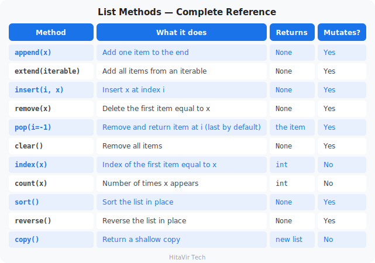

#### Example 1 — Creating and Accessing a List

**`list_access.py`**

```python
# ============================================
# HitaVir Tech - Lists: Creating and Accessing
# ============================================

# A list holds an ordered, changeable collection of items.
groceries = ["milk", "eggs", "bread", "apples"]

# Access by position — indexing starts at 0; negatives count from the end.
print(f"First item:   {groceries[0]}")
print(f"Last item:    {groceries[-1]}")
print(f"Second item:  {groceries[1]}")

# Slicing — [start:stop:step] returns a NEW sub-list.
print(f"First two:    {groceries[:2]}")
print(f"Last two:     {groceries[-2:]}")
print(f"Every other:  {groceries[::2]}")
print(f"Reversed:     {groceries[::-1]}")

# How many items, and does a value exist?
print(f"Total items:  {len(groceries)}")
print(f"Has 'eggs'?   {'eggs' in groceries}")
```

Run it:

```bash
python list_access.py
```

#### Example 2 — Adding Items: `append()`, `insert()`, `extend()`

**`list_add.py`**

```python
# ============================================
# HitaVir Tech - Lists: Adding Items
# ============================================

todo = ["wake up", "brush teeth"]
print(f"Start:        {todo}")

# append(x) — add ONE item to the end.
todo.append("eat breakfast")
print(f"append:       {todo}")

# insert(i, x) — add ONE item at a specific position.
todo.insert(0, "switch off alarm")
print(f"insert:       {todo}")

# extend(iterable) — add MANY items from another iterable.
todo.extend(["go to work", "have lunch"])
print(f"extend:       {todo}")

# Common trap: append() with a list NESTS it; extend() MERGES it.
demo = ["a"]
demo.append(["b", "c"])   # -> ['a', ['b', 'c']]
print(f"append a list: {demo}")
```

Run it:

```bash
python list_add.py
```

#### Example 3 — Removing Items: `remove()`, `pop()`, `clear()`

**`list_remove.py`**

```python
# ============================================
# HitaVir Tech - Lists: Removing Items
# ============================================

columns = ["id", "name", "temp", "email", "debug"]
print(f"Start:        {columns}")

# remove(x) — delete the FIRST matching value (ValueError if absent).
columns.remove("temp")
print(f"remove:       {columns}")

# pop(i) — remove AND return the item at index i (default: last).
last = columns.pop()
print(f"pop():        {last!r}  ->  {columns}")

first = columns.pop(0)
print(f"pop(0):       {first!r}  ->  {columns}")

# del — delete by index or slice (returns nothing).
del columns[0]
print(f"del[0]:       {columns}")

# clear() — empty the whole list.
columns.clear()
print(f"clear():      {columns}")
```

Run it:

```bash
python list_remove.py
```

#### Example 4 — Searching and Counting: `index()`, `count()`

**`list_search.py`**

```python
# ============================================
# HitaVir Tech - Lists: Searching and Counting
# ============================================

status_log = ["ok", "ok", "fail", "ok", "fail", "ok"]

# count(x) — how many times a value appears.
print(f"'ok' count:   {status_log.count('ok')}")
print(f"'fail' count: {status_log.count('fail')}")

# index(x) — position of the FIRST match (ValueError if absent).
print(f"First 'fail': index {status_log.index('fail')}")

# index(x, start) — search from a given position onward.
print(f"Next 'fail':  index {status_log.index('fail', 3)}")

# Always check membership before index() to avoid a crash.
if "timeout" in status_log:
    print(f"'timeout':    index {status_log.index('timeout')}")
else:
    print("'timeout':    not found")
```

Run it:

```bash
python list_search.py
```

#### Example 5 — Reordering: `sort()`, `reverse()`, `copy()`

**`list_reorder.py`**

```python
# ============================================
# HitaVir Tech - Lists: Sorting, Reversing, Copying
# ============================================

scores = [85, 92, 78, 95, 88]

# sort() — sorts IN PLACE (changes the original, returns None).
scores.sort()
print(f"Ascending:    {scores}")

scores.sort(reverse=True)
print(f"Descending:   {scores}")

# sort(key=...) — sort by a custom rule.
words = ["python", "sql", "spark", "go"]
words.sort(key=len)
print(f"By length:    {words}")

# reverse() — reverse the order IN PLACE.
words.reverse()
print(f"Reversed:     {words}")

# copy() — a shallow copy so the original is left untouched.
backup = scores.copy()
backup.append(100)
print(f"Original:     {scores}")
print(f"Copy + 100:   {backup}")
```

Run it:

```bash
python list_reorder.py
```

#### Example 6 — Built-in Functions That Work on Lists

These are **global functions**, not list methods — you pass the list as an argument. The key distinction: `list.sort()` changes the list and returns `None`, while `sorted(list)` leaves the list alone and returns a **new** sorted list.

**`list_builtins.py`**

```python
# ============================================
# HitaVir Tech - Built-in Functions on Lists
# ============================================

scores = [85, 92, 78, 95, 88, 76, 91]

print(f"len()      count:        {len(scores)}")
print(f"sum()      total:        {sum(scores)}")
print(f"min()      lowest:       {min(scores)}")
print(f"max()      highest:      {max(scores)}")
print(f"sorted()   new sorted:   {sorted(scores)}")
print(f"reversed() new reversed: {list(reversed(scores))}")

# any() / all() — boolean checks across the whole list.
flags = [True, True, False]
print(f"any()  at least one True? {any(flags)}")
print(f"all()  every item True?   {all(flags)}")

# enumerate() — index AND value together (ideal for numbered loops).
print("\nenumerate():")
for index, score in enumerate(scores[:3], start=1):
    print(f"  Row {index}: {score}")

# zip() — pair up two lists element by element.
names = ["Alice", "Bob", "Carol"]
ages = [30, 25, 35]
print("\nzip():")
for name, age in zip(names, ages):
    print(f"  {name} is {age}")
```

Run it:

```bash
python list_builtins.py
```

> **HitaVir Tech says:** "Interviewers love the `sort()` vs `sorted()` question. `sort()` mutates and returns `None` (so `x = my_list.sort()` is a classic bug — `x` is `None`). `sorted()` returns a new list and works on any iterable."

---

### Strings — Ordered, Immutable Text

A **string** is a sequence of characters written in quotes. Like a list, you can index and slice it; like a tuple, it is **immutable** — so every "change" method hands back a **brand-new string** and leaves the original untouched. Strings are everywhere in data work: names, dates, CSV lines, and log messages all arrive as text.

#### String Methods — Complete Reference

Strings are immutable, so every method below returns a **new** string (or a list / number) — none of them change the original.

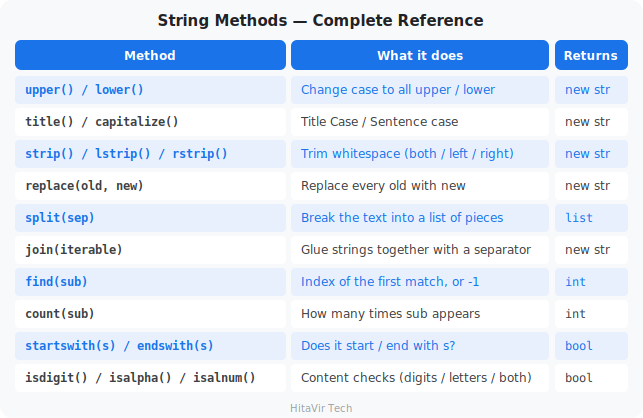

#### Example 1 — Creating and Accessing a String

**`string_access.py`**

```python
# ============================================
# HitaVir Tech - Strings: Creating and Accessing
# ============================================

# A string is text wrapped in quotes — a sequence of characters.
name = "Python"

# Access one character by position (indexing starts at 0).
print(f"First letter: {name[0]}")
print(f"Last letter:  {name[-1]}")

# Slicing — [start:stop:step] returns a NEW piece of the string.
print(f"First three:  {name[:3]}")
print(f"Last two:     {name[-2:]}")
print(f"Reversed:     {name[::-1]}")

# How long is it, and does it contain something?
print(f"Length:       {len(name)}")
print(f"Has 'th'?     {'th' in name}")
```

Run it:

```bash
python string_access.py
```

#### Example 2 — Changing Case: `upper()`, `lower()`, `title()`, `capitalize()`

**`string_case.py`**

```python
# ============================================
# HitaVir Tech - Strings: Changing Case
# ============================================

text = "hello WORLD"

print(f"upper():      {text.upper()}")        # HELLO WORLD
print(f"lower():      {text.lower()}")        # hello world
print(f"title():      {text.title()}")        # Hello World
print(f"capitalize(): {text.capitalize()}")   # Hello world

# Proof the original never changed (strings are immutable).
print(f"original:     {text}")
```

Run it:

```bash
python string_case.py
```

#### Example 3 — Cleaning Whitespace: `strip()`, `lstrip()`, `rstrip()`

**`string_clean.py`**

```python
# ============================================
# HitaVir Tech - Strings: Cleaning Whitespace
# ============================================

# Messy text often has extra spaces — very common when reading files.
raw = "   Asha Sharma   "

# Quotes added so you can SEE where the spaces are.
print(f"strip():  '{raw.strip()}'")     # trims BOTH ends
print(f"lstrip(): '{raw.lstrip()}'")    # trims the LEFT only
print(f"rstrip(): '{raw.rstrip()}'")    # trims the RIGHT only

# strip() can also remove specific characters, not just spaces.
price = "$1500"
print(f"clean price: {price.strip('$')}")
```

Run it:

```bash
python string_clean.py
```

#### Example 4 — Searching and Replacing: `startswith()`, `find()`, `count()`, `replace()`

**`string_search.py`**

```python
# ============================================
# HitaVir Tech - Strings: Searching and Replacing
# ============================================

email = "asha@example.com"

# startswith() / endswith() — quick yes/no checks.
print(f"Starts with 'asha'? {email.startswith('asha')}")
print(f"Ends with '.com'?   {email.endswith('.com')}")

# find() — position of the first match, or -1 if it is not there.
print(f"Position of '@':    {email.find('@')}")

# count() — how many times something appears.
sentence = "she sells sea shells"
print(f"Count of 's':       {sentence.count('s')}")

# replace(old, new) — returns a NEW string with the swaps made.
print(f"replace:            {email.replace('example', 'gmail')}")
```

Run it:

```bash
python string_search.py
```

#### Example 5 — Splitting and Joining: `split()`, `join()`

**`string_split_join.py`**

```python
# ============================================
# HitaVir Tech - Strings: Splitting and Joining
# ============================================

# split() — break a string into a LIST of pieces.
csv_line = "Asha,25,Bangalore"
parts = csv_line.split(",")
print(f"split:  {parts}")

# split() with no argument splits on spaces — handy for words.
sentence = "data is the new oil"
words = sentence.split()
print(f"words:  {words}")

# join() — glue a list of strings back into ONE string.
print(f"join:   {' '.join(words)}")

# You can glue with any separator you like.
print(f"hyphen: {'-'.join(parts)}")
```

Run it:

```bash
python string_split_join.py
```

#### Example 6 — Checking the Content: `isdigit()`, `isalpha()`, `isalnum()`

**`string_check.py`**

```python
# ============================================
# HitaVir Tech - Strings: Checking the Content
# ============================================

# These return True or False — perfect for validating user input.
print(f"'12345'.isdigit():  {'12345'.isdigit()}")    # all digits?
print(f"'Asha'.isalpha():   {'Asha'.isalpha()}")     # all letters?
print(f"'Asha12'.isalnum(): {'Asha12'.isalnum()}")   # letters/digits?

# Real use: only convert to a number if the text actually looks like one.
user_input = "42"
if user_input.isdigit():
    print(f"Valid number: {int(user_input) + 1}")
else:
    print("That is not a whole number")
```

Run it:

```bash
python string_check.py
```

> **HitaVir Tech says:** "Because strings are immutable, `text.upper()` does **not** change `text` — it returns a new string. Beginners often forget to save the result: write `text = text.upper()`, not just `text.upper()`."

---

### Tuples — Ordered, Immutable Records

A **tuple** is an ordered sequence that **cannot be changed** after creation. Use it for fixed records: coordinates, RGB colors, database credentials. Because it is immutable, it has only **two** methods.

#### Tuple Methods — Complete Reference

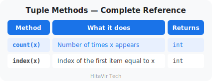

#### Example 1 — Creating and Unpacking a Tuple

**`tuple_basics.py`**

```python
# ============================================
# HitaVir Tech - Tuples: Creating and Unpacking
# ============================================

# A tuple is an ordered, IMMUTABLE collection.
db_config = ("prod-db.hitavir.tech", 5432, "hitavir_prod")

# Access by index, exactly like a list.
print(f"Host: {db_config[0]}")
print(f"Port: {db_config[1]}")

# Tuple unpacking — assign every item to a variable in one line.
host, port, database = db_config
print(f"Unpacked -> {host} : {port} / {database}")

# A single-item tuple NEEDS a trailing comma.
not_a_tuple = ("solo")     # this is just a string
real_tuple = ("solo",)     # this is a tuple
print(f"{type(not_a_tuple).__name__} vs {type(real_tuple).__name__}")

# Immutability — uncommenting the next line raises a TypeError.
# db_config[1] = 5433
```

Run it:

```bash
python tuple_basics.py
```

#### Example 2 — The Two Tuple Methods: `count()`, `index()`

**`tuple_methods.py`**

```python
# ============================================
# HitaVir Tech - Tuples: count() and index()
# ============================================

regions = ("North", "South", "North", "East", "North", "West")

# count(x) — how many times a value appears.
print(f"'North' count: {regions.count('North')}")

# index(x) — position of the first match.
print(f"First 'East':  index {regions.index('East')}")

# Why tuples? They are lighter than lists and protect data that must
# not change — coordinates, fixed pairs, credentials.
point = (12.97, 77.59)   # (latitude, longitude)
print(f"Coordinates:   {point}")
```

Run it:

```bash
python tuple_methods.py
```

---

### Sets — Unordered Collections of Unique Values

A **set** stores **unique** values with **no order**. It is the fastest way to deduplicate data and to test membership (`O(1)`), and it gives you mathematical set operations for free.

#### Set Methods — Complete Reference

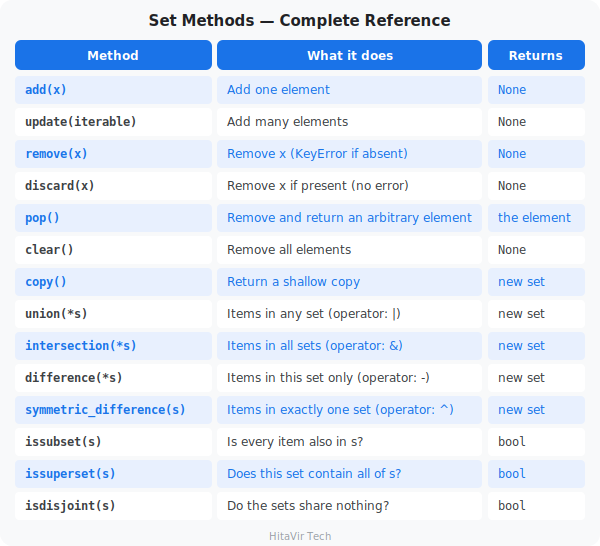

#### Example 1 — Creating and Adding: `add()`, `update()`

**`set_add.py`**

```python
# ============================================
# HitaVir Tech - Sets: Creating and Adding
# ============================================

# A set stores UNIQUE values. Building one from a list deduplicates it.
raw_ids = [101, 102, 101, 103, 102, 104]
unique_ids = set(raw_ids)
print(f"Raw:    {raw_ids}")
print(f"Unique: {unique_ids}")

# add(x) — insert ONE value (duplicates are silently ignored).
unique_ids.add(105)
unique_ids.add(101)        # already present -> no effect
print(f"add:    {unique_ids}")

# update(iterable) — insert MANY values at once.
unique_ids.update([106, 107, 108])
print(f"update: {unique_ids}")

# An EMPTY set must use set() — {} creates an empty dict, not a set.
empty = set()
print(f"Empty set type: {type(empty).__name__}")
```

Run it:

```bash
python set_add.py
```

#### Example 2 — Removing: `remove()`, `discard()`, `pop()`, `clear()`

**`set_remove.py`**

```python
# ============================================
# HitaVir Tech - Sets: Removing Items
# ============================================

active_users = {"alice", "bob", "charlie", "diana", "eve"}
print(f"Start:        {active_users}")

# discard(x) — remove if present; does NOTHING if missing (safe).
active_users.discard("bob")
active_users.discard("zoe")     # not there -> no error
print(f"discard:      {active_users}")

# remove(x) — remove if present; raises KeyError if missing (strict).
active_users.remove("alice")
print(f"remove:       {active_users}")

# pop() — remove and return an ARBITRARY item (a set has no order).
removed = active_users.pop()
print(f"pop():        {removed!r}  ->  {active_users}")

# clear() — empty the set.
active_users.clear()
print(f"clear():      {active_users}")
```

Run it:

```bash
python set_remove.py
```

#### Example 3 — Set Algebra: `union`, `intersection`, `difference`, `symmetric_difference`

**`set_algebra.py`**

```python
# ============================================
# HitaVir Tech - Sets: Comparing Two Groups
# ============================================

# Which students are in the chess club vs the coding club?
chess_club = {"Asha", "Ravi", "Meena", "Diana"}
coding_club = {"Meena", "Diana", "Eve", "Frank"}

# union — everyone in EITHER club.
print(f"In any club    (|): {chess_club | coding_club}")
print(f"union method      : {chess_club.union(coding_club)}")

# intersection — only students in BOTH clubs.
print(f"In both clubs  (&): {chess_club & coding_club}")

# difference — in chess club but NOT in coding club.
print(f"Only chess     (-): {chess_club - coding_club}")

# symmetric_difference — in exactly ONE club, not both.
print(f"In just one    (^): {chess_club ^ coding_club}")
```

Run it:

```bash
python set_algebra.py
```

#### Example 4 — Relationship Tests: `issubset()`, `issuperset()`, `isdisjoint()`

**`set_relations.py`**

```python
# ============================================
# HitaVir Tech - Sets: Relationship Tests
# ============================================

# A recipe needs some ingredients; our kitchen has these on the shelf.
needed = {"flour", "sugar", "eggs"}
pantry = {"flour", "sugar", "eggs", "salt", "butter"}
cleaning = {"soap", "sponge"}

# issubset() — are ALL the needed ingredients on the shelf?
print(f"Have everything needed?  {needed.issubset(pantry)}")

# issuperset() — does the pantry cover every needed ingredient?
print(f"Pantry covers the recipe?{pantry.issuperset(needed)}")

# isdisjoint() — do two sets share NOTHING in common?
print(f"Food vs cleaning overlap?{needed.isdisjoint(cleaning)}")

# A handy follow-up: what (if anything) are we missing?
missing = needed - pantry
print(f"Missing ingredients:     {missing or 'none — ready to bake!'}")
```

Run it:

```bash
python set_relations.py
```

---

### Dictionaries — Key-Value Mappings

A **dictionary** maps **keys to values** and looks up values by key in `O(1)` time. It is the natural fit for a single record, a JSON object, or any named configuration.

#### Dict Methods — Complete Reference

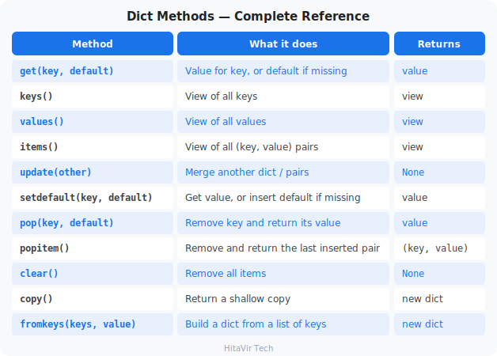

#### Example 1 — Accessing Data: `get()`, `keys()`, `values()`, `items()`

**`dict_access.py`**

```python
# ============================================
# HitaVir Tech - Dictionaries: Accessing Data
# ============================================

employee = {
    "id": 101,
    "name": "Priya Sharma",
    "department": "Data Engineering",
    "salary": 85000,
}

# Direct access with [] — raises KeyError if the key is missing.
print(f"Name:    {employee['name']}")

# get(key, default) — safe access; returns the default instead of crashing.
print(f"Manager: {employee.get('manager', 'Not assigned')}")

# keys() / values() / items() — views you can loop over.
print(f"Keys:    {list(employee.keys())}")
print(f"Values:  {list(employee.values())}")

# items() is the standard way to iterate a dictionary.
print("Record:")
for key, value in employee.items():
    print(f"  {key:<12}: {value}")
```

Run it:

```bash
python dict_access.py
```

#### Example 2 — Adding and Updating: `update()`, `setdefault()`

**`dict_update.py`**

```python
# ============================================
# HitaVir Tech - Dictionaries: Adding and Updating
# ============================================

settings = {"sound": "on", "level": 1}
print(f"Start:      {settings}")

# [] assignment — change an existing key or add a new one.
settings["level"] = 2            # update existing key
settings["player"] = "Asha"      # add a brand new key
print(f"[] set:     {settings}")

# update() — merge another dict (or key/value pairs) in one call.
settings.update({"difficulty": "easy", "lives": 3})
print(f"update:     {settings}")

# setdefault(key, default) — return the value, OR insert it if missing.
settings.setdefault("sound", "off")   # key exists -> left unchanged
settings.setdefault("paused", False)  # key is new -> inserted
print(f"setdefault: {settings}")
```

Run it:

```bash
python dict_update.py
```

#### Example 3 — Removing Data: `pop()`, `popitem()`, `clear()`

**`dict_remove.py`**

```python
# ============================================
# HitaVir Tech - Dictionaries: Removing Data
# ============================================

record = {"id": 1, "name": "Alice", "temp": "x", "debug": True}
print(f"Start:      {record}")

# pop(key) — remove a key and return its value.
name = record.pop("name")
print(f"pop:        {name!r}  ->  {record}")

# pop(key, default) — safe pop that won't crash on a missing key.
missing = record.pop("ghost", "not found")
print(f"pop ghost:  {missing!r}")

# popitem() — remove and return the LAST inserted (key, value) pair.
last_pair = record.popitem()
print(f"popitem:    {last_pair}  ->  {record}")

# del — delete a key by name.
del record["temp"]
print(f"del:        {record}")

# clear() — empty the dictionary.
record.clear()
print(f"clear:      {record}")
```

Run it:

```bash
python dict_remove.py
```

#### Example 4 — Building and Copying: `fromkeys()`, `copy()`, membership

**`dict_utils.py`**

```python
# ============================================
# HitaVir Tech - Dictionaries: fromkeys, copy, membership
# ============================================

# fromkeys(keys, value) — build a dict from a list of keys.
columns = ["id", "name", "email"]
schema = dict.fromkeys(columns, "string")
print(f"fromkeys:   {schema}")

# Membership (in) tests KEYS by default — a fast O(1) lookup.
print(f"'name' in schema?  {'name' in schema}")
print(f"'phone' in schema? {'phone' in schema}")

# copy() — a shallow copy so edits don't touch the original.
original = {"a": 1, "b": 2}
clone = original.copy()
clone["c"] = 3
print(f"Original:   {original}")
print(f"Copy:       {clone}")
```

Run it:

```bash
python dict_utils.py
```

---

### List of Dictionaries — The Data Engineering Standard

This is the single most common pattern in data engineering. A CSV file, an API response, and a database query result all arrive as a **list of dictionaries**: the list is the rows, each dictionary is one row.

**`list_of_dicts.py`**

```python
# ============================================
# HitaVir Tech - List of Dicts: Filter, Aggregate, Group
# ============================================

from collections import defaultdict

sales_data = [
    {"date": "2026-04-01", "product": "Laptop", "amount": 999.99,
     "region": "North"},
    {"date": "2026-04-01", "product": "Mouse", "amount": 29.99,
     "region": "South"},
    {"date": "2026-04-02", "product": "Keyboard", "amount": 79.99,
     "region": "North"},
    {"date": "2026-04-02", "product": "Monitor", "amount": 449.99,
     "region": "East"},
    {"date": "2026-04-03", "product": "Laptop", "amount": 999.99,
     "region": "West"},
]

# Filter — keep only sales above $100 (list comprehension).
big_sales = [s for s in sales_data if s["amount"] > 100]
print(f"Sales > $100: {len(big_sales)}")

# Aggregate — total revenue (generator expression into sum()).
total_revenue = sum(s["amount"] for s in sales_data)
print(f"Total revenue: ${total_revenue:,.2f}")

# Group by region — defaultdict avoids manual "if key in dict" checks.
by_region = defaultdict(float)
for sale in sales_data:
    by_region[sale["region"]] += sale["amount"]

print("\nRevenue by region:")
for region, total in sorted(by_region.items()):
    print(f"  {region:<6}: ${total:,.2f}")
```

Run it:

```bash
python list_of_dicts.py
```

> **HitaVir Tech says:** "A list of dictionaries is the bread and butter of data engineering. It is how APIs return data, how you process CSV rows, and how you pass data between pipeline stages. Master this pattern."

### Data Structure Comparison Table — Interview Reference

This table is asked in **every Python interview** for Data Engineering roles. Memorize it.

#### Core Comparison

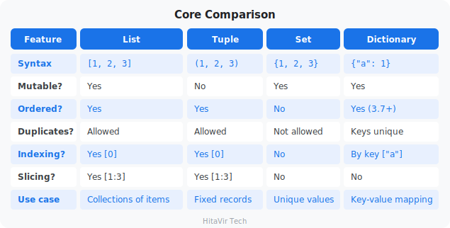

#### Performance Comparison (Big-O)

**What is "Big-O"?**

Big-O describes how much slower an operation gets as your dataset grows. `O(1)` means "instant — the same speed for 10 rows or 10 million." `O(n)` means "scales with size — 10× the data takes 10× longer." For data engineers handling millions of rows, this matters.

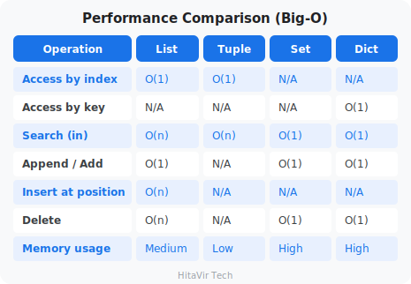

#### When to Use What — Data Engineering Guide

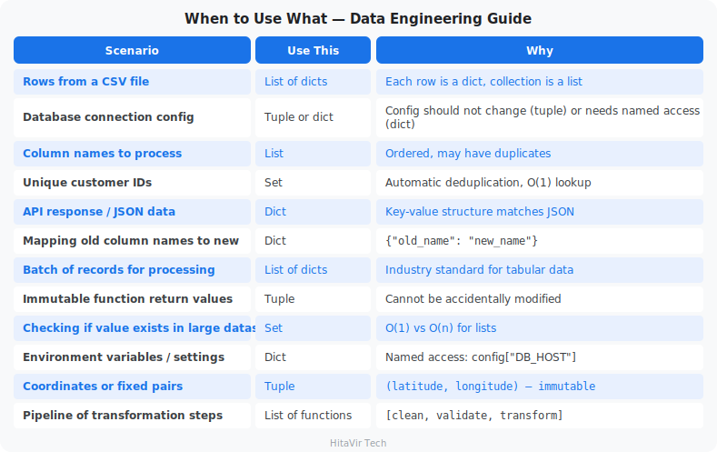

#### Quick Memory Aid for Interviews

```
List  = Shopping cart     → ordered, changeable, duplicates OK
Tuple = ID card           → ordered, fixed, cannot be changed
Set   = Unique stamps     → unordered, no duplicates, fast lookup
Dict  = Phone book        → name→number pairs, fast lookup by key
```

> **HitaVir Tech says:** "In interviews, they will ask: 'When would you use a set instead of a list?' The answer: when you need unique values and fast O(1) lookups. A set checks membership instantly; a list scans every element. For 10 million records, that is the difference between milliseconds and minutes."

### Assignment 4 — Sales Aggregator

**Goal:** Use every Python data structure to build a small sales aggregator.

**The scenario:** Marketing wants three answers from yesterday's sales: revenue per region, the list of unique customers, and the top-spending customer.

**Tasks:**

1. Create `assignment_04_data_structures.py`.
2. Use this input data:

```python
sales = [
    {"customer": "Alice",  "region": "North", "amount": 1500},
    {"customer": "Bob",    "region": "South", "amount":  800},
    {"customer": "Alice",  "region": "North", "amount": 2300},
    {"customer": "Carol",  "region": "East",  "amount": 1200},
    {"customer": "Bob",    "region": "South", "amount":  600},
    {"customer": "David",  "region": "West",  "amount":  450},
    {"customer": "Carol",  "region": "East",  "amount":  900},
]
```

3. Build:
   - `revenue_by_region` (a `dict`) -> total amount per region
   - `unique_customers` (a `set`) -> distinct customer names
   - `revenue_by_customer` (a `dict`) -> total amount per customer
   - `top_customer` (a `tuple` of `(name, amount)`) -> the highest-spender

4. Print a clean report:

```text
Revenue by Region:
  East   : $2,100.00
  North  : $3,800.00
  South  : $1,400.00
  West   :   $450.00

Unique customers: 4
Names: ['Alice', 'Bob', 'Carol', 'David']

Top customer: Alice ($3,800.00)
```

**Success criteria:**

- [ ] Uses `dict`, `set`, `list`, and `tuple` (all four)
- [ ] Regions printed in alphabetical order
- [ ] Customer list sorted alphabetically
- [ ] Top customer = `("Alice", 3800)`
- [ ] Numbers formatted with thousands separator and 2 decimals

**Stretch goal:** Replace the manual loops with `defaultdict(float)` and a dictionary comprehension. Then replace the `for`-loop top-customer logic with `max(revenue_by_customer.items(), key=lambda x: x[1])`.

### What You Have Learnt on This Page

By the end of this page you should be able to confidently:

- Choose the **right structure** — string (text), list (ordered, mutable), tuple (locked), set (unique), dict (key→value)
- Use every **list** method — `append`, `extend`, `insert`, `remove`, `pop`, `clear`, `index`, `count`, `sort`, `reverse`, `copy` — and know `sort()` mutates while `sorted()` returns a new list
- Use the everyday **string** methods — `upper`, `lower`, `title`, `strip`, `replace`, `split`, `join`, `find`, `count`, `startswith`, `isdigit` — and remember strings are immutable, so each returns a new string
- Apply the **built-in functions** that work on any sequence — `len`, `sum`, `min`, `max`, `sorted`, `reversed`, `any`, `all`, `enumerate`, `zip`
- Use the two **tuple** methods (`count`, `index`) and unpack tuples cleanly
- Use every **set** method — `add`, `update`, `remove`, `discard`, `pop`, `clear` — plus set algebra (`union`, `intersection`, `difference`, `symmetric_difference`) and relationship tests (`issubset`, `issuperset`, `isdisjoint`)
- Use every **dict** method — `get`, `keys`, `values`, `items`, `update`, `setdefault`, `pop`, `popitem`, `clear`, `copy`, `fromkeys`
- Combine them into the **list-of-dicts** pattern to filter, aggregate, and group real data

### PEP 8 — Style Rules to Apply Strictly to Data Structures

Real pipeline code lives or dies on how cleanly your data structures are written. Apply these rules every single time:

- For multi-line literals, add a **trailing comma** so diffs show one-line additions only
- Use **dict / list comprehensions** when they fit on one readable line — otherwise use a `for` loop
- Use **`if not records:`** for empty checks, never `len(records) == 0`
- Prefer **double quotes** consistently for keys: `{"name": "Alice"}`
- Avoid mutable default arguments — never `def f(x=[]):` (subtle bug); use `def f(x=None):` then assign inside
- Pick **`defaultdict`** or **`Counter`** from `collections` over manual `if key in d:` checks

> **Inspiration for the road ahead:**
>
> *"Bad programmers worry about the code. Good programmers worry about data structures and their relationships."*
> — Linus Torvalds

## File Handling — CSV, JSON, Parquet, and Text
Duration: 22:00

**Why file handling matters in DE**

Every data pipeline starts and ends with a file. You read raw data **from** a file, transform it, and write the cleaned result **to** another file. The two formats you will use 95% of the time are CSV and JSON.

**Quick definitions:**

- **CSV (Comma-Separated Values)** — a plain-text spreadsheet. Each line is a row; commas separate the columns.
- **JSON (JavaScript Object Notation)** — a text format for structured/nested data. Looks like Python dictionaries.
- **Parquet** — a compact, **columnar** binary format used by every modern data platform (Spark, Databricks, BigQuery). Smaller and faster than CSV for large data.
- **Log file** — a plain-text file where every line is a timestamped event (used for debugging).

We learn each format in its own small file — first **CSV**, then **JSON**, then **text/log** — and because real pipelines combine formats, we add a **mix** example: CSV in, JSON out. Then we **level up to three real public datasets** from Kaggle and add **Parquet**, the format you will meet on every data team.

### Create Sample Data Files

**`create_sample_data.py`**

```python
"""
HitaVir Tech - Create sample data files for practice
"""
import csv
import json

# --- Create CSV file ---
sales_data = [
    ["order_id", "customer", "product", "quantity", "price", "date", "region"],
    [1001, "Alice Johnson", "Laptop", 1, 999.99, "2026-04-01", "North"],
    [1002, "Bob Smith", "Mouse", 5, 29.99, "2026-04-01", "South"],
    [1003, "Charlie Brown", "Keyboard", 2, 79.99, "2026-04-01", "North"],
    [1004, "", "Monitor", 1, 449.99, "2026-04-02", "East"],
    [1005, "Diana Prince", "Laptop", 2, 999.99, "2026-04-02", "West"],
    [1006, "Eve Wilson", "", 3, 29.99, "2026-04-02", "South"],
    [1007, "Frank Miller", "Keyboard", 0, 79.99, "2026-04-03", "North"],
    [1008, "Grace Lee", "Headphones", 1, 149.99, "2026-04-03", "East"],
    [1009, "Henry Davis", "Monitor", 1, 449.99, "2026-04-03", "West"],
    [1010, "Ivy Chen", "Laptop", 1, -999.99, "2026-04-03", "North"],
]

with open("sales_raw.csv", "w", encoding="utf-8", newline="") as f:
    writer = csv.writer(f)
    writer.writerows(sales_data)
print("Created: sales_raw.csv")

# --- Create JSON config ---
config = {
    "pipeline_name": "HitaVir Sales ETL",
    "version": "1.0.0",
    "source": {
        "type": "csv",
        "path": "sales_raw.csv"
    },
    "rules": {
        "max_null_percent": 0.05,
        "min_quantity": 1,
        "min_price": 0.01
    },
    "output": {
        "path": "sales_cleaned.csv",
        "report_path": "pipeline_report.json"
    }
}

with open("pipeline_config.json", "w", encoding="utf-8") as f:
    json.dump(config, f, indent=2)
print("Created: pipeline_config.json")

# --- Create log file ---
logs = """[2026-04-05 08:00:01] INFO: Pipeline started
[2026-04-05 08:00:02] INFO: Loading sales_raw.csv
[2026-04-05 08:00:03] WARNING: Found 2 records with missing customer names
[2026-04-05 08:00:04] ERROR: Record 1010 has negative price
[2026-04-05 08:00:05] INFO: Cleaned 10 records, 2 rejected
[2026-04-05 08:00:06] INFO: Pipeline completed in 5.2s
"""

with open("pipeline.log", "w", encoding="utf-8") as f:
    f.write(logs)
print("Created: pipeline.log")

print("\nAll sample files created successfully!")
```

Run it:

```bash
python create_sample_data.py
```

**What is the with-open block?**

`with open(...) as f:` is the **safe way** to open files in Python. The `with` block automatically closes the file when you are done — even if an error happens inside. This prevents the "file left open and locked" bug.

### CSV — Part 1: Read a CSV File

**What is `csv.DictReader`?**

`csv.DictReader` reads each row of a CSV as a **dictionary** keyed by the header names. Instead of remembering "column 4 is price," you write `row["price"]` — cleaner, safer, easier.

**Best practice up front:** always pass `encoding="utf-8"` so the same code works on Windows, Mac, and Linux.

**`file_csv_read.py`**

```python
# ============================================
# HitaVir Tech - CSV Part 1: Read a CSV
# ============================================
import csv

# DictReader turns every row into a dict keyed by the header line.
records = []
with open("sales_raw.csv", "r", encoding="utf-8") as f:
    reader = csv.DictReader(f)
    for row in reader:
        records.append(row)

print(f"Loaded {len(records)} records")

# Look at the first 3 rows. Note: every value is TEXT at this point.
print("\nFirst 3 rows:")
for record in records[:3]:
    print(f"  Order {record['order_id']}: "
          f"{record['customer']} bought "
          f"{record['quantity']}x {record['product']}")
```

Run it:

```bash
python file_csv_read.py
```

> **Remember:** a CSV cell is always read as a **string**. `record["price"]` is `"999.99"` (text), not `999.99` (a number). You convert it with `float(...)` or `int(...)` before doing maths — exactly what the Mix example below does.

### CSV — Part 2: Write a CSV File

`csv.DictWriter` is the mirror image of `DictReader`: you give it a list of dictionaries and the column order, and it writes the header plus one row per dict.

**Two best practices for writing CSV on Windows:**

- `newline=""` stops Windows from inserting a blank line between every row.
- `encoding="utf-8"` keeps names with accents or symbols intact.

**`file_csv_write.py`**

```python
# ============================================
# HitaVir Tech - CSV Part 2: Write a CSV
# ============================================
import csv

# Each row is one dictionary. The keys match the columns we want.
rows = [
    {"product": "Laptop", "region": "North", "total": 999.99},
    {"product": "Mouse", "region": "South", "total": 149.95},
    {"product": "Monitor", "region": "West", "total": 449.99},
]

# fieldnames sets BOTH the column order and the header line.
fieldnames = ["product", "region", "total"]

with open("summary.csv", "w", encoding="utf-8", newline="") as f:
    writer = csv.DictWriter(f, fieldnames=fieldnames)
    writer.writeheader()      # writes the line: product,region,total
    writer.writerows(rows)    # writes one line per dictionary

print("Saved: summary.csv")
```

Run it:

```bash
python file_csv_write.py
```

> **Try it yourself:** open `summary.csv` in Excel or a text editor. You should see a clean header row and three data rows, with no blank lines in between — that is the `newline=""` doing its job.

#### CSV File Mode Cheat Sheet

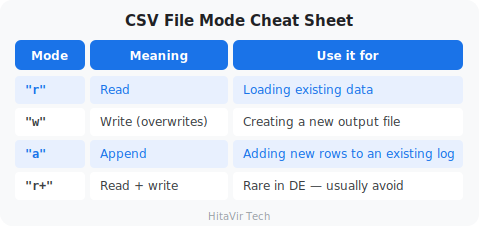

### JSON — Part 1: Read a JSON File

> **JSON ↔ Python dictionary:** JSON is text on disk; a Python dict lives in memory. `json.load()` turns a JSON **file** into a dict. `json.loads()` (with an `s`) turns a JSON **string** into a dict.

**`file_json_read.py`**

```python
# ============================================
# HitaVir Tech - JSON Part 1: Read JSON
# ============================================
import json

# json.load() reads a JSON FILE and hands back a Python dict.
with open("pipeline_config.json", "r", encoding="utf-8") as f:
    config = json.load(f)

# Nested values are reached with chained keys.
print(f"Pipeline:   {config['pipeline_name']}")
print(f"Version:    {config['version']}")
print(f"Source:     {config['source']['path']}")
print(f"Max null %: {config['rules']['max_null_percent']}")

# json.loads() reads JSON from a STRING instead of a file.
raw_text = '{"name": "Asha", "age": 25}'
person = json.loads(raw_text)
print(f"\nFrom a string: {person['name']} is {person['age']}")
```

Run it:

```bash
python file_json_read.py
```

> **Memory aid:** the `s` in `loads`/`dumps` stands for **string**. No `s` (`load`/`dump`) means **file**.

### JSON — Part 2: Write a JSON File

`json.dump()` writes a dict to a file. Always pass `indent=2` — it makes the file readable by humans and produces clean line-by-line diffs in Git.

**`file_json_write.py`**

```python
# ============================================
# HitaVir Tech - JSON Part 2: Write JSON
# ============================================
import json

# A nested dict is exactly what a JSON report looks like.
report = {
    "pipeline": "HitaVir Sales ETL",
    "run_date": "2026-04-05",
    "status": "completed",
    "metrics": {
        "cleaned_records": 7,
        "rejected_records": 3,
        "total_revenue": 4339.89,
    },
}

# json.dump() writes the dict to a FILE. indent=2 = readable output.
with open("pipeline_report.json", "w", encoding="utf-8") as f:
    json.dump(report, f, indent=2)

print("Saved: pipeline_report.json")

# json.dumps() returns JSON as a STRING (handy for printing/logging).
preview = json.dumps(report["metrics"], indent=2)
print(f"\nMetrics as a string:\n{preview}")
```

Run it:

```bash
python file_json_write.py
```

#### JSON Function Cheat Sheet

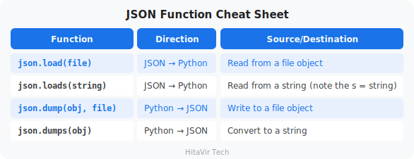

### Text — Read a Text / Log File

A log file is plain text: one event per line. To read it, we loop the file **line by line**.

**Best practice — loop the file directly:** writing `for line in f:` reads one line at a time and works even on a 10 GB log. The older `f.readlines()` loads the *whole* file into memory at once, which crashes on big files. Prefer the loop.

**`file_text_read.py`**

```python
# ============================================
# HitaVir Tech - Text: Read a Log File
# ============================================

info_count = 0
warning_count = 0
errors = []

# Looping the file reads it one line at a time (memory-friendly).
with open("pipeline.log", "r", encoding="utf-8") as f:
    for line in f:
        line = line.strip()       # drop the trailing newline + spaces
        if not line:
            continue              # skip blank lines
        if "INFO:" in line:
            info_count += 1
        elif "WARNING:" in line:
            warning_count += 1
        elif "ERROR:" in line:
            errors.append(line)

print(f"INFO messages:    {info_count}")
print(f"WARNING messages: {warning_count}")
print(f"ERROR messages:   {len(errors)}")

# Show the full text of any error lines we found.
for error in errors:
    print(f"  -> {error}")
```

Run it:

```bash
python file_text_read.py
```

### Mix — CSV In, JSON Out (the real pipeline)

This is the single most common file-handling task in a real job: **read a CSV, clean and summarise it, write a JSON report.** It ties CSV and JSON together and shows the full set of best practices in one place.

**Best practices on display here:**

- `pathlib.Path` for file paths, kept in **UPPER_SNAKE_CASE constants** at the top
- `encoding="utf-8"` on every single `open(...)`
- Small, named **functions** instead of one long script
- A `try / except FileNotFoundError` so a missing file gives a helpful message, not a crash
- `json.dump(..., indent=2)` for a readable, diff-friendly file
- **Reading the file back** to prove it is valid before we trust it
- The `if __name__ == "__main__":` guard

**`file_mix_csv_to_json.py`**

```python
# ============================================
# HitaVir Tech - Mix: CSV In -> JSON Out
# Read a CSV, clean + summarise, write a JSON report.
# ============================================
import csv
import json
from collections import defaultdict
from pathlib import Path

# Best practice: paths live in constants, built with pathlib.Path.
INPUT_CSV = Path("sales_raw.csv")
OUTPUT_JSON = Path("region_summary.json")


def load_clean_sales(path):
    """Read the CSV and return a list of valid sale dicts."""
    sales = []
    with open(path, "r", encoding="utf-8") as f:
        for row in csv.DictReader(f):
            # Skip rows that are missing a customer or a product.
            if not row["customer"] or not row["product"]:
                continue
            quantity = int(row["quantity"])    # text -> whole number
            price = float(row["price"])        # text -> decimal
            # Skip impossible numbers.
            if quantity <= 0 or price <= 0:
                continue
            sales.append({
                "region": row["region"],
                "total": round(quantity * price, 2),
            })
    return sales


def revenue_by_region(sales):
    """Add up revenue per region, sorted by region name."""
    totals = defaultdict(float)
    for sale in sales:
        totals[sale["region"]] += sale["total"]
    # Rebuild as a normal dict in sorted order -> tidy JSON.
    return {region: round(totals[region], 2) for region in sorted(totals)}


def main():
    # Best practice: handle a missing input file gracefully.
    try:
        sales = load_clean_sales(INPUT_CSV)
    except FileNotFoundError:
        print(f"Input file not found: {INPUT_CSV}")
        print("Run 'python create_sample_data.py' first, then retry.")
        return

    by_region = revenue_by_region(sales)
    report = {
        "report_date": "2026-04-30",
        "currency": "USD",
        "by_region": by_region,
        "total": round(sum(by_region.values()), 2),
    }

    # Write the JSON report.
    with open(OUTPUT_JSON, "w", encoding="utf-8") as f:
        json.dump(report, f, indent=2)
    print(f"Wrote {OUTPUT_JSON}")

    # Best practice: read it back to confirm the file is valid JSON.
    with open(OUTPUT_JSON, "r", encoding="utf-8") as f:
        check = json.load(f)
    print(f"Verified - total revenue: ${check['total']:,.2f}")


if __name__ == "__main__":
    main()
```

Run it:

```bash
python file_mix_csv_to_json.py
```

> **This is the Assignment 5 pattern.** Learn this shape — read CSV → validate → group → write JSON → read back to verify — then prove you own it by completing Assignment 5 below in the exact output format it asks for.

### Level Up — Real-World Datasets (CSV, JSON, Parquet)

So far we practised on small files we made ourselves. Now let us use **three real public datasets** from Kaggle — the larger, messier data you meet on the job — and add a new format every data engineer must know: **Parquet**.

> **A real-world truth:** almost all data arrives as **CSV** first. Converting it to **JSON** (for APIs and dashboards) and to **Parquet** (for fast analytics storage) is daily work. So even though all three datasets ship as CSV, we will **read one as CSV**, **convert one to JSON**, and **convert one to Parquet** — exactly the moves you make on a real team.

**The three datasets:**

| Format | Dataset | What it holds |
|---|---|---|
| CSV | [AI Impact on Students](https://www.kaggle.com/datasets/laveshjadon/ai-impact-on-students) | 50,000 students: GenAI usage vs GPA and burnout |
| JSON | [LLM Benchmark Comparison](https://www.kaggle.com/datasets/uzmaakhtar/llm-benchmark-comparison) | benchmark scores for frontier LLMs |
| Parquet | [Election to Assembly Constituencies 2026](https://www.kaggle.com/datasets/sankha1998/general-election-to-assembly-constituencies-2026) | round-wise vote counts by constituency |

#### Step 0 — Get the Datasets

You need a free Kaggle account. There are two ways to download.

**Option A — Manual (easiest):**

1. Open each link above and click **Download** (top-right). You get a `.zip`.
2. Unzip all three into a `data/` folder next to your scripts.
3. The AI dataset file is named `ai_student_impact_dataset (1).csv` — rename it to `ai_student_impact.csv`. (Clean file names lead to clean code.)

**Option B — Kaggle CLI (scriptable):**

```bash
pip install kaggle
# Create an API token at Kaggle -> Account -> "Create New Token",
# then save the downloaded kaggle.json into ~/.kaggle/
kaggle datasets download -d laveshjadon/ai-impact-on-students -p data --unzip
kaggle datasets download -d uzmaakhtar/llm-benchmark-comparison -p data --unzip
kaggle datasets download -d sankha1998/general-election-to-assembly-constituencies-2026 -p data --unzip
```

**Install the Parquet engine** — pandas needs `pyarrow` to read and write Parquet:

```bash
pip install pandas pyarrow
```

Your project folder should now look like this:

```
your-project/
├── data/
│   ├── ai_student_impact.csv
│   ├── 03_standard_llm_benchmarks.csv
│   └── result_round_wise_counting_westbengal.csv
├── real_01_csv.py
├── real_02_json.py
└── real_03_parquet.py
```

> **Why pandas now?** The `csv` and `json` modules from earlier are perfect for small files and line-by-line streaming. But real datasets are big and wide, so from here we use **pandas** — the right tool once data grows.

#### Real CSV — AI Impact on Students

A real CSV with **50,000 rows and 16 columns**. We read it, then ask three everyday questions: did GPA change, how is burnout spread, and which major scores highest?

**`real_01_csv.py`**

```python
# ============================================
# HitaVir Tech - Real CSV: AI Impact on Students
# ============================================
import pandas as pd
from pathlib import Path

CSV_PATH = Path("data/ai_student_impact.csv")

# Read the 50,000-row dataset into a DataFrame.
df = pd.read_csv(CSV_PATH)

# 1. How big is it, and what are the columns?
print(f"Rows: {len(df):,}   Columns: {df.shape[1]}")
print(f"Columns: {list(df.columns)}")

# 2. Did GPA change after using GenAI? Compare the two GPA columns.
print(f"\nAverage GPA before: {df['Pre_Semester_GPA'].mean():.2f}")
print(f"Average GPA after:  {df['Post_Semester_GPA'].mean():.2f}")

# 3. How many students fall into each burnout level?
#    value_counts() tallies how often each label appears.
print("\nBurnout risk level counts:")
print(df["Burnout_Risk_Level"].value_counts())

# 4. Which major has the highest average post-semester GPA?
by_major = (
    df.groupby("Major_Category")["Post_Semester_GPA"]
    .mean()
    .round(2)
    .sort_values(ascending=False)
)
print("\nAverage post-semester GPA by major:")
print(by_major)
```

Run it:

```bash
python real_01_csv.py
```

> **Try it yourself:** add a line that prints the average `Weekly_GenAI_Hours` for students whose `Burnout_Risk_Level` is `"High"`. (Hint: filter first — `df[df["Burnout_Risk_Level"] == "High"]` — then take the column mean.)

#### Real JSON — LLM Benchmarks (CSV → JSON, then read)

This dataset ships as CSV, but dashboards and web APIs expect **JSON**. So we convert it once with pandas, then read the JSON back the way an API would.

`df.to_json(path, orient="records")` writes a **list of objects** — one JSON object per row — which is the shape almost every API uses.

**`real_02_json.py`**

```python
# ============================================
# HitaVir Tech - Real JSON: LLM Benchmarks
# Convert a CSV to JSON, then read the JSON.
# ============================================
import json
import pandas as pd
from pathlib import Path

CSV_PATH = Path("data/03_standard_llm_benchmarks.csv")
JSON_PATH = Path("data/llm_benchmarks.json")

# --- Convert CSV -> JSON ---
# orient="records" => a list of {column: value} objects (the API shape).
df = pd.read_csv(CSV_PATH)
df.to_json(JSON_PATH, orient="records", indent=2)
print(f"Wrote {len(df)} models to {JSON_PATH}")

# --- Read the JSON back with the stdlib json module ---
with open(JSON_PATH, "r", encoding="utf-8") as f:
    models = json.load(f)        # -> a list of dicts

# Keep only models that have an MMLU score, then rank by it.
scored = [m for m in models if m.get("MMLU_pct") is not None]
top = sorted(scored, key=lambda m: m["MMLU_pct"], reverse=True)[:5]

print("\nTop 5 models by MMLU score:")
for model in top:
    print(f"  {model['model_name']:25} "
          f"{model['MMLU_pct']:.1f}%  ({model['organization']})")
```

Run it:

```bash
python real_02_json.py
```

> **Shortcut:** pandas can also read JSON straight into a DataFrame with `pd.read_json("data/llm_benchmarks.json")`. We used the `json` module here so you can see the raw list of dicts an API would hand you.

#### What Is Parquet — and Why Data Teams Love It

**Parquet** stores data **column by column** in a compressed binary block, where CSV stores it **row by row** as plain text. That one difference gives Parquet three superpowers:

- **Smaller** — columns of similar values compress well (often **5–10× smaller** than CSV on large data)
- **Faster** — you can read **only the columns you need** and skip the rest
- **Typed** — it remembers that `votes_total` is an integer, so there is no text re-parsing

It is the default storage format of modern data lakes — Spark, Databricks, AWS Athena, and BigQuery all speak Parquet.

| | CSV | Parquet |
|---|---|---|
| Layout | row by row | column by column |
| Stored as | plain text | compressed binary |
| Size (large data) | large | ~5–10× smaller |
| Remembers data types | no (all text) | yes |
| Read just one column | reads whole file | reads only that column |
| Human-readable | yes | no (needs code) |

#### Real Parquet — Election 2026 (CSV → Parquet, then read)

We convert the election CSV to Parquet, compare the file sizes, then show Parquet's headline trick: **reading only the columns you need.**

**`real_03_parquet.py`**

```python
# ============================================
# HitaVir Tech - Real Parquet: Election 2026
# Convert a CSV to Parquet, then read it back.
# ============================================
import pandas as pd
from pathlib import Path

CSV_PATH = Path("data/result_round_wise_counting_westbengal.csv")
PARQUET_PATH = Path("data/wb_results.parquet")

# --- Convert CSV -> Parquet (uses the pyarrow engine) ---
df = pd.read_csv(CSV_PATH)
df.to_parquet(PARQUET_PATH, index=False)

# Compare the two file sizes on disk.
csv_kb = CSV_PATH.stat().st_size / 1024
parquet_kb = PARQUET_PATH.stat().st_size / 1024
print(f"CSV size:     {csv_kb:8.1f} KB")
print(f"Parquet size: {parquet_kb:8.1f} KB")

# --- Read back ONLY the columns we need (a Parquet superpower) ---
# A CSV read must scan every column; Parquet reads just these two.
votes = pd.read_parquet(PARQUET_PATH, columns=["party", "votes_total"])

# Total votes per party, biggest first.
by_party = (
    votes.groupby("party")["votes_total"].sum().sort_values(ascending=False)
)
print("\nTotal votes by party:")
print(by_party)
```

Run it:

```bash
python real_03_parquet.py
```

> **Honest note on size:** on a *tiny* file Parquet can look **bigger** than CSV, because it adds a small schema header. The savings only show up at scale — on the full multi-thousand-row election data, the Parquet file is several times smaller. Even when the size is similar, Parquet still wins on **speed** and on **reading only the columns you ask for**.

> **HitaVir Tech says:** "CSV is how data is shared, JSON is how data travels between services, and Parquet is how data is stored for analytics. A data engineer fluently converts between all three — and you just did."

> **HitaVir Tech says:** "File handling is where theory meets reality. Every data pipeline starts with reading a file and ends with writing a file. CSV and JSON are the two formats you will use most — and the `with open(...)` block with `encoding='utf-8'` is the habit that keeps them reliable."

### Assignment 5 — CSV to JSON Region Report

**Goal:** Read a CSV, transform the data, and write a JSON summary — the most common file-handling task in real pipelines.

**The scenario:** Finance asked for a daily JSON file showing total revenue per region. They will load the JSON into their dashboard.

**Tasks:**

1. Make sure `sales_raw.csv` exists in your working folder (if not, run `python create_sample_data.py` from the codelab).
2. Create `assignment_05_files.py`.
3. Read `sales_raw.csv` using `csv.DictReader`.
4. Skip records that have empty `customer` or empty `product` (these are bad rows).
5. Convert `quantity` and `price` to numbers, compute `total = quantity * price`.
6. Skip records where `quantity <= 0` or `price <= 0`.
7. Group by `region`, summing the `total`.
8. Write the result to `region_summary.json` with `indent=2`. Format:

```json
{
  "report_date": "2026-04-30",
  "currency": "USD",
  "by_region": {
    "East":  599.98,
    "North": 4079.95,
    "South": 149.95,
    "West":  1449.98
  },
  "total": 6279.86
}
```

9. After writing the file, read it back with `json.load()` and print "Report verified — total: $X.XX" using the value from the loaded file.

**Success criteria:**

- [ ] Uses `csv.DictReader` with `with open(...)`
- [ ] Uses `json.dump(..., indent=2)`
- [ ] Skips rows with empty fields and non-positive numbers
- [ ] JSON file is valid (re-readable by `json.load`)
- [ ] Regions appear in alphabetical order in the output

**Stretch goal:** Also write a `rejected_records.csv` containing every skipped row with a new column `reason` explaining why it was rejected.

### What You Have Learnt on This Page

By the end of this page you should be able to confidently:

- Read CSV files with `csv.reader` and `csv.DictReader`
- Write CSV files with `csv.writer` and `csv.DictWriter` (header + rows)
- Read and write **JSON** with `json.load`, `json.loads`, `json.dump`, `json.dumps`
- Use the **`with open(...)` context manager** so files always close
- Set the right **encoding** (`encoding="utf-8"`) and `newline=""` on Windows
- Append to **log/text files** for audit trails
- Load real-world datasets with **pandas** (`pd.read_csv`) and profile them
- Convert between formats: **CSV → JSON** (`to_json`) and **CSV → Parquet** (`to_parquet`)
- Read **Parquet** with `pd.read_parquet`, selecting only the columns you need

### PEP 8 — Style Rules to Apply Strictly to File I/O

Files are the boundary of every pipeline. Boundary code that breaks PEP 8 turns into the world's worst on-call ticket. Apply these rules every single time you touch a file:

- **Always** use `with open(...) as f:` — never manual `open()` then `f.close()`
- Always pass **`encoding="utf-8"`** explicitly (Windows defaults bite)
- Group imports correctly — `csv`, `json`, `pathlib` are stdlib (Group 1)
- Prefer **`pathlib.Path`** over `os.path` string-joining (modern + cross-platform)
- Use `json.dump(obj, f, indent=2)` so output is **diff-friendly**
- Keep file paths in **constants at the top**: `INPUT_PATH = Path("data/sales.csv")`

> **Inspiration for the road ahead:**
>
> *"Data is the new oil. It is valuable, but if unrefined it cannot really be used."*
> — Clive Humby

## Error Handling and Logging
Duration: 10:00

**What is an "error" or "exception"?**

When Python tries to do something impossible — divide by zero, open a missing file, convert "abc" to a number — it raises an **exception** and the program crashes. Error handling is how you **catch** those exceptions and respond gracefully instead of crashing.

**What is logging?**

Logging is writing timestamped messages about what your pipeline did, to a file or the console. When something fails at 3 AM in production, the log is the only way to find out what happened.

**Why this matters in DE**

Production pipelines must NEVER silently crash. They must **fail gracefully**, log every problem, and let on-call engineers debug the next morning.

### `try-except` — Catching Errors

**The pattern:**

- `try:` — "try to do this risky thing"
- `except SomeError:` — "if THIS specific error happens, do this instead"
- `finally:` — "do this no matter what (cleanup)"

#### Visual Flow — How `try / except / finally` runs

```
               +--------------+
               |   try:       |
               |   risky_code |
               +--------------+
                      |
              did it raise an error?
               /                  \
             NO                   YES
              |                    |
              v                    v
     +----------------+   +-------------------+
     | skip except    |   | matching except:  |
     | block          |   | run handler code  |
     +----------------+   +-------------------+
              \                    /
               \                  /
                v                v
               +------------------+
               |    finally:      |   <-- ALWAYS runs
               |    cleanup       |       (close file,
               +------------------+        release lock)
                        |
                        v
                  continue program
```

**`error_handling.py`**

```python
"""
HitaVir Tech - Error Handling & Logging
"""
import logging
from datetime import datetime

# --- Setup logging ---
# Level INFO means: log INFO, WARNING, ERROR, CRITICAL (skip DEBUG)
logging.basicConfig(
    level=logging.INFO,
    format="%(asctime)s [%(levelname)s] %(message)s",
    datefmt="%Y-%m-%d %H:%M:%S",
    handlers=[
        logging.FileHandler("etl_pipeline.log"),  # write to file
        logging.StreamHandler()                    # also print to console
    ]
)

logger = logging.getLogger("HitaVirETL")

# --- try-except basics ---
print("=" * 60)
print("ERROR HANDLING BASICS")
print("=" * 60)

# Division by zero
try:
    result = 100 / 0
except ZeroDivisionError:
    logger.error("Cannot divide by zero!")

# File not found
try:
    with open("nonexistent_file.csv", "r") as f:
        data = f.read()
except FileNotFoundError:
    logger.warning("File not found — using default data")

# Type conversion error
try:
    value = int("not_a_number")
except ValueError as e:
    logger.error(f"Type conversion failed: {e}")

# --- Real pipeline with error handling ---
print(f"\n{'=' * 60}")
print("PRODUCTION-GRADE PIPELINE")
print("=" * 60)

def safe_extract(filepath):
    """Extract data with error handling."""
    logger.info(f"Starting extraction from {filepath}")
    try:
        with open(filepath, "r") as f:
            import csv
            reader = csv.DictReader(f)
            records = list(reader)
        logger.info(f"Extracted {len(records)} records")
        return records
    except FileNotFoundError:
        logger.error(f"Source file not found: {filepath}")
        return []
    except Exception as e:
        logger.critical(f"Unexpected error during extraction: {e}")
        return []

def safe_transform(records):
    """Transform data with per-record error handling."""
    logger.info(f"Starting transformation of {len(records)} records")
    cleaned = []
    errors = 0

    for i, record in enumerate(records):
        try:
            record["price"] = float(record.get("price", 0))
            record["quantity"] = int(record.get("quantity", 0))

            if record["price"] <= 0 or record["quantity"] <= 0:
                raise ValueError("Invalid price or quantity")

            record["total"] = round(record["price"] * record["quantity"], 2)
            cleaned.append(record)
        except (ValueError, TypeError) as e:
            errors += 1
            logger.warning(f"Record {i+1} skipped: {e}")

    logger.info(f"Transformation complete: {len(cleaned)} valid, {errors} errors")
    return cleaned

def safe_load(records, output_path):
    """Load data with error handling."""
    logger.info(f"Loading {len(records)} records to {output_path}")
    try:
        import csv
        fieldnames = ["order_id", "customer", "product", "quantity", "price", "total", "date", "region"]
        with open(output_path, "w", newline="") as f:
            writer = csv.DictWriter(f, fieldnames=fieldnames, extrasaction="ignore")
            writer.writeheader()
            writer.writerows(records)
        logger.info(f"Successfully saved to {output_path}")
        return True
    except Exception as e:
        logger.critical(f"Failed to save output: {e}")
        return False

# --- Run the pipeline ---
logger.info("=" * 40)
logger.info("HitaVir Tech ETL Pipeline Starting")
logger.info("=" * 40)

start_time = datetime.now()

data = safe_extract("sales_raw.csv")
if data:
    cleaned = safe_transform(data)
    if cleaned:
        success = safe_load(cleaned, "sales_output.csv")

end_time = datetime.now()
duration = (end_time - start_time).total_seconds()

logger.info(f"Pipeline finished in {duration:.2f}s")
logger.info("=" * 40)

print(f"\nLog file saved to: etl_pipeline.log")
```

Run it:

```bash
python error_handling.py
```

#### Common Python Exceptions in Data Engineering

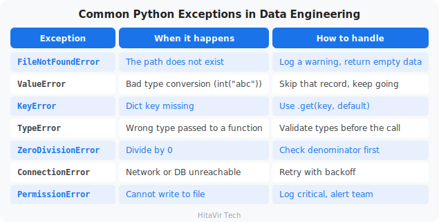

#### Logging Levels — When to Use Each

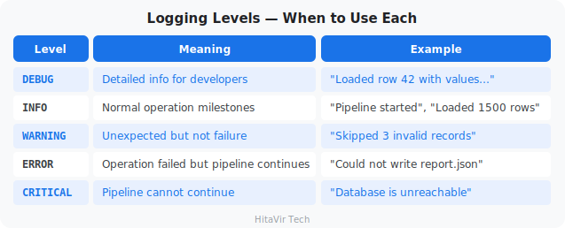

> **HitaVir Tech says:** "In production, errors WILL happen. The question is not if, but when. Good error handling means your pipeline fails gracefully, logs the problem, and makes debugging easy."

### Assignment 6 — Bullet-Proof CSV Reader

**Goal:** Build one reusable function that can read any CSV without ever crashing the parent program.

**The scenario:** Your team's pipelines keep dying because of bad input files. Build a single `safe_read_csv()` they can all import.

**Tasks:**

1. Create `assignment_06_errors.py`.
2. Set up `logging` to write to **both** `errors.log` AND the console, level `INFO`, with a timestamp format.
3. Write `safe_read_csv(filepath)` that:
   - Returns `[]` if the file does not exist (log a `WARNING`)
   - Returns `[]` if the file is unreadable for any other reason (log `CRITICAL`)
   - Otherwise reads with `csv.DictReader`, skips rows that fail `int(row["quantity"])` or `float(row["price"])`, and logs each skip as a `WARNING` with the row number and reason
   - Returns the list of valid rows
4. Test by calling `safe_read_csv()` three times:
   - With `"missing_file.csv"` -> should log a warning, return `[]`
   - With `"sales_raw.csv"` -> should log skipped rows, return cleaned list
   - With a temp file you create yourself containing 1 good row and 1 row with `price="abc"` -> should keep 1, skip 1

**Sample log output:**

```text
2026-04-30 09:00:01 [WARNING] File not found: missing_file.csv
2026-04-30 09:00:02 [INFO]    Loading sales_raw.csv
2026-04-30 09:00:02 [WARNING] Row 7 skipped: invalid quantity '0'
2026-04-30 09:00:02 [WARNING] Row 10 skipped: invalid price '-999.99'
2026-04-30 09:00:02 [INFO]    Loaded 8 valid rows from sales_raw.csv
```

**Success criteria:**

- [ ] Uses `try` / `except` with **specific** exception types (no bare `except:`)
- [ ] Uses `logging`, never `print` for status
- [ ] Function never raises an unhandled exception under any input
- [ ] Both file and console show the same log lines
- [ ] `errors.log` exists and is human-readable

**Stretch goal:** Add the `@retry(max_attempts=3)` decorator from the codelab and apply it to `safe_read_csv` so flaky network-mounted files get retried automatically.

### What You Have Learnt on This Page

By the end of this page you should be able to confidently:

- Catch errors with **`try` / `except`** using **specific** exception classes
- Distinguish `ValueError`, `KeyError`, `FileNotFoundError`, `TypeError`, etc.
- Use **`else`** and **`finally`** clauses correctly
- Configure the **`logging`** module with levels (DEBUG / INFO / WARNING / ERROR / CRITICAL)
- Write logs to **both file and console** simultaneously
- Replace every `print()` in production code with `logger.info()` / `logger.error()`

### PEP 8 — Style Rules to Apply Strictly to Errors and Logging

Silent failures destroy data pipelines. Apply these rules every single time you handle an exception:

- **Never** write a bare `except:` — it swallows `KeyboardInterrupt` and hides bugs
- Catch the **most specific** exception you can: `except ValueError:` not `except Exception:`
- Re-raise with `raise` (no argument) to preserve the traceback
- Use **`logging`**, not `print`, for anything resembling status
- Configure `logger = logging.getLogger(__name__)` at the **top of every module**
- Log **WHY** not just WHAT: `logger.warning("Skipped row %d: invalid price %s", i, val)`
- Add docstrings that mention **`Raises:`** for any exception your function intentionally throws

> **Inspiration for the road ahead:**
>
> *"Errors should never pass silently. Unless explicitly silenced."*
> — Tim Peters, *The Zen of Python*

## Working with pandas
Duration: 15:00

**What is pandas?**

pandas is the most-used Python library for working with **tabular data** (rows and columns). Think of it as Excel inside Python — but able to handle millions of rows, perform complex transformations, and integrate with every data tool.

**What is a DataFrame?**

A **DataFrame** is the central pandas object — a table with rows, columns, and an index. Every column has a name and a data type. It is what you get when you load a CSV via `pd.read_csv(...)`.

**Why DE engineers love pandas**

One library handles: loading CSVs/Excel/JSON, cleaning nulls, filtering rows, joining tables, grouping/aggregating, and writing the result back out.

We will learn pandas the same way a real data engineer works — **one step at a time**. Every data job follows the same six steps, and we give each step its own tiny file so you can run it, read the output, and understand it before moving on.

### The pandas Workflow — Six Small Steps

```
   Part 1        Part 2        Part 3        Part 4         Part 5         Part 6
   LOAD     ->   EXPLORE  ->   CLEAN    ->   TRANSFORM ->   AGGREGATE  ->  SAVE
   read_csv      describe()    dropna()      new columns    groupby()      to_csv()
   the CSV       isnull()      filter rows   price * qty    sum/mean       write file
```

> **How to read this section:** type each small file, run it, and look at what prints. Do not rush to the next part until the current one makes sense. Every part stands on its own and can be run by itself.

### Part 1 — Load a CSV into a DataFrame

**The one-line idea:** `pd.read_csv("file.csv")` reads a CSV file from disk and hands you back a **DataFrame** — a table you can work with in Python.

Once you have a DataFrame, four tiny tools tell you what you are holding:

- `df.shape` — how big is it? Returns `(rows, columns)`
- `df.columns` — what are the column names?
- `df.dtypes` — what type is each column (text, integer, float)?
- `df.head()` — show me the first 5 rows

**`pandas_01_load.py`**

```python
# ============================================
# HitaVir Tech - Part 1: Load a CSV
# ============================================
import pandas as pd

# Read the CSV file into a DataFrame (a table).
df = pd.read_csv("sales_raw.csv")

# How big is the table? .shape returns (rows, columns).
rows, columns = df.shape
print(f"The table has {rows} rows and {columns} columns")

# What are the column names?
print(f"Columns: {list(df.columns)}")

# What type is each column? (object = text, int64 = whole, float64 = decimal)
print("\nColumn types:")
print(df.dtypes)

# Show the first 5 rows so we can eyeball the data.
print("\nFirst 5 rows:")
print(df.head())
```

Run it:

```bash
python pandas_01_load.py
```

> **Try it yourself:** swap `df.head()` for `df.tail(3)` to see the **last** 3 rows. `head` and `tail` are the first things every data engineer runs on a new file.

### Part 2 — Explore Your Data

Before you change a single value, you **look** at the data. This is called *profiling*. Three methods answer the questions you always ask first:

- `df.describe()` — min, max, mean, and count for every **numeric** column
- `df.isnull().sum()` — how many **missing** values are in each column?
- `df["col"].nunique()` — how many **distinct** values does a column have?

**`pandas_02_explore.py`**

```python
# ============================================
# HitaVir Tech - Part 2: Explore the Data
# ============================================
import pandas as pd

df = pd.read_csv("sales_raw.csv")

# describe() summarises every numeric column at once.
print("Numeric summary (min, max, mean, ...):")
print(df.describe())

# isnull() marks each cell True if it is empty; .sum() counts the Trues.
print("\nMissing values per column:")
print(df.isnull().sum())

# nunique() counts how many DIFFERENT values a column holds.
print(f"\nDistinct products: {df['product'].nunique()}")
print(f"Distinct regions:  {df['region'].nunique()}")

# min() and max() on a date column give you the date range.
print(f"Dates from {df['date'].min()} to {df['date'].max()}")
```

Run it:

```bash
python pandas_02_explore.py
```

> **Why this matters:** the `isnull().sum()` line is how you discover dirty data. If `customer` shows 2 missing values, you now know Part 3 has work to do.

### Part 3 — Clean Messy Data

Real data always has problems: blank cells, zero prices, negative quantities. Cleaning means **removing the rows you cannot trust**. Two tools do almost all of it:

- `df.dropna(subset=[...])` — drop rows that are **empty** in the listed columns
- **Boolean indexing** — `df[df["price"] > 0]` keeps only the rows where the condition is `True`

**Mental model — boolean indexing keeps the True rows:**

```
   df["quantity"] > 0   ->   [ True, True, False, True ]
                                 |     |     |      |
   df[ ...the mask... ]   keeps row1, row2,  drop,  row4
```

**`pandas_03_clean.py`**

```python
# ============================================
# HitaVir Tech - Part 3: Clean the Data
# ============================================
import pandas as pd

df = pd.read_csv("sales_raw.csv")
print(f"Started with {len(df)} rows")

# 1. Drop rows missing a customer OR a product (we cannot use those).
df = df.dropna(subset=["customer", "product"])
print(f"After dropping empty rows: {len(df)} rows")

# 2. Keep only sensible numbers: quantity and price must be positive.
df = df[df["quantity"] > 0]
df = df[df["price"] > 0]
print(f"After removing invalid numbers: {len(df)} rows")

# 3. .copy() makes df our own clean table (avoids a pandas warning later).
df = df.copy()
print("\nClean data is ready for the next step.")
```

Run it:

```bash
python pandas_03_clean.py
```

> **Why `.copy()`?** After filtering, pandas is unsure whether `df` is the original table or a slice of it. Calling `.copy()` says "this is now its own table" and silences the famous `SettingWithCopyWarning`.

### Part 4 — Transform: Add New Columns

Transforming means **building new columns** from the ones you already have. The most common transform is arithmetic across two columns, and the second most common is turning a number into a category.

- `df["total"] = df["price"] * df["quantity"]` — pandas multiplies **row by row** automatically
- `df["col"].apply(some_function)` — run your own function on every value in a column

**`pandas_04_transform.py`**

```python
# ============================================
# HitaVir Tech - Part 4: Add New Columns
# ============================================
import pandas as pd


def price_band(price):
    """Turn a price into a simple category label."""
    if price >= 200:
        return "Premium"
    if price >= 50:
        return "Mid"
    return "Budget"


# Steps from Parts 1-3, condensed into 4 lines.
df = pd.read_csv("sales_raw.csv")
df = df.dropna(subset=["customer", "product"])
df = df[(df["quantity"] > 0) & (df["price"] > 0)]
df = df.copy()

# New column 1: total = price * quantity, rounded to 2 decimals.
df["total"] = (df["price"] * df["quantity"]).round(2)

# New column 2: a category label, built by our price_band() function.
df["price_band"] = df["price"].apply(price_band)

# Show just the columns we care about.
print(df[["order_id", "product", "price", "quantity", "total", "price_band"]])
```

Run it:

```bash
python pandas_04_transform.py
```

> **Note on style:** we used a named function `price_band()` instead of a long inline `lambda`. PEP 8 prefers a real `def` whenever the logic has more than one branch — it is easier to read and to test.

### Part 5 — Aggregate with `groupby`

Aggregation answers **"what is the total/average per group?"** — revenue per region, orders per product. If you know SQL, `groupby` is exactly `GROUP BY`.

- `df.groupby("region")["total"].sum()` — one number per region
- `df.groupby("region")["total"].agg(["sum", "count", "mean"])` — several numbers at once

**`pandas_05_aggregate.py`**

```python
# ============================================
# HitaVir Tech - Part 5: Group and Summarise
# ============================================
import pandas as pd

# Steps from Parts 1-4, condensed.
df = pd.read_csv("sales_raw.csv")
df = df.dropna(subset=["customer", "product"])
df = df[(df["quantity"] > 0) & (df["price"] > 0)].copy()
df["total"] = (df["price"] * df["quantity"]).round(2)

# Revenue, order count, and average order value PER region.
by_region = df.groupby("region")["total"].agg(["sum", "count", "mean"]).round(2)
by_region.columns = ["revenue", "orders", "avg_order"]
print("Revenue by region:")
print(by_region)

# Total revenue PER product, biggest first.
by_product = df.groupby("product")["total"].sum().sort_values(ascending=False)
print("\nRevenue by product (highest first):")
print(by_product)
```

Run it:

```bash
python pandas_05_aggregate.py
```

> **Try it yourself:** change `.agg(["sum", "count", "mean"])` to add `"max"`. You will get a fourth column showing each region's biggest single order.

### Part 6 — Save Your Results

The last step writes your work back to disk so others can use it. `df.to_csv("file.csv")` does it.

- Use `index=False` for a normal cleaned table (you do not want pandas' row numbers in the file)
- Keep the index for a `groupby` result (the group label — like `region` — lives in the index)

**`pandas_06_save.py`**

```python
# ============================================
# HitaVir Tech - Part 6: Save the Output
# ============================================
import pandas as pd

# Steps from Parts 1-5, condensed.
df = pd.read_csv("sales_raw.csv")
df = df.dropna(subset=["customer", "product"])
df = df[(df["quantity"] > 0) & (df["price"] > 0)].copy()
df["total"] = (df["price"] * df["quantity"]).round(2)
by_region = df.groupby("region")["total"].sum().round(2)

# Save the cleaned rows. index=False drops pandas' row numbers.
df.to_csv("sales_pandas_cleaned.csv", index=False)
print("Saved: sales_pandas_cleaned.csv")

# Save the summary. Keep the index here — it holds the region names.
by_region.to_csv("region_report.csv")
print("Saved: region_report.csv")

# A few headline numbers for the console.
print(f"\nTotal revenue:       ${df['total'].sum():,.2f}")
print(f"Average order value: ${df['total'].mean():,.2f}")
```

Run it:

```bash
python pandas_06_save.py
```

> **You just built a full pipeline.** Parts 1-6 are exactly Extract (load) → Transform (clean, build columns, aggregate) → Load (save). Every pandas job you ever write is a longer version of these six steps.

### pandas Cheat Sheet — The 15 Methods You'll Use Daily

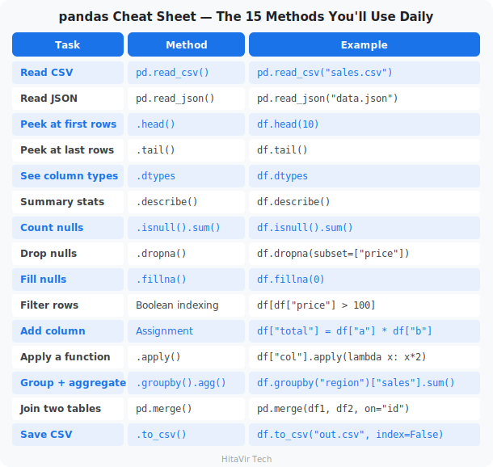

> **HitaVir Tech says:** "pandas is to data engineers what a stethoscope is to doctors — you cannot work without it. Learn `read_csv`, `groupby`, `merge`, and `apply`, and you can handle 90% of data tasks."

### Assignment 7 — Daily Sales Report with pandas

**Goal:** Practice the entire pandas workflow — read, clean, transform, group, save — on the sales dataset.

**The scenario:** The COO wants a daily sales report broken down by date AND region, with one row per (date, region) and revenue ranked.

**Tasks:**

1. Create `assignment_07_pandas.py`.
2. Read `sales_raw.csv` into a DataFrame `df`.
3. Print `df.shape`, `df.dtypes`, and `df.isnull().sum()`.
4. Drop rows where `customer` or `product` is null.
5. Keep only rows where `quantity > 0` and `price > 0`.
6. Add columns:
   - `total = price * quantity` (rounded to 2 decimals)
   - `is_premium = price > 200` (boolean)
7. Group by `["date", "region"]` and aggregate `total` with `sum`, `count`, and `mean`. Round to 2 decimals.
8. Sort the result by `total sum` descending.
9. Save to `daily_region_report.csv`.
10. Print the **top 3 (date, region) pairs** by revenue.

**Sample output (top section):**

```text
DataFrame shape: (10, 7)

Top 3 by revenue:
  2026-04-02 | West  | $1,999.98 | 1 order  | avg $1,999.98
  2026-04-01 | North | $1,159.97 | 2 orders | avg   $539.99
  2026-04-03 | West  |   $449.99 | 1 order  | avg   $449.99
```

**Success criteria:**

- [ ] Uses `read_csv`, `dropna`, boolean indexing, `assign` or column-add, `groupby` with `agg`, and `to_csv`
- [ ] Output CSV has multi-column groupby (date + region)
- [ ] Top-3 print uses formatted strings with thousands separator
- [ ] No `SettingWithCopyWarning` in the output (use `df = df.copy()` after filtering)

**Stretch goal:** Add a `pivot_table` showing regions as rows and dates as columns, with `total` as the cell values. Save it as `pivot_report.csv`.

### What You Have Learnt on This Page

By the end of this page you should be able to confidently:

- Create a **DataFrame** from a CSV with `pd.read_csv`
- Inspect data with `head()`, `tail()`, `info()`, `describe()`, `shape`, `dtypes`
- Clean missing data with `dropna`, `fillna`, and boolean indexing
- Add and transform columns with `df["new"] = ...` or `df.assign(...)`
- **Aggregate** with `groupby(...).agg(...)` for sums, means, counts
- Sort with `sort_values(...)`, slice top-N with `.head(N)`, write with `to_csv`

### PEP 8 — Style Rules to Apply Strictly to pandas Code

pandas one-liners look elegant in tutorials and unreadable in production. Apply these rules every single time you write a DataFrame chain:

- **Break long chains** across multiple lines using `(` `)` parentheses for line continuation
- Each method on its **own line**, indented one level
- Always **`df = df.copy()`** after a filter to avoid `SettingWithCopyWarning`
- Use **double quotes** for column names: `df["price"]`, never `df['price']` mixing
- Prefer **`.assign()`** for adding columns in a chain (no inplace mutation)
- Never set `inplace=True` — always reassign: `df = df.dropna()`
- Constants at top: `INPUT_FILE = "sales.csv"`, `MIN_PRICE = 0`

> **Inspiration for the road ahead:**
>
> *"Without data, you're just another person with an opinion."*
> — W. Edwards Deming

## Data Engineering Mini Project — Complete ETL Pipeline
Duration: 20:00

**What is ETL?**

ETL stands for **Extract, Transform, Load** — the three universal stages of every data pipeline.
1. **Extract** — pull raw data from a source (file, database, API)
2. **Transform** — clean, validate, enrich, reshape it
3. **Load** — save the result to a destination (file, warehouse, dashboard)

### The ETL Pipeline You Are About to Build

```
                              HitaVir Tech Sales ETL
                              ----------------------

  +---------------+      +---------------+      +-------------------+
  |    EXTRACT    |      |   TRANSFORM   |      |       LOAD        |
  |               |      |               |      |                   |
  | sales_raw.csv | ---> |  validate     | ---> |  sales_cleaned.csv|
  |               |      |  type-cast    |      |  rejected.csv     |
  | input/        |      |  enrich       |      |  daily_report.json|
  +---------------+      |  categorize   |      +-------------------+
                         +---------------+               |
                                |                        v
                                v                +-------------------+
                         +---------------+       |    pipeline.log   |
                         | rejected.csv  |       |  (every step is   |
                         | (bad records) |       |   logged here)    |
                         +---------------+       +-------------------+

  Every arrow above is one Python function. Every function is logged.
  If a record fails validation, it goes to rejected.csv with the reason.
```

Time to build a **real, production-quality ETL pipeline** that combines everything you have learned: variables, control flow, functions, data structures, file I/O, error handling, and logging.

### The Scenario

HitaVir Tech receives daily sales CSV files. You need to build an automated pipeline that:

1. Reads the raw CSV
2. Validates every record against business rules
3. Cleans and transforms the data
4. Generates summary reports
5. Saves outputs with proper logging

```bash
mkdir -p pipeline_project/input pipeline_project/output pipeline_project/logs
```

### The Pipeline Code

**`pipeline_project/etl_pipeline.py`**

```python
"""
HitaVir Tech - Sales Data ETL Pipeline
=======================================
A production-quality ETL pipeline that processes daily sales data.

Usage:
    python etl_pipeline.py

Author: HitaVir Tech
Version: 1.0.0
"""

import csv
import json
import logging
import os
from datetime import datetime
from collections import defaultdict

# ============================================================
# CONFIGURATION
# All "knobs" of the pipeline live here, not buried in code
# ============================================================

CONFIG = {
    "input_file": "input/sales_raw.csv",
    "output_file": "output/sales_cleaned.csv",
    "report_file": "output/daily_report.json",
    "rejected_file": "output/rejected_records.csv",
    "log_file": "logs/pipeline.log",
    "rules": {
        "required_fields": ["order_id", "customer", "product", "quantity", "price"],
        "min_quantity": 1,
        "min_price": 0.01,
        "max_price": 100000,
        "valid_regions": ["North", "South", "East", "West"]
    }
}

# ============================================================
# LOGGING SETUP
# ============================================================

def setup_logging(log_file):
    """Configure logging to write to BOTH a file and the console."""
    os.makedirs(os.path.dirname(log_file), exist_ok=True)

    logging.basicConfig(
        level=logging.INFO,
        format="%(asctime)s [%(levelname)-8s] %(message)s",
        datefmt="%Y-%m-%d %H:%M:%S",
        handlers=[
            logging.FileHandler(log_file),
            logging.StreamHandler()
        ]
    )
    return logging.getLogger("HitaVirETL")

# ============================================================
# EXTRACT
# ============================================================

def extract(filepath, logger):
    """
    Extract: Read raw CSV data from source file.

    Returns:
        list[dict]: List of records, or empty list on failure.
    """
    logger.info(f"[EXTRACT] Reading from {filepath}")

    if not os.path.exists(filepath):
        logger.error(f"[EXTRACT] File not found: {filepath}")
        return []

    try:
        with open(filepath, "r", encoding="utf-8") as f:
            reader = csv.DictReader(f)
            records = list(reader)

        logger.info(f"[EXTRACT] Loaded {len(records)} records with columns: {reader.fieldnames}")
        return records
    except Exception as e:
        logger.critical(f"[EXTRACT] Failed to read file: {e}")
        return []

# ============================================================
# VALIDATE
# ============================================================

def validate_record(record, rules):
    """
    Validate a single record against business rules.

    Returns:
        tuple: (is_valid: bool, errors: list[str])
    """
    errors = []

    # Check required fields are present and non-empty
    for field in rules["required_fields"]:
        if not record.get(field, "").strip():
            errors.append(f"Missing required field: {field}")

    # Validate quantity
    try:
        qty = int(record.get("quantity", 0))
        if qty < rules["min_quantity"]:
            errors.append(f"Quantity {qty} below minimum {rules['min_quantity']}")
    except ValueError:
        errors.append(f"Invalid quantity: {record.get('quantity')}")

    # Validate price
    try:
        price = float(record.get("price", 0))
        if price < rules["min_price"]:
            errors.append(f"Price {price} below minimum {rules['min_price']}")
        if price > rules["max_price"]:
            errors.append(f"Price {price} above maximum {rules['max_price']}")
    except ValueError:
        errors.append(f"Invalid price: {record.get('price')}")

    # Validate region (if provided)
    region = record.get("region", "").strip()
    if region and region not in rules["valid_regions"]:
        errors.append(f"Invalid region: {region}")

    return len(errors) == 0, errors

# ============================================================
# TRANSFORM
# ============================================================

def transform(records, rules, logger):
    """
    Transform: Clean, validate, and enrich records.

    Returns:
        tuple: (cleaned_records, rejected_records)
    """
    logger.info(f"[TRANSFORM] Processing {len(records)} records")

    cleaned = []
    rejected = []

    for record in records:
        is_valid, errors = validate_record(record, rules)

        if not is_valid:
            record["rejection_reasons"] = "; ".join(errors)
            rejected.append(record)
            logger.warning(f"[TRANSFORM] Rejected order {record.get('order_id', '?')}: {errors}")
            continue

        # Type conversion (CSV strings → numbers)
        record["quantity"] = int(record["quantity"])
        record["price"] = float(record["price"])

        # Enrichment — add computed fields
        record["total"] = round(record["price"] * record["quantity"], 2)
        record["customer"] = record["customer"].strip().title()
        record["product"] = record["product"].strip().title()

        # Categorization
        if record["total"] >= 1000:
            record["tier"] = "Enterprise"
        elif record["total"] >= 200:
            record["tier"] = "Business"
        else:
            record["tier"] = "Consumer"

        cleaned.append(record)

    logger.info(f"[TRANSFORM] Result: {len(cleaned)} valid, {len(rejected)} rejected")
    return cleaned, rejected

# ============================================================
# LOAD
# ============================================================

def load(cleaned, rejected, config, logger):
    """
    Load: Save cleaned data and rejected records to files.
    """
    os.makedirs("output", exist_ok=True)

    # Save cleaned records
    if cleaned:
        fieldnames = ["order_id", "customer", "product", "quantity",
                       "price", "total", "tier", "date", "region"]
        with open(config["output_file"], "w", newline="", encoding="utf-8") as f:
            writer = csv.DictWriter(f, fieldnames=fieldnames, extrasaction="ignore")
            writer.writeheader()
            writer.writerows(cleaned)
        logger.info(f"[LOAD] Saved {len(cleaned)} cleaned records to {config['output_file']}")

    # Save rejected records (always useful for debugging)
    if rejected:
        fieldnames = ["order_id", "customer", "product", "quantity",
                       "price", "date", "region", "rejection_reasons"]
        with open(config["rejected_file"], "w", newline="", encoding="utf-8") as f:
            writer = csv.DictWriter(f, fieldnames=fieldnames, extrasaction="ignore")
            writer.writeheader()
            writer.writerows(rejected)
        logger.info(f"[LOAD] Saved {len(rejected)} rejected records to {config['rejected_file']}")

# ============================================================
# REPORT
# ============================================================

def generate_report(cleaned, rejected, duration, config, logger):
    """Generate a JSON pipeline run report."""
    total_input = len(cleaned) + len(rejected)
    success_rate = (len(cleaned) / total_input * 100) if total_input > 0 else 0

    # Aggregate metrics
    revenue_by_region = defaultdict(float)
    revenue_by_product = defaultdict(float)
    tier_counts = defaultdict(int)

    for record in cleaned:
        revenue_by_region[record["region"]] += record["total"]
        revenue_by_product[record["product"]] += record["total"]
        tier_counts[record["tier"]] += 1

    report = {
        "pipeline": "HitaVir Tech Sales ETL",
        "run_timestamp": datetime.now().strftime("%Y-%m-%d %H:%M:%S"),
        "duration_seconds": round(duration, 2),
        "summary": {
            "total_input": total_input,
            "cleaned": len(cleaned),
            "rejected": len(rejected),
            "success_rate": round(success_rate, 1)
        },
        "revenue": {
            "total": round(sum(r["total"] for r in cleaned), 2),
            "by_region": dict(sorted(revenue_by_region.items())),
            "by_product": dict(sorted(revenue_by_product.items(),
                                       key=lambda x: x[1], reverse=True))
        },
        "tier_distribution": dict(tier_counts)
    }

    with open(config["report_file"], "w") as f:
        json.dump(report, f, indent=2)
    logger.info(f"[REPORT] Saved to {config['report_file']}")

    return report

# ============================================================
# MAIN — ORCHESTRATOR
# Calls every step in the right order
# ============================================================

def run_pipeline():
    """Main pipeline orchestrator."""
    logger = setup_logging(CONFIG["log_file"])

    logger.info("=" * 60)
    logger.info("HitaVir Tech Sales ETL Pipeline — Starting")
    logger.info("=" * 60)

    start_time = datetime.now()

    # EXTRACT
    raw_data = extract(CONFIG["input_file"], logger)
    if not raw_data:
        logger.error("No data extracted. Pipeline aborted.")
        return

    # TRANSFORM
    cleaned, rejected = transform(raw_data, CONFIG["rules"], logger)

    # LOAD
    load(cleaned, rejected, CONFIG, logger)

    # REPORT
    end_time = datetime.now()
    duration = (end_time - start_time).total_seconds()
    report = generate_report(cleaned, rejected, duration, CONFIG, logger)

    # SUMMARY
    logger.info("=" * 60)
    logger.info("PIPELINE COMPLETE")
    logger.info(f"  Input: {report['summary']['total_input']} records")
    logger.info(f"  Cleaned: {report['summary']['cleaned']} records")
    logger.info(f"  Rejected: {report['summary']['rejected']} records")
    logger.info(f"  Success rate: {report['summary']['success_rate']}%")
    logger.info(f"  Total revenue: ${report['revenue']['total']:,.2f}")
    logger.info(f"  Duration: {duration:.2f}s")
    logger.info("=" * 60)


if __name__ == "__main__":
    run_pipeline()
```

**What is the if-name-main idiom?**

`if __name__ == "__main__":` is a standard Python idiom that means: "Only run `run_pipeline()` if this file is executed directly (`python etl_pipeline.py`), NOT if it is imported by another file." It is how you make a Python file work both as a script and as a reusable module.

### Copy Sample Data and Run

```bash
cp sales_raw.csv pipeline_project/input/
cd pipeline_project
python etl_pipeline.py
```

### Verify Outputs

```bash
echo "--- Cleaned Data ---"
cat output/sales_cleaned.csv

echo -e "\n--- Rejected Records ---"
cat output/rejected_records.csv

echo -e "\n--- Pipeline Report ---"
cat output/daily_report.json

echo -e "\n--- Pipeline Log ---"
cat logs/pipeline.log
```

### Project Structure

```
pipeline_project/
├── etl_pipeline.py          ← Main pipeline script
├── input/
│   └── sales_raw.csv        ← Raw input data
├── output/
│   ├── sales_cleaned.csv    ← Cleaned output
│   ├── rejected_records.csv ← Failed records (for debugging)
│   └── daily_report.json    ← Summary report
└── logs/
    └── pipeline.log         ← Execution log
```

> **HitaVir Tech says:** "This is a real ETL pipeline. It extracts, validates, transforms, loads, reports, and logs. This exact pattern scales from 10 records to 10 million. Add PySpark and you are ready for Big Data."

### Assignment 8 — Extend the ETL Pipeline (capstone)

**Goal:** Modify the production pipeline you just built to add new business rules, a new tier, and richer reporting.

**The scenario:** Sales leadership added three asks: catch typo orders, identify "whale" customers, and surface the top buyers in the daily report.

**Tasks:**

1. Open `pipeline_project/etl_pipeline.py` in VS Code.
2. **New validation rule.** In `validate_record`, add a check: if `quantity > 1000`, reject with reason `"quantity too large (likely typo)"`. Add a new key to `CONFIG["rules"]` for this maximum (`"max_quantity": 1000`).
3. **New tier.** In `transform`, add a "Whale" tier above "Enterprise":
   - `total >= 5000` -> `"Whale"`
   - `total >= 1000` -> `"Enterprise"`
   - `total >= 200`  -> `"Business"`
   - else            -> `"Consumer"`
4. **Richer report.** In `generate_report`, add a `top_customers` section: top 5 customers by total spend, formatted as `[{"customer": "Alice Johnson", "spend": 1999.98}, ...]`.
5. Edit `pipeline_project/input/sales_raw.csv` and add 2 test rows:
   - One row with `quantity=2000` (should be rejected)
   - One row with `total >= 5000` (should land in the new Whale tier)
6. Run `python etl_pipeline.py` and verify:
   - `output/rejected_records.csv` contains your typo row
   - `output/sales_cleaned.csv` shows a `"Whale"` in the `tier` column
   - `output/daily_report.json` includes `top_customers`

**Success criteria:**

- [ ] New rule reads its limit from `CONFIG["rules"]["max_quantity"]` (no magic numbers)
- [ ] Whale tier appears in cleaned CSV
- [ ] `top_customers` section in JSON has up to 5 entries, sorted descending
- [ ] Pipeline log shows the typo rejection and the Whale assignment
- [ ] All existing tests still pass — no regression on the current good records

**Stretch goal:** Add command-line arguments using `argparse` so the pipeline can be run with `python etl_pipeline.py --input path/to/file.csv --top-n 10`.

```bash
cd ~/python-de-learning
```

### What You Have Learnt on This Page

By the end of this page you should be able to confidently:

- Build a complete **Extract → Transform → Load** pipeline from scratch
- Structure a project with `input/`, `output/`, `logs/` folders
- Drive behaviour from a **CONFIG dict** — no magic numbers in code
- Validate every record at the boundary, log rejections with reasons
- Write both **`cleaned.csv`** and a JSON **summary report**
- Make the pipeline **idempotent** — running twice produces identical output

### PEP 8 — Style Rules to Apply Strictly to ETL Pipelines

Capstone code is what hiring managers read first. Apply these rules every single time you ship a pipeline:

- **Imports at top**, grouped (stdlib → third-party → local) with one blank line between groups
- Constants in **`UPPER_SNAKE_CASE`** at module top (e.g., `INPUT_PATH`, `MAX_QUANTITY`)
- One **`def`** per pipeline stage: `extract()`, `transform()`, `load()` — single responsibility
- **Docstrings** on every stage explaining args, returns, raises
- **Type hints** everywhere: `def transform(records: list[dict]) -> list[dict]:`
- An `if __name__ == "__main__":` guard at the bottom
- Run **`black .`** and **`flake8 .`** before committing — zero warnings is the bar

> **Inspiration for the road ahead:**
>
> *"First, solve the problem. Then, write the code."*
> — John Johnson

## Intermediate Concepts
Duration: 12:00

**Why these matter in DE**

Comprehensions, lambdas, and classes are the patterns that turn a Python beginner into a productive Data Engineer. They make code shorter, clearer, and reusable.

We will meet the "intermediate trifecta" — **comprehensions, lambdas, and classes** — one at a time, in its own small file. Each one is just a shorter, clearer way to do something you already know how to do with a loop or a `def`.

### The Six Intermediate Skills

```
   Part 1            Part 2              Part 3      Part 4              Part 5     Part 6
   LIST          ->  DICT / SET      ->  LAMBDA  ->  sorted/map/    ->   CLASSES ->  APIs
   comprehension     comprehension       one-line    filter             (OOP)       requests
   [x for x in ..]   {k: v for ..}       function     + lambda           blueprint   .get()
```

### Part 1 — List Comprehensions

**The one-line idea:** a list comprehension builds a new list from an existing one **in a single line**. It replaces the three-line "create empty list, loop, append" pattern.

**The shape:** `[expression for item in iterable if condition]`

**Mental model — read it right-to-left, like a sentence:**

```
   [ p          for p in prices      if p > 100 ]
     |              |                     |
   keep this    for each price       but only when
   value        in the list          it is over 100
```

**`int_01_list_comprehension.py`**

```python
# ============================================
# HitaVir Tech - Part 1: List Comprehensions
# ============================================

prices = [999.99, 29.99, 79.99, 449.99, 149.99]

# --- 1A. The old way: empty list, loop, append (3 lines) ---
high_value = []
for price in prices:
    if price > 100:
        high_value.append(price)
print(f"Loop result:          {high_value}")

# --- 1B. The comprehension way: same result, one line ---
high_value_lc = [price for price in prices if price > 100]
print(f"Comprehension result: {high_value_lc}")

# --- 1C. Transform AND filter together ---
# Give a 10% discount, but only on items over 100.
discounted = [round(price * 0.9, 2) for price in prices if price > 100]
print(f"Discounted premiums:  {discounted}")

# --- 1D. A plain transform (no filter) ---
with_tax = [round(price * 1.18, 2) for price in prices]
print(f"All prices + 18% tax: {with_tax}")
```

Run it:

```bash
python int_01_list_comprehension.py
```

> **Try it yourself:** write a comprehension that builds a list of the **lengths** of these words: `["data", "engineering", "python"]`. (Hint: `[len(w) for w in words]`.)

### Part 2 — Dictionary and Set Comprehensions

The same idea works for dictionaries and sets — you just change the brackets.

- **Dict comprehension** uses `{key: value for ...}` — note the colon
- **Set comprehension** uses `{value for ...}` — no colon, and duplicates vanish

**`int_02_dict_set_comprehension.py`**

```python
# ============================================
# HitaVir Tech - Part 2: Dict & Set Comprehensions
# ============================================

products = ["Laptop", "Mouse", "Keyboard", "Monitor"]
prices = [999.99, 29.99, 79.99, 449.99]

# --- 2A. Dict comprehension: pair each product with its price ---
# zip() walks both lists together, one pair at a time.
catalog = {product: price for product, price in zip(products, prices)}
print(f"Catalog: {catalog}")

# --- 2B. Dict comprehension with a transform on the value ---
# Build a price list that already includes 18% tax.
with_tax = {product: round(price * 1.18, 2)
            for product, price in zip(products, prices)}
print(f"With tax: {with_tax}")

# --- 2C. Set comprehension: collect UNIQUE values ---
regions = ["North", "South", "North", "East", "South", "North"]
unique_regions = {region for region in regions}
print(f"Unique regions: {unique_regions}")
```

Run it:

```bash
python int_02_dict_set_comprehension.py
```

> **Why this matters in DE:** dict comprehensions are how you reshape data fast — turning two parallel columns into a lookup table, or re-scaling every value in one line.

### Part 3 — Lambda Functions

**The one-line idea:** a `lambda` is a tiny **unnamed** function you write inline, in one line. It is a shortcut for a `def` that is too small to deserve a name.

**Mental model — the same function, two ways:**

```
   def add_tax(amount):              add_tax = lambda amount: amount * 1.18
       return amount * 1.18
   |---------- a named def ------|   |--------- the lambda twin ---------|
```

**`int_03_lambda.py`**

```python
# ============================================
# HitaVir Tech - Part 3: Lambda Functions
# ============================================

# --- 3A. A normal named function ---
def calculate_tax(amount):
    """Add 18% tax to an amount."""
    return round(amount * 1.18, 2)


# --- 3B. The lambda equivalent (inline, no name needed) ---
# Read it as: "given amount, give back amount rounded with 18% tax".
add_tax = lambda amount: round(amount * 1.18, 2)

print(f"Named function: {calculate_tax(100)}")
print(f"Lambda:         {add_tax(100)}")
```

Run it:

```bash
python int_03_lambda.py
```

> **HitaVir Tech says:** "Use a `lambda` only for a one-line throwaway. The moment it needs a second line or an `if/else`, give it a real `def` and a clear name — your teammates will thank you. (This is also a PEP 8 rule.)"

> **Note:** assigning a lambda to a name like `add_tax` above is shown only to compare it with the `def`. In real code, the right place for a lambda is **inside another function call** — which is exactly what Part 4 shows.

### Part 4 — `sorted`, `map`, and `filter` with Lambda

This is where lambdas earn their keep. Functions like `sorted`, `map`, and `filter` take **another function** as an argument, and a lambda is the perfect tiny function to hand them.

- `sorted(data, key=lambda x: ...)` — sort by whatever the lambda returns
- `filter(lambda x: ..., data)` — keep only items where the lambda is `True`
- `map(lambda x: ..., data)` — transform every item

**`int_04_sort_map_filter.py`**

```python
# ============================================
# HitaVir Tech - Part 4: sorted / map / filter
# ============================================

sales = [
    {"product": "Laptop", "revenue": 4999.95},
    {"product": "Mouse", "revenue": 149.95},
    {"product": "Monitor", "revenue": 449.99},
]

# --- 4A. sorted() with a lambda key: sort by revenue, biggest first ---
ranked = sorted(sales, key=lambda sale: sale["revenue"], reverse=True)
print("Sales ranked by revenue:")
for sale in ranked:
    print(f"  {sale['product']}: ${sale['revenue']:,.2f}")

# --- 4B. filter() then map(), step by step (clear for beginners) ---
amounts = [100, 250, 50, 800, 30, 1200]

# Step 1: keep only amounts above 200.
big = filter(lambda x: x > 200, amounts)

# Step 2: add 18% tax to each survivor.
big_with_tax = map(lambda x: round(x * 1.18, 2), big)

# filter() and map() are lazy — list() makes them produce values.
print(f"\nBig amounts + 18% tax: {list(big_with_tax)}")
```

Run it:

```bash
python int_04_sort_map_filter.py
```

> **Try it yourself:** sort `sales` by **product name** instead of revenue. (Hint: `key=lambda sale: sale["product"]`, and drop `reverse=True`.)

### Part 5 — Classes (Object-Oriented Programming Basics)

**The one-line idea:** a **class** is a blueprint that bundles **data** (attributes) and **behaviour** (methods) together. An **object** is one real thing built from that blueprint.

Real-life analogy: `"Car"` is the class (the design). *Your* specific car in the driveway is an object built from it.

Three words to learn:

- `__init__` — the **constructor**; it runs automatically when you create an object and sets up its starting data
- `self` — means "**this particular object**"; every method takes it as the first parameter
- **method** — a function that lives inside a class

**`int_05_classes.py`**

```python
# ============================================
# HitaVir Tech - Part 5: Classes (Basic OOP)
# ============================================


class DataPipeline:
    """A small, reusable data pipeline."""

    def __init__(self, name, source, destination):
        # __init__ runs when you create the object. self = this object.
        self.name = name
        self.source = source
        self.destination = destination
        self.records = []
        self.status = "initialized"

    def extract(self):
        """Pretend to pull records from the source."""
        self.status = "extracting"
        self.records = [{"id": 1, "value": 100}, {"id": 2, "value": 200}]
        print(f"  [{self.name}] Extracted {len(self.records)} records")
        return self  # returning self lets us chain .extract().transform()...

    def transform(self, multiplier=1.0):
        """Multiply every record's value."""
        self.status = "transforming"
        for record in self.records:
            record["value"] = record["value"] * multiplier
        print(f"  [{self.name}] Transformed records (x{multiplier})")
        return self

    def load(self):
        """Pretend to write records to the destination."""
        self.status = "completed"
        print(f"  [{self.name}] Loaded {len(self.records)} records")
        return self

    def __str__(self):
        # __str__ decides what print(object) shows.
        return f"Pipeline('{self.name}', status={self.status})"


# Build ONE object from the blueprint.
pipeline = DataPipeline("Sales ETL", "postgres", "s3")

# Call its methods. Because each returns self, we can chain them.
pipeline.extract().transform(multiplier=1.18).load()

print(f"Result: {pipeline}")
```

Run it:

```bash
python int_05_classes.py
```

> **Why classes matter in DE:** a class keeps a pipeline's data (`records`, `status`) and its steps (`extract`, `transform`, `load`) in one tidy package you can reuse and test. You met this exact shape in the ETL mini-project.

### Part 6 — Working with APIs

**The one-line idea:** an **API** is a URL that returns **data** (usually JSON) instead of a web page. The `requests` library calls it in one line, and you get back a Python dictionary.

**`int_06_api.py`**

```python
# ============================================
# HitaVir Tech - Part 6: Calling an API
# ============================================
import requests

# Ask GitHub's API about the official Python repository.
url = "https://api.github.com/repos/python/cpython"

try:
    response = requests.get(url, timeout=10)

    # status_code 200 means "OK, here is your data".
    if response.status_code == 200:
        data = response.json()  # turn the JSON reply into a dict
        print(f"Repo:        {data['full_name']}")
        print(f"Stars:       {data['stargazers_count']:,}")
        print(f"Language:    {data['language']}")
        print(f"Open issues: {data['open_issues_count']:,}")
    else:
        print(f"API returned status {response.status_code}")

except requests.exceptions.RequestException as error:
    # Catches no-internet, timeout, bad-URL, etc.
    print(f"API call failed: {error}")
```

Run it (install the library first if needed):

```bash
pip install requests
python int_06_api.py
```

> **Try it yourself:** change the URL to your own favourite repo, e.g. `https://api.github.com/repos/pandas-dev/pandas`, and see its star count.

> **HitaVir Tech says:** "List comprehensions, lambdas, and classes are the intermediate trifecta. Comprehensions make your code concise. Lambdas make sorting and filtering elegant. Classes make your pipelines reusable and testable. APIs connect your pipelines to the wider world."

### Assignment 9 — Refactor Assignment 4 with Pythonic Tools

**Goal:** Take the sales aggregator from Assignment 4 and rewrite it using comprehensions, lambdas, and a class — the trifecta of intermediate Python.

**The scenario:** Code review feedback says your aggregator works but is "too imperative." Refactor it.

**Tasks:**

1. Copy `assignment_04_data_structures.py` to `assignment_09_intermediate.py`.
2. Replace the manual region-grouping loop with a `defaultdict(float)` and a single `for sale in sales: by_region[sale["region"]] += sale["amount"]`. Then convert `by_region` into a regular dict using a **dict comprehension** that also rounds to 2 decimals.
3. Replace the top-customer loop with `max(...)` plus a **lambda** key.
4. Wrap everything in a class `SalesAggregator` with:
   - `__init__(self)` -> initializes empty internal dicts
   - `add_sale(self, customer, region, amount)` -> records one sale
   - `revenue_by_region(self)` -> returns the dict
   - `top_customer(self)` -> returns `(name, amount)`
   - `__str__(self)` -> returns a one-line summary
5. In `if __name__ == "__main__":`, build the aggregator from the same input list, call each method, and print the results.

**Success criteria:**

- [ ] At least one **list or dict comprehension** is used
- [ ] At least one **lambda** is used (with `sorted`, `max`, `filter`, or `map`)
- [ ] Class has `__init__`, three methods, and `__str__`
- [ ] Same numeric output as Assignment 4 (Alice = $3,800 top customer)
- [ ] Code passes `black` formatter and `flake8` with zero warnings

**Stretch goal:** Make the class iterable by adding `__iter__` so you can write `for sale in aggregator:` to walk through every recorded sale.

### What You Have Learnt on This Page

By the end of this page you should be able to confidently:

- Replace verbose loops with **list / dict / set comprehensions**
- Use **`lambda`** with `sorted`, `max`, `filter`, `map` for one-liners
- Define **classes** with `__init__`, methods, and `__str__`
- Group state and behaviour together (Object-Oriented Programming basics)
- Iterate custom objects by adding **`__iter__`**

### PEP 8 — Style Rules to Apply Strictly to Comprehensions, Lambdas, and Classes

Pythonic code is judged at this level. Apply these rules every single time:

- **Class names** → `PascalCase` (e.g., `SalesAggregator`, `ETLPipeline`)
- **Method names** → `snake_case` (e.g., `add_sale`, `revenue_by_region`)
- **One blank line** between methods, **two blank lines** between top-level classes
- **Lambdas only for trivial one-liners** — anything bigger gets a `def`
- Comprehensions only when they fit **on one readable line** — otherwise use a regular `for` loop
- **Magic methods** (`__init__`, `__str__`, `__iter__`) follow the dunder naming convention
- Private attributes use **a single leading underscore**: `self._cache`

> **Inspiration for the road ahead:**
>
> *"Beautiful is better than ugly. Readability counts."*
> — Tim Peters, *The Zen of Python*

## Best Practices and Project Structure
Duration: 6:00

How real data engineering teams organize their code.

**`best_practices.py`**

```python
"""
HitaVir Tech - Python Best Practices for Data Engineering
"""

# ====== NAMING CONVENTIONS ======
# Variables and functions: snake_case
pipeline_name = "sales_etl"
total_record_count = 1500

def calculate_success_rate(total, failed):
    return round((total - failed) / total * 100, 2)

# Classes: PascalCase
class DataPipeline:
    pass

class SalesTransformer:
    pass

# Constants: UPPER_SNAKE_CASE
MAX_RETRY_COUNT = 3
DEFAULT_BATCH_SIZE = 1000
DATABASE_TIMEOUT = 30

# ====== DOCSTRINGS ======
# A docstring describes what a function does, its arguments, and what it returns.
# Tools like VS Code, Sphinx, and your future self all read these.
def process_batch(records, batch_size=500):
    """
    Process records in batches.

    Args:
        records (list): List of dictionaries containing record data.
        batch_size (int): Number of records per batch. Defaults to 500.

    Returns:
        list: Processed records.

    Raises:
        ValueError: If records is empty.
    """
    if not records:
        raise ValueError("Records list cannot be empty")

    processed = []
    for i in range(0, len(records), batch_size):
        batch = records[i:i + batch_size]
        processed.extend(batch)
    return processed

print("Best practices loaded successfully!")
print(f"Max retries: {MAX_RETRY_COUNT}")
print(f"Default batch size: {DEFAULT_BATCH_SIZE}")
```

Run it:

```bash
python best_practices.py
```

### Professional Project Structure

```
hitavir-data-project/
├── README.md                  ← Project documentation
├── requirements.txt           ← Package dependencies
├── .gitignore                 ← Files to exclude from Git
├── setup.py                   ← Package configuration
│
├── src/                       ← Source code
│   ├── __init__.py
│   ├── extract.py             ← Extraction logic
│   ├── transform.py           ← Transformation logic
│   ├── load.py                ← Loading logic
│   ├── validate.py            ← Validation rules
│   └── utils.py               ← Utility functions
│
├── config/                    ← Configuration files
│   ├── dev.yaml
│   ├── staging.yaml
│   └── prod.yaml
│
├── tests/                     ← Test files
│   ├── test_extract.py
│   ├── test_transform.py
│   └── test_validate.py
│
├── data/                      ← Data files (gitignored)
│   ├── input/
│   └── output/
│
└── logs/                      ← Log files (gitignored)
```

### The 10 Habits of Good Data Engineers

1. **Use virtual environments** — never install libraries globally
2. **Pin dependency versions** — `pandas==2.2.1`, not just `pandas`
3. **Never hardcode secrets** — use environment variables / `.env`
4. **Always log, never `print`** in production code
5. **Validate at the boundary** — check inputs from files/APIs, trust internal calls
6. **Make pipelines idempotent** — running twice gives the same result
7. **Save rejected records** — never silently drop bad data
8. **Use type hints** — `def func(x: int) -> str:` (introduced in Python 3.5+)
9. **Write unit tests** — pytest is the standard
10. **Commit often, with clear messages** — `git commit -m "feat: add region filter"`

> **HitaVir Tech says:** "Code is read 10× more than it is written. Follow naming conventions, write docstrings, and organize your projects. Your future self and your teammates will thank you."

### What You Have Learnt on This Page

By the end of this page you should be able to confidently:

- Lay out a Data Engineering project the way real teams do (`src/`, `tests/`, `data/`, `logs/`)
- Apply naming conventions consistently (snake_case / PascalCase / UPPER_SNAKE)
- Write **docstrings** on every public function and module
- Make pipelines **idempotent** — same input, same output, every run
- Validate at the boundary; trust internal calls
- Save **rejected records**; never silently drop bad data
- Manage **secrets** through environment variables, never hardcoded

### PEP 8 — The Style Rules That Define a Professional

These are the rules every Data Engineering team enforces in code review. Apply them every single time:

- **Imports** at the top of every file, grouped (stdlib → third-party → local), one blank line between groups
- **Constants** in `UPPER_SNAKE_CASE` at module top — never magic numbers buried in code
- **No bare `except:`** — always specific exceptions, always log them
- **F-strings** over `%` and `.format()` (Python 3.6+ standard)
- **`pathlib`** over `os.path` string-joining
- **`black`** + **`flake8`** clean before every commit — zero warnings is the contract

> **Inspiration for the road ahead:**
>
> *"Make it work, make it right, make it fast."*
> — Kent Beck

## Debugging and Troubleshooting
Duration: 6:00

### Common Python Errors and Fixes

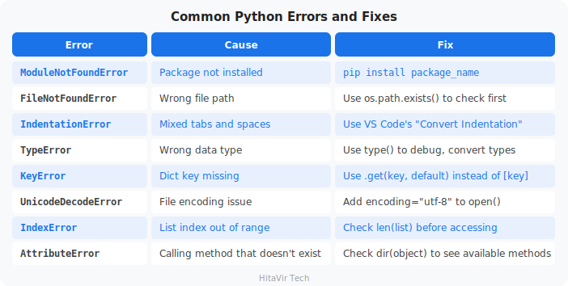

### Windows-Specific Issues

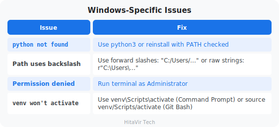

### Debugging Technique — The Print-Statement Trick

```python
# When something is wrong, add print statements to inspect the state:
print(f"DEBUG: variable = {variable}")
print(f"DEBUG: type = {type(variable)}")
print(f"DEBUG: len = {len(data)}")

# Or use Python's built-in debugger:
# python -m pdb your_script.py
```

### Reading a Traceback

When Python crashes, it prints a **traceback** — the trail of function calls leading to the error. Read it **bottom up**:

```
Traceback (most recent call last):
  File "etl_pipeline.py", line 100, in <module>
    run_pipeline()
  File "etl_pipeline.py", line 80, in run_pipeline
    cleaned = transform(raw_data, ...)
  File "etl_pipeline.py", line 50, in transform
    record["price"] = float(record["price"])
ValueError: could not convert string to float: 'abc'
                                                ^^^^^
                                  This is the actual problem
```

> **HitaVir Tech says:** "Every bug is a lesson. Read the error message carefully — Python tells you exactly what went wrong and on which line. The traceback is your best debugging friend."

### What You Have Learnt on This Page

By the end of this page you should be able to confidently:

- Recognise the **8 most common Python errors** by their names (`ModuleNotFoundError`, `KeyError`, `IndexError`, etc.)
- Read a **traceback** bottom-up to find the actual line that failed
- Fix Windows-specific issues (PATH, encoding, line endings, venv activation)
- Use `os.path.exists()`, `.get(key, default)`, and `len()` checks **before** the failing call

### PEP 8 — Style Rules to Apply Strictly During Debugging

Bugs hide in inconsistent code. Apply these rules every single time you debug:

- Use the **`logging`** module to print debug info — never leave `print()` calls behind
- Catch **specific** exceptions — `except ValueError as e:` not `except Exception:`
- Always include the **error variable** in the log: `logger.error("Failed: %s", e)`
- Re-raise with `raise` (no argument) to preserve the traceback
- Run **`flake8`** *before* hunting bugs — many "bugs" are linter warnings you ignored
- Keep a clean repo — `black .` first, *then* debug

> **Inspiration for the road ahead:**
>
> *"Debugging is twice as hard as writing the code in the first place. Therefore, if you write the code as cleverly as possible, you are, by definition, not smart enough to debug it."*
> — Brian Kernighan

## Python Interview Questions for Data Engineering
Duration: 12:00

These questions are frequently asked in Python Data Engineering interviews at companies hiring through **LinkedIn, Naukri, Indeed**, and at institutes like **Simplilearn, Intellipaat, Coursera, DataCamp, Great Learning**, and **Scaler Academy**. They cover the exact topics you learned in this codelab.

### Category 1 — Python Fundamentals

**Q1: What is the difference between a list and a tuple?**

**Answer:** A list is mutable (can be changed after creation) while a tuple is immutable (cannot be changed). Lists use square brackets `[]`, tuples use parentheses `()`. Use tuples for fixed data like database connection configs `(host, port, db)` and lists for collections that change like rows from a query result. Tuples are slightly faster and use less memory.

**Q2: What are `*args` and `**kwargs`? Give a real example.**

**Answer:** `*args` allows a function to accept any number of positional arguments as a tuple. `**kwargs` allows any number of keyword arguments as a dictionary. Real example: a database connection function uses `**kwargs` so callers can pass `host`, `port`, `ssl`, `timeout` — any combination without the function needing to define every parameter explicitly.

```python
def connect_db(**kwargs):
    host = kwargs.get("host", "localhost")
    port = kwargs.get("port", 5432)
    # flexible — caller decides which params to pass
```

**Q3: What is the difference between `==` and `is`?**

**Answer:** `==` checks if two values are equal (same content). `is` checks if two variables point to the exact same object in memory (same identity). For data engineering: use `==` for value comparison, use `is` only for checking `None` (`if value is None`).

**Q4: What are list comprehensions? Why are they preferred?**

**Answer:** List comprehensions are a concise way to create lists from existing iterables. They are preferred because they are faster than traditional for loops (optimized internally by Python) and more readable for simple transformations.

```python
# Traditional loop
results = []
for x in data:
    if x > 0:
        results.append(x * 2)

# List comprehension (faster, cleaner)
results = [x * 2 for x in data if x > 0]
```

**Q5: Explain mutable vs immutable types with examples.**

**Answer:** Mutable objects can be changed after creation: `list`, `dict`, `set`. Immutable objects cannot: `int`, `float`, `str`, `tuple`, `frozenset`. This matters in data engineering when passing data between functions — mutable objects can be accidentally modified by a function, causing bugs. Use tuples for data that must not change.

### Category 2 — Data Handling and File I/O

**Q6: How do you read a CSV file in Python? Compare csv module vs pandas.**

**Answer:** The `csv` module is built-in and lightweight — good for simple row-by-row processing. pandas `read_csv()` loads the entire file into a DataFrame — good for analysis, transformation, and aggregation. For small files or streaming, use `csv`. For analytics and transformation pipelines, use pandas.

```python
# csv module (row by row, low memory)
import csv
with open("data.csv") as f:
    reader = csv.DictReader(f)
    for row in reader:
        process(row)

# pandas (full DataFrame, powerful but uses more memory)
import pandas as pd
df = pd.read_csv("data.csv")
```

**Q7: How do you handle missing values in a dataset?**

**Answer:** Detect with `df.isnull().sum()`. Handle by either: (1) dropping rows: `df.dropna()`, (2) filling with default: `df.fillna(0)` or `df.fillna(method="ffill")`, (3) filling with statistics: `df.fillna(df["column"].mean())`. The strategy depends on business rules — for financial data, you might reject rows; for sensor data, you might forward-fill.

**Q8: What is the difference between `json.load()` and `json.loads()`?**

**Answer:** `json.load()` reads from a file object. `json.loads()` reads from a string. Similarly, `json.dump()` writes to a file, `json.dumps()` converts to a string. The "s" stands for "string."

```python
import json

# From file
with open("config.json") as f:
    data = json.load(f)

# From string
data = json.loads('{"key": "value"}')
```

**Q9: How would you process a 10 GB CSV file that does not fit in memory?**

**Answer:** Use chunked reading with pandas: `pd.read_csv("huge.csv", chunksize=10000)` which returns an iterator of DataFrames. Or use the `csv` module for row-by-row processing. For production, use PySpark or Dask which distribute processing across multiple machines. You can also use generator functions with `yield` to process batches lazily.

### Category 3 — Functions and OOP

**Q10: What is a decorator? Give a data engineering use case.**

**Answer:** A decorator is a function that wraps another function to add behavior without modifying the original. In data engineering, common use cases are: timing pipeline steps (`@timer`), retrying on failure (`@retry(max=3)`), logging function calls (`@log_execution`), and caching results (`@lru_cache`).

```python
def retry(max_attempts=3):
    def decorator(func):
        def wrapper(*args, **kwargs):
            for attempt in range(max_attempts):
                try:
                    return func(*args, **kwargs)
                except Exception:
                    if attempt == max_attempts - 1:
                        raise
        return wrapper
    return decorator

@retry(max_attempts=3)
def fetch_data_from_api(url):
    # automatically retries up to 3 times on failure
    pass
```

**Q11: What is the difference between `@staticmethod` and `@classmethod`?**

**Answer:** `@staticmethod` does not receive `self` or `cls` — it is a utility function that lives inside a class. `@classmethod` receives `cls` (the class itself) and can create instances. In a data pipeline class, you might use `@classmethod` as a factory method: `Pipeline.from_config("config.yaml")` and `@staticmethod` for utility: `Pipeline.validate_path(path)`.

**Q12: What are generators? When would you use them in data engineering?**

**Answer:** Generators use `yield` instead of `return` and produce values lazily — one at a time, without loading everything into memory. Essential for processing large datasets, reading database cursors row-by-row, or streaming data. They are memory-efficient because only one item exists in memory at a time.

```python
def read_batches(filepath, batch_size=1000):
    batch = []
    with open(filepath) as f:
        for line in f:
            batch.append(line)
            if len(batch) == batch_size:
                yield batch
                batch = []
        if batch:
            yield batch
```

### Category 4 — Error Handling and Production Code

**Q13: How do you handle errors in a production data pipeline?**

**Answer:** Use `try-except` blocks with specific exception types (never bare `except:`). Log errors with the `logging` module (not `print`). Implement retry logic for transient failures (network, database timeouts). Use `finally` blocks for cleanup (closing connections). Store failed records separately for investigation rather than silently dropping them.

**Q14: What is the difference between `raise` and `raise from`?**

**Answer:** `raise` re-raises or creates an exception. `raise NewError() from original_error` chains exceptions — preserving the original traceback while wrapping it in a more meaningful error. This is useful in pipelines to add context: "Failed to process batch 42" while still showing the original "Connection refused" error.

**Q15: How do you implement logging in Python?**

**Answer:** Use the built-in `logging` module with appropriate levels: `DEBUG` for development, `INFO` for normal operations, `WARNING` for unexpected but handled situations, `ERROR` for failures, `CRITICAL` for system-level failures. Configure with `basicConfig()` or handler-based setup for file + console output. Never use `print()` in production pipelines.

### Category 5 — pandas and Data Transformation

**Q16: What is the difference between `loc` and `iloc` in pandas?**

**Answer:** `loc` selects by label (column names, index labels). `iloc` selects by integer position. `df.loc[0:5, "name"]` selects rows 0 through 5 of column "name" (inclusive). `df.iloc[0:5, 0]` selects the first 5 rows of the first column (exclusive of end).

**Q17: How do you merge two DataFrames? Explain join types.**

**Answer:** Use `pd.merge(df1, df2, on="key", how="inner")`. Join types: `inner` (matching rows only), `left` (all from left, matching from right), `right` (all from right), `outer` (all from both). This mirrors SQL JOIN behavior. Use `left` when you want to keep all records from your primary table and enrich with data from a lookup table.

**Q18: How do you handle duplicate rows in pandas?**

**Answer:** Detect with `df.duplicated().sum()`. Remove with `df.drop_duplicates()`. For specific columns: `df.drop_duplicates(subset=["email"])`. Keep first or last: `df.drop_duplicates(keep="last")`. In data engineering, always check for duplicates after merging datasets or loading incremental data.

**Q19: What is the `apply()` function in pandas?**

**Answer:** `apply()` runs a function on every row or column of a DataFrame. Use it for custom transformations that cannot be done with built-in pandas methods. It is slower than vectorized operations but more flexible.

```python
# Apply to each row
df["full_name"] = df.apply(lambda row: f"{row['first']} {row['last']}", axis=1)

# Apply to a column
df["category"] = df["price"].apply(lambda p: "Premium" if p > 500 else "Standard")
```

**Q20: What is the difference between `groupby().agg()` and `groupby().transform()`?**

**Answer:** `agg()` returns a reduced DataFrame (one row per group) — used for summary reports. `transform()` returns a DataFrame with the same shape as the original — each row gets the group's aggregated value. Use `transform()` when you need group statistics as a new column alongside individual rows.

```python
# agg: one row per region (summary)
df.groupby("region")["revenue"].agg(["sum", "mean", "count"])

# transform: adds group mean to every row (enrichment)
df["region_avg"] = df.groupby("region")["revenue"].transform("mean")
```

### Category 6 — Architecture and Best Practices

**Q21: How do you structure a Python data engineering project?**

**Answer:** Use a modular structure separating concerns: `src/` for source code (extract.py, transform.py, load.py), `config/` for environment configs, `tests/` for unit tests, `data/` for input/output (gitignored), `logs/` for pipeline logs. Include `requirements.txt` for dependencies, `.gitignore` for secrets and data files, and `README.md` for documentation.

**Q22: What is the difference between a virtual environment and a conda environment?**

**Answer:** Both isolate project dependencies. `venv` is built into Python, lightweight, and uses pip. Conda manages both Python packages and non-Python dependencies (like C libraries), and can manage Python versions. For data engineering: use `venv` for pure Python projects, use `conda` when you need complex scientific libraries (NumPy with MKL, CUDA for GPU).

**Q23: How do you make a pipeline idempotent?**

**Answer:** Idempotent means running the pipeline twice produces the same result. Techniques: use `INSERT ... ON CONFLICT DO UPDATE` (upsert) instead of plain `INSERT`, use `CREATE TABLE IF NOT EXISTS`, delete-then-insert for full refreshes, use partition overwriting for incremental loads, and always use deterministic transformations (no random values without seeds).

**Q24: What is the difference between ETL and ELT?**

**Answer:** ETL (Extract-Transform-Load) transforms data before loading into the warehouse — used when compute is cheaper at the pipeline level. ELT (Extract-Load-Transform) loads raw data first and transforms inside the warehouse — used with powerful cloud warehouses like BigQuery, Snowflake, Redshift that can handle heavy SQL transformations. Modern data engineering favors ELT.

**Q25: How do you handle secrets (passwords, API keys) in Python projects?**

**Answer:** Never hardcode secrets in source code. Use environment variables (`os.environ["DB_PASSWORD"]`), `.env` files with `python-dotenv` (gitignored), or secret managers (AWS Secrets Manager, Azure Key Vault). Always add `.env` and credential files to `.gitignore`. In CI/CD, use pipeline secrets (GitHub Secrets, GitLab CI Variables).

### Interview Preparation Tips

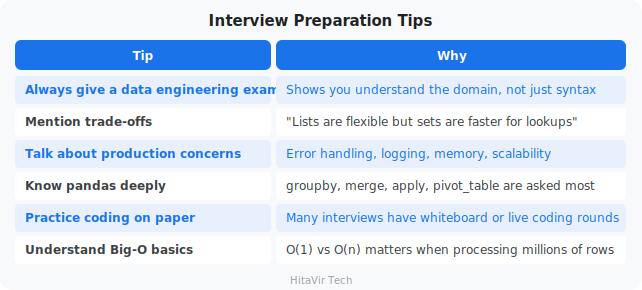

> **HitaVir Tech says:** "These 25 questions cover 90% of what you will face in a Python Data Engineering interview. But knowing the answer is not enough — practice explaining them out loud. An interview is a conversation, not a written exam."

### What You Have Learnt on This Page

By the end of this page you should be able to confidently:

- Answer the **25 most-asked Python DE interview questions** with concrete examples
- Walk through trade-offs (list vs. tuple, `==` vs. `is`, append vs. extend)
- Explain pandas operations (`groupby`, `merge`, `apply`, `pivot_table`) under pressure
- Demonstrate production-grade thinking — error handling, logging, idempotency
- Handle **secrets** correctly (`.env`, env vars, never in code)

### PEP 8 — Style Rules to Apply Strictly in the Interview Itself

Whiteboards and shared editors are where interviewers judge your discipline. Apply these rules every single time:

- Indent with **4 spaces** even on a whiteboard — never sloppy 2-space pseudocode
- Name functions and variables in **`snake_case`** out loud as you write
- Open every function with a one-line docstring: `"""Return the top customer."""`
- Verbalize **type hints** when you write a signature
- Catch a **specific** exception, not `except Exception:` — interviewers notice
- After "I'm done", say: *"In production I'd run this through `black` and `flake8`."*

> **Inspiration for the road ahead:**
>
> *"Talk is cheap. Show me the code."*
> — Linus Torvalds

## Summary and Next Steps
Duration: 3:00

Congratulations! You have completed **Python for Data Engineering** by **HitaVir Tech**!

### What You Mastered

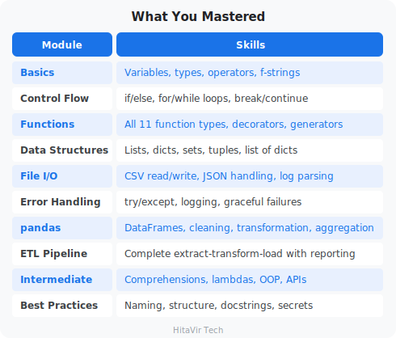

### What to Learn Next

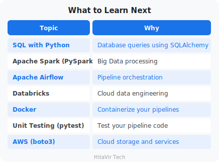

### The Data Engineer Learning Path

```
+----------------------------------------------+
|  Python Basics (you finished this codelab!)  |   <-- you are here
+----------------------------------------------+
                       |
                       v
+----------------------------------------------+
|  SQL + Database Design                       |
+----------------------------------------------+
                       |
                       v
+----------------------------------------------+
|  pandas + Data Transformation                |
+----------------------------------------------+
                       |
                       v
+----------------------------------------------+
|  Apache Spark (PySpark)                      |
+----------------------------------------------+
                       |
                       v
+----------------------------------------------+
|  Airflow (Pipeline Orchestration)            |
+----------------------------------------------+
                       |
                       v
+----------------------------------------------+
|  Cloud Platforms (AWS / Azure / GCP)         |
+----------------------------------------------+
                       |
                       v
+----------------------------------------------+
|  Databricks + Delta Lake (production scale)  |
+----------------------------------------------+
```

> **HitaVir Tech says:** "You now have the Python foundation that every data engineer needs. The language is your tool — data is your mission. Go build pipelines that move data, transform businesses, and create value."

### What You Have Learnt Across This Codelab

By finishing this codelab you have proven you can confidently:

- Set up a **professional Python environment** on Windows (Python, pip, VS Code, venv)
- Apply **PEP 8** rigorously across every concept — variables, control flow, functions, files
- Use **all 5 core data types** and **all 4 data structures** fluently
- Build **production-grade ETL pipelines** with logging, error handling, and config
- Wield **pandas** for cleaning, transformation, and aggregation at scale
- Write **OOP, comprehensions, lambdas, decorators** — the Pythonic toolbox
- Speak about your code in interviews using DE-specific examples

### PEP 8 — Your Lifelong Engineering Habit

This is not the end of the style journey — it is the start. From this codelab onward, **every** repo you push to GitHub, **every** PR you open, **every** notebook you share will be:

- **`black`-formatted** before commit (no exceptions)
- **`flake8`-clean** with zero warnings
- Documented with **docstrings** and **type hints**
- Free of magic numbers, bare excepts, and hardcoded secrets

> **Inspiration for the road ahead:**
>
> *"The journey of a thousand miles begins with a single step. You have just taken thousands."*
> — Adapted from Lao Tzu

## Congratulations
Duration: 1:00

You have successfully completed **Python Programming for Data Engineering** by **HitaVir Tech**!

### What You Built

- A complete development environment
- Multiple hands-on Python scripts (one per concept)
- A production-quality ETL pipeline with logging and error handling
- Data cleaning and transformation workflows
- Automated report generation

### Your Files

```
python-de-learning/
├── venv/
├── requirements.txt
│
├── test_setup.py
├── basics_variables.py
├── basics_types.py
├── basics_operators.py
├── basics_input.py
├── control_if.py
├── control_loops.py
├── func_01_basics.py
├── func_02_defaults_kwargs.py
├── func_03_args.py
├── func_04_kwargs.py
├── func_05_lambda.py
├── func_06_recursion.py
├── func_07_generators.py
├── func_08_decorators.py
├── func_09_pipeline.py
├── data_structures.py
├── create_sample_data.py
├── file_csv.py
├── file_json.py
├── file_logs.py
├── error_handling.py
├── pandas_basics.py
├── intermediate.py
├── best_practices.py
│
├── assignment_00_pep8.py            <-- Style refactor drill
├── assignment_01_basics.py          <-- Pipeline Stats Calculator
├── assignment_02_control.py         <-- Data Quality Gate
├── assignment_03_functions.py       <-- Reusable Validation Toolkit
├── assignment_04_data_structures.py <-- Sales Aggregator
├── assignment_05_files.py           <-- CSV to JSON Region Report
├── assignment_06_errors.py          <-- Bullet-Proof CSV Reader
├── assignment_07_pandas.py          <-- Daily Sales Report
├── assignment_09_intermediate.py    <-- Pythonic refactor
│
├── pipeline_project/                <-- Capstone (Assignment 8)
│   ├── etl_pipeline.py
│   ├── input/sales_raw.csv
│   ├── output/
│   └── logs/
└── (data files created during exercises)
```

### Assignment Tracker — Tick Each One Off

```
+---------------------------------------------------------------+
|  [ ]  Assignment 0  -  Style-Refactor Drill                   |
|  [ ]  Assignment 1  -  Pipeline Stats Calculator              |
|  [ ]  Assignment 2  -  Data Quality Gate                      |
|  [ ]  Assignment 3  -  Reusable Validation Toolkit            |
|  [ ]  Assignment 4  -  Sales Aggregator                       |
|  [ ]  Assignment 5  -  CSV to JSON Region Report              |
|  [ ]  Assignment 6  -  Bullet-Proof CSV Reader                |
|  [ ]  Assignment 7  -  Daily Sales Report with pandas         |
|  [ ]  Assignment 8  -  Extend the ETL Pipeline (capstone)     |
|  [ ]  Assignment 9  -  Refactor Assignment 4 (intermediate)   |
+---------------------------------------------------------------+
```

When all 10 boxes are ticked, you have a portfolio of working pipeline code you can show in any DE interview.

Keep coding, keep building pipelines, and keep growing with HitaVir Tech!

### What You Have Learnt — and What You Carry Forward

You now own a complete portfolio of working Data Engineering code:

- A production-quality **ETL pipeline** with logging, validation, and reporting
- **10 hands-on assignments** covering every Python concept used in the field
- A **virtual environment** and project structure you can reuse for any new pipeline
- **PEP 8 muscle memory** — you no longer think about indentation, naming, or imports

### PEP 8 — One Final Promise to Yourself

Before you close this codelab, commit out loud:

- *"I will never push code that has not been formatted with `black`."*
- *"I will never push code that has not been linted with `flake8`."*
- *"I will write docstrings and type hints — every function, every time."*
- *"I will treat every code review as a chance to learn, not a defence."*

> **Inspiration for the road ahead:**
>
> *"The only way to learn a new programming language is by writing programs in it."*
> — Dennis Ritchie, creator of C
>
> You did exactly that. Now go build pipelines that move the world.

**Happy engineering!**
